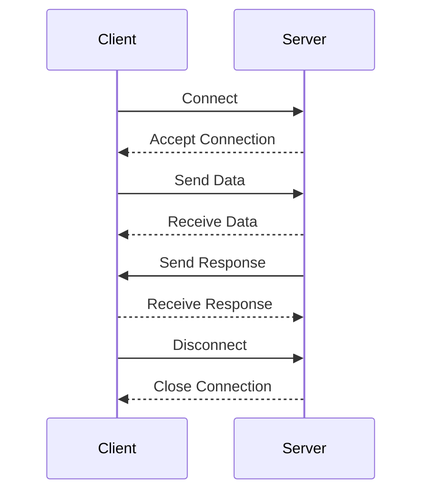

## 17.12 Network Programming Patterns

In today's interconnected world, network programming is a crucial skill for software engineers and architects. Lua, with its lightweight nature and extensibility, is an excellent choice for building network applications. This section will guide you through various network programming patterns in Lua, focusing on socket programming, implementing network protocols, and asynchronous communication. We'll explore practical use cases and provide code examples to solidify your understanding.

### Building Network Applications in Lua

Network applications often require handling multiple connections, managing data streams, and ensuring efficient communication between clients and servers. Lua, with libraries like LuaSocket, provides the tools necessary to build robust network applications.

#### Socket Programming

Socket programming is the foundation of network communication. It allows applications to send and receive data over a network. In Lua, the LuaSocket library is a popular choice for socket programming.

**Key Concepts:**

- **Sockets**: Endpoints for sending and receiving data.
- **Client-Server Model**: A common architecture where clients request services from servers.
- **Blocking vs. Non-Blocking I/O**: Blocking I/O waits for operations to complete, while non-blocking I/O allows other operations to proceed.

**Example: Creating a Simple TCP Client and Server**

Let's create a simple TCP client and server using LuaSocket.

**Server Code:**

```lua
local socket = require("socket")

-- Create a TCP socket and bind it to the local host, at port 12345
local server = assert(socket.bind("*", 12345))

-- Set a timeout of 10 seconds
server:settimeout(10)

print("Server started on port 12345")

while true do
    -- Wait for a connection from any client
    local client = server:accept()

    if client then
        -- Receive data from the client
        local line, err = client:receive()

        if not err then
            print("Received: " .. line)
            -- Send a response back to the client
            client:send("Hello from server!\n")
        end

        -- Close the client connection
        client:close()
    end
end
```

**Client Code:**

```lua
local socket = require("socket")

-- Connect to the server at localhost, port 12345
local client = assert(socket.connect("localhost", 12345))

-- Send a message to the server
client:send("Hello from client!\n")

-- Receive a response from the server
local response, err = client:receive()

if not err then
    print("Server response: " .. response)
end

-- Close the client connection
client:close()
```

**Try It Yourself:**

- Modify the server to handle multiple clients simultaneously.
- Implement error handling for network failures.

### Implementing Network Protocols

Network protocols define rules for data exchange between devices. Lua can be used to implement various protocols, such as TCP, UDP, and HTTP.

#### TCP/UDP Communication

TCP (Transmission Control Protocol) and UDP (User Datagram Protocol) are fundamental protocols for network communication.

**TCP Communication:**

TCP is a connection-oriented protocol that ensures reliable data transmission. It is suitable for applications where data integrity is crucial.

**Example: TCP Client and Server**

Refer to the previous TCP client and server example for a basic implementation.

**UDP Communication:**

UDP is a connectionless protocol that offers faster data transmission but without guarantees of delivery. It is suitable for applications like real-time video streaming.

**Example: UDP Client and Server**

**Server Code:**

```lua
local socket = require("socket")

-- Create a UDP socket
local server = assert(socket.udp())

-- Bind the socket to the local host, at port 12345
server:setsockname("*", 12345)

print("UDP Server started on port 12345")

while true do
    -- Receive data from any client
    local data, ip, port = server:receivefrom()

    if data then
        print("Received: " .. data .. " from " .. ip .. ":" .. port)
        -- Send a response back to the client
        server:sendto("Hello from UDP server!", ip, port)
    end
end
```

**Client Code:**

```lua
local socket = require("socket")

-- Create a UDP socket
local client = assert(socket.udp())

-- Send a message to the server
client:sendto("Hello from UDP client!", "localhost", 12345)

-- Receive a response from the server
local response, ip, port = client:receivefrom()

if response then
    print("Server response: " .. response)
end

-- Close the client connection
client:close()
```

**Try It Yourself:**

- Experiment with sending larger data packets.
- Implement a simple chat application using UDP.

#### HTTP Clients and Servers

HTTP (Hypertext Transfer Protocol) is the foundation of data communication on the web. Lua can be used to create HTTP clients and servers, enabling web services and APIs.

**Example: Creating an HTTP Server**

Using the `socket.http` module, we can create a simple HTTP server.

```lua
local http = require("socket.http")
local ltn12 = require("ltn12")

-- Function to handle HTTP requests
local function handleRequest(request)
    return "HTTP/1.1 200 OK\r\nContent-Type: text/plain\r\n\r\nHello, World!"
end

-- Create a TCP socket and bind it to the local host, at port 8080
local server = assert(socket.bind("*", 8080))

print("HTTP Server started on port 8080")

while true do
    -- Wait for a connection from any client
    local client = server:accept()

    if client then
        -- Receive the HTTP request
        local request, err = client:receive()

        if not err then
            print("Received request: " .. request)
            -- Send the HTTP response
            client:send(handleRequest(request))
        end

        -- Close the client connection
        client:close()
    end
end
```

**Try It Yourself:**

- Extend the server to handle different HTTP methods (GET, POST).
- Implement a simple RESTful API.

### Asynchronous Communication

Asynchronous communication allows applications to handle multiple tasks concurrently, improving performance and responsiveness.

#### Non-Blocking I/O

Non-blocking I/O enables applications to perform other tasks while waiting for I/O operations to complete. This is crucial for network applications that handle multiple connections.

**Example: Non-Blocking TCP Server**

```lua
local socket = require("socket")

-- Create a TCP socket and bind it to the local host, at port 12345
local server = assert(socket.bind("*", 12345))

-- Set the socket to non-blocking mode
server:settimeout(0)

print("Non-blocking TCP Server started on port 12345")

local clients = {}

while true do
    -- Accept new client connections
    local client = server:accept()

    if client then
        client:settimeout(0)
        table.insert(clients, client)
    end

    -- Handle existing client connections
    for i, client in ipairs(clients) do
        local line, err = client:receive()

        if not err then
            print("Received: " .. line)
            client:send("Hello from non-blocking server!\n")
        elseif err == "closed" then
            table.remove(clients, i)
        end
    end
end
```

**Try It Yourself:**

- Implement a non-blocking UDP server.
- Experiment with different timeout values.

#### Event Loops

Event loops manage multiple connections by continuously checking for events (e.g., data received, connection closed) and dispatching them to appropriate handlers.

**Example: Simple Event Loop**

```lua
local socket = require("socket")

-- Create a TCP socket and bind it to the local host, at port 12345
local server = assert(socket.bind("*", 12345))

-- Set the socket to non-blocking mode
server:settimeout(0)

print("Event Loop Server started on port 12345")

local clients = {}

while true do
    -- Accept new client connections
    local client = server:accept()

    if client then
        client:settimeout(0)
        table.insert(clients, client)
    end

    -- Handle existing client connections
    for i, client in ipairs(clients) do
        local line, err = client:receive()

        if not err then
            print("Received: " .. line)
            client:send("Hello from event loop server!\n")
        elseif err == "closed" then
            table.remove(clients, i)
        end
    end

    -- Sleep for a short period to prevent high CPU usage
    socket.sleep(0.01)
end
```

**Try It Yourself:**

- Implement an event loop for an HTTP server.
- Add support for handling multiple types of events.

### Use Cases and Examples

Network programming patterns in Lua can be applied to various real-world scenarios. Let's explore some common use cases.

#### Chat Applications

Real-time messaging systems require efficient handling of multiple client connections and message broadcasting.

**Example: Simple Chat Server**

```lua
local socket = require("socket")

-- Create a TCP socket and bind it to the local host, at port 12345
local server = assert(socket.bind("*", 12345))

-- Set the socket to non-blocking mode
server:settimeout(0)

print("Chat Server started on port 12345")

local clients = {}

while true do
    -- Accept new client connections
    local client = server:accept()

    if client then
        client:settimeout(0)
        table.insert(clients, client)
    end

    -- Handle existing client connections
    for i, client in ipairs(clients) do
        local line, err = client:receive()

        if not err then
            print("Received: " .. line)
            -- Broadcast the message to all clients
            for _, otherClient in ipairs(clients) do
                otherClient:send(line .. "\n")
            end
        elseif err == "closed" then
            table.remove(clients, i)
        end
    end

    -- Sleep for a short period to prevent high CPU usage
    socket.sleep(0.01)
end
```

**Try It Yourself:**

- Implement private messaging between clients.
- Add support for user authentication.

#### Data Servers

Data servers handle concurrent client connections and provide data services, such as file transfers or database access.

**Example: Simple File Server**

```lua
local socket = require("socket")

-- Create a TCP socket and bind it to the local host, at port 12345
local server = assert(socket.bind("*", 12345))

-- Set the socket to non-blocking mode
server:settimeout(0)

print("File Server started on port 12345")

local clients = {}

while true do
    -- Accept new client connections
    local client = server:accept()

    if client then
        client:settimeout(0)
        table.insert(clients, client)
    end

    -- Handle existing client connections
    for i, client in ipairs(clients) do
        local line, err = client:receive()

        if not err then
            print("Received request for file: " .. line)
            -- Send the requested file to the client
            local file = io.open(line, "r")
            if file then
                local content = file:read("*a")
                client:send(content)
                file:close()
            else
                client:send("File not found\n")
            end
        elseif err == "closed" then
            table.remove(clients, i)
        end
    end

    -- Sleep for a short period to prevent high CPU usage
    socket.sleep(0.01)
end
```

**Try It Yourself:**

- Implement file upload functionality.
- Add support for directory listing.

### Visualizing Network Programming Patterns

To better understand the flow of network programming patterns, let's visualize the client-server interaction using a sequence diagram.



**Diagram Description:**

- **Connect**: The client initiates a connection to the server.
- **Accept Connection**: The server accepts the client's connection.
- **Send Data**: The client sends data to the server.
- **Receive Data**: The server receives the data from the client.
- **Send Response**: The server sends a response back to the client.
- **Receive Response**: The client receives the server's response.
- **Disconnect**: The client disconnects from the server.
- **Close Connection**: The server closes the connection.

### Knowledge Check

- What is the difference between blocking and non-blocking I/O?
- How does TCP differ from UDP in terms of reliability and speed?
- What are the benefits of using an event loop in network programming?

### Embrace the Journey

Network programming in Lua opens up a world of possibilities for building efficient and scalable applications. Remember, this is just the beginning. As you progress, you'll build more complex and interactive network applications. Keep experimenting, stay curious, and enjoy the journey!

## Quiz Time!



### What is the primary purpose of socket programming in Lua?

- [x] To enable network communication between applications
- [ ] To manage file I/O operations
- [ ] To handle database connections
- [ ] To perform mathematical calculations

> **Explanation:** Socket programming is used to enable network communication between applications by creating endpoints for sending and receiving data.

### Which Lua library is commonly used for socket programming?

- [x] LuaSocket
- [ ] LuaHTTP
- [ ] LuaDB
- [ ] LuaMath

> **Explanation:** LuaSocket is a popular library used for socket programming in Lua, providing tools for network communication.

### What is the main difference between TCP and UDP?

- [x] TCP is connection-oriented, while UDP is connectionless
- [ ] TCP is faster than UDP
- [ ] UDP provides reliable data transmission
- [ ] TCP is used for real-time video streaming

> **Explanation:** TCP is connection-oriented and ensures reliable data transmission, while UDP is connectionless and offers faster data transmission without guarantees of delivery.

### How does non-blocking I/O improve network application performance?

- [x] It allows other operations to proceed while waiting for I/O operations to complete
- [ ] It increases the speed of data transmission
- [ ] It reduces the amount of data sent over the network
- [ ] It simplifies the code structure

> **Explanation:** Non-blocking I/O allows applications to perform other tasks while waiting for I/O operations to complete, improving performance and responsiveness.

### What is the role of an event loop in network programming?

- [x] To manage multiple connections by continuously checking for events
- [ ] To handle file operations
- [ ] To perform mathematical calculations
- [ ] To manage database transactions

> **Explanation:** An event loop manages multiple connections by continuously checking for events (e.g., data received, connection closed) and dispatching them to appropriate handlers.

### Which protocol is suitable for applications where data integrity is crucial?

- [x] TCP
- [ ] UDP
- [ ] HTTP
- [ ] FTP

> **Explanation:** TCP is suitable for applications where data integrity is crucial because it is a connection-oriented protocol that ensures reliable data transmission.

### What is a common use case for UDP communication?

- [x] Real-time video streaming
- [ ] Secure file transfers
- [ ] Database transactions
- [ ] Web page rendering

> **Explanation:** UDP is suitable for real-time video streaming because it offers faster data transmission without guarantees of delivery, making it ideal for applications where speed is more important than reliability.

### How can you enhance a simple chat server to support private messaging?

- [x] Implement user authentication and message routing
- [ ] Increase the server's timeout value
- [ ] Use a different port for each client
- [ ] Limit the number of connected clients

> **Explanation:** Implementing user authentication and message routing can enhance a chat server to support private messaging between clients.

### What is the benefit of using Lua for network programming?

- [x] Lua is lightweight and extensible, making it suitable for building network applications
- [ ] Lua is primarily used for mathematical calculations
- [ ] Lua provides built-in support for database transactions
- [ ] Lua is designed for rendering web pages

> **Explanation:** Lua is lightweight and extensible, making it suitable for building network applications with libraries like LuaSocket.

### True or False: Non-blocking I/O waits for operations to complete before proceeding.

- [ ] True
- [x] False

> **Explanation:** False. Non-blocking I/O allows other operations to proceed while waiting for I/O operations to complete, improving performance and responsiveness.




