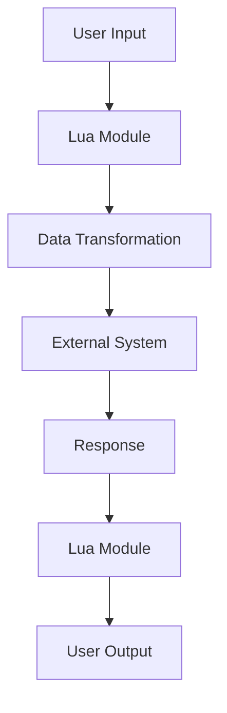

## 17.13 Best Practices for Interoperability

In today's interconnected world, interoperability is a crucial aspect of software development. It ensures that different systems, applications, and components can work together seamlessly, regardless of their underlying technologies or platforms. In this section, we will explore best practices for achieving interoperability in Lua applications, focusing on designing for compatibility and flexibility, robust error handling and recovery, comprehensive documentation and support, and practical use cases.

### Designing for Compatibility and Flexibility

#### Modular Design

Modular design is a fundamental principle for achieving interoperability. By separating concerns and breaking down applications into smaller, independent modules, you can facilitate easier integration and maintenance. Each module should have a well-defined interface and be responsible for a specific functionality.

- **Separation of Concerns**: Divide your application into distinct modules, each handling a specific aspect of the functionality. This approach not only enhances maintainability but also allows for easier integration with other systems.

- **Loose Coupling**: Ensure that modules are loosely coupled, meaning they have minimal dependencies on each other. This design allows for greater flexibility in integrating with external systems.

- **Reusable Components**: Design modules to be reusable across different projects. This practice not only saves development time but also ensures consistency in functionality.

**Example: Modular Design in Lua**

```lua
-- Define a module for handling user authentication
local auth = {}

function auth.login(username, password)
    -- Logic for user login
    return true
end

function auth.logout(userId)
    -- Logic for user logout
    return true
end

return auth
```

In this example, the `auth` module encapsulates all authentication-related functionality, making it easy to integrate with other systems that require user authentication.

#### Standard Protocols

Using standard protocols for communication is essential for interoperability. Standard protocols are widely accepted and supported, ensuring that different systems can communicate effectively.

- **HTTP/HTTPS**: Use HTTP/HTTPS for web-based communication. These protocols are universally supported and provide a robust framework for data exchange.

- **REST and SOAP**: Implement RESTful or SOAP-based APIs for web services. These standards are well-documented and supported by a wide range of tools and libraries.

- **JSON and XML**: Use JSON or XML for data interchange. These formats are human-readable and supported by most programming languages, including Lua.

**Example: Using JSON for Data Interchange**

```lua
local json = require("json")

-- Serialize a Lua table to JSON
local data = {name = "John Doe", age = 30}
local jsonData = json.encode(data)

-- Deserialize JSON to a Lua table
local decodedData = json.decode(jsonData)
```

In this example, we use the JSON format to serialize and deserialize data, ensuring compatibility with other systems that use JSON for data interchange.

### Error Handling and Recovery

#### Robust Interfaces

Robust interfaces are essential for managing failures and ensuring smooth interoperability. Anticipate potential errors and design your interfaces to handle them gracefully.

- **Error Codes and Messages**: Use standardized error codes and messages to communicate issues. This practice helps in diagnosing problems and implementing recovery strategies.

- **Retry Mechanisms**: Implement retry mechanisms for transient errors. This approach can help in recovering from temporary network issues or service outages.

- **Fallback Strategies**: Design fallback strategies for critical operations. In case of failure, the system should be able to switch to an alternative method or resource.

**Example: Error Handling in Lua**

```lua
local function fetchData(url)
    local success, result = pcall(function()
        -- Simulate a network request
        if math.random() > 0.5 then
            error("Network error")
        end
        return "Data from " .. url
    end)

    if success then
        return result
    else
        print("Error fetching data:", result)
        -- Implement retry or fallback logic here
        return nil
    end
end

local data = fetchData("http://example.com")
```

In this example, we use `pcall` to handle potential errors during a network request, allowing for graceful recovery.

#### Logging and Monitoring

Logging and monitoring are critical for tracking interactions and diagnosing issues in interoperable systems.

- **Centralized Logging**: Implement centralized logging to collect and analyze logs from different components. This practice helps in identifying patterns and diagnosing issues.

- **Real-Time Monitoring**: Use real-time monitoring tools to track system performance and detect anomalies. This approach enables proactive issue resolution.

- **Alerting Mechanisms**: Set up alerting mechanisms to notify stakeholders of critical issues. This practice ensures timely response to potential problems.

**Example: Logging in Lua**

```lua
local logger = require("logger")

function logEvent(event)
    logger.info("Event occurred:", event)
end

logEvent("User login")
```

In this example, we use a simple logging module to track events, providing valuable insights into system interactions.

### Documentation and Support

#### Clear API Documentation

Clear and comprehensive API documentation is essential for facilitating third-party integrations. It provides developers with the information they need to understand and use your APIs effectively.

- **Detailed Descriptions**: Provide detailed descriptions of each API endpoint, including input parameters, output formats, and error codes.

- **Code Examples**: Include code examples to demonstrate how to use the APIs. This practice helps developers understand the practical application of the APIs.

- **Versioning Information**: Clearly document versioning information to help developers manage changes and updates.

**Example: API Documentation Format**

```markdown

## Login

**Endpoint**: `/api/login`

**Method**: `POST`

**Parameters**:
- `username` (string): The user's username.
- `password` (string): The user's password.

**Response**:
- `200 OK`: Successful login.
- `401 Unauthorized`: Invalid credentials.

**Example**:
```lua
local response = http.post("/api/login", {username = "john", password = "secret"})
```
```

In this example, we provide a clear and concise format for documenting an API endpoint, including parameters, responses, and code examples.

#### Community Engagement

Engaging with the community is crucial for supporting users and contributors. It fosters collaboration and encourages the adoption of your software.

- **Forums and Discussion Groups**: Create forums or discussion groups where users can ask questions, share experiences, and collaborate on solutions.

- **Open Source Contributions**: Encourage open source contributions by providing clear guidelines and recognizing contributors.

- **Regular Updates and Announcements**: Keep the community informed about updates, new features, and bug fixes through regular announcements.

**Example: Community Engagement Strategies**

- **Create a GitHub Repository**: Host your project on GitHub to facilitate collaboration and contributions.

- **Organize Webinars and Workshops**: Conduct webinars and workshops to educate users and promote best practices.

- **Participate in Conferences**: Attend and present at conferences to connect with the community and share insights.

### Use Cases and Examples

#### Enterprise Integrations

Enterprise integrations involve connecting disparate systems to streamline operations and improve efficiency. Lua's lightweight nature and flexibility make it an ideal choice for such integrations.

- **Middleware Solutions**: Use Lua as a middleware solution to facilitate communication between different enterprise systems.

- **Data Transformation**: Implement Lua scripts for data transformation and mapping between different formats and systems.

- **Automated Workflows**: Use Lua to automate workflows and processes, reducing manual intervention and improving efficiency.

**Example: Enterprise Integration with Lua**

```lua
local function transformData(input)
    -- Transform data from one format to another
    local output = {}
    for key, value in pairs(input) do
        output[key:upper()] = value
    end
    return output
end

local inputData = {name = "John", age = 30}
local transformedData = transformData(inputData)
```

In this example, we use Lua to transform data from one format to another, facilitating integration between different systems.

#### Open Source Projects

Open source projects benefit from interoperability by promoting widespread adoption and collaboration. By designing for interoperability, you can attract a larger user base and foster community contributions.

- **Cross-Platform Compatibility**: Ensure that your project is compatible with different platforms and environments.

- **Extensible Architecture**: Design your project with an extensible architecture to allow for customization and enhancements.

- **Community Contributions**: Encourage community contributions by providing clear guidelines and recognizing contributors.

**Example: Open Source Project with Lua**

- **Project Name**: LuaSocket

- **Description**: LuaSocket is a Lua extension library that provides support for the TCP and UDP transport layers.

- **Features**:
  - Cross-platform compatibility
  - Extensible architecture
  - Active community contributions

### Visualizing Interoperability in Lua

To better understand the concepts of interoperability in Lua, let's visualize the process using a flowchart. This diagram illustrates the flow of data and interactions between different modules and systems.



**Diagram Description**: This flowchart represents the process of data flow in an interoperable Lua application. It starts with user input, which is processed by a Lua module. The data is then transformed and sent to an external system. The response from the external system is processed by the Lua module and presented as user output.

### Knowledge Check

To reinforce your understanding of interoperability best practices, consider the following questions:

- What are the benefits of modular design in achieving interoperability?
- How can standard protocols facilitate communication between different systems?
- Why is robust error handling important in interoperable systems?
- What role does documentation play in supporting third-party integrations?
- How can community engagement enhance the adoption of your software?

### Embrace the Journey

Remember, achieving interoperability is an ongoing journey. As you continue to develop and integrate Lua applications, keep experimenting, stay curious, and embrace the challenges and opportunities that come your way. By following these best practices, you'll be well-equipped to create flexible, compatible, and robust systems that can seamlessly interact with a wide range of technologies and platforms.

## Quiz Time!



### What is a key benefit of modular design in interoperability?

- [x] Easier integration and maintenance
- [ ] Increased complexity
- [ ] Higher coupling between components
- [ ] Reduced flexibility

> **Explanation:** Modular design allows for easier integration and maintenance by separating concerns and reducing dependencies between components.

### Which protocol is commonly used for web-based communication?

- [x] HTTP/HTTPS
- [ ] FTP
- [ ] SMTP
- [ ] SNMP

> **Explanation:** HTTP/HTTPS are standard protocols for web-based communication, providing a robust framework for data exchange.

### What is the purpose of using JSON in interoperability?

- [x] To facilitate data interchange between systems
- [ ] To increase data size
- [ ] To complicate data parsing
- [ ] To obscure data

> **Explanation:** JSON is a widely supported format used for data interchange, making it easier for different systems to communicate.

### Why is robust error handling important in interoperable systems?

- [x] To manage failures and ensure smooth operation
- [ ] To increase error frequency
- [ ] To complicate debugging
- [ ] To reduce system reliability

> **Explanation:** Robust error handling helps manage failures and ensures smooth operation by anticipating and handling potential errors.

### What is a key component of clear API documentation?

- [x] Detailed descriptions and code examples
- [ ] Vague instructions
- [ ] Minimal information
- [ ] Lack of versioning

> **Explanation:** Clear API documentation includes detailed descriptions and code examples to help developers understand and use the APIs effectively.

### How can community engagement benefit open source projects?

- [x] By fostering collaboration and contributions
- [ ] By isolating users
- [ ] By reducing user interaction
- [ ] By limiting feedback

> **Explanation:** Community engagement fosters collaboration and contributions, enhancing the development and adoption of open source projects.

### What is a common use case for Lua in enterprise integrations?

- [x] Data transformation and automated workflows
- [ ] Manual data entry
- [ ] Isolated processing
- [ ] Redundant operations

> **Explanation:** Lua is commonly used for data transformation and automated workflows in enterprise integrations, improving efficiency and reducing manual intervention.

### What is the role of logging in interoperable systems?

- [x] To track interactions and diagnose issues
- [ ] To increase system load
- [ ] To obscure errors
- [ ] To reduce transparency

> **Explanation:** Logging tracks interactions and helps diagnose issues, providing valuable insights into system performance and behavior.

### How can open source projects promote widespread adoption?

- [x] By ensuring cross-platform compatibility
- [ ] By limiting functionality
- [ ] By restricting access
- [ ] By reducing community involvement

> **Explanation:** Open source projects promote widespread adoption by ensuring cross-platform compatibility and encouraging community involvement.

### True or False: Interoperability is only important for large-scale systems.

- [ ] True
- [x] False

> **Explanation:** Interoperability is important for systems of all sizes, as it ensures seamless communication and integration between different components and technologies.


