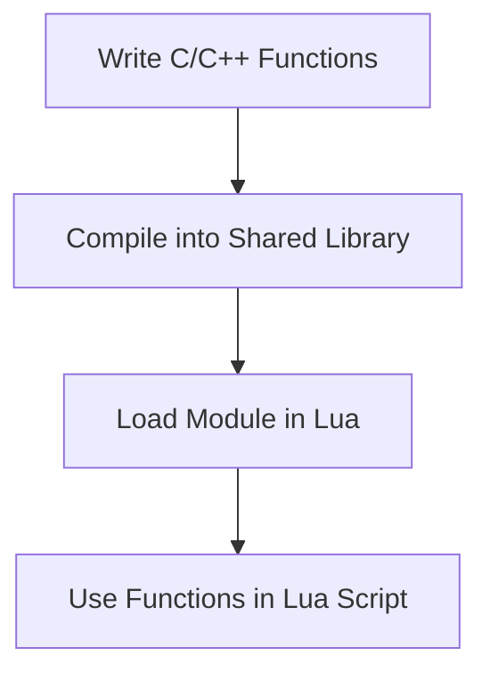

## 17.3 Writing C/C++ Modules for Lua

In the world of software development, Lua is renowned for its simplicity and flexibility. However, there are times when you need to extend Lua's capabilities beyond its native offerings. This is where writing C/C++ modules for Lua comes into play. By creating native extensions, you can enhance Lua's functionality, optimize performance, and integrate with existing C/C++ libraries. In this section, we will explore the process of writing C/C++ modules for Lua, covering module creation, structure, compilation, distribution, and practical use cases.

### Creating Native Extensions

Native extensions allow you to extend Lua by writing modules in C or C++. These modules can provide new functions, libraries, or capabilities that are not available in standard Lua. The process involves creating shared libraries that Lua can load and use seamlessly.

#### Module Creation

To create a C/C++ module for Lua, you need to build a shared library. This library will contain the functions you want to expose to Lua. The key steps in module creation include:

1. **Define the Functions**: Write the C/C++ functions that you want to expose to Lua. These functions should follow the Lua C API conventions.

2. **Create a Shared Library**: Compile the C/C++ code into a shared library that Lua can load. This involves using a compiler that supports shared library creation.

3. **Load the Module in Lua**: Use Lua's `require()` function to load the shared library and access the functions it provides.

#### Module Structure

A well-structured C/C++ module for Lua consists of several key components:

##### Initialization Function

The initialization function serves as the entry point for the module. It is responsible for setting up the module and registering the functions that will be available to Lua. The function typically follows this pattern:

```c
#include <lua.h>
#include <lauxlib.h>

// Function to be exposed to Lua
static int my_function(lua_State *L) {
    // Function implementation
    return 0; // Number of return values
}

// Initialization function
int luaopen_mymodule(lua_State *L) {
    static const luaL_Reg mylib[] = {
        {"my_function", my_function},
        {NULL, NULL} // Sentinel
    };
    luaL_newlib(L, mylib);
    return 1; // Number of results
}
```

##### Function Registration

Function registration involves mapping C functions to Lua. This is done using the `luaL_Reg` structure, which pairs function names with their corresponding C function pointers. The `luaL_newlib` function creates a new Lua table and registers the functions in it.

### Compiling and Distributing Modules

Once you have written your C/C++ module, the next step is to compile and distribute it. This involves dealing with cross-platform compilation and dynamic loading.

#### Cross-Platform Compilation

Compiling C/C++ modules for Lua can vary depending on the operating system. Here are some general guidelines:

- **Linux**: Use `gcc` to compile the module into a shared object (`.so`) file.
- **Windows**: Use `cl` (Microsoft C/C++ Compiler) to create a dynamic-link library (`.dll`).
- **macOS**: Use `clang` to compile the module into a dynamic library (`.dylib`).

Here's an example of compiling a module on Linux:

```bash
gcc -shared -o mymodule.so -fPIC mymodule.c -I/usr/include/lua5.3
```

#### Dynamic Loading

Lua's `require()` function is used to dynamically load native modules. When you call `require("mymodule")`, Lua searches for a shared library named `mymodule.so`, `mymodule.dll`, or `mymodule.dylib` depending on the platform.

### Use Cases and Examples

Writing C/C++ modules for Lua opens up a world of possibilities. Here are some common use cases:

#### Extending Lua Functionality

You can add new libraries or capabilities to Lua by writing C/C++ modules. For example, you might create a module that provides advanced mathematical functions or integrates with a third-party library.

#### Optimizing Performance

C/C++ modules can offload computationally intensive tasks to compiled code, significantly improving performance. This is particularly useful for tasks like image processing, data analysis, or complex algorithms.

### Try It Yourself

To get hands-on experience, try creating a simple C module for Lua. Start by writing a C function that performs a basic task, such as adding two numbers. Compile it into a shared library and load it in Lua using `require()`. Experiment by modifying the function to perform different tasks or by adding more functions to the module.

### Visualizing the Process

To better understand the process of writing C/C++ modules for Lua, let's visualize the workflow using a flowchart.



**Figure 1**: The process of writing C/C++ modules for Lua involves writing functions, compiling them into a shared library, loading the module in Lua, and using the functions in a Lua script.

### Knowledge Check

To reinforce your understanding, consider the following questions:

- What are the key components of a C/C++ module for Lua?
- How do you register functions in a Lua module?
- What are some use cases for writing C/C++ modules for Lua?

### Embrace the Journey

Remember, writing C/C++ modules for Lua is a powerful way to extend Lua's capabilities and optimize performance. As you progress, you'll be able to create more complex modules and integrate Lua with existing C/C++ libraries. Keep experimenting, stay curious, and enjoy the journey!

## Quiz Time!



### What is the purpose of the initialization function in a C/C++ module for Lua?

- [x] To set up the module and register functions with Lua
- [ ] To compile the module into a shared library
- [ ] To load the module in Lua using `require()`
- [ ] To define the functions that will be exposed to Lua

> **Explanation:** The initialization function serves as the entry point for the module and is responsible for setting up the module and registering the functions that will be available to Lua.

### Which function is used to create a new Lua table and register functions in it?

- [x] luaL_newlib
- [ ] luaL_openlib
- [ ] luaL_register
- [ ] luaL_loadlib

> **Explanation:** The `luaL_newlib` function creates a new Lua table and registers the functions in it, making them available to Lua scripts.

### What is the role of the `luaL_Reg` structure in a C/C++ module for Lua?

- [x] It pairs function names with their corresponding C function pointers
- [ ] It compiles the module into a shared library
- [ ] It loads the module in Lua using `require()`
- [ ] It defines the entry point for the module

> **Explanation:** The `luaL_Reg` structure is used to map C functions to Lua by pairing function names with their corresponding C function pointers.

### What command is used to compile a C module into a shared library on Linux?

- [x] gcc -shared -o mymodule.so -fPIC mymodule.c -I/usr/include/lua5.3
- [ ] cl /LD mymodule.c /I C:\Lua\include
- [ ] clang -shared -o mymodule.dylib mymodule.c -I/usr/local/include/lua5.3
- [ ] make mymodule

> **Explanation:** The `gcc` command with the `-shared` and `-fPIC` flags is used to compile a C module into a shared library on Linux.

### What is the purpose of using `require()` in Lua?

- [x] To dynamically load native modules
- [ ] To compile C/C++ code into a shared library
- [ ] To register functions in a Lua module
- [ ] To define the entry point for a module

> **Explanation:** The `require()` function in Lua is used to dynamically load native modules, allowing Lua scripts to access the functions provided by the module.

### Which of the following is a use case for writing C/C++ modules for Lua?

- [x] Extending Lua functionality
- [ ] Compiling Lua scripts into bytecode
- [ ] Writing Lua scripts for web development
- [ ] Creating graphical user interfaces

> **Explanation:** Writing C/C++ modules for Lua is commonly used to extend Lua functionality by adding new libraries or capabilities.

### What is the benefit of offloading tasks to compiled code in a C/C++ module for Lua?

- [x] Optimizing performance
- [ ] Simplifying Lua scripts
- [ ] Improving code readability
- [ ] Enhancing security

> **Explanation:** Offloading computationally intensive tasks to compiled code in a C/C++ module can significantly optimize performance.

### What is the role of the `luaopen_mymodule` function in a C/C++ module for Lua?

- [x] It serves as the entry point for the module
- [ ] It compiles the module into a shared library
- [ ] It loads the module in Lua using `require()`
- [ ] It defines the functions that will be exposed to Lua

> **Explanation:** The `luaopen_mymodule` function serves as the entry point for the module and is responsible for setting up the module and registering functions with Lua.

### What is the purpose of the `-fPIC` flag when compiling a C module on Linux?

- [x] To generate position-independent code for shared libraries
- [ ] To optimize the performance of the module
- [ ] To register functions in a Lua module
- [ ] To define the entry point for the module

> **Explanation:** The `-fPIC` flag is used to generate position-independent code, which is necessary for creating shared libraries on Linux.

### True or False: Writing C/C++ modules for Lua can improve the performance of Lua scripts.

- [x] True
- [ ] False

> **Explanation:** Writing C/C++ modules for Lua can improve the performance of Lua scripts by offloading computationally intensive tasks to compiled code.


