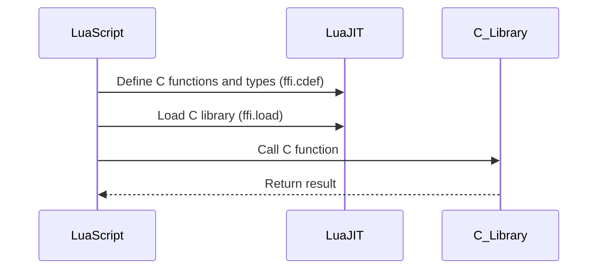

## 17.4 Using LuaJIT's FFI for Interoperability

In the world of software development, the ability to seamlessly integrate different programming languages can significantly enhance the flexibility and performance of applications. LuaJIT, a Just-In-Time Compiler for Lua, offers a powerful feature known as the Foreign Function Interface (FFI) that allows Lua scripts to directly interact with C libraries. This capability opens up a realm of possibilities for developers, enabling them to leverage existing C codebases, optimize performance, and simplify the integration process.

### Direct Access to C Libraries

#### Foreign Function Interface (FFI)

The Foreign Function Interface (FFI) in LuaJIT is a mechanism that simplifies the process of calling C functions and using C data structures directly from Lua code. Unlike traditional methods that require writing C bindings or using external tools, FFI provides a straightforward and efficient way to access C libraries.

**Key Features of FFI:**

- **Ease of Use**: FFI eliminates the need for complex binding code or compilation steps. Developers can declare C functions and types directly within Lua scripts using simple syntax.
- **Performance**: By reducing the overhead associated with C function calls, FFI enhances the performance of Lua applications, making it ideal for high-performance scenarios.

### Benefits of FFI

#### Ease of Use

One of the primary advantages of using FFI is its simplicity. Developers can define C functions and data types directly in Lua scripts using the `ffi.cdef` function. This approach eliminates the need for external tools or compilation processes, streamlining the integration of C libraries.

#### Performance

FFI is designed to minimize the overhead of calling C functions from Lua. By directly interfacing with C libraries, FFI reduces the latency and computational cost associated with traditional binding methods. This performance boost is particularly beneficial for applications that require frequent or intensive C function calls.

### Implementing FFI

#### Defining C Data Structures

To use FFI, developers must first declare the C functions and data types they wish to access. This is done using the `ffi.cdef` function, which allows Lua scripts to define C declarations in a manner similar to C header files.

```lua
local ffi = require("ffi")

ffi.cdef[[
    typedef struct {
        int x;
        int y;
    } Point;

    int add(int a, int b);
]]
```

In this example, we define a simple C structure `Point` and a function `add` that takes two integers as arguments.

#### Calling C Functions

Once the C functions and types are defined, they can be called directly from Lua code. This is achieved by loading the C library using `ffi.load` and invoking the functions as if they were native Lua functions.

```lua
local mylib = ffi.load("mylib")

local result = mylib.add(10, 20)
print("Result of addition:", result)
```

Here, we load a hypothetical C library `mylib` and call the `add` function, passing two integers as arguments.

### Use Cases and Examples

#### Rapid Prototyping

FFI is an excellent tool for rapid prototyping, allowing developers to quickly test integrations with C libraries without the overhead of writing extensive binding code. This capability is particularly useful in scenarios where developers need to experiment with different C functions or data structures.

#### High-Performance Applications

For applications that demand high performance, such as real-time systems or computationally intensive tasks, FFI provides a means to minimize the overhead of C function calls. By directly interfacing with C libraries, developers can achieve significant performance gains, making FFI an ideal choice for high-performance applications.

### Try It Yourself

To get hands-on experience with LuaJIT's FFI, try modifying the code examples provided. Experiment with different C functions and data structures, and observe how FFI simplifies the integration process. Consider creating a small project that leverages a C library of your choice, and explore the performance benefits of using FFI.

### Visualizing FFI Interactions

To better understand how LuaJIT's FFI interacts with C libraries, let's visualize the process using a sequence diagram.



**Diagram Description:** This sequence diagram illustrates the interaction between a Lua script, LuaJIT, and a C library. The Lua script defines C functions and types using `ffi.cdef`, loads the C library with `ffi.load`, and calls the C function directly. The C library processes the request and returns the result to the Lua script.

### References and Links

For further reading on LuaJIT and FFI, consider exploring the following resources:

- [LuaJIT FFI Documentation](http://luajit.org/ext_ffi.html)
- [FFI Tutorial on LuaJIT](https://luajit.org/luajit.html)
- [MDN Web Docs on Foreign Function Interface](https://developer.mozilla.org/en-US/docs/Glossary/FFI)

### Knowledge Check

To reinforce your understanding of LuaJIT's FFI, consider the following questions:

- What are the primary benefits of using FFI in LuaJIT?
- How does FFI improve the performance of Lua applications?
- What is the purpose of the `ffi.cdef` function?
- How can FFI be used for rapid prototyping?

### Embrace the Journey

Remember, mastering LuaJIT's FFI is just the beginning. As you continue to explore the capabilities of FFI, you'll discover new ways to enhance the performance and flexibility of your Lua applications. Keep experimenting, stay curious, and enjoy the journey!

## Quiz Time!



### What is the primary purpose of LuaJIT's FFI?

- [x] To simplify the integration of C libraries into Lua applications.
- [ ] To compile Lua scripts into machine code.
- [ ] To provide a graphical user interface for Lua applications.
- [ ] To manage memory allocation in Lua scripts.

> **Explanation:** LuaJIT's FFI is designed to simplify the process of integrating C libraries into Lua applications, allowing developers to directly call C functions and use C data structures.

### How does FFI improve the performance of Lua applications?

- [x] By reducing the overhead of C function calls.
- [ ] By compiling Lua scripts into machine code.
- [ ] By optimizing memory allocation.
- [ ] By providing a faster garbage collector.

> **Explanation:** FFI reduces the overhead associated with calling C functions from Lua, enhancing the performance of applications that require frequent or intensive C function calls.

### What function is used to define C functions and types in LuaJIT's FFI?

- [x] ffi.cdef
- [ ] ffi.load
- [ ] ffi.call
- [ ] ffi.struct

> **Explanation:** The `ffi.cdef` function is used to declare C functions and types within Lua scripts, similar to how C header files are used.

### Which function is used to load a C library in LuaJIT's FFI?

- [x] ffi.load
- [ ] ffi.cdef
- [ ] ffi.call
- [ ] ffi.struct

> **Explanation:** The `ffi.load` function is used to load a C library, allowing Lua scripts to call the functions defined in the library.

### What is a common use case for LuaJIT's FFI?

- [x] Rapid prototyping of C library integrations.
- [ ] Creating graphical user interfaces.
- [ ] Managing memory allocation.
- [ ] Compiling Lua scripts into machine code.

> **Explanation:** FFI is commonly used for rapid prototyping, allowing developers to quickly test integrations with C libraries without the need for extensive binding code.

### What is the main advantage of using FFI over traditional binding methods?

- [x] It eliminates the need for external tools or compilation processes.
- [ ] It provides a graphical user interface for Lua applications.
- [ ] It optimizes memory allocation.
- [ ] It compiles Lua scripts into machine code.

> **Explanation:** FFI simplifies the integration process by allowing developers to define C functions and types directly in Lua scripts, eliminating the need for external tools or compilation.

### How can FFI be beneficial for high-performance applications?

- [x] By minimizing the overhead of C function calls.
- [ ] By providing a faster garbage collector.
- [ ] By optimizing memory allocation.
- [ ] By compiling Lua scripts into machine code.

> **Explanation:** FFI minimizes the overhead of calling C functions, making it ideal for high-performance applications that require frequent or intensive C function calls.

### What is the role of the `ffi.cdef` function in LuaJIT's FFI?

- [x] To declare C functions and types within Lua scripts.
- [ ] To load C libraries.
- [ ] To call C functions.
- [ ] To manage memory allocation.

> **Explanation:** The `ffi.cdef` function is used to declare C functions and types within Lua scripts, similar to how C header files are used.

### What is the purpose of the `ffi.load` function in LuaJIT's FFI?

- [x] To load a C library for use in Lua scripts.
- [ ] To declare C functions and types.
- [ ] To call C functions.
- [ ] To manage memory allocation.

> **Explanation:** The `ffi.load` function is used to load a C library, allowing Lua scripts to call the functions defined in the library.

### True or False: FFI can be used to create graphical user interfaces in Lua applications.

- [ ] True
- [x] False

> **Explanation:** FFI is not used for creating graphical user interfaces. Its primary purpose is to simplify the integration of C libraries into Lua applications.


