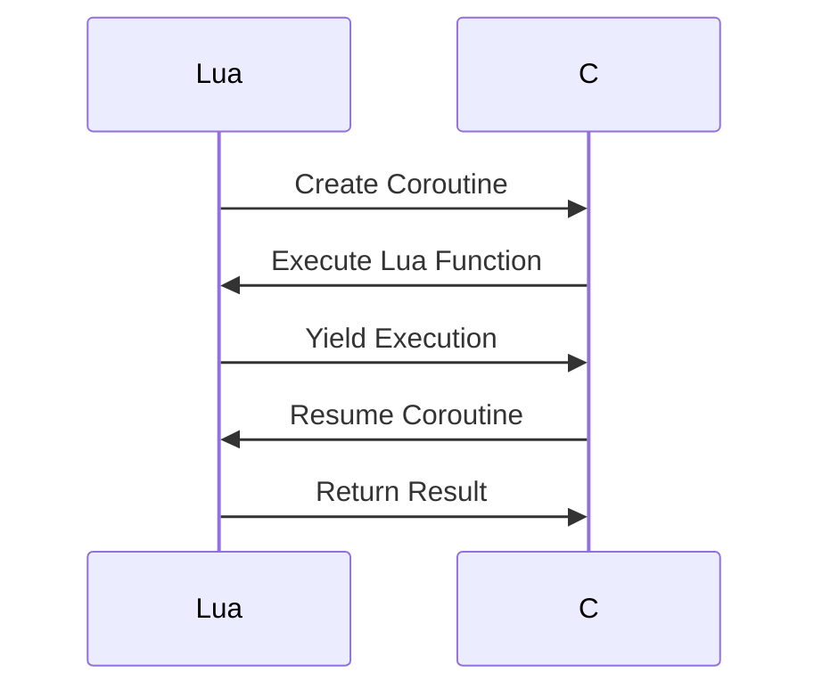

## 17.5 Enhanced Coroutines and Interoperation

In this section, we delve into the advanced techniques of using coroutines in Lua, focusing on their interoperation capabilities. Coroutines are a powerful feature in Lua, enabling cooperative multitasking and asynchronous programming. We will explore how to manage coroutines across language boundaries, preserve execution states, and implement complex control structures.

### Advanced Coroutine Techniques

Coroutines in Lua are a fundamental construct for managing concurrency. Unlike threads, coroutines are cooperative, meaning they yield control back to the main program explicitly. This makes them lightweight and efficient for certain types of tasks, such as asynchronous I/O operations.

#### Cross-Language Coroutines

One of the advanced uses of coroutines is managing them across different programming languages, such as Lua and C. This is particularly useful in applications where Lua is embedded within a C program, allowing for seamless integration and execution flow between the two languages.

**Key Concepts:**

- **Coroutine Creation in C**: Use the Lua C API to create and manage coroutines from C code.
- **State Management**: Maintain the state of coroutines when switching between Lua and C.
- **Error Handling**: Implement robust error handling to manage exceptions across language boundaries.

**Example: Creating and Managing Coroutines in C**

```c
#include <lua.h>
#include <lauxlib.h>
#include <lualib.h>

// Function to create a coroutine in C
void create_coroutine(lua_State *L) {
    lua_getglobal(L, "coroutine");
    lua_getfield(L, -1, "create");
    lua_pushcfunction(L, my_lua_function); // Push the Lua function to be executed
    lua_call(L, 1, 1); // Create the coroutine
}

// Function to resume a coroutine in C
void resume_coroutine(lua_State *L) {
    lua_getglobal(L, "coroutine");
    lua_getfield(L, -1, "resume");
    lua_pushvalue(L, -3); // Push the coroutine object
    lua_call(L, 1, 1); // Resume the coroutine
}
```

### Implementing Interoperation

Interoperation between Lua and other languages involves managing coroutine states and handling flow control effectively. This section covers how to preserve execution states and manage yielding and resuming of coroutines.

#### Coroutine States

Preserving the execution state of coroutines is crucial when dealing with interoperation. This involves saving the current state of a coroutine and restoring it when needed.

**Key Concepts:**

- **State Preservation**: Save the current state of a coroutine to resume later.
- **State Restoration**: Restore the saved state to continue execution.
- **Cross-Boundary Execution**: Manage execution across language boundaries without losing state.

**Example: Preserving and Restoring Coroutine States**

```lua
function coroutine_example()
    local state = coroutine.yield("Paused")
    print("Resumed with state:", state)
end

local co = coroutine.create(coroutine_example)
local status, result = coroutine.resume(co)
print(result) -- Output: Paused

-- Restore state and resume
status, result = coroutine.resume(co, "New State")
print(result) -- Output: Resumed with state: New State
```

#### Yielding and Resuming

Yielding and resuming are fundamental operations in coroutine management. They allow coroutines to pause execution and resume later, providing a mechanism for cooperative multitasking.

**Key Concepts:**

- **Yielding**: Pause the execution of a coroutine and return control to the caller.
- **Resuming**: Continue execution from the point where the coroutine was paused.
- **Flow Control**: Manage the flow of execution between coroutines and the main program.

**Example: Yielding and Resuming Coroutines**

```lua
function producer()
    local i = 0
    while true do
        i = i + 1
        coroutine.yield(i)
    end
end

function consumer()
    local co = coroutine.create(producer)
    for i = 1, 5 do
        local status, value = coroutine.resume(co)
        print("Consumed:", value)
    end
end

consumer()
```

### Use Cases and Examples

Coroutines are particularly useful in scenarios that require asynchronous programming and complex control structures. Let's explore some practical use cases.

#### Asynchronous Programming

Coroutines enable non-blocking I/O operations, making them ideal for asynchronous programming. This allows programs to perform other tasks while waiting for I/O operations to complete.

**Example: Non-blocking I/O with Coroutines**

```lua
function async_read(file)
    local co = coroutine.create(function()
        local data = file:read("*a")
        coroutine.yield(data)
    end)
    return co
end

local file = io.open("example.txt", "r")
local co = async_read(file)
local status, data = coroutine.resume(co)
print("File data:", data)
file:close()
```

#### Complex Control Structures

Coroutines can be used to implement complex control structures, such as cooperative multitasking, where multiple tasks are executed in a single thread by yielding control to each other.

**Example: Cooperative Multitasking with Coroutines**

```lua
function task1()
    for i = 1, 5 do
        print("Task 1 - Step", i)
        coroutine.yield()
    end
end

function task2()
    for i = 1, 5 do
        print("Task 2 - Step", i)
        coroutine.yield()
    end
end

local co1 = coroutine.create(task1)
local co2 = coroutine.create(task2)

while coroutine.status(co1) ~= "dead" or coroutine.status(co2) ~= "dead" do
    coroutine.resume(co1)
    coroutine.resume(co2)
end
```

### Visualizing Coroutine Interoperation

To better understand how coroutines interact across language boundaries, let's visualize the process using a sequence diagram.



This diagram illustrates the interaction between Lua and C when managing coroutines. The process involves creating a coroutine in Lua, executing a function, yielding execution, and resuming the coroutine from C.

### References and Links

For further reading on Lua coroutines and interoperation, consider the following resources:

- [Lua 5.4 Reference Manual](https://www.lua.org/manual/5.4/)
- [Programming in Lua](https://www.lua.org/pil/contents.html)
- [Lua C API Documentation](https://www.lua.org/manual/5.4/manual.html#4)

### Knowledge Check

Let's reinforce our understanding with some questions and exercises:

1. Explain the difference between coroutines and threads in Lua.
2. Describe how to manage coroutine states across language boundaries.
3. Implement a coroutine-based producer-consumer model in Lua.
4. How can coroutines be used to implement non-blocking I/O operations?
5. What are the benefits of using coroutines for cooperative multitasking?

### Embrace the Journey

Remember, mastering coroutines and interoperation in Lua is a journey. As you experiment with these concepts, you'll discover new ways to optimize and enhance your applications. Keep exploring, stay curious, and enjoy the process!

## Quiz Time!



### What is a key advantage of using coroutines in Lua?

- [x] They allow cooperative multitasking.
- [ ] They are faster than threads.
- [ ] They automatically handle errors.
- [ ] They require less memory than functions.

> **Explanation:** Coroutines enable cooperative multitasking by allowing explicit yielding and resuming of execution.

### How can you create a coroutine in C using the Lua C API?

- [x] Use `lua_getglobal` and `lua_getfield` to access the coroutine library.
- [ ] Use `lua_newthread` to create a new coroutine.
- [ ] Use `luaL_openlibs` to initialize the coroutine.
- [ ] Use `lua_pushcfunction` to push a coroutine.

> **Explanation:** You access the coroutine library using `lua_getglobal` and `lua_getfield`, then create a coroutine using `lua_pushcfunction`.

### What is the purpose of yielding in a coroutine?

- [x] To pause execution and return control to the caller.
- [ ] To terminate the coroutine.
- [ ] To execute a function in parallel.
- [ ] To handle errors in the coroutine.

> **Explanation:** Yielding pauses the coroutine's execution and returns control to the caller, allowing for cooperative multitasking.

### How do you resume a coroutine in Lua?

- [x] Use `coroutine.resume`.
- [ ] Use `coroutine.start`.
- [ ] Use `coroutine.run`.
- [ ] Use `coroutine.execute`.

> **Explanation:** `coroutine.resume` is used to continue execution of a paused coroutine.

### What is a common use case for coroutines in Lua?

- [x] Asynchronous programming.
- [ ] Real-time graphics rendering.
- [ ] Memory management.
- [ ] Network security.

> **Explanation:** Coroutines are often used for asynchronous programming, allowing non-blocking operations.

### How can you preserve the state of a coroutine?

- [x] By yielding and passing state information.
- [ ] By using global variables.
- [ ] By creating a new coroutine.
- [ ] By using a separate thread.

> **Explanation:** Yielding allows you to pass state information, preserving the coroutine's state for later resumption.

### What is the role of the Lua C API in coroutine management?

- [x] It allows creation and management of coroutines from C code.
- [ ] It automatically handles coroutine errors.
- [ ] It provides built-in coroutine functions.
- [ ] It optimizes coroutine performance.

> **Explanation:** The Lua C API provides functions to create and manage coroutines from C code, enabling cross-language interoperation.

### What is the output of the following code?

```lua
function task()
    coroutine.yield("Paused")
    return "Resumed"
end

local co = coroutine.create(task)
local status, result = coroutine.resume(co)
print(result)
```

- [x] Paused
- [ ] Resumed
- [ ] Error
- [ ] nil

> **Explanation:** The coroutine yields with the value "Paused", which is printed by the `print` function.

### What is a benefit of using coroutines for complex control structures?

- [x] They allow multiple tasks to execute in a single thread.
- [ ] They automatically optimize memory usage.
- [ ] They simplify error handling.
- [ ] They improve network performance.

> **Explanation:** Coroutines enable multiple tasks to execute in a single thread by yielding control to each other.

### True or False: Coroutines in Lua are preemptive.

- [ ] True
- [x] False

> **Explanation:** Coroutines in Lua are cooperative, meaning they yield control explicitly rather than being preempted by the system.


