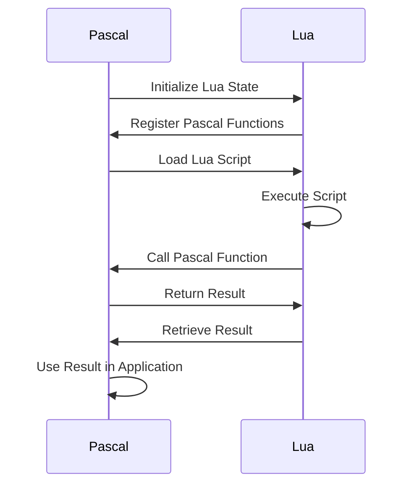

## 17.6.1 Using Lua in Pascal

In this section, we will delve into the integration of Lua scripting language with Pascal, a powerful combination that can enhance the flexibility and functionality of Pascal applications. By embedding Lua into Pascal, developers can leverage Lua's lightweight scripting capabilities to extend and modernize legacy Pascal codebases. This guide will cover the necessary tools, strategies, and examples to effectively use Lua within Pascal applications.

### Integrating Lua with Pascal Applications

#### Bindings and Libraries

To bridge Lua and Pascal, we need to establish a communication channel between the two languages. This is achieved through bindings and libraries that facilitate the interaction between Lua scripts and Pascal code. Some popular libraries and tools that can be used for this purpose include:

- **LuaPascal**: A set of bindings that allow Lua scripts to call Pascal functions and vice versa.
- **LuaBridge**: A lightweight library that provides a simple interface for embedding Lua in C++ and can be adapted for Pascal.
- **Pascal Script**: An embeddable scripting engine that can be used alongside Lua for more complex scripting needs.

These tools help in creating a seamless integration, allowing developers to call Lua functions from Pascal and expose Pascal functions to Lua scripts.

#### Implementation Strategies

There are two primary strategies for integrating Lua with Pascal: calling Pascal functions from Lua and embedding Lua scripts within Pascal programs.

##### Calling Pascal from Lua

To expose Pascal functions to Lua, we need to create bindings that allow Lua scripts to invoke Pascal functions. This involves:

1. **Defining Pascal Functions**: Start by defining the Pascal functions that you want to expose to Lua.

   ```pascal
   function AddNumbers(a, b: Integer): Integer;
   begin
     Result := a + b;
   end;
   ```

2. **Creating Bindings**: Use a library like LuaPascal to create bindings for the defined functions.

   ```pascal
   procedure RegisterFunctions(L: Plua_State);
   begin
     lua_register(L, 'AddNumbers', @AddNumbers);
   end;
   ```

3. **Executing Lua Scripts**: Load and execute Lua scripts that call the registered Pascal functions.

   ```lua
   local result = AddNumbers(5, 10)
   print("The sum is: " .. result)
   ```

##### Embedding Lua

Embedding Lua scripts within Pascal programs allows for dynamic script execution and enhances the flexibility of the application. This involves:

1. **Initializing Lua**: Set up a Lua state within the Pascal application.

   ```pascal
   var
     L: Plua_State;
   begin
     L := luaL_newstate();
     luaL_openlibs(L);
   end;
   ```

2. **Loading and Running Scripts**: Load Lua scripts from files or strings and execute them within the Pascal program.

   ```pascal
   if luaL_loadfile(L, 'script.lua') = 0 then
     lua_pcall(L, 0, LUA_MULTRET, 0);
   ```

3. **Handling Results**: Retrieve results from Lua scripts and use them within the Pascal application.

   ```pascal
   var
     result: Integer;
   begin
     lua_getglobal(L, 'result');
     result := lua_tointeger(L, -1);
     writeln('Result from Lua: ', result);
   end;
   ```

### Use Cases and Examples

#### Legacy Applications

One of the most compelling use cases for integrating Lua with Pascal is modernizing legacy applications. Many existing Pascal codebases can benefit from the flexibility and ease of use that Lua scripting provides. By embedding Lua, developers can:

- **Add New Features**: Quickly implement new features without altering the core Pascal code.
- **Enhance Customization**: Allow end-users to customize application behavior through Lua scripts.
- **Simplify Maintenance**: Reduce the complexity of maintaining large Pascal codebases by offloading certain functionalities to Lua scripts.

#### Example: Modernizing a Legacy Application

Consider a legacy Pascal application that performs complex mathematical calculations. By integrating Lua, we can allow users to define custom calculations through Lua scripts, enhancing the application's flexibility.

1. **Define Core Calculations in Pascal**: Keep the core calculation logic in Pascal for performance reasons.

   ```pascal
   function Calculate(a, b: Integer): Integer;
   begin
     Result := a * b; // Core calculation
   end;
   ```

2. **Expose Calculation Function to Lua**: Allow Lua scripts to call the core calculation function.

   ```pascal
   procedure RegisterCalculation(L: Plua_State);
   begin
     lua_register(L, 'Calculate', @Calculate);
   end;
   ```

3. **Load and Execute Custom Lua Scripts**: Users can define custom calculations in Lua, which are executed by the Pascal application.

   ```lua
   local customResult = Calculate(7, 3) + 10
   print("Custom calculation result: " .. customResult)
   ```

### Visualizing Lua and Pascal Integration

To better understand the integration process, let's visualize the interaction between Lua and Pascal using a sequence diagram.



This diagram illustrates the flow of data and control between Lua and Pascal, highlighting the key steps in the integration process.

### Try It Yourself

To get hands-on experience with Lua and Pascal integration, try modifying the code examples provided. Experiment with:

- **Adding New Functions**: Define additional Pascal functions and expose them to Lua.
- **Custom Lua Scripts**: Write Lua scripts that perform different calculations or operations.
- **Error Handling**: Implement error handling mechanisms to manage script execution errors.

### References and Links

For further reading and resources on Lua and Pascal integration, consider the following links:

- [Lua Official Documentation](https://www.lua.org/manual/5.4/)
- [Free Pascal Documentation](https://www.freepascal.org/docs.html)
- [LuaPascal Library](https://github.com/luapascal/luapascal)

### Knowledge Check

Before we conclude, let's reinforce what we've learned with a few questions and exercises.

- **What are the benefits of using Lua in Pascal applications?**
- **How can you expose Pascal functions to Lua scripts?**
- **What are some common use cases for Lua and Pascal integration?**

### Embrace the Journey

Integrating Lua with Pascal opens up a world of possibilities for enhancing and modernizing applications. Remember, this is just the beginning. As you continue to explore and experiment, you'll discover new ways to leverage the power of Lua scripting within your Pascal projects. Stay curious, keep learning, and enjoy the journey!

## Quiz Time!



### What is the primary purpose of integrating Lua with Pascal?

- [x] To enhance flexibility and functionality of Pascal applications
- [ ] To replace Pascal with Lua entirely
- [ ] To convert Lua scripts into Pascal code
- [ ] To make Pascal applications slower

> **Explanation:** Integrating Lua with Pascal enhances the flexibility and functionality of Pascal applications by allowing dynamic scripting capabilities.

### Which library can be used to create bindings between Lua and Pascal?

- [x] LuaPascal
- [ ] LuaBridge
- [ ] Pascal Script
- [ ] LuaJIT

> **Explanation:** LuaPascal is a library specifically designed to create bindings between Lua and Pascal.

### What is the first step in exposing Pascal functions to Lua?

- [x] Define the Pascal functions
- [ ] Initialize Lua state
- [ ] Load Lua scripts
- [ ] Retrieve results from Lua

> **Explanation:** The first step is to define the Pascal functions that you want to expose to Lua.

### How can you execute a Lua script within a Pascal program?

- [x] Load and run the script using Lua state
- [ ] Convert the script to Pascal code
- [ ] Use a Pascal interpreter
- [ ] Compile the script into a binary

> **Explanation:** You can execute a Lua script within a Pascal program by loading and running it using a Lua state.

### What is a common use case for integrating Lua with Pascal?

- [x] Modernizing legacy applications
- [ ] Replacing Pascal with Lua
- [ ] Creating standalone Lua applications
- [ ] Converting Lua scripts to Pascal

> **Explanation:** A common use case is modernizing legacy applications by adding Lua scripting capabilities.

### What does the sequence diagram illustrate in the context of Lua and Pascal integration?

- [x] The flow of data and control between Lua and Pascal
- [ ] The structure of a Pascal program
- [ ] The syntax of Lua scripts
- [ ] The performance of Lua scripts

> **Explanation:** The sequence diagram illustrates the flow of data and control between Lua and Pascal during integration.

### What is the benefit of embedding Lua scripts in Pascal programs?

- [x] Enhances flexibility and allows dynamic script execution
- [ ] Slows down the application
- [ ] Replaces Pascal code with Lua
- [ ] Makes the application less secure

> **Explanation:** Embedding Lua scripts in Pascal programs enhances flexibility and allows for dynamic script execution.

### Which of the following is NOT a tool for integrating Lua with Pascal?

- [x] LuaJIT
- [ ] LuaPascal
- [ ] LuaBridge
- [ ] Pascal Script

> **Explanation:** LuaJIT is a Just-In-Time Compiler for Lua, not specifically a tool for integrating Lua with Pascal.

### What should you do to handle errors in Lua script execution within Pascal?

- [x] Implement error handling mechanisms
- [ ] Ignore the errors
- [ ] Convert errors to warnings
- [ ] Use a different scripting language

> **Explanation:** Implementing error handling mechanisms is essential to manage script execution errors effectively.

### True or False: Integrating Lua with Pascal can help reduce the complexity of maintaining large Pascal codebases.

- [x] True
- [ ] False

> **Explanation:** True. Integrating Lua with Pascal can offload certain functionalities to Lua scripts, reducing the complexity of maintaining large Pascal codebases.


