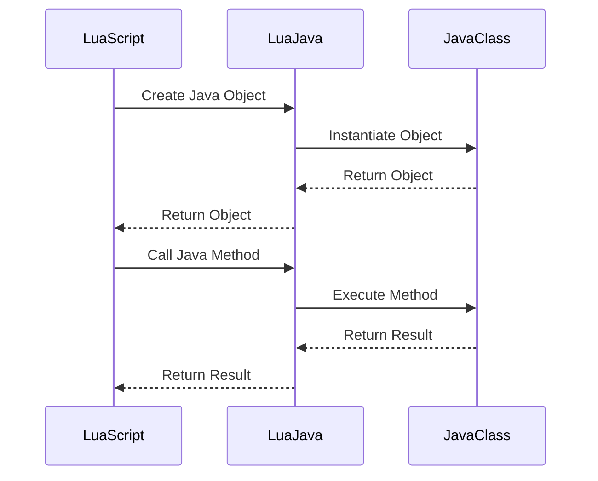

## 17.6.2 Interfacing with Java Using LuaJava

In the world of software development, the ability to integrate different programming languages can significantly enhance the flexibility and functionality of applications. LuaJava is a powerful tool that allows developers to interface Lua scripts with Java classes, opening up a myriad of possibilities for extending and enhancing Java applications. In this section, we will explore the capabilities of LuaJava, provide practical examples, and discuss its applications in Android development and Java applications.

### Introduction to LuaJava

**LuaJava** is a library that facilitates the integration of Lua and Java, allowing Lua scripts to interact with Java classes seamlessly. This integration is particularly useful in scenarios where the lightweight scripting capabilities of Lua can complement the robust features of Java.

#### Key Features of LuaJava

- **Accessing Java Objects**: Lua scripts can create and manipulate Java objects, call methods, and access fields.
- **Extending Java Applications**: Lua can be embedded in Java applications to provide scripting capabilities, enhancing flexibility and customization.
- **Cross-Platform Compatibility**: LuaJava can be used across different platforms, including Android, making it a versatile choice for developers.

### Setting Up LuaJava

Before we dive into examples, let's set up the environment for using LuaJava.

#### Prerequisites

- **Java Development Kit (JDK)**: Ensure that you have the JDK installed on your system. You can download it from the [Oracle website](https://www.oracle.com/java/technologies/javase-jdk11-downloads.html).
- **Lua**: Install Lua on your system. You can find installation instructions on the [Lua website](https://www.lua.org/download.html).
- **LuaJava Library**: Download the LuaJava library from its [official repository](https://github.com/luaj/luaj).

#### Installation Steps

1. **Download and Extract LuaJava**: Download the LuaJava library and extract it to a directory of your choice.
2. **Set Environment Variables**: Add the LuaJava library path to your system's environment variables.
3. **Compile LuaJava**: Navigate to the LuaJava directory and compile the library using the following command:

   ```bash
   javac -d . src/org/keplerproject/luajava/*.java
   ```

4. **Verify Installation**: Ensure that the LuaJava library is correctly installed by running a simple Lua script that interacts with Java.

### Accessing Java Objects from Lua

One of the primary capabilities of LuaJava is accessing and manipulating Java objects from Lua scripts. Let's explore how this can be achieved.

#### Creating Java Objects

To create a Java object in Lua, you can use the `luajava.newInstance` function. Here's an example:

```lua
-- Import the LuaJava package
local luajava = require("luajava")

-- Create a new instance of the Java String class
local javaString = luajava.newInstance("java.lang.String", "Hello, LuaJava!")

-- Print the Java String object
print(javaString)
```

#### Calling Java Methods

Once you have a Java object, you can call its methods using the `:methodName()` syntax. Here's how you can call methods on a Java object:

```lua
-- Call the length method on the Java String object
local length = javaString:length()

-- Print the length of the string
print("Length of the string:", length)
```

#### Accessing Java Fields

You can also access fields of Java objects using the `:fieldName` syntax. Here's an example:

```lua
-- Access the CASE_INSENSITIVE_ORDER field of the String class
local caseInsensitiveOrder = luajava.bindClass("java.lang.String").CASE_INSENSITIVE_ORDER

-- Print the field value
print("CASE_INSENSITIVE_ORDER:", caseInsensitiveOrder)
```

### Extending Java Applications with Lua

LuaJava allows you to embed Lua scripts within Java applications, providing a powerful way to extend and customize Java software.

#### Embedding Lua in Java

To embed Lua in a Java application, you need to create a Lua state and execute Lua scripts within that state. Here's a basic example:

```java
import org.keplerproject.luajava.LuaState;
import org.keplerproject.luajava.LuaStateFactory;

public class LuaJavaExample {
    public static void main(String[] args) {
        // Create a new Lua state
        LuaState luaState = LuaStateFactory.newLuaState();
        luaState.openLibs();

        // Load and execute a Lua script
        luaState.LdoString("print('Hello from Lua!')");

        // Close the Lua state
        luaState.close();
    }
}
```

#### Passing Data Between Java and Lua

You can pass data between Java and Lua by pushing values onto the Lua stack and retrieving them in your Lua scripts. Here's an example:

```java
// Push a Java integer onto the Lua stack
luaState.pushInteger(42);

// Execute a Lua script that retrieves the integer
luaState.LdoString("local number = ...; print('Number from Java:', number)");
```

### Use Cases and Examples

#### Android Development

LuaJava is particularly useful in Android development, where Lua can be used to script Android applications, providing a lightweight and flexible scripting solution.

##### Example: Scripting an Android Application

In an Android application, you can use LuaJava to script UI interactions, handle events, and more. Here's a simple example:

```lua
-- Import the LuaJava package
local luajava = require("luajava")

-- Access the Android Activity class
local activity = luajava.bindClass("android.app.Activity")

-- Create a new instance of the Activity class
local myActivity = luajava.newInstance("com.example.MyActivity")

-- Call a method on the Activity instance
myActivity:setTitle("Hello, LuaJava!")
```

#### Java Applications

In Java applications, LuaJava can be used to add scripting capabilities, allowing users to customize and extend the functionality of the software.

##### Example: Adding Scripting to a Java Application

Consider a Java application that processes data. By embedding Lua, you can allow users to write custom scripts to process data in unique ways.

```java
// Create a Lua state
LuaState luaState = LuaStateFactory.newLuaState();
luaState.openLibs();

// Load a Lua script that processes data
luaState.LdoString("function processData(data) return data * 2 end");

// Push data onto the Lua stack
luaState.pushInteger(10);

// Call the Lua function
luaState.getGlobal("processData");
luaState.pushValue(-2);
luaState.call(1, 1);

// Retrieve the result
int result = luaState.toInteger(-1);
System.out.println("Processed data: " + result);

// Close the Lua state
luaState.close();
```

### Visualizing LuaJava Integration

To better understand how LuaJava facilitates the interaction between Lua and Java, let's visualize the process using a sequence diagram.



**Caption**: This diagram illustrates the interaction between a Lua script and a Java class using LuaJava. The Lua script creates a Java object, calls a method on it, and receives the result.

### Best Practices for Using LuaJava

- **Error Handling**: Always handle errors gracefully when calling Java methods from Lua, as exceptions can occur.
- **Performance Considerations**: Be mindful of performance when integrating Lua and Java, especially in resource-constrained environments like Android.
- **Security**: Ensure that Lua scripts do not execute untrusted code, as this can pose security risks.

### Differences and Similarities with Other Integration Tools

LuaJava is one of several tools available for integrating Lua with other languages. It is similar to tools like LuaJIT's FFI, which allows interfacing with C libraries. However, LuaJava is specifically designed for Java integration, providing a more seamless experience for Java developers.

### Try It Yourself

Experiment with LuaJava by modifying the examples provided. Try creating different Java objects, calling various methods, and embedding Lua scripts in your Java applications. This hands-on approach will deepen your understanding of LuaJava's capabilities.

### Knowledge Check

- **What is LuaJava, and what are its primary capabilities?**
- **How can you create and manipulate Java objects from Lua scripts?**
- **What are some use cases for embedding Lua in Java applications?**
- **How can LuaJava be used in Android development?**

### Conclusion

Interfacing Lua with Java using LuaJava opens up a world of possibilities for developers looking to enhance their applications with scripting capabilities. Whether you're working on Android development or extending Java applications, LuaJava provides a powerful and flexible solution. Remember, this is just the beginning. As you progress, you'll discover even more ways to leverage LuaJava in your projects. Keep experimenting, stay curious, and enjoy the journey!

## Quiz Time!



### What is LuaJava primarily used for?

- [x] Integrating Lua scripts with Java classes
- [ ] Compiling Java code into Lua
- [ ] Converting Lua scripts into Java bytecode
- [ ] Debugging Java applications

> **Explanation:** LuaJava is a library that allows Lua scripts to interact with Java classes, enabling integration between the two languages.

### How do you create a Java object in Lua using LuaJava?

- [x] Using the `luajava.newInstance` function
- [ ] Using the `luajava.createObject` function
- [ ] Using the `luajava.newObject` function
- [ ] Using the `luajava.instantiate` function

> **Explanation:** The `luajava.newInstance` function is used to create Java objects from Lua scripts.

### What is a common use case for LuaJava in Android development?

- [x] Scripting UI interactions and handling events
- [ ] Compiling Android applications
- [ ] Debugging Android applications
- [ ] Converting Java code to Lua

> **Explanation:** LuaJava can be used to script UI interactions and handle events in Android applications, providing flexibility and customization.

### How can you call a method on a Java object from Lua?

- [x] Using the `:methodName()` syntax
- [ ] Using the `->methodName()` syntax
- [ ] Using the `.methodName()` syntax
- [ ] Using the `@methodName()` syntax

> **Explanation:** The `:methodName()` syntax is used to call methods on Java objects from Lua scripts.

### What is a key consideration when using LuaJava in resource-constrained environments?

- [x] Performance
- [ ] Compilation speed
- [ ] Code readability
- [ ] Debugging ease

> **Explanation:** Performance is a key consideration when integrating Lua and Java, especially in resource-constrained environments like Android.

### Which of the following is NOT a feature of LuaJava?

- [ ] Accessing Java objects
- [ ] Extending Java applications
- [x] Compiling Java code
- [ ] Cross-platform compatibility

> **Explanation:** LuaJava does not compile Java code; it facilitates interaction between Lua scripts and Java classes.

### How can you pass data from Java to Lua using LuaJava?

- [x] By pushing values onto the Lua stack
- [ ] By writing data to a file
- [ ] By using a network socket
- [ ] By converting data to JSON

> **Explanation:** Data can be passed from Java to Lua by pushing values onto the Lua stack, which can then be accessed in Lua scripts.

### What is the purpose of the `LuaState` class in LuaJava?

- [x] To manage the execution of Lua scripts within a Java application
- [ ] To compile Lua scripts into Java bytecode
- [ ] To convert Java objects into Lua tables
- [ ] To debug Lua scripts

> **Explanation:** The `LuaState` class is used to manage the execution of Lua scripts within a Java application, providing an interface for interacting with Lua.

### Which method is used to load and execute a Lua script in a Java application using LuaJava?

- [x] `LdoString`
- [ ] `executeScript`
- [ ] `runLua`
- [ ] `loadScript`

> **Explanation:** The `LdoString` method is used to load and execute a Lua script in a Java application using LuaJava.

### True or False: LuaJava can be used to integrate Lua with C libraries.

- [ ] True
- [x] False

> **Explanation:** LuaJava is specifically designed for integrating Lua with Java, not C libraries. For C integration, tools like LuaJIT's FFI are used.


