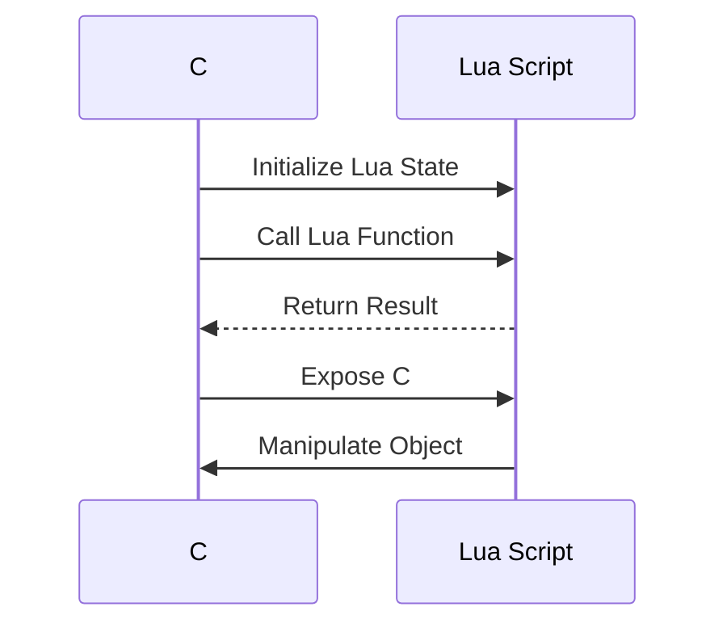

## 17.6.3 Embedding Lua in C# Applications

In the ever-evolving landscape of software development, the ability to integrate different programming languages within a single application can significantly enhance flexibility and functionality. Embedding Lua in C# applications is a powerful technique that allows developers to harness the simplicity and efficiency of Lua scripting within the robust .NET framework. This section will guide you through the process of embedding Lua in C# applications, focusing on interoperability, implementation details, and practical use cases.

### .NET and Lua Interoperability

**Interoperability** between .NET and Lua is made possible through libraries like **NLua**, which act as a bridge between the two languages. NLua is a .NET library that provides a simple and efficient way to execute Lua scripts and access Lua functions and variables from C# code. It allows developers to leverage Lua's lightweight scripting capabilities while maintaining the performance and structure of a C# application.

#### Key Features of NLua

- **Ease of Use**: NLua provides a straightforward API for integrating Lua scripts into C# applications.
- **Flexibility**: It supports both Lua 5.1 and Lua 5.2, offering compatibility with a wide range of Lua scripts.
- **Data Exchange**: NLua facilitates seamless data exchange between Lua and C#, allowing for complex interactions and manipulations.
- **Performance**: Designed to minimize overhead, NLua ensures that Lua scripts run efficiently within a C# environment.

### Implementation Details

#### Setting Up NLua

To begin embedding Lua in your C# application, you need to set up NLua. Follow these steps:

1. **Install NLua**: You can install NLua via NuGet Package Manager in Visual Studio. Use the following command in the Package Manager Console:

   ```shell
   Install-Package NLua
   ```

2. **Reference NLua in Your Project**: Ensure that your project references the NLua library. This can be done by adding the NLua package to your project dependencies.

3. **Initialize Lua State**: Create and initialize a Lua state in your C# application. The Lua state is the environment where Lua scripts are executed.

   ```csharp
   using NLua;

   class Program
   {
       static void Main(string[] args)
       {
           using (Lua lua = new Lua())
           {
               // Lua state initialized
           }
       }
   }
   ```

#### Data Exchange: Passing Data Between Lua and C#

One of the core functionalities of embedding Lua in C# is the ability to pass data between the two languages. This involves:

- **Calling Lua Functions from C#**: You can call Lua functions from your C# code and pass parameters to these functions.

  ```csharp
  lua.DoString(@"
      function add(a, b)
          return a + b
      end
  ");

  var result = lua.GetFunction("add").Call(3, 4);
  Console.WriteLine("Result from Lua: " + result[0]);
  ```

- **Accessing C# Objects in Lua**: You can expose C# objects to Lua scripts, allowing Lua to manipulate these objects.

  ```csharp
  lua["myObject"] = new MyClass();
  lua.DoString("myObject:MyMethod()");
  ```

- **Returning Data from Lua to C#**: Lua functions can return data to C#, which can then be used within your application.

  ```csharp
  lua.DoString(@"
      function getData()
          return 'Hello from Lua'
      end
  ");

  var message = lua.GetFunction("getData").Call();
  Console.WriteLine(message[0]);
  ```

#### Scripting Capabilities: Manipulating .NET Objects

Embedding Lua in C# applications enhances scripting capabilities by allowing Lua scripts to manipulate .NET objects. This is particularly useful in scenarios where dynamic behavior is required, such as game development or real-time data processing.

- **Expose .NET Methods to Lua**: You can expose specific methods of your .NET objects to Lua, enabling scripts to invoke these methods.

  ```csharp
  public class GameCharacter
  {
      public void Move(int x, int y)
      {
          Console.WriteLine($"Moving to ({x}, {y})");
      }
  }

  lua["character"] = new GameCharacter();
  lua.DoString("character:Move(10, 20)");
  ```

- **Modify Object Properties**: Lua scripts can modify the properties of .NET objects, providing a flexible way to change application behavior at runtime.

  ```csharp
  public class GameSettings
  {
      public int Volume { get; set; }
  }

  lua["settings"] = new GameSettings();
  lua.DoString("settings.Volume = 75");
  ```

### Use Cases and Examples

#### Game Development: Using Lua for Game Logic in Unity

One of the most compelling use cases for embedding Lua in C# applications is in game development, particularly within the Unity engine. Lua's lightweight nature and ease of use make it an ideal choice for scripting game logic, AI behaviors, and event handling.

- **Game Logic**: Use Lua scripts to define game rules, character behaviors, and interactions. This allows for rapid prototyping and iteration without recompiling the entire game.

- **AI Behaviors**: Implement complex AI behaviors using Lua scripts, enabling dynamic and adaptive gameplay experiences.

- **Event Handling**: Lua scripts can handle in-game events, such as player actions or environmental changes, providing a responsive and interactive gaming experience.

#### Example: Integrating Lua in a Unity Game

To illustrate the integration of Lua in a Unity game, consider the following example:

1. **Create a Unity Project**: Start by creating a new Unity project and setting up the necessary scenes and assets.

2. **Install NLua**: Add the NLua library to your Unity project using the Unity Package Manager or by manually importing the NLua DLLs.

3. **Script Game Logic with Lua**: Write Lua scripts to handle game logic. For example, a simple script to control a character's movement:

   ```lua
   function moveCharacter(character, x, y)
       character:Move(x, y)
   end
   ```

4. **Integrate Lua with C#**: Use C# scripts to load and execute Lua scripts within the Unity environment.

   ```csharp
   using UnityEngine;
   using NLua;

   public class LuaIntegration : MonoBehaviour
   {
       private Lua lua;

       void Start()
       {
           lua = new Lua();
           lua["character"] = new GameCharacter();
           lua.DoFile("Assets/Scripts/moveCharacter.lua");
           lua.GetFunction("moveCharacter").Call(lua["character"], 5, 10);
       }
   }
   ```

5. **Test and Iterate**: Run your Unity project and test the Lua scripts. Make adjustments as needed to refine game logic and behavior.

### Visualizing Lua and C# Interaction

To better understand the interaction between Lua and C#, consider the following sequence diagram:



**Diagram Description**: This sequence diagram illustrates the interaction between a C# application and a Lua script. The C# application initializes the Lua state, calls a Lua function, and receives a result. It also exposes a C# object to Lua, allowing the script to manipulate the object.

### Best Practices for Embedding Lua in C# Applications

When embedding Lua in C# applications, consider the following best practices:

- **Error Handling**: Implement robust error handling to manage exceptions and errors that may occur during script execution.
- **Security**: Ensure that Lua scripts do not execute untrusted code or access sensitive data.
- **Performance Optimization**: Profile and optimize Lua scripts to minimize performance overhead.
- **Modular Design**: Organize Lua scripts into modules to promote reusability and maintainability.

### Differences and Similarities with Other Integration Patterns

Embedding Lua in C# applications shares similarities with other integration patterns, such as embedding Lua in C++ or Python. However, the .NET framework provides unique features and challenges, such as garbage collection and type safety, which must be considered when integrating Lua.

### Try It Yourself

To deepen your understanding of embedding Lua in C# applications, try the following exercises:

1. **Modify the Example**: Change the Lua script to implement a different game mechanic, such as jumping or attacking.
2. **Add Error Handling**: Implement error handling in the C# code to catch and log Lua script errors.
3. **Experiment with Data Types**: Pass different data types between Lua and C#, such as tables or complex objects.

### Conclusion

Embedding Lua in C# applications offers a powerful way to enhance the flexibility and functionality of your software. By leveraging libraries like NLua, you can seamlessly integrate Lua scripting capabilities into your C# projects, enabling dynamic behavior and rapid development. Whether you're developing games, real-time applications, or complex systems, embedding Lua can provide the scripting power you need to succeed.

## Quiz Time!



### What is the primary library used for embedding Lua in C# applications?

- [x] NLua
- [ ] LuaJIT
- [ ] LuaBridge
- [ ] LuaSocket

> **Explanation:** NLua is the primary library used for embedding Lua in C# applications, providing a simple and efficient way to execute Lua scripts and access Lua functions from C#.

### Which of the following is a key feature of NLua?

- [x] Ease of Use
- [ ] High Memory Usage
- [ ] Limited Compatibility
- [ ] Complex API

> **Explanation:** NLua is known for its ease of use, providing a straightforward API for integrating Lua scripts into C# applications.

### How can you expose a C# object to a Lua script using NLua?

- [x] By assigning the object to a Lua variable
- [ ] By using a special Lua function
- [ ] By modifying the Lua interpreter
- [ ] By recompiling the C# application

> **Explanation:** You can expose a C# object to a Lua script by assigning the object to a Lua variable, allowing the script to manipulate the object.

### What is a common use case for embedding Lua in C# applications?

- [x] Game Development
- [ ] Database Management
- [ ] Operating System Development
- [ ] Network Protocol Design

> **Explanation:** Game development is a common use case for embedding Lua in C# applications, as Lua provides lightweight scripting capabilities for game logic and AI behaviors.

### Which diagram best illustrates the interaction between Lua and C#?

- [x] Sequence Diagram
- [ ] Class Diagram
- [ ] Flowchart
- [ ] ER Diagram

> **Explanation:** A sequence diagram best illustrates the interaction between Lua and C#, showing the flow of data and function calls between the two.

### What should you consider when embedding Lua in C# applications?

- [x] Error Handling
- [ ] Ignoring Security
- [ ] Disabling Optimization
- [ ] Avoiding Modular Design

> **Explanation:** When embedding Lua in C# applications, it's important to implement robust error handling to manage exceptions and errors during script execution.

### How can Lua scripts modify .NET object properties?

- [x] By accessing the properties directly
- [ ] By recompiling the .NET application
- [ ] By using a special Lua function
- [ ] By modifying the Lua interpreter

> **Explanation:** Lua scripts can modify .NET object properties by accessing the properties directly, providing a flexible way to change application behavior at runtime.

### What is a benefit of using Lua for game logic in Unity?

- [x] Rapid Prototyping
- [ ] Increased Complexity
- [ ] Slower Execution
- [ ] Limited Flexibility

> **Explanation:** Using Lua for game logic in Unity allows for rapid prototyping and iteration without recompiling the entire game.

### Which of the following is a best practice for embedding Lua in C# applications?

- [x] Security
- [ ] Ignoring Performance
- [ ] Avoiding Error Handling
- [ ] Disabling Modular Design

> **Explanation:** Ensuring that Lua scripts do not execute untrusted code or access sensitive data is a best practice for embedding Lua in C# applications.

### True or False: NLua supports both Lua 5.1 and Lua 5.2.

- [x] True
- [ ] False

> **Explanation:** NLua supports both Lua 5.1 and Lua 5.2, offering compatibility with a wide range of Lua scripts.


