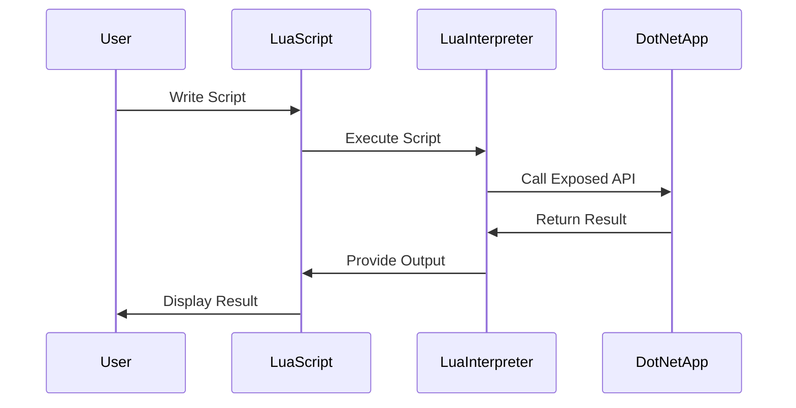

## 17.6.4 Scripting .NET Applications with Lua

In today's rapidly evolving software landscape, the ability to extend and customize applications is a significant advantage. By integrating Lua scripting into .NET applications, developers can offer users the flexibility to tailor application behavior to their specific needs. This section will guide you through the process of embedding Lua into .NET applications, exposing .NET APIs to Lua, and addressing security considerations. We will also explore practical use cases and provide code examples to illustrate these concepts.

### Advantages of Scripting in .NET

#### Customization

One of the primary advantages of integrating Lua scripting into .NET applications is the ability to enable user customization. By allowing users to write scripts that interact with the application, developers can provide a powerful tool for users to modify and extend application functionality without altering the core codebase. This can lead to increased user satisfaction and engagement, as users can tailor the application to better fit their workflows and preferences.

#### Automation

Lua scripting can also be used to automate repetitive tasks within .NET applications. Users can create scripts to perform complex sequences of actions with a single command, saving time and reducing the potential for human error. This is particularly useful in enterprise environments where efficiency and accuracy are paramount.

### Implementing Lua Scripting

To implement Lua scripting in a .NET application, developers need to expose .NET APIs to Lua, allowing Lua scripts to interact with the application's functionality. This involves several steps, including setting up a Lua interpreter within the .NET environment, defining the API functions that will be accessible from Lua, and ensuring that the integration is secure.

#### Exposing APIs

Exposing .NET APIs to Lua involves making .NET functions available to Lua scripts. This can be achieved using a Lua interpreter library for .NET, such as NLua or MoonSharp. These libraries provide the necessary tools to embed a Lua interpreter within a .NET application and facilitate communication between Lua scripts and .NET code.

**Example: Using NLua to Expose .NET APIs**

```csharp
using NLua;

public class LuaScriptingExample
{
    private Lua lua;

    public LuaScriptingExample()
    {
        lua = new Lua();
        // Expose a .NET method to Lua
        lua.RegisterFunction("PrintMessage", this, GetType().GetMethod("PrintMessage"));
    }

    public void PrintMessage(string message)
    {
        Console.WriteLine(message);
    }

    public void ExecuteLuaScript(string script)
    {
        lua.DoString(script);
    }
}

// Usage
var scriptingExample = new LuaScriptingExample();
scriptingExample.ExecuteLuaScript("PrintMessage('Hello from Lua!')");
```

In this example, we use NLua to create a Lua interpreter and register a .NET method (`PrintMessage`) that can be called from Lua scripts. This allows Lua scripts to interact with the .NET application by calling the exposed method.

#### Security Considerations

When integrating Lua scripting into a .NET application, security is a critical concern. Allowing scripts to execute arbitrary code can pose significant risks, including unauthorized access to system resources and data. To mitigate these risks, developers should implement sandboxing and permission control mechanisms.

**Sandboxing and Permission Control**

Sandboxing involves restricting the execution environment of Lua scripts to prevent them from accessing sensitive resources. This can be achieved by limiting the functions and libraries available to Lua scripts and controlling the scope of their execution.

**Example: Implementing a Sandbox**

```csharp
using NLua;

public class SecureLuaScripting
{
    private Lua lua;

    public SecureLuaScripting()
    {
        lua = new Lua();
        // Restrict access to certain libraries
        lua.DoString("os = nil; io = nil;"); // Disable os and io libraries
    }

    public void ExecuteSecureScript(string script)
    {
        lua.DoString(script);
    }
}

// Usage
var secureScripting = new SecureLuaScripting();
secureScripting.ExecuteSecureScript("print('This is a secure script')");
```

In this example, we disable the `os` and `io` libraries in the Lua environment to prevent scripts from performing potentially harmful operations, such as file I/O or executing system commands.

### Use Cases and Examples

#### Automation Tools

One of the most common use cases for Lua scripting in .NET applications is the creation of automation tools. By allowing users to write scripts that automate complex tasks, developers can enhance the functionality of their applications and improve user productivity.

**Example: Creating a Macro System**

Consider a .NET application that processes data files. By integrating Lua scripting, users can write macros to automate repetitive tasks, such as data transformation or report generation.

```csharp
using NLua;

public class MacroSystem
{
    private Lua lua;

    public MacroSystem()
    {
        lua = new Lua();
        lua.RegisterFunction("ProcessData", this, GetType().GetMethod("ProcessData"));
    }

    public void ProcessData(string filePath)
    {
        // Implement data processing logic here
        Console.WriteLine($"Processing data from {filePath}");
    }

    public void ExecuteMacro(string macroScript)
    {
        lua.DoString(macroScript);
    }
}

// Usage
var macroSystem = new MacroSystem();
macroSystem.ExecuteMacro("ProcessData('data.csv')");
```

In this example, we register a `ProcessData` method that can be called from Lua scripts. Users can write macros that automate data processing tasks by calling this method with the appropriate parameters.

### Try It Yourself

To get hands-on experience with Lua scripting in .NET, try modifying the code examples provided above. Experiment with exposing different .NET methods to Lua, implementing additional security measures, or creating more complex automation scripts. By doing so, you'll gain a deeper understanding of how Lua scripting can enhance .NET applications.

### Visualizing Lua and .NET Integration

To better understand the integration of Lua scripting into .NET applications, let's visualize the process using a sequence diagram.



**Diagram Description:** This sequence diagram illustrates the interaction between a user, a Lua script, a Lua interpreter, and a .NET application. The user writes a Lua script, which is executed by the Lua interpreter. The interpreter calls an exposed .NET API, receives the result, and provides the output back to the Lua script, which then displays the result to the user.

### References and Links

- [NLua GitHub Repository](https://github.com/NLua/NLua): Explore the NLua library for integrating Lua scripting into .NET applications.
- [MoonSharp Documentation](http://www.moonsharp.org/): Learn about MoonSharp, another Lua interpreter for .NET.
- [Lua Official Website](https://www.lua.org/): Discover more about the Lua programming language and its features.

### Knowledge Check

To reinforce your understanding of Lua scripting in .NET applications, consider the following questions:

- What are the primary advantages of integrating Lua scripting into .NET applications?
- How can developers expose .NET APIs to Lua scripts?
- What security measures should be implemented when allowing Lua scripts to execute within a .NET application?
- Provide an example of a use case where Lua scripting can enhance the functionality of a .NET application.

### Embrace the Journey

Remember, integrating Lua scripting into .NET applications is just the beginning. As you continue to explore this powerful combination, you'll discover new ways to enhance application functionality, improve user experiences, and streamline workflows. Keep experimenting, stay curious, and enjoy the journey!

## Quiz Time!



### What is one of the primary advantages of integrating Lua scripting into .NET applications?

- [x] Customization
- [ ] Increased application size
- [ ] Reduced performance
- [ ] Limited functionality

> **Explanation:** Customization is a key advantage, allowing users to tailor application behavior to their needs.

### Which library can be used to embed a Lua interpreter within a .NET application?

- [x] NLua
- [ ] PyLua
- [ ] LuaSharp
- [ ] LuaNet

> **Explanation:** NLua is a popular library for embedding Lua interpreters in .NET applications.

### What is a critical security measure when integrating Lua scripting into .NET applications?

- [x] Sandboxing
- [ ] Increasing memory usage
- [ ] Disabling all scripts
- [ ] Allowing unrestricted access

> **Explanation:** Sandboxing restricts the execution environment to prevent unauthorized access to resources.

### In the provided code example, what method is exposed to Lua scripts?

- [x] PrintMessage
- [ ] ExecuteScript
- [ ] ProcessData
- [ ] RunMacro

> **Explanation:** The `PrintMessage` method is registered and exposed to Lua scripts in the example.

### What is a common use case for Lua scripting in .NET applications?

- [x] Automation tools
- [ ] Reducing application features
- [ ] Disabling user input
- [ ] Limiting application access

> **Explanation:** Automation tools are a common use case, allowing users to automate tasks with Lua scripts.

### How can developers restrict access to certain libraries in Lua scripts?

- [x] By disabling specific libraries
- [ ] By increasing script execution time
- [ ] By allowing all libraries
- [ ] By reducing script size

> **Explanation:** Developers can disable specific libraries to prevent access to sensitive operations.

### What is the purpose of the `ExecuteLuaScript` method in the code example?

- [x] To execute a Lua script
- [ ] To compile a Lua script
- [ ] To delete a Lua script
- [ ] To save a Lua script

> **Explanation:** The `ExecuteLuaScript` method is used to execute a Lua script within the application.

### Which of the following is a Lua interpreter library for .NET?

- [x] MoonSharp
- [ ] LuaSharp
- [ ] PyLua
- [ ] LuaNet

> **Explanation:** MoonSharp is another Lua interpreter library for .NET, similar to NLua.

### What is the role of the Lua interpreter in the integration process?

- [x] To execute Lua scripts and facilitate communication with .NET
- [ ] To compile .NET code
- [ ] To manage .NET memory
- [ ] To disable .NET features

> **Explanation:** The Lua interpreter executes Lua scripts and facilitates communication with .NET APIs.

### True or False: Lua scripting can be used to automate repetitive tasks in .NET applications.

- [x] True
- [ ] False

> **Explanation:** True. Lua scripting can automate repetitive tasks, enhancing application functionality.


