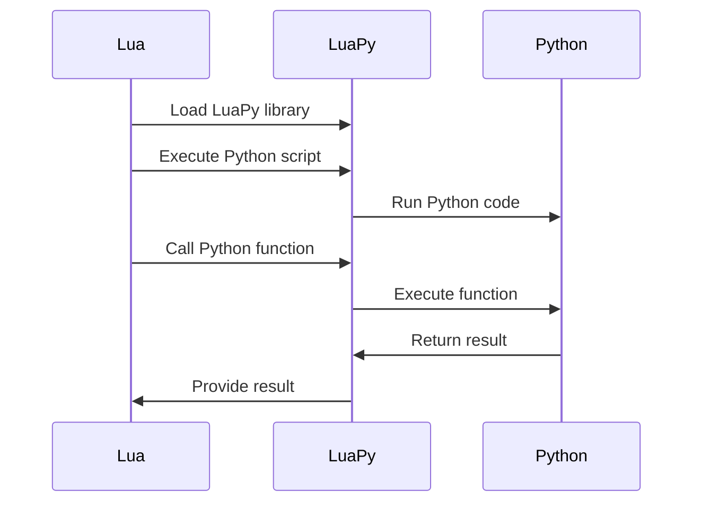

## 17.6.5 Communicating with Python via LuaPy

In the world of software development, interoperability between different programming languages is crucial for leveraging the strengths of each language. Lua, known for its lightweight and embeddable nature, often needs to interact with Python, which boasts a vast ecosystem of libraries and tools. This section will guide you through the process of using the LuaPy library to facilitate communication between Lua and Python, enabling you to call Python code from Lua and share data structures seamlessly.

### Introduction to LuaPy

**LuaPy** is a library designed to bridge the gap between Lua and Python, allowing developers to execute Python code from within Lua scripts and exchange data between the two languages. This interoperability is particularly useful in scenarios where Lua's simplicity and speed are combined with Python's extensive libraries for tasks such as data analysis, machine learning, and web development.

#### Key Features of LuaPy

- **Calling Python Code**: Execute Python functions and scripts directly from Lua.
- **Data Sharing**: Seamlessly exchange data structures between Lua and Python.
- **Combining Ecosystems**: Leverage Python's libraries while maintaining Lua's lightweight footprint.

### Setting Up LuaPy

To begin using LuaPy, you need to install the library and set up your development environment. Follow these steps to get started:

1. **Install Python**: Ensure you have Python installed on your system. You can download it from the [official Python website](https://www.python.org/downloads/).

2. **Install Lua**: Similarly, make sure Lua is installed. Visit the [Lua website](https://www.lua.org/download.html) for installation instructions.

3. **Install LuaPy**: LuaPy can be installed via pip, Python's package manager. Open your terminal and run the following command:

   ```bash
   pip install luapy
   ```

4. **Verify Installation**: Confirm that LuaPy is installed correctly by running a simple test script.

### Calling Python from Lua

One of the primary capabilities of LuaPy is to execute Python code from Lua. This is achieved by embedding Python code within Lua scripts and using LuaPy functions to execute them.

#### Example: Calling a Python Function

Let's start with a basic example where we call a Python function from Lua to perform a simple arithmetic operation.

**Python Code (arith.py):**

```python
def add(a, b):
    return a + b
```

**Lua Code:**

```lua
-- Load the LuaPy library
local luapy = require("luapy")

-- Define the Python script to be executed
local python_script = [[
def add(a, b):
    return a + b
]]

-- Execute the Python script
luapy.execute(python_script)

-- Call the Python function and print the result
local result = luapy.call("add", 5, 3)
print("The result of adding 5 and 3 is: " .. result)
```

**Explanation:**

- We define a Python function `add` in a string within the Lua script.
- The `luapy.execute` function is used to execute the Python code.
- The `luapy.call` function calls the Python function `add` with arguments `5` and `3`, and the result is printed.

### Data Sharing Between Lua and Python

Data sharing is a critical aspect of interoperability. LuaPy allows you to exchange data structures between Lua and Python, enabling complex data manipulations and analyses.

#### Example: Sharing Data Structures

Consider a scenario where you have a list of numbers in Lua and want to calculate their average using Python.

**Lua Code:**

```lua
-- Load the LuaPy library
local luapy = require("luapy")

-- Define the Python script for calculating the average
local python_script = [[
def calculate_average(numbers):
    return sum(numbers) / len(numbers)
]]

-- Execute the Python script
luapy.execute(python_script)

-- Define a Lua table (list) of numbers
local numbers = {10, 20, 30, 40, 50}

-- Call the Python function with the Lua table
local average = luapy.call("calculate_average", numbers)
print("The average is: " .. average)
```

**Explanation:**

- A Lua table `numbers` is defined and passed to the Python function `calculate_average`.
- The Python function calculates the average and returns the result to Lua.

### Leveraging Python's Libraries

One of the significant advantages of using LuaPy is the ability to leverage Python's extensive libraries. This capability allows you to perform complex tasks such as data analysis, machine learning, and web scraping directly from Lua.

#### Example: Using NumPy for Numerical Computations

Let's use Python's NumPy library to perform numerical computations on a dataset.

**Lua Code:**

```lua
-- Load the LuaPy library
local luapy = require("luapy")

-- Import the NumPy library in Python
luapy.execute("import numpy as np")

-- Define a Lua table of numbers
local numbers = {1, 2, 3, 4, 5}

-- Convert the Lua table to a NumPy array and calculate the mean
local mean = luapy.call("np.mean", numbers)
print("The mean of the numbers is: " .. mean)
```

**Explanation:**

- NumPy is imported in the Python environment using `luapy.execute`.
- The Lua table `numbers` is converted to a NumPy array, and the mean is calculated using `np.mean`.

### Use Cases and Examples

The interoperability between Lua and Python opens up numerous possibilities for developers. Here are some practical use cases:

1. **Data Analysis**: Use Python's data analysis libraries like Pandas and Matplotlib to process and visualize data while maintaining Lua's lightweight scripting capabilities.

2. **Machine Learning**: Integrate machine learning models built in Python with Lua-based applications, enabling intelligent decision-making processes.

3. **Web Scraping**: Utilize Python's web scraping libraries such as BeautifulSoup and Scrapy to gather data from the web and process it within Lua scripts.

4. **Game Development**: Combine Lua's scripting capabilities with Python's AI libraries to create intelligent game characters and behaviors.

### Visualizing Lua and Python Interaction

To better understand the interaction between Lua and Python using LuaPy, let's visualize the process with a sequence diagram.



**Diagram Description**: This sequence diagram illustrates the process of loading the LuaPy library, executing Python scripts, calling Python functions, and returning results to Lua.

### Try It Yourself

Experiment with the examples provided by modifying the Python functions and Lua tables. Try using different Python libraries and see how they can enhance your Lua applications. Remember, this is just the beginning. As you progress, you'll discover more ways to integrate Lua and Python, creating powerful and efficient applications.

### References and Further Reading

- [Lua Official Website](https://www.lua.org/)
- [Python Official Website](https://www.python.org/)
- [NumPy Documentation](https://numpy.org/doc/)
- [LuaPy GitHub Repository](https://github.com/luapy/luapy)

### Knowledge Check

1. Explain how LuaPy facilitates communication between Lua and Python.
2. Describe a scenario where calling Python code from Lua would be beneficial.
3. What are some of the advantages of leveraging Python's libraries in Lua applications?

### Summary

In this section, we've explored how LuaPy enables seamless communication between Lua and Python. By calling Python code from Lua and sharing data structures, you can leverage the strengths of both languages to create robust and efficient applications. Whether you're performing data analysis, machine learning, or web scraping, LuaPy provides the tools you need to integrate Lua and Python effectively.

## Quiz Time!



### What is LuaPy primarily used for?

- [x] Facilitating communication between Lua and Python
- [ ] Creating graphical user interfaces in Lua
- [ ] Compiling Lua code to machine code
- [ ] Debugging Lua scripts

> **Explanation:** LuaPy is a library designed to facilitate communication between Lua and Python, allowing for the execution of Python code from Lua and data sharing between the two languages.

### Which function is used to execute Python code in Lua using LuaPy?

- [x] luapy.execute
- [ ] luapy.run
- [ ] luapy.start
- [ ] luapy.init

> **Explanation:** The `luapy.execute` function is used to execute Python code from within a Lua script.

### What is a key advantage of using LuaPy?

- [x] Leveraging Python's extensive libraries in Lua applications
- [ ] Compiling Lua scripts into Python bytecode
- [ ] Creating standalone Lua applications
- [ ] Enhancing Lua's garbage collection

> **Explanation:** LuaPy allows Lua applications to leverage Python's extensive libraries, enabling complex tasks such as data analysis and machine learning.

### How can you call a Python function from Lua using LuaPy?

- [x] Using the luapy.call function
- [ ] Using the luapy.run function
- [ ] Using the luapy.invoke function
- [ ] Using the luapy.execute function

> **Explanation:** The `luapy.call` function is used to call a Python function from Lua, passing arguments and receiving the result.

### What is the purpose of the sequence diagram in the article?

- [x] To illustrate the interaction process between Lua and Python using LuaPy
- [ ] To show the internal workings of the Lua interpreter
- [ ] To demonstrate the flow of a Lua script execution
- [ ] To visualize the structure of a Lua table

> **Explanation:** The sequence diagram illustrates the interaction process between Lua and Python using LuaPy, showing how Lua scripts execute Python code and receive results.

### Which Python library is used in the example for numerical computations?

- [x] NumPy
- [ ] Pandas
- [ ] Matplotlib
- [ ] SciPy

> **Explanation:** NumPy is used in the example for numerical computations, specifically to calculate the mean of a set of numbers.

### What is a practical use case for LuaPy mentioned in the article?

- [x] Data analysis using Python's libraries
- [ ] Creating 3D graphics in Lua
- [ ] Compiling Lua scripts to native code
- [ ] Building web servers in Lua

> **Explanation:** One practical use case for LuaPy is data analysis, where Python's libraries can be used to process and visualize data within Lua applications.

### What is the first step in setting up LuaPy?

- [x] Install Python
- [ ] Install Lua
- [ ] Install LuaPy
- [ ] Verify installation

> **Explanation:** The first step in setting up LuaPy is to install Python, as it is required for executing Python code from Lua.

### How does LuaPy enhance Lua applications?

- [x] By allowing integration with Python's libraries
- [ ] By improving Lua's execution speed
- [ ] By reducing memory usage
- [ ] By providing a graphical user interface

> **Explanation:** LuaPy enhances Lua applications by allowing integration with Python's libraries, enabling more complex and powerful functionalities.

### True or False: LuaPy can be used to create standalone Python applications.

- [ ] True
- [x] False

> **Explanation:** False. LuaPy is not used to create standalone Python applications; it is used to facilitate communication between Lua and Python.


