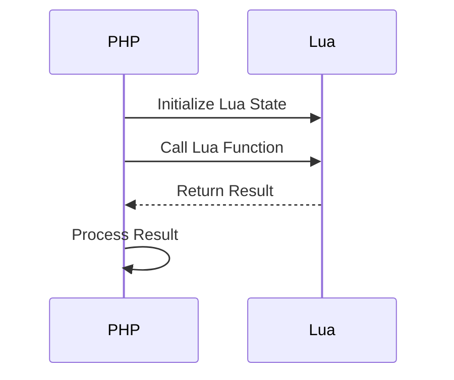

## 17.6.6 Integration with Other Languages (Ruby, PHP, etc.)

In the ever-evolving landscape of software development, the ability to integrate multiple programming languages within a single application is a powerful skill. Lua, known for its lightweight and embeddable nature, is often used alongside other languages to enhance functionality and performance. In this section, we will explore how Lua can be integrated with languages like Ruby and PHP, focusing on available bindings, implementation strategies, and practical use cases.

### Expanding Lua's Reach

#### Available Bindings

Lua's simplicity and efficiency make it an attractive choice for embedding in applications written in other languages. To facilitate this, several bindings and libraries have been developed to enable seamless integration with languages such as Ruby and PHP.

- **LuaRuby**: A binding that allows Lua scripts to be executed within Ruby applications. It provides a bridge between the two languages, enabling Ruby developers to leverage Lua's scripting capabilities.
- **PHPLua**: A PHP extension that embeds the Lua interpreter into PHP, allowing PHP scripts to execute Lua code. This integration is particularly useful for web applications that require scripting capabilities beyond what PHP natively offers.

These bindings serve as the foundation for inter-language communication, allowing developers to harness the strengths of both Lua and the host language.

#### Implementation Strategies

Integrating Lua with other languages involves several key strategies, including inter-language calls and data conversion. Let's delve into each of these strategies to understand how they facilitate seamless integration.

##### Inter-Language Calls

Inter-language calls enable one language to execute code written in another language. This is achieved through bindings or extensions that expose the functionality of one language to another. For instance, using LuaRuby, a Ruby application can call Lua functions and vice versa.

**Example: Calling Lua from Ruby**

```ruby
require 'lua'

lua = Lua::State.new
lua.eval('function greet(name) return "Hello, " .. name end')
puts lua.call('greet', 'World') # Output: Hello, World
```

In this example, we create a Lua state within a Ruby application and define a Lua function `greet`. The Ruby code then calls this Lua function, demonstrating how inter-language calls can be implemented.

##### Data Conversion

Data conversion is a critical aspect of integrating multiple languages, as each language has its own data types and structures. Effective integration requires converting data between these types to ensure compatibility and correctness.

**Example: Data Conversion between PHP and Lua**

```php
$lua = new Lua();
$lua->eval('function add(a, b) return a + b end');
$result = $lua->call('add', array(5, 10));
echo $result; // Output: 15
```

In this PHP example, we use the PHPLua extension to execute a Lua function that adds two numbers. The PHP array is converted to Lua's table format, and the result is returned to PHP as a native data type.

### Use Cases and Examples

#### Web Development

One of the most common use cases for integrating Lua with other languages is in web development. PHP, a widely used server-side scripting language, can benefit from Lua's lightweight and fast execution for specific tasks.

**Enhancing PHP Applications with Lua Scripting**

By embedding Lua into PHP applications, developers can offload computationally intensive tasks to Lua scripts, improving performance and scalability. This approach is particularly beneficial for applications that require real-time data processing or complex calculations.

**Example: Lua-Powered PHP Web Application**

```php
<?php
$lua = new Lua();
$lua->eval('function process_data(data) return #data end');
$data = array(1, 2, 3, 4, 5);
$result = $lua->call('process_data', $data);
echo "Number of elements: " . $result; // Output: Number of elements: 5
?>
```

In this example, a PHP web application uses Lua to process an array of data, counting the number of elements. This demonstrates how Lua can be used to enhance PHP applications by handling specific tasks more efficiently.

### Visualizing Integration

To better understand the integration process, let's visualize the interaction between Lua and other languages using a sequence diagram.



**Diagram Description**: This sequence diagram illustrates the process of integrating Lua with PHP. The PHP application initializes a Lua state, calls a Lua function, receives the result, and processes it within the PHP environment.

### References and Links

- [LuaRuby GitHub Repository](https://github.com/luarocks/luaruby)
- [PHPLua Documentation](https://www.php.net/manual/en/book.lua.php)
- [Lua Scripting in PHP Applications](https://www.php.net/manual/en/lua.examples.php)

### Knowledge Check

To reinforce your understanding of integrating Lua with other languages, consider the following questions:

1. What are the key benefits of integrating Lua with languages like Ruby and PHP?
2. How do inter-language calls facilitate communication between Lua and other languages?
3. What challenges might arise when converting data between Lua and another language?

### Embrace the Journey

Remember, integrating Lua with other languages is just the beginning. As you explore these integration patterns, you'll unlock new possibilities for enhancing your applications. Keep experimenting, stay curious, and enjoy the journey!

## Quiz Time!



### What is the primary purpose of LuaRuby?

- [x] To enable Lua scripts to be executed within Ruby applications.
- [ ] To convert Ruby code into Lua code.
- [ ] To replace Ruby with Lua in applications.
- [ ] To compile Lua scripts into Ruby bytecode.

> **Explanation:** LuaRuby is a binding that allows Lua scripts to be executed within Ruby applications, providing a bridge between the two languages.

### How does PHPLua enhance PHP applications?

- [x] By embedding the Lua interpreter into PHP, allowing PHP scripts to execute Lua code.
- [ ] By converting PHP code into Lua code.
- [ ] By replacing PHP with Lua in web applications.
- [ ] By compiling Lua scripts into PHP bytecode.

> **Explanation:** PHPLua is a PHP extension that embeds the Lua interpreter into PHP, enabling PHP scripts to execute Lua code and enhancing their functionality.

### What is a key challenge when integrating Lua with other languages?

- [x] Data conversion between different data types.
- [ ] Lack of available bindings.
- [ ] Incompatibility of syntax.
- [ ] Difficulty in installing Lua.

> **Explanation:** Data conversion is a critical aspect of integrating multiple languages, as each language has its own data types and structures.

### Which of the following is an example of inter-language calls?

- [x] A Ruby application calling a Lua function.
- [ ] A Lua script converting PHP code.
- [ ] A PHP application replacing Lua with Ruby.
- [ ] A Lua script compiling Ruby code.

> **Explanation:** Inter-language calls enable one language to execute code written in another language, such as a Ruby application calling a Lua function.

### What is the benefit of using Lua for computationally intensive tasks in PHP applications?

- [x] Improved performance and scalability.
- [ ] Easier code maintenance.
- [ ] Simplified syntax.
- [ ] Reduced memory usage.

> **Explanation:** By offloading computationally intensive tasks to Lua scripts, PHP applications can achieve improved performance and scalability.

### What does the sequence diagram illustrate in the context of Lua and PHP integration?

- [x] The process of integrating Lua with PHP, including initializing a Lua state and calling a Lua function.
- [ ] The conversion of PHP code into Lua code.
- [ ] The replacement of PHP with Lua in web applications.
- [ ] The compilation of Lua scripts into PHP bytecode.

> **Explanation:** The sequence diagram illustrates the process of integrating Lua with PHP, including initializing a Lua state, calling a Lua function, and processing the result.

### What is a common use case for integrating Lua with PHP?

- [x] Enhancing web applications with Lua scripting.
- [ ] Replacing PHP with Lua in web development.
- [ ] Converting PHP code into Lua code.
- [ ] Compiling Lua scripts into PHP bytecode.

> **Explanation:** A common use case for integrating Lua with PHP is enhancing web applications with Lua scripting, improving performance and functionality.

### How can Lua improve the performance of PHP applications?

- [x] By handling specific tasks more efficiently than PHP.
- [ ] By converting PHP code into Lua code.
- [ ] By replacing PHP with Lua in web applications.
- [ ] By compiling Lua scripts into PHP bytecode.

> **Explanation:** Lua can improve the performance of PHP applications by handling specific tasks more efficiently, such as real-time data processing or complex calculations.

### What is the role of data conversion in integrating Lua with other languages?

- [x] Ensuring compatibility and correctness between different data types.
- [ ] Replacing one language with another.
- [ ] Compiling scripts into bytecode.
- [ ] Simplifying syntax.

> **Explanation:** Data conversion is essential for ensuring compatibility and correctness between different data types when integrating Lua with other languages.

### True or False: Lua can only be integrated with Ruby and PHP.

- [ ] True
- [x] False

> **Explanation:** False. Lua can be integrated with a wide range of languages, not just Ruby and PHP, thanks to its lightweight and embeddable nature.


