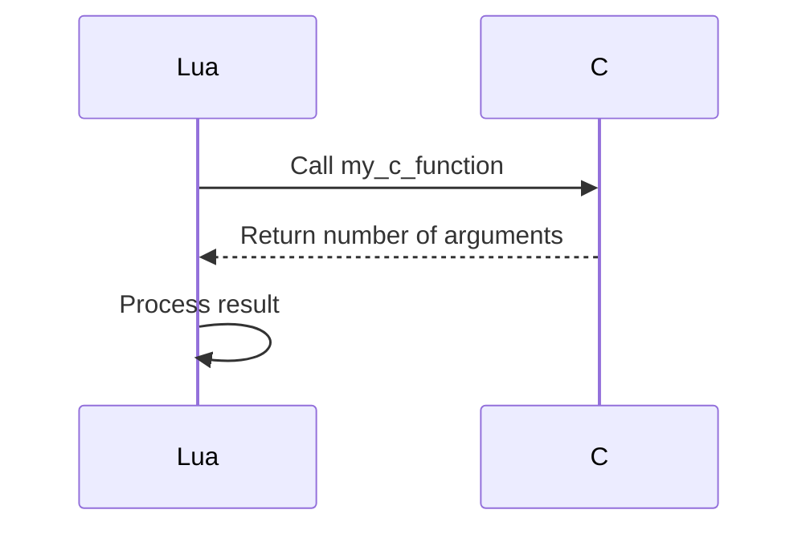

## 17.6.7 Best Practices for Multi-Language Integration

In today's diverse software ecosystem, integrating multiple programming languages within a single application is a common practice. This section delves into the best practices for integrating Lua with other languages, ensuring smooth interoperation, optimizing performance, and managing complexity in multi-language systems.

### Ensuring Smooth Interoperation

#### Consistent Interfaces: Designing Compatible APIs

When integrating Lua with other languages, designing consistent and compatible APIs is crucial. This involves:

- **Standardizing Data Formats**: Use common data formats like JSON or XML to facilitate communication between Lua and other languages. This ensures that data is easily interpretable across different systems.
  
- **Defining Clear Contracts**: Establish clear API contracts that specify the expected inputs and outputs. This helps in maintaining consistency and reduces the likelihood of integration errors.

- **Versioning and Compatibility**: Implement versioning in your APIs to manage changes over time. This allows different components to evolve independently without breaking existing integrations.

- **Documentation**: Provide comprehensive documentation for your APIs, including examples and edge cases. This aids developers in understanding how to interact with your system effectively.

#### Error Handling: Managing Exceptions Across Languages

Error handling is a critical aspect of multi-language integration. Here are some best practices:

- **Unified Error Codes**: Use a unified set of error codes across languages to simplify error handling. This makes it easier to diagnose and resolve issues.

- **Graceful Degradation**: Design your system to degrade gracefully in the event of an error. This involves implementing fallback mechanisms and ensuring that critical functionality remains available.

- **Logging and Monitoring**: Implement robust logging and monitoring to capture errors and performance metrics. This provides insights into the system's behavior and aids in troubleshooting.

- **Exception Translation**: Translate exceptions from one language to another in a way that preserves context and meaning. This ensures that errors are understandable regardless of the language in which they occur.

### Performance Considerations

#### Overhead Reduction: Minimizing Call Latency

Performance is a key consideration in multi-language integration. To minimize overhead:

- **Batch Processing**: Where possible, batch multiple operations into a single call to reduce the number of cross-language invocations.

- **Asynchronous Communication**: Use asynchronous communication patterns to avoid blocking operations and improve responsiveness.

- **Efficient Data Serialization**: Choose efficient serialization formats to reduce the time spent converting data between languages.

- **Profiling and Optimization**: Regularly profile your system to identify bottlenecks and optimize performance-critical paths.

#### Resource Management: Proper Handling of Memory and References

Proper resource management is essential to prevent memory leaks and ensure system stability:

- **Automatic Resource Cleanup**: Use language features like Lua's garbage collector to automatically manage memory. Ensure that resources are released promptly when no longer needed.

- **Reference Counting**: Implement reference counting for shared resources to track usage and release resources when they are no longer in use.

- **Cross-Language Resource Management**: Coordinate resource management across languages to prevent leaks and ensure that resources are properly cleaned up.

### Use Cases and Examples

#### Complex Systems: Integrating Components Written in Different Languages

Multi-language integration is often used in complex systems where different components are written in different languages. Here are some examples:

- **Web Applications**: A web application might use Lua for scripting, Python for data processing, and JavaScript for the frontend. Each language is chosen for its strengths, and integration ensures seamless operation.

- **Game Development**: In game development, Lua is often used for scripting game logic, while C++ is used for performance-critical components. Integration allows developers to leverage the strengths of both languages.

- **Embedded Systems**: In embedded systems, Lua can be used for high-level scripting, while C is used for low-level hardware interaction. This combination provides flexibility and performance.

### Code Examples

Let's explore a simple example of integrating Lua with C using the Lua C API. This example demonstrates how to call a C function from Lua.

```c
// C code: mylib.c
#include <lua.h>
#include <lauxlib.h>
#include <lualib.h>

// A simple C function to be called from Lua
static int my_c_function(lua_State *L) {
    int n = lua_gettop(L);  // Number of arguments
    lua_pushnumber(L, n);   // Push the number of arguments as the return value
    return 1;               // Number of return values
}

// Register the function with Lua
int luaopen_mylib(lua_State *L) {
    lua_register(L, "my_c_function", my_c_function);
    return 0;
}
```

```lua
-- Lua code: main.lua
-- Load the C library
local mylib = require("mylib")

-- Call the C function
local result = mylib.my_c_function(1, 2, 3)
print("Number of arguments:", result)  -- Output: Number of arguments: 3
```

### Visualizing Multi-Language Integration

To better understand the flow of data and control between Lua and other languages, let's visualize a typical integration scenario using a sequence diagram.



This diagram illustrates the interaction between Lua and C, highlighting the function call and return process.

### Try It Yourself

Experiment with the code example by modifying the C function to perform different operations, such as summing the arguments or returning a string. Observe how the changes affect the Lua script.

### References and Links

- [Lua C API Documentation](https://www.lua.org/manual/5.4/manual.html#4)
- [JSON for Modern C++](https://github.com/nlohmann/json)
- [Asynchronous Programming in Lua](https://www.lua.org/pil/9.3.html)

### Knowledge Check

- What are some common data formats used for multi-language integration?
- How can you ensure consistent error handling across languages?
- What are some strategies for minimizing call latency in multi-language systems?
- How does reference counting help in resource management?

### Embrace the Journey

Remember, integrating multiple languages in a single application can be challenging, but it's also an opportunity to leverage the strengths of each language. Keep experimenting, stay curious, and enjoy the journey!

## Quiz Time!



### What is a key consideration when designing APIs for multi-language integration?

- [x] Consistent data formats
- [ ] Using only one programming language
- [ ] Avoiding documentation
- [ ] Ignoring versioning

> **Explanation:** Consistent data formats ensure that data can be easily interpreted across different systems, which is crucial for multi-language integration.

### How can you manage exceptions across different languages?

- [x] Unified error codes
- [ ] Ignoring errors
- [ ] Using different error codes for each language
- [ ] Only handling errors in Lua

> **Explanation:** Unified error codes simplify error handling by providing a consistent way to diagnose and resolve issues across languages.

### What is a strategy to minimize call latency in multi-language systems?

- [x] Batch processing
- [ ] Increasing the number of calls
- [ ] Using synchronous communication
- [ ] Avoiding data serialization

> **Explanation:** Batch processing reduces the number of cross-language invocations, thereby minimizing call latency.

### What is the role of reference counting in resource management?

- [x] Tracking usage of shared resources
- [ ] Increasing memory usage
- [ ] Ignoring resource cleanup
- [ ] Only applicable to Lua

> **Explanation:** Reference counting helps track the usage of shared resources and ensures they are released when no longer in use.

### Which of the following is a common use case for multi-language integration?

- [x] Web applications
- [ ] Single-language applications
- [ ] Ignoring performance
- [ ] Avoiding scripting languages

> **Explanation:** Web applications often integrate multiple languages, such as Lua for scripting and Python for data processing, to leverage the strengths of each language.

### What is an advantage of using asynchronous communication in multi-language integration?

- [x] Improved responsiveness
- [ ] Increased blocking operations
- [ ] Slower performance
- [ ] More complex error handling

> **Explanation:** Asynchronous communication avoids blocking operations, leading to improved responsiveness in multi-language systems.

### How can you ensure proper memory management in multi-language integration?

- [x] Automatic resource cleanup
- [ ] Ignoring memory leaks
- [ ] Using manual memory management only
- [ ] Avoiding garbage collection

> **Explanation:** Automatic resource cleanup, such as using Lua's garbage collector, helps manage memory efficiently and prevent leaks.

### What is a benefit of using efficient data serialization formats?

- [x] Reduced conversion time
- [ ] Increased data size
- [ ] Slower data processing
- [ ] More complex integration

> **Explanation:** Efficient data serialization formats reduce the time spent converting data between languages, improving performance.

### Which diagram type is useful for visualizing multi-language integration?

- [x] Sequence diagram
- [ ] Pie chart
- [ ] Bar graph
- [ ] Scatter plot

> **Explanation:** Sequence diagrams are useful for visualizing the flow of data and control between different components in multi-language integration.

### True or False: Multi-language integration is only beneficial for small-scale applications.

- [ ] True
- [x] False

> **Explanation:** Multi-language integration is beneficial for both small-scale and large-scale applications, allowing developers to leverage the strengths of different languages.


