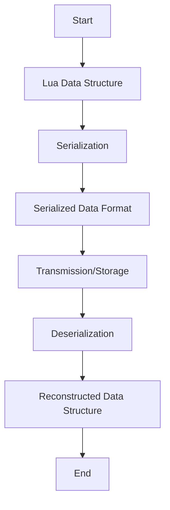

## 17.7 Data Serialization and Deserialization

In the realm of software engineering, data serialization and deserialization are pivotal processes that enable the transfer of data between different systems, applications, or components. This section delves into the concepts, techniques, and best practices for mastering data serialization and deserialization in Lua, a lightweight and flexible scripting language.

### Transferring Data Between Systems

Data serialization is the process of converting a data structure or object state into a format that can be stored or transmitted and reconstructed later. Deserialization is the reverse process, where the serialized data is converted back into a usable data structure. These processes are essential for data persistence, network communication, and interoperability between different systems.

#### Common Formats

Several data formats are commonly used for serialization and deserialization:

- **JSON (JavaScript Object Notation)**: A lightweight data interchange format that is easy for humans to read and write and easy for machines to parse and generate.
- **XML (Extensible Markup Language)**: A markup language that defines a set of rules for encoding documents in a format that is both human-readable and machine-readable.
- **Binary Formats**: These include Protocol Buffers, MessagePack, and others, which are efficient for both storage and transmission but are not human-readable.

### Implementing Serialization

In Lua, serialization can be implemented using various libraries and custom solutions. Let's explore some of these options.

#### Lua Libraries

Several Lua libraries facilitate serialization and deserialization:

- **dkjson**: A pure Lua implementation of JSON encoding and decoding. It is simple to use and integrates well with Lua applications.
- **lyaml**: A binding to the YAML parser and emitter, allowing for easy serialization and deserialization of YAML data.
- **serpent**: A Lua serializer and pretty printer that can handle complex data structures, including tables with cycles.

##### Example: Using dkjson for JSON Serialization

```lua
-- Import the dkjson module
local json = require("dkjson")

-- Define a Lua table
local data = {
    name = "John Doe",
    age = 30,
    hobbies = {"reading", "gaming", "coding"}
}

-- Serialize the table to a JSON string
local jsonString = json.encode(data, {indent = true})

-- Print the JSON string
print(jsonString)

-- Deserialize the JSON string back to a Lua table
local decodedData, pos, err = json.decode(jsonString)

-- Check for errors
if err then
    print("Error decoding JSON:", err)
else
    print("Decoded Lua table:", decodedData)
end
```

In this example, we use the `dkjson` library to serialize a Lua table into a JSON string and then deserialize it back into a Lua table. The `indent` option in `json.encode` makes the output more readable.

#### Custom Solutions

For unique data structures or specific requirements, you may need to implement custom serialization solutions. This involves writing functions to convert your data structures into a string format and back.

##### Example: Custom Serialization Function

```lua
-- Custom serialization function for a Lua table
function serializeTable(tbl)
    local result = "{"
    for k, v in pairs(tbl) do
        result = result .. "[" .. tostring(k) .. "]=" .. tostring(v) .. ","
    end
    return result .. "}"
end

-- Custom deserialization function (simple example)
function deserializeTable(str)
    local func = load("return " .. str)
    return func()
end

-- Example usage
local myTable = {x = 10, y = 20}
local serialized = serializeTable(myTable)
print("Serialized:", serialized)

local deserialized = deserializeTable(serialized)
print("Deserialized:", deserialized)
```

This example demonstrates a simple custom serialization and deserialization function for a Lua table. Note that this approach is basic and may not handle complex data structures or edge cases.

### Data Integrity and Security

When dealing with serialization and deserialization, ensuring data integrity and security is crucial.

#### Validation

Validation is the process of ensuring that the data being serialized or deserialized is consistent and adheres to expected formats. This can prevent errors and data corruption.

#### Security Risks

Deserialization can pose security risks, especially if the data comes from untrusted sources. Deserialization attacks can exploit vulnerabilities to execute arbitrary code or cause denial of service.

##### Best Practices for Secure Deserialization

- **Validate Input**: Always validate and sanitize input data before deserialization.
- **Use Safe Libraries**: Choose libraries that are known for their security and robustness.
- **Limit Deserialization Capabilities**: Restrict the types of objects that can be deserialized to prevent arbitrary code execution.

### Use Cases and Examples

Serialization and deserialization have numerous applications in software development. Let's explore some common use cases.

#### State Saving

Serialization is often used to persist application state, allowing data to be saved and restored across sessions.

##### Example: Saving and Loading Game State

```lua
-- Define a game state
local gameState = {
    level = 5,
    score = 1200,
    player = {name = "Hero", health = 100}
}

-- Serialize the game state to a JSON string
local gameStateJson = json.encode(gameState)

-- Save the JSON string to a file
local file = io.open("game_state.json", "w")
file:write(gameStateJson)
file:close()

-- Load the JSON string from the file
local file = io.open("game_state.json", "r")
local loadedJson = file:read("*a")
file:close()

-- Deserialize the JSON string back to a Lua table
local loadedGameState = json.decode(loadedJson)

print("Loaded Game State:", loadedGameState)
```

In this example, we serialize a game state to a JSON string and save it to a file. Later, we load the JSON string from the file and deserialize it back into a Lua table.

#### Network Communication

Serialization is essential for sending data over the network, enabling communication between different systems or components.

##### Example: Sending Data Over a Network

```lua
-- Example function to send serialized data over a network
function sendData(socket, data)
    local jsonData = json.encode(data)
    socket:send(jsonData)
end

-- Example function to receive and deserialize data from a network
function receiveData(socket)
    local jsonData = socket:receive()
    return json.decode(jsonData)
end

-- Example usage
local socket = require("socket")
local client = socket.connect("localhost", 8080)

local dataToSend = {message = "Hello, server!"}
sendData(client, dataToSend)

local receivedData = receiveData(client)
print("Received Data:", receivedData)
```

This example demonstrates how to serialize data into JSON format and send it over a network socket. The data is then received and deserialized back into a Lua table.

### Visualizing Data Serialization and Deserialization

To better understand the process of data serialization and deserialization, let's visualize it using a flowchart.



**Figure 1: Data Serialization and Deserialization Flowchart**

This flowchart illustrates the process of converting a Lua data structure into a serialized format, transmitting or storing the data, and then deserializing it back into a Lua data structure.

### References and Links

For further reading and exploration, consider the following resources:

- [Lua Users Wiki: Serialization](http://lua-users.org/wiki/Serialization)
- [dkjson GitHub Repository](https://github.com/LuaDist/dkjson)
- [LuaSocket Documentation](http://w3.impa.br/~diego/software/luasocket/)

### Knowledge Check

To reinforce your understanding of data serialization and deserialization in Lua, consider the following questions and exercises:

1. What are the advantages and disadvantages of using JSON for data serialization?
2. Implement a custom serialization function for a Lua table that includes nested tables.
3. Discuss the security implications of deserialization and how to mitigate potential risks.
4. Experiment with different serialization libraries in Lua and compare their performance and ease of use.

### Embrace the Journey

Remember, mastering data serialization and deserialization is a journey. As you continue to explore and experiment with different techniques and libraries, you'll gain a deeper understanding of how to efficiently and securely transfer data between systems. Keep learning, stay curious, and enjoy the process!

## Quiz Time!



### What is data serialization?

- [x] The process of converting a data structure into a format for storage or transmission.
- [ ] The process of converting a data structure into a binary format.
- [ ] The process of converting a data structure into a human-readable format.
- [ ] The process of converting a data structure into a machine code.

> **Explanation:** Data serialization is the process of converting a data structure or object state into a format that can be stored or transmitted and reconstructed later.

### Which of the following is a common format for data serialization?

- [x] JSON
- [ ] CSV
- [ ] HTML
- [ ] Markdown

> **Explanation:** JSON (JavaScript Object Notation) is a common format for data serialization, known for its lightweight and easy-to-read structure.

### What is the purpose of deserialization?

- [x] To convert serialized data back into a usable data structure.
- [ ] To compress data for storage.
- [ ] To encrypt data for security.
- [ ] To convert data into a binary format.

> **Explanation:** Deserialization is the process of converting serialized data back into a usable data structure.

### Which Lua library is commonly used for JSON serialization?

- [x] dkjson
- [ ] luasocket
- [ ] lpeg
- [ ] luafilesystem

> **Explanation:** The `dkjson` library is commonly used in Lua for JSON serialization and deserialization.

### What is a potential security risk of deserialization?

- [x] Deserialization attacks that execute arbitrary code.
- [ ] Data loss during transmission.
- [ ] Increased data size.
- [ ] Data duplication.

> **Explanation:** Deserialization can pose security risks, such as deserialization attacks that exploit vulnerabilities to execute arbitrary code.

### What is the role of validation in serialization?

- [x] Ensuring data consistency and preventing errors.
- [ ] Compressing data for storage.
- [ ] Encrypting data for security.
- [ ] Converting data into a binary format.

> **Explanation:** Validation ensures that the data being serialized or deserialized is consistent and adheres to expected formats, preventing errors and data corruption.

### Which of the following is a use case for serialization?

- [x] Persisting application state.
- [ ] Compressing data for storage.
- [ ] Encrypting data for security.
- [ ] Converting data into a binary format.

> **Explanation:** Serialization is often used to persist application state, allowing data to be saved and restored across sessions.

### What is the main advantage of using binary formats for serialization?

- [x] Efficiency in storage and transmission.
- [ ] Human-readability.
- [ ] Compatibility with all programming languages.
- [ ] Simplicity in implementation.

> **Explanation:** Binary formats are efficient for both storage and transmission, although they are not human-readable.

### Which of the following is a best practice for secure deserialization?

- [x] Validate and sanitize input data before deserialization.
- [ ] Use only binary formats for serialization.
- [ ] Avoid using any third-party libraries.
- [ ] Always deserialize data from untrusted sources.

> **Explanation:** Validating and sanitizing input data before deserialization is a best practice to prevent security vulnerabilities.

### True or False: Serialization is only used for network communication.

- [ ] True
- [x] False

> **Explanation:** Serialization is used for various purposes, including network communication, data persistence, and interoperability between systems.


