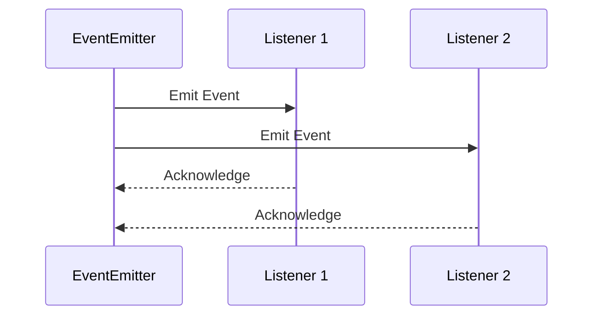

## 17.8 Message Passing and Event Systems

In the realm of software engineering, effective communication between components is crucial for building scalable and maintainable applications. Lua, with its lightweight and flexible nature, provides powerful mechanisms for implementing message passing and event systems. This section delves into the concepts of event-driven architectures, message queues, and dispatcher patterns, offering insights and practical examples to help you master these techniques in Lua.

### Facilitating Component Communication

#### Event-Driven Architectures: Using Events for Decoupled Communication

Event-driven architectures are a cornerstone of modern software design, enabling components to communicate in a decoupled manner. In Lua, events can be used to trigger actions without requiring direct interaction between components. This approach enhances modularity and scalability, allowing systems to respond dynamically to changes.

**Key Concepts:**

- **Events**: Signals that indicate a change or occurrence within the system.
- **Listeners**: Functions or methods that respond to specific events.
- **Event Emitters**: Objects or modules that generate events.

**Example: Basic Event System in Lua**

```lua
-- Define an EventEmitter class
local EventEmitter = {}
EventEmitter.__index = EventEmitter

function EventEmitter:new()
    local instance = {
        listeners = {}
    }
    setmetatable(instance, EventEmitter)
    return instance
end

function EventEmitter:on(event, listener)
    if not self.listeners[event] then
        self.listeners[event] = {}
    end
    table.insert(self.listeners[event], listener)
end

function EventEmitter:emit(event, ...)
    if self.listeners[event] then
        for _, listener in ipairs(self.listeners[event]) do
            listener(...)
        end
    end
end

-- Usage
local emitter = EventEmitter:new()

-- Register a listener for the 'data' event
emitter:on('data', function(data)
    print("Data received: " .. data)
end)

-- Emit the 'data' event
emitter:emit('data', 'Hello, World!')
```

In this example, we define a simple `EventEmitter` class that allows components to register listeners for specific events and emit those events when necessary. This pattern is foundational for building more complex event-driven systems.

#### Implementing Messaging

Messaging is a critical aspect of event-driven systems, enabling asynchronous communication between components. Lua supports various messaging patterns, including message queues and dispatcher patterns, to facilitate effective communication.

##### Message Queues: Managing Asynchronous Communication

Message queues are used to manage asynchronous communication between components, ensuring that messages are delivered and processed in a controlled manner. They are particularly useful in distributed systems where components may operate at different speeds or times.

**Example: Simple Message Queue in Lua**

```lua
-- Define a MessageQueue class
local MessageQueue = {}
MessageQueue.__index = MessageQueue

function MessageQueue:new()
    local instance = {
        queue = {}
    }
    setmetatable(instance, MessageQueue)
    return instance
end

function MessageQueue:enqueue(message)
    table.insert(self.queue, message)
end

function MessageQueue:dequeue()
    return table.remove(self.queue, 1)
end

-- Usage
local queue = MessageQueue:new()

-- Enqueue messages
queue:enqueue("Message 1")
queue:enqueue("Message 2")

-- Dequeue and process messages
local message = queue:dequeue()
while message do
    print("Processing: " .. message)
    message = queue:dequeue()
end
```

In this example, we implement a simple message queue that allows messages to be enqueued and dequeued in a first-in, first-out (FIFO) manner. This pattern is essential for managing asynchronous tasks and ensuring that messages are processed in the correct order.

##### Dispatcher Patterns: Centralized Event Handling

Dispatcher patterns centralize event handling, allowing a single component to manage the distribution of events to appropriate listeners. This approach simplifies the architecture and enhances the maintainability of the system.

**Example: Event Dispatcher in Lua**

```lua
-- Define an EventDispatcher class
local EventDispatcher = {}
EventDispatcher.__index = EventDispatcher

function EventDispatcher:new()
    local instance = {
        listeners = {}
    }
    setmetatable(instance, EventDispatcher)
    return instance
end

function EventDispatcher:addListener(event, listener)
    if not self.listeners[event] then
        self.listeners[event] = {}
    end
    table.insert(self.listeners[event], listener)
end

function EventDispatcher:dispatch(event, ...)
    if self.listeners[event] then
        for _, listener in ipairs(self.listeners[event]) do
            listener(...)
        end
    end
end

-- Usage
local dispatcher = EventDispatcher:new()

-- Add listeners for events
dispatcher:addListener('start', function()
    print("Start event triggered")
end)

dispatcher:addListener('stop', function()
    print("Stop event triggered")
end)

-- Dispatch events
dispatcher:dispatch('start')
dispatcher:dispatch('stop')
```

In this example, we create an `EventDispatcher` class that manages listeners for different events and dispatches those events when triggered. This pattern is useful for coordinating complex interactions between components.

### Use Cases and Examples

#### Modular Applications: Allowing Plugins to Communicate

In modular applications, plugins often need to communicate with each other without being tightly coupled. Event systems provide a flexible mechanism for enabling this communication, allowing plugins to register for and emit events as needed.

**Example: Plugin Communication in Lua**

```lua
-- Define a PluginManager class
local PluginManager = {}
PluginManager.__index = PluginManager

function PluginManager:new()
    local instance = {
        plugins = {},
        eventEmitter = EventEmitter:new()
    }
    setmetatable(instance, PluginManager)
    return instance
end

function PluginManager:registerPlugin(plugin)
    table.insert(self.plugins, plugin)
    plugin:initialize(self.eventEmitter)
end

-- Define a sample plugin
local SamplePlugin = {}
SamplePlugin.__index = SamplePlugin

function SamplePlugin:new()
    local instance = {}
    setmetatable(instance, SamplePlugin)
    return instance
end

function SamplePlugin:initialize(eventEmitter)
    eventEmitter:on('customEvent', function(data)
        print("SamplePlugin received: " .. data)
    end)
end

-- Usage
local manager = PluginManager:new()
local plugin = SamplePlugin:new()

manager:registerPlugin(plugin)
manager.eventEmitter:emit('customEvent', 'Hello from PluginManager')
```

In this example, we define a `PluginManager` class that manages plugins and an `EventEmitter` for communication. Plugins can register for events and respond to them, enabling dynamic interaction within the application.

#### Distributed Systems: Messaging Across Networked Components

In distributed systems, components often need to communicate across network boundaries. Message passing and event systems provide a robust mechanism for facilitating this communication, ensuring that messages are delivered reliably and efficiently.

**Example: Distributed Messaging in Lua**

```lua
-- Simulate a networked message passing system
local Network = {}
Network.__index = Network

function Network:new()
    local instance = {
        nodes = {}
    }
    setmetatable(instance, Network)
    return instance
end

function Network:addNode(node)
    table.insert(self.nodes, node)
end

function Network:broadcast(message)
    for _, node in ipairs(self.nodes) do
        node:receive(message)
    end
end

-- Define a Node class
local Node = {}
Node.__index = Node

function Node:new(name)
    local instance = {
        name = name
    }
    setmetatable(instance, Node)
    return instance
end

function Node:receive(message)
    print(self.name .. " received: " .. message)
end

-- Usage
local network = Network:new()
local node1 = Node:new("Node1")
local node2 = Node:new("Node2")

network:addNode(node1)
network:addNode(node2)

network:broadcast("Hello, Network!")
```

In this example, we simulate a networked message passing system where nodes can receive messages broadcasted by a central network component. This pattern is essential for building distributed applications that require reliable communication between components.

### Visualizing Message Passing and Event Systems

To better understand the flow of message passing and event systems, let's visualize the architecture using a sequence diagram.



**Diagram Description:** This sequence diagram illustrates the flow of events from an `EventEmitter` to multiple listeners. The emitter sends an event to each listener, and the listeners acknowledge the receipt of the event.

### Try It Yourself

Experiment with the code examples provided in this section. Try modifying the event types, adding more listeners, or implementing additional message queue functionalities. This hands-on approach will deepen your understanding of message passing and event systems in Lua.

### Knowledge Check

- What are the key components of an event-driven architecture?
- How can message queues be used to manage asynchronous communication?
- What is the role of a dispatcher in an event system?
- How can plugins communicate in a modular application using events?
- What are the benefits of using message passing in distributed systems?

### Embrace the Journey

Remember, mastering message passing and event systems in Lua is just the beginning. As you continue to explore these concepts, you'll unlock new possibilities for building dynamic, scalable applications. Keep experimenting, stay curious, and enjoy the journey!

## Quiz Time!



### What is the primary benefit of using event-driven architectures in Lua?

- [x] Decoupled communication between components
- [ ] Faster execution of code
- [ ] Simplified syntax
- [ ] Reduced memory usage

> **Explanation:** Event-driven architectures enable decoupled communication, allowing components to interact without direct dependencies.

### In a message queue, what is the typical order of message processing?

- [x] First-in, first-out (FIFO)
- [ ] Last-in, first-out (LIFO)
- [ ] Random order
- [ ] Priority-based

> **Explanation:** Message queues typically process messages in a first-in, first-out (FIFO) order to ensure that messages are handled in the sequence they were received.

### What is the role of an EventEmitter in an event-driven system?

- [x] To generate and emit events
- [ ] To process and store data
- [ ] To manage user interfaces
- [ ] To handle network communication

> **Explanation:** An EventEmitter is responsible for generating and emitting events to which other components can listen and respond.

### How can plugins communicate in a modular application using Lua?

- [x] By registering for and emitting events
- [ ] By directly calling each other's functions
- [ ] By sharing global variables
- [ ] By using shared memory

> **Explanation:** Plugins can communicate in a modular application by registering for and emitting events, allowing for decoupled interaction.

### What is a common use case for message passing in distributed systems?

- [x] Messaging across networked components
- [ ] Rendering graphics
- [ ] Managing local file systems
- [ ] Performing mathematical calculations

> **Explanation:** Message passing is commonly used in distributed systems to facilitate communication across networked components.

### What is a key advantage of using dispatcher patterns?

- [x] Centralized event handling
- [ ] Faster data processing
- [ ] Reduced code complexity
- [ ] Improved user interface design

> **Explanation:** Dispatcher patterns centralize event handling, making it easier to manage and coordinate events within a system.

### In the provided example, what does the `Network:broadcast` function do?

- [x] Sends a message to all nodes in the network
- [ ] Receives messages from nodes
- [ ] Processes data locally
- [ ] Connects to external databases

> **Explanation:** The `Network:broadcast` function sends a message to all nodes in the network, simulating a broadcast communication.

### What is the purpose of a message queue in asynchronous communication?

- [x] To manage the order and delivery of messages
- [ ] To store data permanently
- [ ] To execute code faster
- [ ] To simplify user interfaces

> **Explanation:** A message queue manages the order and delivery of messages, ensuring that they are processed in a controlled manner.

### How does an EventDispatcher differ from an EventEmitter?

- [x] An EventDispatcher centralizes event handling, while an EventEmitter generates events
- [ ] An EventDispatcher stores data, while an EventEmitter processes data
- [ ] An EventDispatcher manages user interfaces, while an EventEmitter handles network communication
- [ ] An EventDispatcher is faster than an EventEmitter

> **Explanation:** An EventDispatcher centralizes event handling, distributing events to appropriate listeners, while an EventEmitter is responsible for generating events.

### True or False: Message passing is only useful in distributed systems.

- [ ] True
- [x] False

> **Explanation:** False. Message passing is useful in various contexts, including modular applications and event-driven architectures, not just distributed systems.


