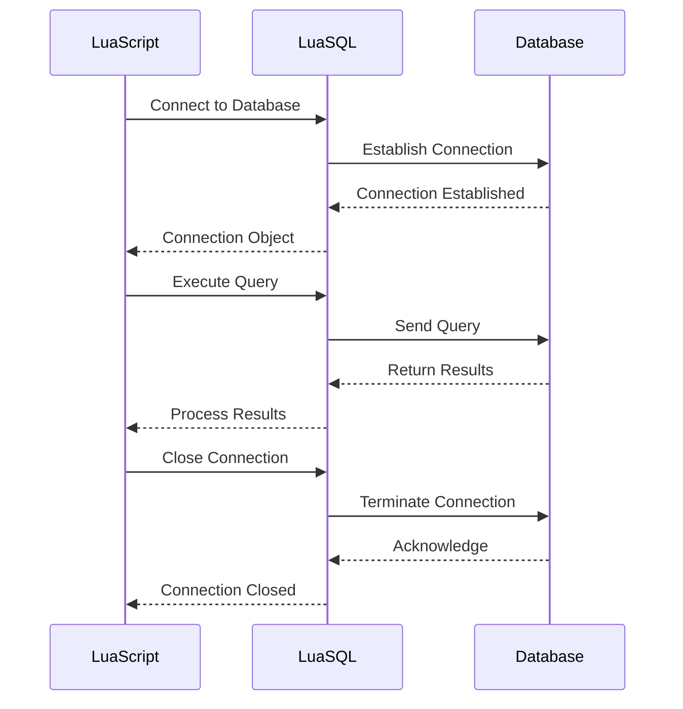

## 17.9 Integration with Databases and Data Stores

In modern software development, integrating applications with databases and data stores is a fundamental requirement. Lua, known for its lightweight and embeddable nature, provides several ways to interact with both SQL and NoSQL databases. This section will guide you through the process of integrating Lua with various databases, focusing on best practices and practical examples.

### Accessing Databases from Lua

#### LuaSQL: A Module for Database Connectivity

LuaSQL is a popular library that provides a simple and consistent interface for connecting to various SQL databases, including MySQL, PostgreSQL, SQLite, and others. It abstracts the complexities of database interactions, allowing developers to focus on executing queries and processing results.

**Installation and Setup**

To use LuaSQL, you need to install it via LuaRocks, the package manager for Lua:

```bash
luarocks install luasql-mysql
```

Replace `mysql` with the appropriate database driver you wish to use, such as `postgres` or `sqlite3`.

**Connecting to a Database**

Here's a basic example of how to connect to a MySQL database using LuaSQL:

```lua
local luasql = require "luasql.mysql"

-- Create an environment object
local env = luasql.mysql()

-- Connect to the database
local conn = env:connect("database_name", "username", "password", "hostname", port)

if conn then
    print("Connected to the database successfully!")
else
    print("Failed to connect to the database.")
end

-- Close the connection
conn:close()
env:close()
```

**Executing Queries**

Once connected, you can execute SQL queries and process the results. Here's an example of executing a simple SELECT query:

```lua
-- Execute a query
local cursor, errorString = conn:execute("SELECT * FROM users")

if cursor then
    -- Fetch each row
    local row = cursor:fetch({}, "a")
    while row do
        print(string.format("User: %s, Email: %s", row.name, row.email))
        row = cursor:fetch(row, "a")
    end
    cursor:close()
else
    print("Error executing query: " .. errorString)
end
```

### Implementing Data Access

#### SQL Operations: Executing Queries and Processing Results

SQL operations in Lua involve executing queries and handling the results. LuaSQL provides a straightforward API for these tasks.

**Inserting Data**

To insert data into a database, use the `execute` method with an INSERT statement:

```lua
local insertQuery = [[
    INSERT INTO users (name, email) VALUES ('John Doe', 'john.doe@example.com')
]]
local result, errorString = conn:execute(insertQuery)

if result then
    print("Data inserted successfully!")
else
    print("Error inserting data: " .. errorString)
end
```

**Updating and Deleting Data**

Updating and deleting records follow a similar pattern:

```lua
-- Update a record
local updateQuery = [[
    UPDATE users SET email = 'john.new@example.com' WHERE name = 'John Doe'
]]
conn:execute(updateQuery)

-- Delete a record
local deleteQuery = [[
    DELETE FROM users WHERE name = 'John Doe'
]]
conn:execute(deleteQuery)
```

#### NoSQL Databases: Using Drivers for MongoDB, Redis, etc.

Lua can also interact with NoSQL databases using specific drivers. For example, to connect to Redis, you can use the `lua-resty-redis` library.

**Connecting to Redis**

First, install the library:

```bash
luarocks install lua-resty-redis
```

Then, use the following code to connect and perform operations:

```lua
local redis = require "resty.redis"
local red = redis:new()

-- Connect to Redis
red:set_timeout(1000)  -- 1 second
local ok, err = red:connect("127.0.0.1", 6379)

if not ok then
    print("Failed to connect to Redis: " .. err)
    return
end

-- Set a key-value pair
red:set("key", "value")

-- Get the value
local res, err = red:get("key")
if res then
    print("Value: " .. res)
else
    print("Error: " .. err)
end

-- Close the connection
red:close()
```

### Best Practices

#### Connection Management: Efficient Resource Utilization

Efficient connection management is crucial for performance and resource utilization. Here are some best practices:

- **Connection Pooling**: Use connection pooling to reuse database connections, reducing the overhead of establishing new connections.
- **Timeouts**: Set appropriate timeouts for database operations to prevent hanging connections.
- **Graceful Shutdown**: Ensure connections are closed properly to release resources.

#### Prepared Statements: Preventing SQL Injection

Prepared statements are a powerful tool to prevent SQL injection attacks. They separate SQL code from data, ensuring that user input does not alter the intended SQL logic.

**Using Prepared Statements**

Here's how you can use prepared statements in LuaSQL:

```lua
local stmt = conn:prepare("INSERT INTO users (name, email) VALUES (?, ?)")
stmt:execute("Jane Doe", "jane.doe@example.com")
stmt:close()
```

### Use Cases and Examples

#### Web Applications: Dynamic Content Generation

In web applications, databases are often used to store and retrieve dynamic content. Lua, with its lightweight nature, is an excellent choice for scripting in web servers like Nginx with OpenResty.

**Example: Fetching Data for a Web Page**

```lua
local function fetchUserData(userId)
    local query = string.format("SELECT * FROM users WHERE id = %d", userId)
    local cursor = conn:execute(query)
    local row = cursor:fetch({}, "a")
    cursor:close()
    return row
end

local userData = fetchUserData(1)
if userData then
    print(string.format("User: %s, Email: %s", userData.name, userData.email))
else
    print("User not found.")
end
```

#### Data Analysis Tools: Processing and Visualizing Data

Lua can be used to build data analysis tools that process and visualize data stored in databases. By leveraging Lua's scripting capabilities, you can create custom data processing pipelines.

**Example: Aggregating Data**

```lua
local function aggregateUserData()
    local query = "SELECT COUNT(*) as user_count FROM users"
    local cursor = conn:execute(query)
    local row = cursor:fetch({}, "a")
    cursor:close()
    return row.user_count
end

local userCount = aggregateUserData()
print("Total users: " .. userCount)
```

### Visualizing Database Integration

To better understand the flow of integrating Lua with databases, let's visualize the process using a sequence diagram:



This diagram illustrates the typical interaction between a Lua script, the LuaSQL library, and a database. It highlights the key steps involved in establishing a connection, executing queries, and closing the connection.

### Try It Yourself

Experiment with the provided code examples by modifying the queries and observing the results. Try connecting to different databases or using different data sets to see how Lua handles various scenarios. This hands-on approach will deepen your understanding of Lua's database integration capabilities.

### Knowledge Check

Before we conclude, let's reinforce what we've learned:

- How does LuaSQL facilitate database connectivity?
- What are the benefits of using prepared statements?
- How can Lua interact with NoSQL databases like Redis?

### Embrace the Journey

Remember, integrating Lua with databases is just one aspect of its versatility. As you continue to explore Lua's capabilities, you'll discover more ways to leverage its power in various domains. Keep experimenting, stay curious, and enjoy the journey!

## Quiz Time!



### What is LuaSQL used for in Lua programming?

- [x] Database connectivity
- [ ] File I/O operations
- [ ] Network communication
- [ ] GUI development

> **Explanation:** LuaSQL is a module that provides database connectivity for Lua, allowing interaction with SQL databases.

### Which Lua library is used to connect to Redis?

- [x] lua-resty-redis
- [ ] luasql-redis
- [ ] lua-redis
- [ ] redis-lua

> **Explanation:** lua-resty-redis is a library used to connect to Redis from Lua.

### What is the primary benefit of using prepared statements?

- [x] Preventing SQL injection
- [ ] Improving query performance
- [ ] Simplifying query syntax
- [ ] Reducing database load

> **Explanation:** Prepared statements help prevent SQL injection by separating SQL code from data.

### What is a common practice for efficient connection management?

- [x] Connection pooling
- [ ] Using global variables
- [ ] Hardcoding credentials
- [ ] Disabling timeouts

> **Explanation:** Connection pooling is a common practice to efficiently manage database connections.

### How can Lua interact with NoSQL databases?

- [x] Using specific drivers
- [ ] Through LuaSQL
- [ ] Via HTTP requests
- [ ] Using shell scripts

> **Explanation:** Lua interacts with NoSQL databases using specific drivers tailored for each database.

### What is the purpose of setting timeouts for database operations?

- [x] Preventing hanging connections
- [ ] Increasing query speed
- [ ] Reducing memory usage
- [ ] Simplifying code

> **Explanation:** Setting timeouts helps prevent hanging connections by ensuring operations complete within a specified time.

### Which of the following is a use case for Lua database integration?

- [x] Dynamic content generation in web applications
- [ ] Real-time graphics rendering
- [ ] Audio processing
- [ ] Image editing

> **Explanation:** Lua database integration is commonly used for dynamic content generation in web applications.

### What does the `execute` method in LuaSQL do?

- [x] Executes SQL queries
- [ ] Connects to the database
- [ ] Closes the connection
- [ ] Fetches query results

> **Explanation:** The `execute` method in LuaSQL is used to execute SQL queries.

### What is the role of the `fetch` method in LuaSQL?

- [x] Retrieves query results
- [ ] Executes SQL queries
- [ ] Connects to the database
- [ ] Closes the connection

> **Explanation:** The `fetch` method retrieves query results from the database.

### True or False: Lua can only interact with SQL databases.

- [ ] True
- [x] False

> **Explanation:** Lua can interact with both SQL and NoSQL databases using appropriate libraries and drivers.


