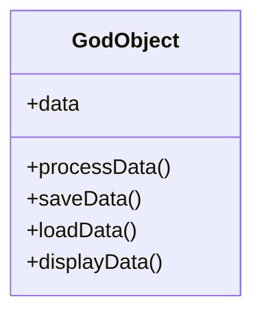

## 18.1 Common Anti-Patterns in Lua Programming

In the realm of software development, recognizing and avoiding anti-patterns is crucial for maintaining code quality and ensuring efficient performance. Anti-patterns are solutions that may seem effective initially but lead to negative consequences in the long term. In this section, we will explore some common anti-patterns in Lua programming, understand their implications, and learn how to refactor them for better code quality and performance.

### Recognizing Ineffective Practices

#### Definition of Anti-Patterns

Anti-patterns are recurring solutions to common problems that are counterproductive in the long term. They often arise from a lack of understanding of best practices or from taking shortcuts that seem beneficial at first but lead to maintenance challenges and performance issues.

#### Examples of Anti-Patterns

Let's delve into some specific anti-patterns that are prevalent in Lua programming:

1. **God Object**

   The God Object anti-pattern occurs when a single object or module knows too much or does too much. This leads to a lack of modularity and makes the code difficult to maintain and extend.

   ```lua
   -- Example of a God Object
   local GodObject = {
       data = {},
       processData = function(self)
           -- Process data
       end,
       saveData = function(self)
           -- Save data to a file
       end,
       loadData = function(self)
           -- Load data from a file
       end,
       displayData = function(self)
           -- Display data to the user
       end
   }
   ```

   **Consequences**: The God Object becomes a bottleneck for changes, as any modification requires understanding and altering a large, complex structure.

   **Refactoring Tip**: Break down the God Object into smaller, more focused modules or objects, each responsible for a specific aspect of the functionality.

2. **Cargo Cult Programming**

   Cargo Cult Programming refers to the practice of using code without understanding its purpose, often copying and pasting code snippets without adapting them to the specific context.

   ```lua
   -- Example of Cargo Cult Programming
   function calculate(a, b)
       -- Copied code without understanding
       return a + b -- Assuming this is the correct operation
   end
   ```

   **Consequences**: This leads to code that is difficult to debug and maintain, as the developer may not fully understand how it works or why it was implemented in a certain way.

   **Refactoring Tip**: Always strive to understand the code you are using. If you must use external code, ensure it is well-documented and that you comprehend its functionality.

3. **Magic Numbers and Strings**

   Using hard-coded numbers or strings in your code, known as magic numbers or strings, can make the code difficult to understand and maintain.

   ```lua
   -- Example of Magic Numbers
   local discount = 0.15 -- Magic number
   local price = 100
   local finalPrice = price - (price * discount)
   ```

   **Consequences**: Magic numbers and strings obscure the meaning of the code, making it harder for others (or yourself in the future) to understand the logic.

   **Refactoring Tip**: Replace magic numbers and strings with named constants that clearly describe their purpose.

   ```lua
   -- Refactored Code
   local DISCOUNT_RATE = 0.15
   local price = 100
   local finalPrice = price - (price * DISCOUNT_RATE)
   ```

4. **Spaghetti Code**

   Spaghetti code is characterized by a complex and tangled control structure, often resulting from excessive use of goto statements or deeply nested loops and conditionals.

   ```lua
   -- Example of Spaghetti Code
   local function process(data)
       if data then
           for i = 1, #data do
               if data[i] > 0 then
                   -- Do something
               else
                   -- Do something else
               end
           end
       else
           -- Handle no data
       end
   end
   ```

   **Consequences**: Spaghetti code is difficult to read, understand, and maintain, leading to increased chances of bugs and errors.

   **Refactoring Tip**: Simplify control structures by breaking down complex logic into smaller, well-defined functions. Avoid deep nesting by using early returns or guard clauses.

5. **Copy-Paste Programming**

   Copy-paste programming involves duplicating code across different parts of the application, leading to code duplication and inconsistency.

   ```lua
   -- Example of Copy-Paste Programming
   function calculateArea(length, width)
       return length * width
   end

   function calculateVolume(length, width, height)
       return length * width * height
   end
   ```

   **Consequences**: Code duplication increases the risk of bugs, as changes need to be made in multiple places. It also leads to larger codebases that are harder to maintain.

   **Refactoring Tip**: Identify common functionality and extract it into reusable functions or modules.

   ```lua
   -- Refactored Code
   function calculateArea(length, width)
       return length * width
   end

   function calculateVolume(length, width, height)
       return calculateArea(length, width) * height
   end
   ```

6. **Premature Optimization**

   Premature optimization is the practice of trying to improve the performance of code before it is necessary, often at the expense of code readability and maintainability.

   ```lua
   -- Example of Premature Optimization
   local function calculateSum(numbers)
       local sum = 0
       for i = 1, #numbers do
           sum = sum + numbers[i]
       end
       return sum
   end
   ```

   **Consequences**: Premature optimization can lead to complex and unreadable code, making it difficult to maintain and debug.

   **Refactoring Tip**: Focus on writing clear and maintainable code first. Optimize only when you have identified performance bottlenecks through profiling.

7. **Overuse of Global Variables**

   Using global variables excessively can lead to code that is difficult to understand and maintain, as it becomes unclear where and how variables are being modified.

   ```lua
   -- Example of Overuse of Global Variables
   myGlobalVar = 10

   function incrementGlobalVar()
       myGlobalVar = myGlobalVar + 1
   end
   ```

   **Consequences**: Global variables can lead to unexpected side effects and make it difficult to track changes in the code.

   **Refactoring Tip**: Limit the use of global variables by using local variables and passing data through function parameters.

   ```lua
   -- Refactored Code
   local function incrementVar(var)
       return var + 1
   end

   local myVar = 10
   myVar = incrementVar(myVar)
   ```

### Consequences of Anti-Patterns

Anti-patterns can have several negative consequences on your codebase:

- **Maintenance Challenges**: Code becomes difficult to update or fix, leading to increased development time and effort.
- **Performance Issues**: Inefficient code can lead to slow execution and increased resource consumption.
- **Increased Bug Risk**: Complex and tangled code structures are more prone to errors and bugs.
- **Reduced Readability**: Code becomes difficult to understand, making it harder for new developers to contribute.

### Visualizing Anti-Patterns

To better understand the impact of anti-patterns, let's visualize the structure of a God Object using a class diagram:



**Diagram Description**: The God Object class diagram illustrates a single object with multiple responsibilities, leading to a lack of modularity and increased complexity.

### Try It Yourself

To better understand these anti-patterns, try refactoring the provided code examples. Experiment with breaking down the God Object into smaller modules, replacing magic numbers with named constants, and simplifying spaghetti code.

### References and Links

- [MDN Web Docs: Anti-Patterns](https://developer.mozilla.org/en-US/docs/Glossary/Anti-pattern)
- [W3Schools: Lua Programming](https://www.w3schools.com/lua/)
- [Lua Users Wiki: Programming in Lua](http://lua-users.org/wiki/ProgrammingInLua)

### Knowledge Check

- What is an anti-pattern, and why is it important to recognize them in your code?
- How can the God Object anti-pattern affect the maintainability of your code?
- What are some strategies for refactoring spaghetti code?

### Embrace the Journey

Remember, recognizing and avoiding anti-patterns is just the beginning. As you progress, you'll develop a deeper understanding of best practices and design patterns that will help you write clean, efficient, and maintainable code. Keep experimenting, stay curious, and enjoy the journey!

## Quiz Time!



### What is an anti-pattern?

- [x] A recurring solution to a common problem that is counterproductive in the long term.
- [ ] A design pattern that improves code efficiency.
- [ ] A method for optimizing code performance.
- [ ] A technique for debugging complex code.

> **Explanation:** An anti-pattern is a recurring solution to a common problem that is counterproductive in the long term.

### Which of the following is an example of the God Object anti-pattern?

- [x] A single object that knows too much or does too much.
- [ ] A function that performs a single task.
- [ ] A module with a clear separation of concerns.
- [ ] A class with a single responsibility.

> **Explanation:** The God Object anti-pattern occurs when a single object knows too much or does too much, leading to a lack of modularity.

### What is a consequence of Cargo Cult Programming?

- [x] Difficulty in debugging and maintaining code.
- [ ] Improved code readability.
- [ ] Enhanced code performance.
- [ ] Increased modularity.

> **Explanation:** Cargo Cult Programming leads to difficulty in debugging and maintaining code, as the developer may not fully understand how it works.

### How can you refactor magic numbers in your code?

- [x] Replace them with named constants.
- [ ] Use more complex algorithms.
- [ ] Increase the number of global variables.
- [ ] Add more comments to explain them.

> **Explanation:** Refactoring magic numbers involves replacing them with named constants that clearly describe their purpose.

### What is a common consequence of spaghetti code?

- [x] Increased chances of bugs and errors.
- [ ] Improved code performance.
- [ ] Enhanced code readability.
- [ ] Easier maintenance.

> **Explanation:** Spaghetti code is difficult to read and maintain, leading to increased chances of bugs and errors.

### What is the main issue with copy-paste programming?

- [x] Code duplication and inconsistency.
- [ ] Improved code efficiency.
- [ ] Enhanced code readability.
- [ ] Increased modularity.

> **Explanation:** Copy-paste programming leads to code duplication and inconsistency, making it harder to maintain.

### How can you avoid premature optimization?

- [x] Focus on writing clear and maintainable code first.
- [ ] Optimize code before writing it.
- [ ] Use complex algorithms from the start.
- [ ] Avoid profiling your code.

> **Explanation:** Avoid premature optimization by focusing on writing clear and maintainable code first, and optimize only when necessary.

### What is a consequence of overusing global variables?

- [x] Unexpected side effects and difficulty tracking changes.
- [ ] Improved code readability.
- [ ] Enhanced code performance.
- [ ] Increased modularity.

> **Explanation:** Overusing global variables can lead to unexpected side effects and make it difficult to track changes in the code.

### How can you refactor code with excessive global variables?

- [x] Use local variables and pass data through function parameters.
- [ ] Increase the number of global variables.
- [ ] Add more comments to explain them.
- [ ] Use more complex algorithms.

> **Explanation:** Refactor code with excessive global variables by using local variables and passing data through function parameters.

### Anti-patterns can lead to performance issues.

- [x] True
- [ ] False

> **Explanation:** Anti-patterns can lead to performance issues due to inefficient code and increased resource consumption.


