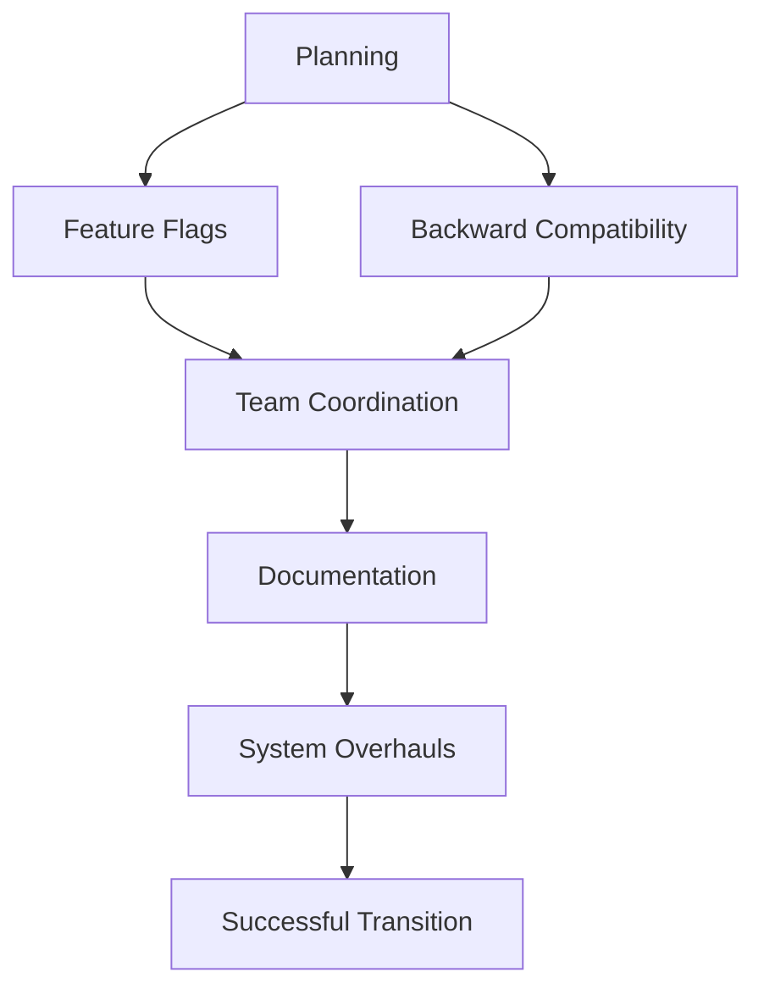

## 18.10 Effecting Large-Scale Change with Minimal Trauma

In the ever-evolving landscape of software development, change is inevitable. Whether it's adapting to new technologies, optimizing performance, or restructuring code for better maintainability, large-scale changes are a part of every developer's journey. However, these changes can often be disruptive, leading to bugs, downtime, and frustration. In this section, we'll explore strategies to manage significant code changes in Lua applications with minimal trauma.

### Managing Significant Code Changes

Effectively managing large-scale changes requires a structured approach. Let's delve into the key components that ensure a smooth transition.

#### Planning

**Explain the Importance of Planning:** Before diving into code changes, it's crucial to have a clear plan. This involves outlining objectives, identifying potential risks, and defining a strategy to achieve the desired outcome. Planning helps in setting realistic timelines and allocating resources efficiently.

**Outline Objectives and Strategies:**

- **Define Clear Goals:** What are you trying to achieve with this change? Is it performance improvement, code readability, or adopting a new technology?
- **Risk Assessment:** Identify potential risks and their impact. Develop contingency plans to address these risks.
- **Resource Allocation:** Determine the resources required, including time, personnel, and tools.

#### Techniques

Implementing large-scale changes requires specific techniques to ensure a seamless transition. Here are some effective methods:

##### Feature Flags

**Explain Feature Flags:** Feature flags are a powerful tool for managing changes. They allow you to enable or disable features dynamically without deploying new code. This technique is particularly useful for gradual rollouts and testing in production environments.

**Provide a Code Example:**

```lua
-- Feature flag implementation in Lua
local featureFlags = {
    newFeature = false,  -- Set to true to enable the new feature
}

function executeFeature()
    if featureFlags.newFeature then
        print("Executing new feature")
        -- New feature code goes here
    else
        print("Executing old feature")
        -- Old feature code goes here
    end
end

executeFeature()
```

**Highlight Key Points:**

- **Gradual Rollout:** Enable the feature for a small subset of users to monitor its impact.
- **A/B Testing:** Compare the performance of the new feature against the old one.

##### Backward Compatibility

**Explain Backward Compatibility:** Ensuring that new changes do not break existing functionality is crucial. Backward compatibility allows old code to continue working temporarily while new changes are integrated.

**Provide a Code Example:**

```lua
-- Backward compatibility example in Lua
function processData(input)
    if type(input) == "table" then
        -- New processing logic for tables
        print("Processing table input")
    else
        -- Old processing logic for strings
        print("Processing string input")
    end
end

processData("old data")
processData({key = "value"})
```

**Highlight Key Points:**

- **Deprecation Warnings:** Inform users about deprecated features and provide alternatives.
- **Graceful Transition:** Allow time for users to adapt to changes before removing old functionality.

### Communication and Collaboration

Effective communication and collaboration are vital for managing large-scale changes. Keeping the team informed and involved ensures a smooth transition.

#### Team Coordination

**Explain Team Coordination:** Coordinating with team members is essential to align efforts and avoid conflicts. Regular meetings and updates help in tracking progress and addressing issues promptly.

**Provide Tips for Effective Coordination:**

- **Regular Stand-ups:** Conduct daily or weekly stand-ups to discuss progress and challenges.
- **Collaborative Tools:** Use tools like Slack, Trello, or Jira for communication and task management.

#### Documentation

**Explain the Importance of Documentation:** Accurate documentation is crucial for maintaining clarity and consistency. It serves as a reference for current and future team members.

**Provide Tips for Maintaining Documentation:**

- **Update Regularly:** Ensure documentation is updated with every change.
- **Version Control:** Use version control systems like Git to track changes in documentation.

### Use Cases and Examples

Let's explore some real-world scenarios where these strategies can be applied.

#### System Overhauls

**Explain System Overhauls:** Transitioning to new architectures or technologies often requires a complete system overhaul. This can be challenging but is necessary for long-term growth and scalability.

**Provide a Case Study:**

- **Scenario:** A company decides to migrate its monolithic application to a microservices architecture.
- **Approach:** Use feature flags to gradually transition services, ensuring backward compatibility with existing systems.
- **Outcome:** The transition is completed with minimal disruption, and the new architecture improves scalability and performance.

**Highlight Key Points:**

- **Incremental Changes:** Break down the overhaul into smaller, manageable changes.
- **Continuous Integration:** Use CI/CD pipelines to automate testing and deployment.

### Visualizing the Process

To better understand the process of effecting large-scale change, let's visualize it using a flowchart.



**Description:** This flowchart illustrates the process of managing large-scale changes, starting from planning and implementing feature flags and backward compatibility, to team coordination, documentation, and ultimately achieving a successful transition.

### Try It Yourself

Encourage experimentation by suggesting modifications to the code examples provided. For instance, try implementing a feature flag for a different functionality or explore backward compatibility with other data types.

### Knowledge Check

Pose questions or small challenges to engage readers. For example:

- **Question:** What are the benefits of using feature flags in managing large-scale changes?
- **Challenge:** Implement a feature flag for a new feature in your current project.

### Embrace the Journey

Remember, managing large-scale changes is a journey. As you progress, you'll gain valuable insights and experience. Keep experimenting, stay curious, and enjoy the journey!

### Summary

In this section, we've explored strategies for effecting large-scale changes with minimal trauma. By planning effectively, using techniques like feature flags and backward compatibility, and fostering communication and collaboration, you can ensure a smooth transition. Remember to document changes and embrace the journey of continuous improvement.

## Quiz Time!



### What is the primary purpose of feature flags in managing large-scale changes?

- [x] To enable or disable features dynamically without deploying new code
- [ ] To permanently remove old features
- [ ] To increase the complexity of the codebase
- [ ] To replace documentation

> **Explanation:** Feature flags allow developers to enable or disable features dynamically, facilitating gradual rollouts and testing in production environments.

### Why is backward compatibility important during large-scale changes?

- [x] It ensures that new changes do not break existing functionality
- [ ] It allows for immediate removal of old code
- [ ] It increases the complexity of the codebase
- [ ] It is only necessary for legacy systems

> **Explanation:** Backward compatibility ensures that existing functionality continues to work while new changes are integrated, providing a smooth transition.

### What is a key benefit of team coordination during large-scale changes?

- [x] Aligning efforts and avoiding conflicts
- [ ] Increasing individual workload
- [ ] Reducing communication among team members
- [ ] Eliminating the need for documentation

> **Explanation:** Team coordination helps align efforts, track progress, and address issues promptly, ensuring a smooth transition.

### How can documentation aid in managing large-scale changes?

- [x] By providing a reference for current and future team members
- [ ] By replacing the need for team meetings
- [ ] By increasing the complexity of the codebase
- [ ] By eliminating the need for version control

> **Explanation:** Documentation serves as a reference, maintaining clarity and consistency, and is crucial for managing large-scale changes.

### What is a common use case for system overhauls?

- [x] Transitioning to new architectures or technologies
- [ ] Removing all existing features
- [ ] Increasing the complexity of the codebase
- [ ] Reducing system performance

> **Explanation:** System overhauls often involve transitioning to new architectures or technologies to improve scalability and performance.

### What is a key strategy for managing system overhauls?

- [x] Incremental changes
- [ ] Immediate removal of old systems
- [ ] Increasing system complexity
- [ ] Reducing team communication

> **Explanation:** Incremental changes break down the overhaul into smaller, manageable changes, facilitating a smoother transition.

### How can feature flags facilitate A/B testing?

- [x] By enabling the comparison of new and old features
- [ ] By permanently removing old features
- [ ] By increasing the complexity of the codebase
- [ ] By eliminating the need for testing

> **Explanation:** Feature flags enable A/B testing by allowing the comparison of new and old features, helping assess their impact.

### What is a benefit of using CI/CD pipelines during large-scale changes?

- [x] Automating testing and deployment
- [ ] Increasing manual testing efforts
- [ ] Reducing the need for documentation
- [ ] Eliminating team coordination

> **Explanation:** CI/CD pipelines automate testing and deployment, ensuring a smooth transition during large-scale changes.

### Why is it important to update documentation regularly?

- [x] To ensure clarity and consistency
- [ ] To replace the need for team meetings
- [ ] To increase the complexity of the codebase
- [ ] To eliminate the need for version control

> **Explanation:** Regularly updating documentation ensures clarity and consistency, providing a reliable reference for managing changes.

### True or False: Large-scale changes should be implemented all at once to minimize disruption.

- [ ] True
- [x] False

> **Explanation:** Large-scale changes should be implemented incrementally to minimize disruption and ensure a smooth transition.


