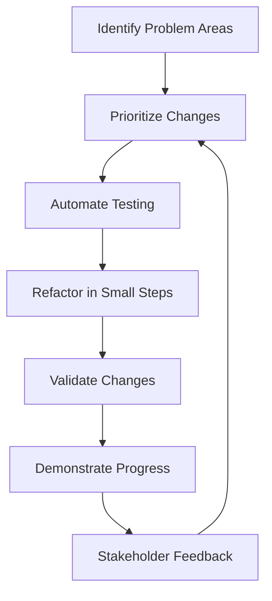

## 18.11 Case Studies in Refactoring Legacy Lua Code

Refactoring legacy code is a critical task in software development, especially when dealing with languages like Lua, which are often used in embedded systems, gaming, and scripting environments. This section explores real-world case studies of refactoring legacy Lua code, highlighting the challenges faced, approaches taken, and outcomes achieved. By learning from these examples, you can enhance your ability to manage and improve existing Lua codebases.

### Learning from Real Examples

#### Challenges Faced

Refactoring legacy Lua code presents several challenges:

1. **Complexity and Entanglement**: Legacy code often lacks clear structure, making it difficult to understand and modify without introducing errors.
2. **Lack of Documentation**: Older codebases may have little to no documentation, leaving developers to decipher the code's intent and functionality.
3. **Dependency Management**: Legacy systems may have dependencies on outdated libraries or systems, complicating refactoring efforts.
4. **Performance Constraints**: Refactoring must be done carefully to avoid degrading performance, especially in real-time applications like games.
5. **Resistance to Change**: Stakeholders may be hesitant to approve refactoring efforts due to perceived risks and costs.

#### Approaches and Solutions

##### Incremental Refactoring

Incremental refactoring involves making small, manageable changes to the codebase over time. This approach minimizes risk and allows for continuous improvement. Key steps include:

- **Identify Problem Areas**: Use tools and techniques to pinpoint parts of the code that are difficult to maintain or understand.
- **Prioritize Changes**: Focus on high-impact areas that will provide the most significant benefits.
- **Automate Testing**: Implement automated tests to ensure that changes do not introduce new bugs.
- **Refactor in Small Steps**: Make small, incremental changes that can be easily tested and validated.

**Example Code Snippet:**

```lua
-- Original legacy code
function calculateTotalPrice(items)
    local total = 0
    for i = 1, #items do
        total = total + items[i].price * items[i].quantity
    end
    return total
end

-- Refactored code with improved readability and maintainability
function calculateTotalPrice(items)
    local total = 0
    for _, item in ipairs(items) do
        total = total + calculateItemPrice(item)
    end
    return total
end

function calculateItemPrice(item)
    return item.price * item.quantity
end
```

In this example, the refactored code improves readability by extracting the item price calculation into a separate function.

##### Stakeholder Involvement

Involving stakeholders throughout the refactoring process is crucial for success. This includes:

- **Communicating Benefits**: Clearly articulate the benefits of refactoring, such as improved performance and maintainability.
- **Collaborating on Priorities**: Work with stakeholders to prioritize refactoring efforts based on business needs.
- **Demonstrating Progress**: Regularly showcase improvements to build confidence and support for ongoing refactoring.

#### Outcomes

##### Improved Performance

Refactoring can lead to significant performance improvements by optimizing algorithms and data structures. For example, replacing inefficient loops with more efficient data processing techniques can reduce execution time and resource consumption.

**Example Code Snippet:**

```lua
-- Original code with performance bottleneck
function findMaxValue(numbers)
    local max = numbers[1]
    for i = 2, #numbers do
        if numbers[i] > max then
            max = numbers[i]
        end
    end
    return max
end

-- Refactored code using built-in Lua functions
function findMaxValue(numbers)
    return math.max(table.unpack(numbers))
end
```

The refactored code leverages Lua's built-in `math.max` function, which is more efficient for finding the maximum value in a list.

##### Better Maintainability

Refactoring enhances maintainability by simplifying code structure and improving readability. This makes it easier for developers to understand and modify the code in the future.

**Example Code Snippet:**

```lua
-- Original code with complex logic
function processOrder(order)
    if order.status == "pending" then
        -- Process pending order
    elseif order.status == "shipped" then
        -- Process shipped order
    elseif order.status == "delivered" then
        -- Process delivered order
    else
        -- Handle unknown status
    end
end

-- Refactored code with simplified logic
function processOrder(order)
    local handlers = {
        pending = processPendingOrder,
        shipped = processShippedOrder,
        delivered = processDeliveredOrder
    }
    local handler = handlers[order.status] or handleUnknownStatus
    handler(order)
end
```

The refactored code uses a table to map order statuses to their respective handlers, simplifying the logic and making it easier to extend in the future.

### Use Cases and Examples

#### Success Stories

##### Case Study 1: Refactoring a Game Engine

A game development company faced challenges with their Lua-based game engine, which had grown complex and difficult to maintain. By adopting an incremental refactoring approach, they were able to:

- **Reduce Load Times**: Optimizing resource loading and management reduced game load times by 30%.
- **Enhance Modularity**: Breaking down monolithic scripts into modular components improved code reuse and flexibility.
- **Improve Developer Productivity**: Simplified code structure and better documentation reduced onboarding time for new developers.

##### Case Study 2: Modernizing an Embedded System

An embedded systems company needed to update their Lua-based control software to support new hardware features. Through stakeholder involvement and careful refactoring, they achieved:

- **Seamless Integration**: Refactored code allowed for seamless integration with new hardware components.
- **Increased Reliability**: Improved error handling and testing reduced system downtime by 20%.
- **Future-Proofing**: Modular design and clear documentation made it easier to add new features in the future.

### Visualizing the Refactoring Process

To better understand the refactoring process, let's visualize the workflow using a flowchart:



**Caption**: This flowchart illustrates the iterative process of refactoring legacy Lua code, emphasizing the importance of stakeholder feedback and continuous improvement.

### Try It Yourself

To practice refactoring, try modifying the code examples provided in this section. Experiment with different approaches to improve readability, performance, and maintainability. Consider:

- Extracting complex logic into separate functions.
- Replacing inefficient loops with built-in Lua functions.
- Simplifying conditional logic using tables or other data structures.

### References and Links

For further reading on refactoring and Lua programming, consider the following resources:

- [Refactoring: Improving the Design of Existing Code](https://martinfowler.com/books/refactoring.html) by Martin Fowler
- [Programming in Lua](https://www.lua.org/pil/) by Roberto Ierusalimschy
- [Lua Users Wiki](http://lua-users.org/wiki/)

### Knowledge Check

To reinforce your understanding of refactoring legacy Lua code, consider the following questions:

1. What are the main challenges of refactoring legacy Lua code?
2. How can incremental refactoring benefit a project?
3. Why is stakeholder involvement important in the refactoring process?
4. What are some common outcomes of successful refactoring efforts?
5. How can you improve the maintainability of Lua code?

### Embrace the Journey

Remember, refactoring is an ongoing process that requires patience and persistence. By continuously improving your code, you can enhance its performance, maintainability, and adaptability. Keep experimenting, stay curious, and enjoy the journey of mastering Lua design patterns!

## Quiz Time!



### What is a common challenge faced when refactoring legacy Lua code?

- [x] Lack of documentation
- [ ] Excessive documentation
- [ ] Too many developers
- [ ] Overuse of modern libraries

> **Explanation:** Legacy code often lacks documentation, making it difficult to understand and refactor.

### What is the primary benefit of incremental refactoring?

- [x] Minimizes risk by making small changes
- [ ] Increases risk by making large changes
- [ ] Eliminates the need for testing
- [ ] Reduces the need for stakeholder involvement

> **Explanation:** Incremental refactoring involves making small, manageable changes, which minimizes risk.

### Why is stakeholder involvement crucial in refactoring?

- [x] To prioritize refactoring efforts based on business needs
- [ ] To avoid any changes to the codebase
- [ ] To increase the complexity of the code
- [ ] To reduce the number of developers involved

> **Explanation:** Stakeholder involvement helps prioritize refactoring efforts based on business needs and ensures alignment.

### What outcome can be achieved by refactoring legacy Lua code?

- [x] Improved performance
- [ ] Increased code complexity
- [ ] Reduced code readability
- [ ] Decreased maintainability

> **Explanation:** Refactoring can lead to improved performance and maintainability of the code.

### How can you improve the maintainability of Lua code?

- [x] Simplifying code structure and improving readability
- [ ] Increasing the number of global variables
- [ ] Adding more complex logic
- [ ] Removing all comments

> **Explanation:** Simplifying code structure and improving readability enhances maintainability.

### What is a key step in the incremental refactoring process?

- [x] Automate testing
- [ ] Remove all tests
- [ ] Increase code duplication
- [ ] Avoid stakeholder feedback

> **Explanation:** Automating testing ensures that changes do not introduce new bugs.

### What is a common outcome of successful refactoring?

- [x] Better maintainability
- [ ] Increased code duplication
- [ ] Reduced code readability
- [ ] Decreased performance

> **Explanation:** Successful refactoring leads to better maintainability and readability.

### How can you optimize performance in Lua code?

- [x] Using built-in Lua functions
- [ ] Increasing the number of loops
- [ ] Adding more conditional statements
- [ ] Removing all functions

> **Explanation:** Using built-in Lua functions can optimize performance by leveraging efficient implementations.

### What is a benefit of modular design in refactoring?

- [x] Easier to add new features
- [ ] Harder to understand the code
- [ ] Increases code complexity
- [ ] Reduces code flexibility

> **Explanation:** Modular design makes it easier to add new features and enhances code flexibility.

### True or False: Refactoring is a one-time process.

- [ ] True
- [x] False

> **Explanation:** Refactoring is an ongoing process that requires continuous improvement and adaptation.


