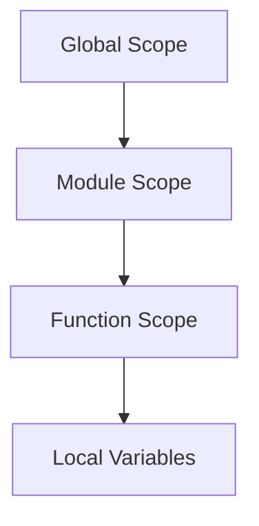

## 18.2 The Pitfalls of Global Variables

Global variables are a common feature in many programming languages, including Lua. While they can be convenient, they often lead to a host of problems that can make your code difficult to maintain and debug. In this section, we'll explore the pitfalls of using global variables, discuss best practices to avoid them, and provide alternatives that can lead to more robust and maintainable code.

### Understanding the Risks

#### Unintended Side Effects

Global variables can be accessed and modified from anywhere in your program. This flexibility can lead to unintended side effects, where changes in one part of the codebase inadvertently affect other parts. This can make debugging a nightmare, as it becomes challenging to track down where a variable was altered.

**Example:**

```lua
-- Global variable
count = 0

function increment()
    count = count + 1
end

function reset()
    count = 0
end

increment()
print(count) -- Output: 1
reset()
print(count) -- Output: 0
```

In this simple example, the `count` variable is global and can be modified by any function, leading to potential conflicts if multiple functions try to manipulate it simultaneously.

#### Name Clashes

Another significant risk of global variables is name clashes. As your codebase grows, the likelihood of accidentally reusing a variable name increases, leading to unexpected behavior.

**Example:**

```lua
-- Global variable
name = "Alice"

function greet()
    print("Hello, " .. name)
end

function setName(newName)
    name = newName
end

setName("Bob")
greet() -- Output: Hello, Bob
```

Here, the `name` variable is global, and any function can change it, potentially leading to conflicts if another part of the program uses the same variable name for a different purpose.

### Best Practices

#### Local Variables

One of the simplest ways to avoid the pitfalls of global variables is to use local variables. Local variables are confined to the scope in which they are declared, reducing the risk of unintended side effects and name clashes.

**Example:**

```lua
function calculateSum(a, b)
    local sum = a + b
    return sum
end

print(calculateSum(3, 4)) -- Output: 7
```

In this example, the `sum` variable is local to the `calculateSum` function, ensuring that it cannot be accessed or modified outside of this function.

#### Module Encapsulation

Modules in Lua provide a way to encapsulate functionality and expose only the necessary parts of your code. By using modules, you can limit the scope of variables and functions, reducing the risk of global variable issues.

**Example:**

```lua
-- mymodule.lua
local M = {}

local function privateFunction()
    print("This is a private function")
end

function M.publicFunction()
    print("This is a public function")
end

return M
```

In this module, `privateFunction` is not exposed, while `publicFunction` is accessible to other parts of the program that require this module.

### Alternatives

#### Dependency Injection

Dependency injection is a design pattern that involves passing dependencies to a function or module rather than relying on global variables. This approach makes your code more modular and easier to test.

**Example:**

```lua
function process(data, logger)
    logger.log("Processing data: " .. data)
end

local logger = {
    log = function(message)
        print(message)
    end
}

process("Sample Data", logger)
```

In this example, the `logger` dependency is passed to the `process` function, allowing for greater flexibility and testability.

#### Namespaces

Namespaces help organize code and avoid conflicts by grouping related functions and variables. In Lua, you can use tables to create namespaces.

**Example:**

```lua
local MathUtils = {}

function MathUtils.add(a, b)
    return a + b
end

function MathUtils.subtract(a, b)
    return a - b
end

print(MathUtils.add(5, 3)) -- Output: 8
print(MathUtils.subtract(5, 3)) -- Output: 2
```

By using a table as a namespace, you can group related functions and avoid polluting the global namespace.

### Use Cases and Examples

#### Refactoring Globals

Transitioning from global variables to a more modular design can significantly improve your code's maintainability and scalability. Let's explore a practical example of refactoring global variables.

**Before Refactoring:**

```lua
-- Global variables
config = {
    host = "localhost",
    port = 8080
}

function connect()
    print("Connecting to " .. config.host .. ":" .. config.port)
end

connect()
```

**After Refactoring:**

```lua
-- config.lua
local config = {
    host = "localhost",
    port = 8080
}

return config

-- main.lua
local config = require("config")

function connect(cfg)
    print("Connecting to " .. cfg.host .. ":" .. cfg.port)
end

connect(config)
```

By refactoring the code to use a module for configuration, we encapsulate the configuration details and pass them explicitly to the `connect` function, reducing the reliance on global variables.

### Visualizing Variable Scope

To better understand how variable scope works in Lua, let's visualize it using a scope chain diagram.



In this diagram, we see that global variables reside in the global scope, while module and function scopes provide more localized environments for variables, reducing the risk of unintended side effects.

### References and Links

For further reading on global variables and best practices in Lua, consider exploring the following resources:

- [Lua 5.4 Reference Manual](https://www.lua.org/manual/5.4/)
- [Programming in Lua](https://www.lua.org/pil/)
- [MDN Web Docs: JavaScript Guide](https://developer.mozilla.org/en-US/docs/Web/JavaScript/Guide) (for comparison with JavaScript's handling of global variables)

### Knowledge Check

To reinforce your understanding of the pitfalls of global variables and how to avoid them, consider the following questions:

1. What are the main risks associated with using global variables?
2. How can local variables help mitigate the risks of global variables?
3. What is the purpose of using modules in Lua?
4. How does dependency injection improve code modularity?
5. What are namespaces, and how can they help organize code?

### Embrace the Journey

Remember, avoiding global variables is just one step towards writing clean and maintainable code. As you continue your journey in mastering Lua design patterns, keep experimenting with different techniques and approaches. Stay curious, and enjoy the process of refining your skills!

### Formatting and Structure

Organizing your code with clear headings, subheadings, and comments can significantly improve readability and maintainability. Use bullet points to break down complex information and highlight important terms or concepts using bold or italic text sparingly.

### Writing Style

Use first-person plural (we, let's) to create a collaborative feel, and avoid gender-specific pronouns. Define acronyms and abbreviations upon first use to ensure clarity.

## Quiz Time!



### What is a major risk of using global variables?

- [x] Unintended side effects
- [ ] Improved performance
- [ ] Easier debugging
- [ ] Increased security

> **Explanation:** Global variables can lead to unintended side effects because they can be modified from anywhere in the program.

### How can local variables help mitigate the risks of global variables?

- [x] By limiting the scope to where variables are needed
- [ ] By increasing the program's complexity
- [ ] By making variables accessible globally
- [ ] By reducing the number of variables

> **Explanation:** Local variables limit the scope to where they are needed, reducing the risk of unintended side effects and name clashes.

### What is the purpose of using modules in Lua?

- [x] To encapsulate functionality and expose only necessary parts
- [ ] To increase the number of global variables
- [ ] To make all functions public
- [ ] To decrease code readability

> **Explanation:** Modules encapsulate functionality and expose only necessary parts, reducing the risk of global variable issues.

### How does dependency injection improve code modularity?

- [x] By passing dependencies explicitly
- [ ] By using more global variables
- [ ] By making code less testable
- [ ] By increasing code coupling

> **Explanation:** Dependency injection involves passing dependencies explicitly, making code more modular and easier to test.

### What are namespaces, and how can they help organize code?

- [x] Group related functions and variables to avoid conflicts
- [ ] Increase the number of global variables
- [ ] Make code less readable
- [ ] Decrease code modularity

> **Explanation:** Namespaces group related functions and variables, helping to avoid conflicts and organize code.

### What is a common issue with name clashes in global variables?

- [x] Unexpected behavior due to variable reuse
- [ ] Improved code readability
- [ ] Increased program speed
- [ ] Better memory management

> **Explanation:** Name clashes can lead to unexpected behavior due to accidental reuse of variable names.

### How can module encapsulation reduce the risk of global variable issues?

- [x] By limiting the scope of variables and functions
- [ ] By making all variables global
- [ ] By increasing code complexity
- [ ] By decreasing code readability

> **Explanation:** Module encapsulation limits the scope of variables and functions, reducing the risk of global variable issues.

### What is a benefit of using local variables over global variables?

- [x] Reduced risk of unintended side effects
- [ ] Increased program complexity
- [ ] Easier access from anywhere in the program
- [ ] Increased memory usage

> **Explanation:** Local variables reduce the risk of unintended side effects by limiting their scope.

### How can refactoring globals improve code maintainability?

- [x] By transitioning to a more modular design
- [ ] By increasing the number of global variables
- [ ] By making code less readable
- [ ] By decreasing code modularity

> **Explanation:** Refactoring globals to a more modular design improves code maintainability and scalability.

### True or False: Global variables are always the best choice for storing data in a program.

- [ ] True
- [x] False

> **Explanation:** Global variables are not always the best choice due to the risks of unintended side effects and name clashes.




