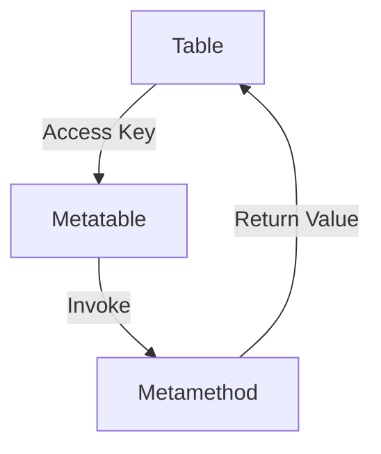

## 18.3 Overuse of Metatables and Metamethods

Metatables and metamethods are powerful features in Lua that allow developers to customize the behavior of tables, enabling operator overloading, custom indexing, and more. However, with great power comes the potential for misuse. In this section, we will explore the common pitfalls associated with the overuse of metatables and metamethods, provide guidance on when their use is appropriate, and offer strategies for simplifying codebases that have become overly complex due to excessive reliance on these features.

### Recognizing Overcomplication

#### Performance Overhead

Metamethods introduce a layer of indirection that can slow down operations. When a metamethod is invoked, Lua must perform additional checks and function calls, which can degrade performance, especially in performance-critical applications such as games or real-time systems.

**Example:**

```lua
-- Define a metatable with an __add metamethod
local mt = {
    __add = function(a, b)
        return {x = a.x + b.x, y = a.y + b.y}
    end
}

-- Create two tables and set their metatables
local vector1 = setmetatable({x = 1, y = 2}, mt)
local vector2 = setmetatable({x = 3, y = 4}, mt)

-- Add the vectors
local result = vector1 + vector2 -- Invokes the __add metamethod
```

In this example, the `__add` metamethod allows for vector addition. While this is a neat feature, it introduces a performance overhead due to the function call involved in the addition operation.

#### Readability Issues

Complex metatable usage can confuse developers, especially those unfamiliar with Lua's metaprogramming capabilities. Excessive use of metamethods can make code difficult to read and maintain, as the behavior of tables becomes less predictable and more reliant on hidden logic.

**Example:**

```lua
-- Complex metatable with multiple metamethods
local mt = {
    __index = function(table, key)
        return "default"
    end,
    __newindex = function(table, key, value)
        rawset(table, key, value)
    end,
    __call = function(table, ...)
        return "called"
    end
}

local t = setmetatable({}, mt)

print(t.someKey) -- Outputs "default"
t.newKey = "value" -- Sets newKey to "value"
print(t()) -- Outputs "called"
```

Here, the table `t` has multiple metamethods defined, making its behavior non-intuitive. Developers unfamiliar with the metatable might struggle to understand the code's functionality.

### When to Use Metatables Appropriately

#### Operator Overloading

Metatables are well-suited for operator overloading in cases where it makes logical sense, such as mathematical objects. This use case enhances code readability and expressiveness without introducing unnecessary complexity.

**Example:**

```lua
-- Metatable for complex numbers
local complex_mt = {
    __add = function(a, b)
        return {real = a.real + b.real, imag = a.imag + b.imag}
    end
}

-- Create complex numbers
local c1 = setmetatable({real = 1, imag = 2}, complex_mt)
local c2 = setmetatable({real = 3, imag = 4}, complex_mt)

-- Add complex numbers
local sum = c1 + c2
print(sum.real, sum.imag) -- Outputs 4, 6
```

In this example, operator overloading is used to add complex numbers, making the code more intuitive and mathematically expressive.

#### Proxy Objects

Metatables can be used to create proxy objects that intercept access to another object. This is useful for implementing features like lazy loading, access control, or logging.

**Example:**

```lua
-- Proxy metatable
local proxy_mt = {
    __index = function(table, key)
        print("Accessing key:", key)
        return table.__data[key]
    end
}

-- Create a proxy object
local data = {a = 1, b = 2}
local proxy = setmetatable({__data = data}, proxy_mt)

-- Access through the proxy
print(proxy.a) -- Outputs "Accessing key: a" followed by "1"
```

In this example, the proxy object logs access to its underlying data, demonstrating a practical use of metatables.

### Simplification Strategies

#### Direct Implementation

Whenever possible, prefer straightforward code over complex metatable usage. Direct implementations are often more efficient and easier to understand.

**Example:**

Instead of using a metatable to overload the addition operator for vectors, consider a simple function:

```lua
-- Direct implementation of vector addition
local function addVectors(a, b)
    return {x = a.x + b.x, y = a.y + b.y}
end

local v1 = {x = 1, y = 2}
local v2 = {x = 3, y = 4}

local result = addVectors(v1, v2)
print(result.x, result.y) -- Outputs 4, 6
```

This approach is more transparent and avoids the overhead of metamethods.

#### Documentation

When metatables are necessary, clearly document their use. Explain the purpose of each metamethod and how it affects the table's behavior. This practice improves code maintainability and helps other developers understand the logic.

**Example:**

```lua
-- Metatable with documented metamethods
local mt = {
    -- __index metamethod returns a default value for missing keys
    __index = function(table, key)
        return "default"
    end
}

local t = setmetatable({}, mt)

-- Accessing a non-existent key returns "default"
print(t.someKey) -- Outputs "default"
```

In this example, a comment explains the purpose of the `__index` metamethod, aiding comprehension.

### Use Cases and Examples

#### Simplifying Codebase

Identify and remove unnecessary metatable usage to simplify your codebase. Focus on clarity and maintainability, ensuring that metatables are only used when they provide a clear benefit.

**Example:**

Suppose you have a codebase with multiple tables using metatables for logging access. Consider consolidating this functionality into a single logging function:

```lua
-- Logging function
local function logAccess(table, key)
    print("Accessing key:", key)
    return table[key]
end

-- Simplified access
local data = {a = 1, b = 2}
print(logAccess(data, "a")) -- Outputs "Accessing key: a" followed by "1"
```

This approach reduces complexity and improves code readability.

### Visualizing Metatable Usage

To better understand the flow of metatable operations, consider the following diagram illustrating the interaction between a table, its metatable, and metamethods:



**Diagram Description:** This flowchart represents the process of accessing a key in a table with a metatable. The table delegates the operation to its metatable, which invokes the appropriate metamethod and returns the result.

### References and Links

- [Lua 5.4 Reference Manual: Metatables and Metamethods](https://www.lua.org/manual/5.4/manual.html#2.4)
- [Programming in Lua: Metatables](https://www.lua.org/pil/13.html)
- [MDN Web Docs: Operator Overloading](https://developer.mozilla.org/en-US/docs/Web/JavaScript/Reference/Operators/Operator_Overloading)

### Knowledge Check

1. What are the potential performance impacts of using metamethods in Lua?
2. How can excessive use of metatables affect code readability?
3. When is it appropriate to use metatables for operator overloading?
4. What are proxy objects, and how can metatables be used to implement them?
5. How can you simplify a codebase that overuses metatables?

### Embrace the Journey

Remember, mastering metatables and metamethods is just one step in your Lua programming journey. As you continue to explore and experiment, you'll gain a deeper understanding of when and how to use these powerful features effectively. Keep coding, stay curious, and enjoy the process!

## Quiz Time!



### What is a common performance issue associated with metamethods?

- [x] They introduce additional function calls.
- [ ] They directly modify the Lua interpreter.
- [ ] They prevent garbage collection.
- [ ] They increase memory usage.

> **Explanation:** Metamethods introduce additional function calls, which can slow down operations.

### How can excessive use of metatables affect code readability?

- [x] It can make the code less intuitive and harder to understand.
- [ ] It can make the code more concise and clear.
- [ ] It can improve the performance of the code.
- [ ] It can simplify the logic of the code.

> **Explanation:** Excessive use of metatables can make the code less intuitive and harder to understand due to hidden logic.

### When is it appropriate to use metatables for operator overloading?

- [x] When dealing with mathematical objects like vectors or complex numbers.
- [ ] When optimizing performance-critical code.
- [ ] When simplifying simple data structures.
- [ ] When avoiding function calls.

> **Explanation:** Metatables are appropriate for operator overloading in cases like mathematical objects where it enhances expressiveness.

### What is a proxy object in the context of metatables?

- [x] An object that intercepts access to another object.
- [ ] An object that directly modifies another object.
- [ ] An object that prevents access to another object.
- [ ] An object that duplicates another object.

> **Explanation:** A proxy object intercepts access to another object, often for logging or access control.

### How can you simplify a codebase that overuses metatables?

- [x] By removing unnecessary metatable usage and preferring direct implementations.
- [ ] By adding more metamethods to handle different cases.
- [ ] By using metatables for all operations.
- [ ] By avoiding documentation.

> **Explanation:** Simplifying a codebase involves removing unnecessary metatable usage and preferring direct implementations.

### What is a benefit of documenting metatable usage?

- [x] It improves code maintainability and understanding.
- [ ] It increases the performance of the code.
- [ ] It reduces the need for comments.
- [ ] It eliminates the need for testing.

> **Explanation:** Documenting metatable usage improves code maintainability and helps others understand the logic.

### What does the `__index` metamethod do?

- [x] It provides a default value for missing keys.
- [ ] It modifies the value of existing keys.
- [ ] It deletes keys from the table.
- [ ] It prevents access to certain keys.

> **Explanation:** The `__index` metamethod provides a default value for missing keys in a table.

### What is the purpose of the `__add` metamethod?

- [x] To define custom behavior for the addition operator.
- [ ] To prevent the addition of numbers.
- [ ] To multiply two numbers.
- [ ] To divide two numbers.

> **Explanation:** The `__add` metamethod defines custom behavior for the addition operator.

### How can metatables be used in logging?

- [x] By creating proxy objects that log access to data.
- [ ] By directly modifying log files.
- [ ] By preventing access to log data.
- [ ] By duplicating log entries.

> **Explanation:** Metatables can be used to create proxy objects that log access to data.

### True or False: Metatables should be used for all table operations to enhance performance.

- [ ] True
- [x] False

> **Explanation:** False. Metatables introduce overhead and should be used judiciously, not for all table operations.




