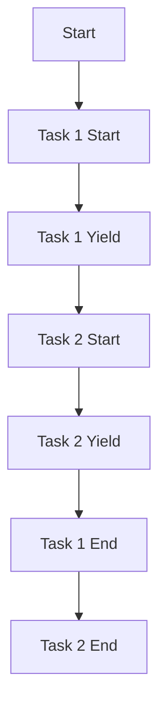

## 18.4 Misuse of Coroutines

Coroutines in Lua are a powerful feature that allows for cooperative multitasking, enabling developers to write asynchronous code that is easier to read and maintain. However, like any powerful tool, coroutines can be misused, leading to code that is difficult to understand, maintain, or debug. In this section, we will explore common mistakes made when using coroutines, best practices to avoid these pitfalls, and alternatives to coroutines when appropriate.

### Avoiding Common Mistakes

#### Resource Leaks

One of the most common mistakes when using coroutines is failing to properly manage their lifecycle, leading to resource leaks. Coroutines that are not properly closed can consume memory and other resources unnecessarily.

**Example of Resource Leak:**

```lua
function createCoroutine()
    local co = coroutine.create(function()
        while true do
            print("Running coroutine...")
            coroutine.yield()
        end
    end)
    return co
end

local co = createCoroutine()
coroutine.resume(co)
-- Forgetting to close or manage the coroutine lifecycle
```

In this example, the coroutine `co` is created and resumed, but there is no mechanism to close or manage it, potentially leading to a resource leak.

#### Complex Control Flow

Coroutines can make code harder to follow if not structured properly. Complex control flow with multiple coroutine interactions can lead to spaghetti code, making it difficult to understand the program's execution path.

**Example of Complex Control Flow:**

```lua
function task1()
    print("Task 1 start")
    coroutine.yield()
    print("Task 1 end")
end

function task2()
    print("Task 2 start")
    coroutine.yield()
    print("Task 2 end")
end

local co1 = coroutine.create(task1)
local co2 = coroutine.create(task2)

coroutine.resume(co1)
coroutine.resume(co2)
coroutine.resume(co1)
coroutine.resume(co2)
```

In this example, the control flow between `task1` and `task2` is interleaved, making it difficult to track the program's execution.

### Best Practices

#### Lifecycle Management

To avoid resource leaks, it is crucial to manage the lifecycle of coroutines carefully. This involves keeping track of their states and ensuring they are properly closed when no longer needed.

**Example of Lifecycle Management:**

```lua
function manageCoroutine(co)
    while coroutine.status(co) ~= "dead" do
        coroutine.resume(co)
    end
end

local co = coroutine.create(function()
    for i = 1, 3 do
        print("Coroutine running: " .. i)
        coroutine.yield()
    end
end)

manageCoroutine(co)
```

In this example, the `manageCoroutine` function ensures that the coroutine is resumed until it completes, preventing resource leaks.

#### Clear Structuring

Simplifying coroutine interactions and structuring them clearly can help maintain readability and manageability of the code.

**Example of Clear Structuring:**

```lua
function task()
    print("Task start")
    coroutine.yield()
    print("Task end")
end

local co = coroutine.create(task)

-- Clear and simple control flow
coroutine.resume(co)
coroutine.resume(co)
```

By keeping coroutine interactions straightforward, the code remains easy to follow and maintain.

### Alternatives

#### Event Loops

In some cases, using an event loop or a library that handles asynchronous tasks might be a better choice than coroutines. Event loops can provide a more structured way to manage asynchronous operations.

**Example of Event Loop:**

```lua
-- Using a simple event loop
local events = {}

function addEvent(event)
    table.insert(events, event)
end

function runEvents()
    for _, event in ipairs(events) do
        event()
    end
end

addEvent(function() print("Event 1") end)
addEvent(function() print("Event 2") end)

runEvents()
```

This example demonstrates a basic event loop that manages and executes events in a structured manner.

#### State Machines

For simpler logic structures, implementing a state machine can be an effective alternative to coroutines. State machines can provide a clear and organized way to handle different states and transitions.

**Example of State Machine:**

```lua
local state = "start"

function handleState()
    if state == "start" then
        print("Starting...")
        state = "running"
    elseif state == "running" then
        print("Running...")
        state = "end"
    elseif state == "end" then
        print("Ending...")
    end
end

handleState()
handleState()
handleState()
```

In this example, a simple state machine manages transitions between different states, providing a clear and organized control flow.

### Use Cases and Examples

#### Refactoring Coroutines

When coroutines are misused, refactoring can help streamline the code and improve efficiency. This involves simplifying coroutine interactions, managing their lifecycle, and considering alternatives when appropriate.

**Example of Refactoring Coroutines:**

Before Refactoring:

```lua
function complexTask()
    print("Start")
    coroutine.yield()
    print("Middle")
    coroutine.yield()
    print("End")
end

local co = coroutine.create(complexTask)
coroutine.resume(co)
coroutine.resume(co)
coroutine.resume(co)
```

After Refactoring:

```lua
function simpleTask()
    print("Start")
    print("Middle")
    print("End")
end

simpleTask()
```

By simplifying the task and removing unnecessary coroutine interactions, the code becomes more efficient and easier to maintain.

### Visualizing Coroutine Misuse

To better understand the misuse of coroutines, let's visualize the complex control flow and how it can be simplified.



**Diagram Description:** This flowchart illustrates the complex control flow between two tasks using coroutines. By simplifying the interactions, the control flow can be made more straightforward and easier to follow.

### Knowledge Check

To reinforce your understanding of coroutine misuse and best practices, consider the following questions:

1. What are the common pitfalls when using coroutines in Lua?
2. How can you manage the lifecycle of a coroutine to prevent resource leaks?
3. What are some alternatives to using coroutines for asynchronous tasks?
4. How can you simplify complex control flow when using coroutines?

### Embrace the Journey

Remember, mastering coroutines in Lua is a journey. As you continue to explore and experiment with coroutines, you'll gain a deeper understanding of their power and potential pitfalls. Keep practicing, stay curious, and enjoy the process of learning and improving your Lua programming skills!

## Quiz Time!



### What is a common mistake when using coroutines in Lua?

- [x] Not properly managing their lifecycle
- [ ] Using them for synchronous tasks
- [ ] Avoiding them in all cases
- [ ] Using them only for error handling

> **Explanation:** Not properly managing the lifecycle of coroutines can lead to resource leaks and other issues.

### How can you prevent resource leaks when using coroutines?

- [x] By managing their lifecycle and ensuring they are closed properly
- [ ] By using them only once
- [ ] By avoiding their use altogether
- [ ] By using global variables

> **Explanation:** Proper lifecycle management ensures that coroutines are closed when no longer needed, preventing resource leaks.

### What is an alternative to using coroutines for asynchronous tasks?

- [x] Event loops
- [ ] Global variables
- [ ] Synchronous functions
- [ ] Static variables

> **Explanation:** Event loops can provide a structured way to manage asynchronous operations, serving as an alternative to coroutines.

### What is a benefit of using state machines instead of coroutines?

- [x] Clear and organized control flow
- [ ] Increased complexity
- [ ] More resource consumption
- [ ] Less readability

> **Explanation:** State machines provide a clear and organized way to handle different states and transitions, simplifying control flow.

### How can you simplify complex control flow when using coroutines?

- [x] By structuring coroutine interactions clearly
- [ ] By adding more coroutines
- [ ] By using global variables
- [ ] By avoiding coroutine use

> **Explanation:** Clear structuring of coroutine interactions helps maintain readability and manageability of the code.

### What is a key practice in managing coroutine lifecycle?

- [x] Tracking coroutine states
- [ ] Using them only once
- [ ] Avoiding their use
- [ ] Using global variables

> **Explanation:** Tracking coroutine states ensures they are properly managed and closed when no longer needed.

### What is a potential downside of complex control flow with coroutines?

- [x] It can lead to spaghetti code
- [ ] It simplifies the code
- [ ] It reduces resource usage
- [ ] It improves readability

> **Explanation:** Complex control flow with coroutines can lead to spaghetti code, making it difficult to understand the program's execution path.

### What is a benefit of using event loops over coroutines?

- [x] Structured management of asynchronous operations
- [ ] Increased complexity
- [ ] More resource consumption
- [ ] Less readability

> **Explanation:** Event loops provide structured management of asynchronous operations, serving as an alternative to coroutines.

### What is a common pitfall when using coroutines?

- [x] Resource leaks
- [ ] Simplified control flow
- [ ] Reduced complexity
- [ ] Improved readability

> **Explanation:** Resource leaks are a common pitfall when coroutines are not properly managed.

### True or False: Coroutines should always be used for asynchronous tasks.

- [ ] True
- [x] False

> **Explanation:** While coroutines are useful for asynchronous tasks, they are not always the best choice. Alternatives like event loops or state machines may be more appropriate in some cases.


