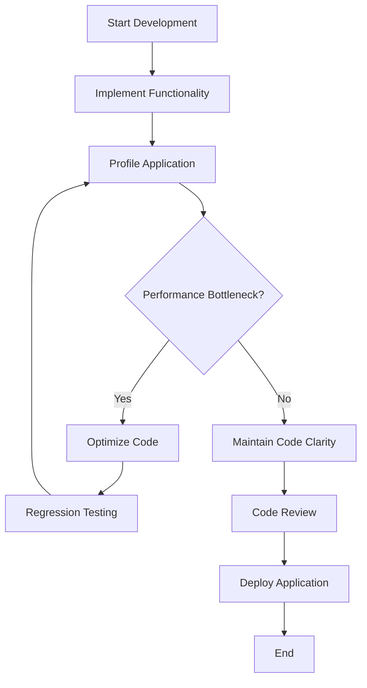

## 18.5 Premature Optimization Pitfalls

In the realm of software development, the pursuit of optimization can sometimes lead developers astray. The famous computer scientist Donald Knuth once said, "Premature optimization is the root of all evil." This statement underscores the potential pitfalls of optimizing code too early in the development process. In this section, we will explore the concept of premature optimization, its impact on Lua programming, and best practices to avoid these pitfalls.

### Understanding the Downside

#### Complexity Increase

Premature optimization often leads to increased complexity in code. When developers focus on optimizing code before fully understanding the problem or the codebase, they can introduce convoluted logic that makes the code harder to read and maintain. This complexity can obscure the original intent of the code, making it difficult for other developers (or even the original author) to understand and modify it later.

Consider the following Lua code snippet:

```lua
-- Original, simple code
function calculateSum(numbers)
    local sum = 0
    for _, number in ipairs(numbers) do
        sum = sum + number
    end
    return sum
end
```

In an attempt to optimize, a developer might rewrite it as:

```lua
-- Prematurely optimized code
function calculateSum(numbers)
    local sum = 0
    local i = 1
    while numbers[i] do
        sum = sum + numbers[i]
        i = i + 1
    end
    return sum
end
```

While the second version might be marginally faster due to the use of a `while` loop, it sacrifices readability and maintainability. The original version is clearer and more idiomatic in Lua.

#### Misallocation of Effort

Another pitfall of premature optimization is the misallocation of effort. Developers may spend significant time optimizing parts of the code that do not significantly impact overall performance. This misallocation can lead to wasted resources and delayed project timelines.

For example, optimizing a function that is called infrequently or operates on small datasets may yield negligible performance gains. Instead, developers should focus on optimizing critical sections of the code that are executed frequently or handle large amounts of data.

### Recommended Approach

#### Profile Before Optimizing

To avoid the pitfalls of premature optimization, it is crucial to profile the application before making any optimization efforts. Profiling helps identify bottlenecks and areas of the code that truly impact performance. By using profiling tools, developers can make data-driven decisions about where to focus their optimization efforts.

In Lua, you can use tools like LuaProfiler or built-in debugging libraries to gather performance data. Here's a simple example of using Lua's built-in `debug` library to measure execution time:

```lua
local function profile(func, ...)
    local startTime = os.clock()
    local result = {func(...)}
    local endTime = os.clock()
    print("Execution time: " .. (endTime - startTime) .. " seconds")
    return table.unpack(result)
end

-- Example usage
local function exampleFunction()
    -- Simulate some work
    for i = 1, 1000000 do end
end

profile(exampleFunction)
```

#### Focus on Clarity

When writing code, prioritize clarity and maintainability over optimization. Clear code is easier to understand, debug, and extend. Once the code is working correctly and is easy to read, you can then consider optimization if necessary.

Here are some tips for writing clear and maintainable Lua code:

- **Use Descriptive Variable Names**: Choose variable names that convey the purpose of the variable.
- **Keep Functions Small**: Break down complex logic into smaller, reusable functions.
- **Comment Wisely**: Use comments to explain why certain decisions were made, not just what the code does.
- **Follow Lua Idioms**: Use Lua's idiomatic constructs, such as `ipairs` for iterating over arrays, to make your code more readable.

### Use Cases and Examples

#### Development Workflow

Balancing functionality and optimization is a key aspect of a successful development workflow. Here are some strategies to achieve this balance:

1. **Iterative Development**: Start with a simple, functional implementation. Once the functionality is complete and tested, profile the application to identify performance bottlenecks.

2. **Incremental Optimization**: Focus on optimizing one part of the code at a time. This approach allows you to measure the impact of each optimization and ensures that changes do not introduce new bugs.

3. **Regression Testing**: After making optimizations, run regression tests to ensure that the changes have not affected the correctness of the application.

4. **Code Reviews**: Conduct code reviews to catch unnecessary optimizations and ensure that the code remains clear and maintainable.

### Visualizing the Impact of Premature Optimization

To better understand the impact of premature optimization, let's visualize the process of identifying and addressing performance bottlenecks using a flowchart.



**Figure 1:** This flowchart illustrates a recommended development workflow that balances functionality and optimization. By profiling the application before optimizing, developers can focus their efforts on areas that truly impact performance.

### Try It Yourself

To solidify your understanding of premature optimization pitfalls, try the following exercises:

1. **Refactor for Clarity**: Take a piece of complex, optimized Lua code and refactor it for clarity. Focus on making the code more readable and maintainable without worrying about optimization.

2. **Profile and Optimize**: Write a Lua script that performs a computationally intensive task. Profile the script to identify bottlenecks, then optimize the code based on the profiling data.

3. **Experiment with Different Approaches**: Implement the same functionality using different approaches (e.g., using `for` loops vs. `while` loops) and compare their performance using profiling tools.

### Knowledge Check

Before we conclude, let's reinforce the key takeaways from this section:

- **Premature optimization** can lead to increased complexity and misallocation of effort.
- **Profiling** is essential to identify true performance bottlenecks.
- **Clarity and maintainability** should be prioritized over optimization.
- **Iterative development** and **incremental optimization** are effective strategies for balancing functionality and performance.

Remember, optimization should be a deliberate and informed decision, not a reflexive action. By following these best practices, you can write efficient and maintainable Lua code that meets both performance and readability goals.

## Quiz Time!



### What is a common consequence of premature optimization?

- [x] Increased code complexity
- [ ] Improved code readability
- [ ] Reduced development time
- [ ] Enhanced code maintainability

> **Explanation:** Premature optimization often leads to increased code complexity, making it harder to read and maintain.


### Why is profiling important before optimization?

- [x] It identifies performance bottlenecks
- [ ] It simplifies the code
- [ ] It reduces the need for comments
- [ ] It automatically optimizes the code

> **Explanation:** Profiling helps identify the parts of the code that truly impact performance, guiding optimization efforts.


### What should be prioritized over optimization in code development?

- [x] Clarity and maintainability
- [ ] Execution speed
- [ ] Memory usage
- [ ] Code length

> **Explanation:** Clarity and maintainability should be prioritized to ensure the code is easy to understand and modify.


### Which of the following is a recommended approach to optimization?

- [x] Incremental optimization
- [ ] Optimize all code at once
- [ ] Avoid profiling
- [ ] Focus on rarely used functions

> **Explanation:** Incremental optimization allows for measuring the impact of each change and ensures code correctness.


### What is a benefit of iterative development?

- [x] Balances functionality and optimization
- [ ] Eliminates the need for testing
- [ ] Guarantees no bugs
- [ ] Automatically improves performance

> **Explanation:** Iterative development allows developers to focus on functionality first and optimize based on profiling data.


### What is a potential downside of optimizing code too early?

- [x] Misallocation of effort
- [ ] Improved code quality
- [ ] Faster development
- [ ] Increased collaboration

> **Explanation:** Optimizing too early can lead to spending time on parts of the code that do not significantly impact performance.


### What is a key strategy for balancing functionality and optimization?

- [x] Conducting code reviews
- [ ] Writing complex code
- [ ] Avoiding testing
- [ ] Ignoring profiling data

> **Explanation:** Code reviews help catch unnecessary optimizations and ensure code clarity and maintainability.


### What is a common practice to ensure code changes do not introduce new bugs?

- [x] Regression testing
- [ ] Skipping testing
- [ ] Writing longer code
- [ ] Avoiding comments

> **Explanation:** Regression testing ensures that optimizations do not affect the correctness of the application.


### What should developers focus on when writing Lua code?

- [x] Using Lua idioms
- [ ] Writing complex logic
- [ ] Avoiding comments
- [ ] Ignoring variable names

> **Explanation:** Using Lua idioms makes the code more readable and maintainable.


### True or False: Premature optimization should be a reflexive action in development.

- [ ] True
- [x] False

> **Explanation:** Optimization should be a deliberate and informed decision, not a reflexive action.



Remember, this is just the beginning. As you progress, you'll build more efficient and maintainable Lua applications. Keep experimenting, stay curious, and enjoy the journey!
