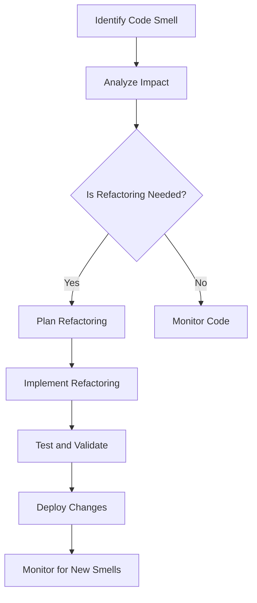

## 18.6 Code Smells and How to Address Them

In the realm of software development, code smells are subtle indicators that something might be amiss in your codebase. While not necessarily bugs, these smells can lead to deeper issues if left unaddressed. In this section, we will explore common code smells in Lua, how to identify them, and effective refactoring techniques to enhance your code's quality and maintainability.

### Identifying Issues Early

#### Definition of Code Smells

Code smells are symptoms of deeper problems within a codebase. They are not outright errors but rather indicators that the code may need refactoring. Recognizing these smells early can prevent technical debt and improve the overall health of your software.

### Common Code Smells in Lua

#### Long Parameter Lists

Long parameter lists occur when functions require too many arguments, making them difficult to understand and use. This can lead to errors and complicate testing.

**Example of Long Parameter List:**

```lua
-- A function with a long parameter list
function createUser(name, age, email, address, phone, occupation, company)
    -- Function implementation
end
```

**Addressing Long Parameter Lists:**

To address this, consider using tables to encapsulate parameters, making the function call more manageable and readable.

```lua
-- Refactored function using a table for parameters
function createUser(userDetails)
    local name = userDetails.name
    local age = userDetails.age
    -- Continue with other parameters
end

-- Calling the function with a table
createUser({
    name = "John Doe",
    age = 30,
    email = "john.doe@example.com",
    address = "123 Main St",
    phone = "555-1234",
    occupation = "Engineer",
    company = "Tech Corp"
})
```

#### Feature Envy

Feature envy occurs when a class or function is overly interested in the data of another class or module. This can lead to tight coupling and make the code harder to maintain.

**Example of Feature Envy:**

```lua
-- A function that accesses another module's data excessively
function calculateDiscount(order)
    local total = order.getTotal()
    local discount = order.getDiscountRate()
    return total * discount
end
```

**Addressing Feature Envy:**

Refactor the code to move the behavior closer to the data it operates on, enhancing encapsulation and reducing dependencies.

```lua
-- Refactored to move behavior to the Order module
Order = {}

function Order:new(total, discountRate)
    local obj = {total = total, discountRate = discountRate}
    setmetatable(obj, self)
    self.__index = self
    return obj
end

function Order:calculateDiscount()
    return self.total * self.discountRate
end

-- Usage
local order = Order:new(100, 0.1)
local discount = order:calculateDiscount()
```

### Refactoring Techniques

#### Simplifying Functions

Complex functions can be difficult to understand and maintain. Simplifying functions by breaking them down into smaller, more focused functions can improve readability and testability.

**Example of a Complex Function:**

```lua
-- A complex function with multiple responsibilities
function processOrder(order)
    -- Validate order
    if not order.isValid then
        return "Invalid order"
    end

    -- Calculate total
    local total = 0
    for _, item in ipairs(order.items) do
        total = total + item.price * item.quantity
    end

    -- Apply discount
    if order.discount then
        total = total * (1 - order.discount)
    end

    -- Return result
    return total
end
```

**Refactoring to Simplify:**

Break down the function into smaller, single-responsibility functions.

```lua
-- Refactored functions
function validateOrder(order)
    return order.isValid
end

function calculateTotal(order)
    local total = 0
    for _, item in ipairs(order.items) do
        total = total + item.price * item.quantity
    end
    return total
end

function applyDiscount(total, discount)
    return total * (1 - discount)
end

function processOrder(order)
    if not validateOrder(order) then
        return "Invalid order"
    end

    local total = calculateTotal(order)
    if order.discount then
        total = applyDiscount(total, order.discount)
    end

    return total
end
```

#### Encapsulating Data

Encapsulating data involves keeping data and related functions together, reducing the risk of data being manipulated in unintended ways.

**Example of Poor Encapsulation:**

```lua
-- Data and functions are separate
user = {name = "Alice", age = 25}

function updateUserAge(user, newAge)
    user.age = newAge
end
```

**Refactoring for Encapsulation:**

Encapsulate the data and related functions within a module or class.

```lua
-- Encapsulated user data and functions
User = {}

function User:new(name, age)
    local obj = {name = name, age = age}
    setmetatable(obj, self)
    self.__index = self
    return obj
end

function User:updateAge(newAge)
    self.age = newAge
end

-- Usage
local user = User:new("Alice", 25)
user:updateAge(26)
```

### Use Cases and Examples

#### Improving Design

Enhancing code structure through refactoring not only addresses code smells but also improves maintainability and scalability. By applying these techniques, you can create a more robust and flexible codebase.

**Example of Improved Design:**

Consider a scenario where a Lua application is handling user data. Initially, the code might be tightly coupled and difficult to extend. By identifying code smells and refactoring, the design can be improved to support future changes with minimal effort.

**Before Refactoring:**

```lua
-- Tightly coupled code
function saveUserData(name, age, email)
    -- Save to database
end

function sendWelcomeEmail(name, email)
    -- Send email
end
```

**After Refactoring:**

```lua
-- Improved design with separation of concerns
User = {}

function User:new(name, age, email)
    local obj = {name = name, age = age, email = email}
    setmetatable(obj, self)
    self.__index = self
    return obj
end

function User:save()
    -- Save to database
end

function User:sendWelcomeEmail()
    -- Send email
end

-- Usage
local user = User:new("John Doe", 30, "john.doe@example.com")
user:save()
user:sendWelcomeEmail()
```

### Visualizing Code Smells and Refactoring

To better understand the impact of code smells and the benefits of refactoring, let's visualize the process using a flowchart.



**Diagram Description:** This flowchart illustrates the process of identifying code smells, analyzing their impact, deciding whether refactoring is needed, planning and implementing refactoring, testing and validating changes, deploying the changes, and monitoring for new smells.

### Try It Yourself

To solidify your understanding of code smells and refactoring in Lua, try modifying the provided code examples. Experiment with adding new features or changing existing functionality while maintaining clean and maintainable code. Consider the following challenges:

- Refactor a function with a long parameter list to use a table for parameters.
- Identify a feature envy smell in your own code and refactor it to improve encapsulation.
- Simplify a complex function by breaking it down into smaller, single-responsibility functions.

### Knowledge Check

- What are code smells, and why are they important to identify?
- How can long parameter lists be addressed in Lua?
- What is feature envy, and how can it be refactored?
- Why is encapsulating data important in software design?
- What are the benefits of simplifying complex functions?

### Embrace the Journey

Remember, identifying and addressing code smells is an ongoing process. As you continue to develop your skills in Lua, you'll become more adept at recognizing these smells and applying effective refactoring techniques. Keep experimenting, stay curious, and enjoy the journey of continuous improvement in your software development practices!

## Quiz Time!



### What is a code smell?

- [x] A symptom of deeper problems in the code
- [ ] A syntax error in the code
- [ ] A runtime error in the code
- [ ] A feature of the Lua language

> **Explanation:** A code smell is a symptom of deeper problems in the code, indicating that the code may need refactoring.

### How can long parameter lists be addressed in Lua?

- [x] By using tables to encapsulate parameters
- [ ] By adding more comments to the code
- [ ] By increasing the function's complexity
- [ ] By using global variables

> **Explanation:** Long parameter lists can be addressed by using tables to encapsulate parameters, making the function call more manageable and readable.

### What is feature envy?

- [x] A function overly interested in another's data
- [ ] A function that is too long
- [ ] A function with too many parameters
- [ ] A function that is not used

> **Explanation:** Feature envy occurs when a function is overly interested in another's data, leading to tight coupling.

### Why is encapsulating data important?

- [x] It reduces the risk of data being manipulated in unintended ways
- [ ] It makes the code run faster
- [ ] It increases the number of lines of code
- [ ] It makes the code harder to understand

> **Explanation:** Encapsulating data reduces the risk of data being manipulated in unintended ways, enhancing code maintainability.

### What is the benefit of simplifying complex functions?

- [x] Improved readability and testability
- [ ] Increased code complexity
- [ ] More lines of code
- [ ] Slower execution time

> **Explanation:** Simplifying complex functions improves readability and testability, making the code easier to maintain.

### What is the first step in addressing a code smell?

- [x] Identify the code smell
- [ ] Delete the code
- [ ] Add more comments
- [ ] Increase the function's complexity

> **Explanation:** The first step in addressing a code smell is to identify it.

### How can feature envy be refactored?

- [x] By moving behavior closer to the data it operates on
- [ ] By adding more parameters to the function
- [ ] By using global variables
- [ ] By increasing the function's complexity

> **Explanation:** Feature envy can be refactored by moving behavior closer to the data it operates on, enhancing encapsulation.

### What does the flowchart in the article illustrate?

- [x] The process of identifying and addressing code smells
- [ ] The syntax of Lua functions
- [ ] The structure of a Lua program
- [ ] The history of Lua

> **Explanation:** The flowchart illustrates the process of identifying and addressing code smells.

### What is the purpose of refactoring?

- [x] To improve code quality and maintainability
- [ ] To increase the number of lines of code
- [ ] To make the code run slower
- [ ] To add more comments

> **Explanation:** The purpose of refactoring is to improve code quality and maintainability.

### True or False: Code smells are always bugs.

- [ ] True
- [x] False

> **Explanation:** Code smells are not necessarily bugs; they are indicators that the code may need refactoring.


