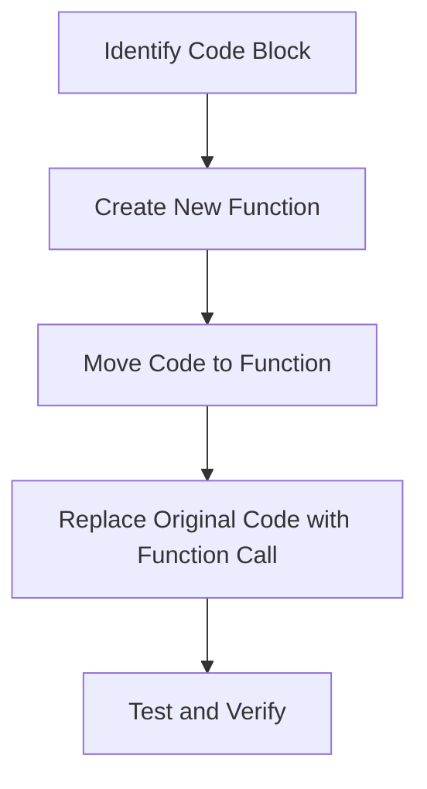

## 18.7 Refactoring Techniques in Lua

Refactoring is a critical process in software development that involves restructuring existing code without changing its external behavior. In Lua, as in other programming languages, refactoring aims to improve the code's readability, maintainability, and performance. This section will guide you through various refactoring techniques, focusing on systematic improvement strategies, common methods, tools, and practices to enhance your Lua codebase.

### Systematic Improvement Strategies

Refactoring should be approached systematically to minimize risks and ensure that changes do not introduce new bugs. Here are some strategies to consider:

#### Small Steps

Taking small, incremental steps is crucial when refactoring. This approach reduces the risk of introducing errors and makes it easier to identify the source of any issues that do arise. By making one change at a time and testing frequently, you can ensure that each modification is safe and effective.

**Example:**

Suppose you have a function that performs multiple tasks. Instead of refactoring the entire function at once, break it down into smaller parts and refactor each part individually.

```lua
-- Original function
function processOrder(order)
    validateOrder(order)
    calculateTotal(order)
    applyDiscount(order)
    finalizeOrder(order)
end

-- Refactored in small steps
function processOrder(order)
    validateOrder(order)
    calculateTotal(order)
    applyDiscount(order)
    finalizeOrder(order)
end

-- Step 1: Extract validation
function validateOrder(order)
    -- Validation logic
end

-- Step 2: Extract calculation
function calculateTotal(order)
    -- Calculation logic
end

-- Continue with other steps...
```

### Common Refactoring Methods

Refactoring methods are specific techniques used to improve code structure. Here are some common methods applicable to Lua:

#### Extract Method

The Extract Method technique involves creating new functions from existing code blocks. This method helps reduce code duplication and enhances readability by breaking down complex functions into smaller, more manageable pieces.

**Example:**

```lua
-- Before refactoring
function calculateArea(length, width)
    local area = length * width
    print("The area is " .. area)
end

-- After refactoring
function calculateArea(length, width)
    local area = computeArea(length, width)
    print("The area is " .. area)
end

function computeArea(length, width)
    return length * width
end
```

#### Rename Variables

Renaming variables to more descriptive names can significantly enhance code clarity. This method helps other developers (and your future self) understand the code's purpose and logic more easily.

**Example:**

```lua
-- Before refactoring
local a = 10
local b = 20
local c = a + b

-- After refactoring
local length = 10
local width = 20
local area = length + width
```

### Tools and Practices

Refactoring is supported by various tools and practices that help ensure the process is smooth and error-free.

#### Automated Tests

Automated tests are essential for verifying that refactored code maintains its original behavior. By running tests before and after refactoring, you can ensure that changes do not introduce new bugs.

**Example:**

```lua
-- Sample test using Busted, a Lua testing framework
describe("calculateArea", function()
    it("should return the correct area", function()
        assert.are.equal(200, calculateArea(10, 20))
    end)
end)
```

#### Version Control

Using version control systems like Git is crucial for safely tracking changes during refactoring. Version control allows you to revert to previous versions if something goes wrong and provides a history of changes for future reference.

**Example:**

```bash
git checkout -b refactor-calculate-area
git commit -m "Refactor calculateArea function"
git push origin refactor-calculate-area
```

### Use Cases and Examples

Refactoring is particularly beneficial in the following scenarios:

#### Legacy Code Enhancement

Legacy codebases often contain outdated practices and inefficient structures. Refactoring can modernize these codebases, making them easier to maintain and extend.

**Example:**

Consider a legacy Lua script that uses global variables extensively. Refactoring can involve encapsulating these variables within functions or modules to reduce side effects and improve modularity.

```lua
-- Before refactoring
globalVar = 10

function increment()
    globalVar = globalVar + 1
end

-- After refactoring
local function createCounter()
    local count = 10
    return {
        increment = function()
            count = count + 1
            return count
        end
    }
end

local counter = createCounter()
print(counter.increment())  -- Output: 11
```

### Visualizing Refactoring Techniques

To better understand the refactoring process, let's visualize the Extract Method technique using a flowchart.



**Caption:** This flowchart illustrates the steps involved in the Extract Method refactoring technique.

### Knowledge Check

To reinforce your understanding of refactoring techniques in Lua, consider the following questions:

- What are the benefits of taking small steps during refactoring?
- How does the Extract Method technique improve code readability?
- Why is renaming variables an important refactoring method?
- How can automated tests support the refactoring process?
- What role does version control play in refactoring?

### Try It Yourself

Experiment with the code examples provided by:

- Modifying the `calculateArea` function to include additional parameters, such as height, and refactor accordingly.
- Creating a new function that calculates the perimeter of a rectangle and refactor the existing code to use this function.
- Renaming variables in a complex Lua script to improve clarity and readability.

### Embrace the Journey

Remember, refactoring is an ongoing process that requires patience and practice. As you continue to refine your Lua code, you'll develop a deeper understanding of best practices and design patterns. Keep experimenting, stay curious, and enjoy the journey!

## Quiz Time!



### What is the primary goal of refactoring?

- [x] To improve code readability and maintainability without changing its external behavior.
- [ ] To add new features to the code.
- [ ] To optimize the code for performance.
- [ ] To rewrite the code in a different programming language.

> **Explanation:** Refactoring focuses on improving the internal structure of the code while preserving its external behavior.

### Which refactoring technique involves creating new functions from existing code blocks?

- [x] Extract Method
- [ ] Rename Variables
- [ ] Inline Method
- [ ] Move Method

> **Explanation:** The Extract Method technique involves creating new functions from existing code blocks to improve readability and reduce duplication.

### Why is renaming variables an important refactoring method?

- [x] It enhances code clarity and understanding.
- [ ] It improves code performance.
- [ ] It reduces the number of lines of code.
- [ ] It changes the functionality of the code.

> **Explanation:** Renaming variables to more descriptive names helps developers understand the code's purpose and logic more easily.

### What is the benefit of using automated tests during refactoring?

- [x] To verify that refactored code maintains its original behavior.
- [ ] To automatically refactor the code.
- [ ] To improve code performance.
- [ ] To document the code.

> **Explanation:** Automated tests help ensure that changes made during refactoring do not introduce new bugs by verifying that the code's behavior remains consistent.

### How does version control support the refactoring process?

- [x] By safely tracking changes and allowing reversion to previous versions.
- [ ] By automatically refactoring the code.
- [ ] By optimizing the code for performance.
- [ ] By documenting the code.

> **Explanation:** Version control systems like Git allow developers to track changes, revert to previous versions if necessary, and maintain a history of modifications.

### What is a common challenge when refactoring legacy code?

- [x] Dealing with outdated practices and inefficient structures.
- [ ] Adding new features to the code.
- [ ] Optimizing the code for performance.
- [ ] Rewriting the code in a different programming language.

> **Explanation:** Legacy codebases often contain outdated practices and inefficient structures that require careful refactoring to modernize and improve maintainability.

### What is the first step in the Extract Method refactoring technique?

- [x] Identify the code block to be extracted.
- [ ] Create a new function.
- [ ] Move the code to the new function.
- [ ] Replace the original code with a function call.

> **Explanation:** The first step in the Extract Method technique is to identify the code block that needs to be extracted into a new function.

### What is the advantage of taking small steps during refactoring?

- [x] It reduces the risk of introducing errors.
- [ ] It speeds up the refactoring process.
- [ ] It automatically optimizes the code.
- [ ] It changes the functionality of the code.

> **Explanation:** Taking small, incremental steps during refactoring reduces the risk of introducing errors and makes it easier to identify the source of any issues.

### What is the purpose of the flowchart in the refactoring section?

- [x] To illustrate the steps involved in the Extract Method technique.
- [ ] To show the entire refactoring process.
- [ ] To demonstrate the benefits of refactoring.
- [ ] To compare different refactoring techniques.

> **Explanation:** The flowchart visually represents the steps involved in the Extract Method refactoring technique, helping readers understand the process.

### True or False: Refactoring always involves changing the external behavior of the code.

- [ ] True
- [x] False

> **Explanation:** Refactoring focuses on improving the internal structure of the code without changing its external behavior.


