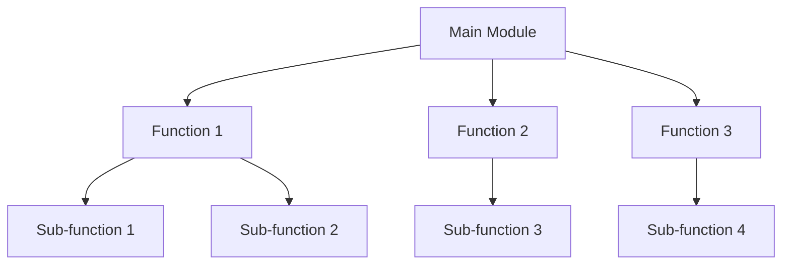

## 18.8 Improving Code Readability and Maintainability

In the realm of software development, writing code that is not only functional but also readable and maintainable is crucial. This is especially true in Lua, where the dynamic nature of the language can lead to complex and hard-to-follow code if not managed properly. In this section, we will explore strategies to enhance the readability and maintainability of your Lua code, ensuring that it remains understandable and adaptable over time.

### Writing Clear and Understandable Code

#### Consistent Naming

One of the foundational aspects of readable code is the use of consistent and descriptive naming conventions. Names should convey the purpose of variables, functions, and modules clearly. This practice aids in understanding the code without needing to delve into the implementation details.

**Example:**

```lua
-- Poor naming
function p(a, b)
    return a + b
end

-- Improved naming
function addNumbers(firstNumber, secondNumber)
    return firstNumber + secondNumber
end
```

In the improved example, the function name `addNumbers` clearly indicates its purpose, and the parameter names `firstNumber` and `secondNumber` describe their roles.

#### Modularization

Modularization involves breaking down code into smaller, manageable, and cohesive units. This approach not only enhances readability but also facilitates easier testing and maintenance.

**Example:**

```lua
-- Without modularization
function processUserData(userData)
    -- Validate user data
    if not userData.name or not userData.age then
        return false
    end

    -- Process user data
    print("Processing user:", userData.name)
    -- Additional processing logic...
end

-- With modularization
function validateUserData(userData)
    return userData.name and userData.age
end

function processUserData(userData)
    if not validateUserData(userData) then
        return false
    end
    print("Processing user:", userData.name)
    -- Additional processing logic...
end
```

By separating the validation logic into its own function, we make the `processUserData` function easier to read and maintain.

### Commenting and Documentation

#### Clear Comments

Comments are essential for explaining complex or non-obvious code segments. They should be used judiciously to clarify the intent and logic behind the code.

**Example:**

```lua
-- Calculate the factorial of a number using recursion
function factorial(n)
    -- Base case: factorial of 0 is 1
    if n == 0 then
        return 1
    else
        -- Recursive case: n * factorial of (n-1)
        return n * factorial(n - 1)
    end
end
```

In this example, comments are used to explain the base and recursive cases of the factorial function.

#### API Documentation

Providing documentation for your modules and functions is crucial for users to understand how to use them effectively. This includes detailing the purpose, parameters, return values, and any side effects.

**Example:**

```lua
--- Calculate the area of a rectangle.
-- @param width The width of the rectangle.
-- @param height The height of the rectangle.
-- @return The area of the rectangle.
function calculateRectangleArea(width, height)
    return width * height
end
```

This documentation provides a clear understanding of what the function does and how to use it.

### Simplifying Complexity

#### Avoid Deep Nesting

Deeply nested control structures can make code difficult to follow. Strive to keep nesting levels manageable by using early returns or breaking complex logic into smaller functions.

**Example:**

```lua
-- Deep nesting
function processOrder(order)
    if order.isValid then
        if order.paymentProcessed then
            if order.stockAvailable then
                -- Process order
                print("Order processed")
            end
        end
    end
end

-- Simplified with early returns
function processOrder(order)
    if not order.isValid then return end
    if not order.paymentProcessed then return end
    if not order.stockAvailable then return end

    -- Process order
    print("Order processed")
end
```

By using early returns, we reduce the nesting level and make the code easier to read.

#### Limit Function Size

Functions should ideally perform a single task. Limiting function size enhances readability and makes testing and debugging more straightforward.

**Example:**

```lua
-- Large function doing multiple tasks
function handleUserRequest(request)
    -- Authenticate user
    if not authenticate(request.user) then
        return "Authentication failed"
    end

    -- Process request
    local result = processRequest(request)

    -- Log request
    logRequest(request)

    return result
end

-- Refactored into smaller functions
function handleUserRequest(request)
    if not authenticateUser(request.user) then
        return "Authentication failed"
    end

    local result = processUserRequest(request)
    logUserRequest(request)

    return result
end

function authenticateUser(user)
    -- Authentication logic
end

function processUserRequest(request)
    -- Request processing logic
end

function logUserRequest(request)
    -- Logging logic
end
```

By breaking down the `handleUserRequest` function into smaller functions, we improve its readability and maintainability.

### Use Cases and Examples

#### Code Reviews

Code reviews are an excellent way to share knowledge and improve code quality. They provide an opportunity for developers to learn from each other and identify areas for improvement.

**Example:**

During a code review, a team member might suggest renaming a variable for clarity or refactoring a function to reduce complexity. These suggestions can lead to more readable and maintainable code.

**Try It Yourself:**

Experiment with the code examples provided by modifying variable names, breaking down functions into smaller units, or adding comments to clarify complex logic. Observe how these changes impact the readability and maintainability of the code.

### Visualizing Code Structure

To further enhance understanding, let's visualize the structure of a Lua module using a Mermaid.js diagram. This diagram illustrates how functions within a module can be organized to improve readability and maintainability.



**Description:** This diagram represents a Lua module with a main function that delegates tasks to smaller, more focused sub-functions. This modular approach enhances both readability and maintainability.

### References and Links

For further reading on code readability and maintainability, consider exploring the following resources:

- [Clean Code: A Handbook of Agile Software Craftsmanship](https://www.amazon.com/Clean-Code-Handbook-Software-Craftsmanship/dp/0132350882) by Robert C. Martin
- [The Art of Readable Code](https://www.amazon.com/Art-Readable-Code-Simple-Practical/dp/0596802293) by Dustin Boswell and Trevor Foucher
- [Lua Programming Guide](https://www.lua.org/manual/5.4/) - Official Lua Documentation

### Knowledge Check

To reinforce your understanding of improving code readability and maintainability, consider the following questions:

- What are the benefits of using consistent naming conventions in your code?
- How can modularization improve the maintainability of your code?
- Why is it important to limit the size of your functions?
- How can code reviews contribute to better code quality?

### Embrace the Journey

Remember, improving code readability and maintainability is an ongoing process. As you continue to write and review code, keep experimenting with different techniques and approaches. Stay curious, and enjoy the journey of becoming a more proficient Lua developer!

## Quiz Time!



### What is one benefit of using consistent naming conventions in code?

- [x] It makes the code easier to understand.
- [ ] It increases the execution speed of the code.
- [ ] It reduces the number of lines of code.
- [ ] It eliminates the need for comments.

> **Explanation:** Consistent naming conventions help convey the purpose of variables and functions, making the code easier to understand.

### How does modularization improve code maintainability?

- [x] By breaking code into smaller, manageable units.
- [ ] By increasing the complexity of the code.
- [ ] By reducing the number of functions.
- [ ] By making the code run faster.

> **Explanation:** Modularization involves breaking code into smaller, cohesive units, which makes it easier to manage, test, and maintain.

### What is a key reason to limit the size of functions?

- [x] To ensure functions perform a single task.
- [ ] To make functions harder to understand.
- [ ] To increase the number of parameters.
- [ ] To reduce the number of comments needed.

> **Explanation:** Limiting function size helps ensure that each function performs a single task, enhancing readability and maintainability.

### Why should deep nesting be avoided in code?

- [x] It makes the code difficult to follow.
- [ ] It increases the execution speed.
- [ ] It reduces the number of lines of code.
- [ ] It eliminates the need for comments.

> **Explanation:** Deep nesting can make code difficult to follow and understand, so it should be avoided when possible.

### What is the purpose of clear comments in code?

- [x] To explain complex or non-obvious code segments.
- [ ] To increase the execution speed of the code.
- [ ] To reduce the number of lines of code.
- [ ] To eliminate the need for documentation.

> **Explanation:** Clear comments help explain complex or non-obvious code segments, aiding in understanding and maintenance.

### How can code reviews improve code quality?

- [x] By providing opportunities for knowledge sharing and improvement.
- [ ] By increasing the number of lines of code.
- [ ] By reducing the execution speed of the code.
- [ ] By eliminating the need for testing.

> **Explanation:** Code reviews allow developers to share knowledge and identify areas for improvement, leading to better code quality.

### What is the benefit of API documentation?

- [x] It details how to use modules and functions effectively.
- [ ] It increases the execution speed of the code.
- [ ] It reduces the number of lines of code.
- [ ] It eliminates the need for comments.

> **Explanation:** API documentation provides detailed information on how to use modules and functions, aiding in effective usage.

### Why is it important to use early returns in functions?

- [x] To reduce the nesting level and improve readability.
- [ ] To increase the complexity of the code.
- [ ] To make functions longer.
- [ ] To eliminate the need for comments.

> **Explanation:** Early returns help reduce the nesting level in functions, making the code easier to read and understand.

### What is a key takeaway from improving code readability and maintainability?

- [x] It is an ongoing process that requires continuous effort.
- [ ] It can be achieved once and never revisited.
- [ ] It only applies to large projects.
- [ ] It eliminates the need for testing.

> **Explanation:** Improving code readability and maintainability is an ongoing process that requires continuous effort and attention.

### True or False: Modularization can make code more difficult to test.

- [ ] True
- [x] False

> **Explanation:** Modularization actually makes code easier to test by breaking it into smaller, more manageable units.


