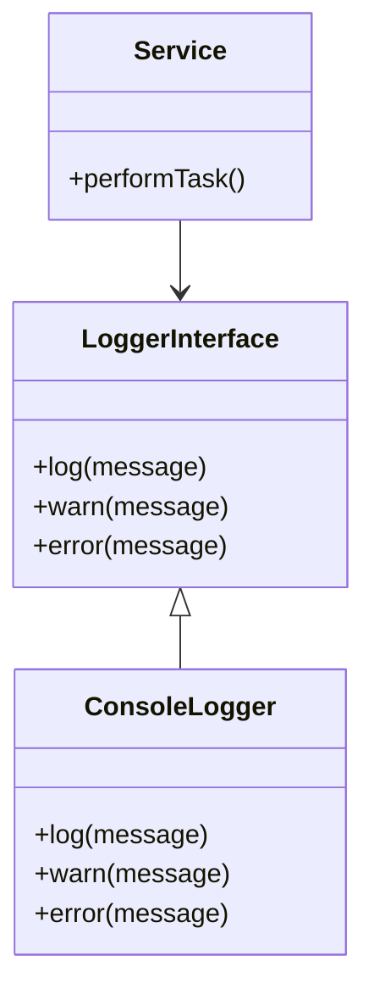

## 18.9 Avoiding Tight Coupling and Promoting Loose Coupling

In the realm of software design, coupling refers to the degree of direct knowledge that one module has about another. Tight coupling occurs when modules are highly dependent on each other, making changes difficult and potentially introducing bugs. On the other hand, loose coupling minimizes dependencies, allowing for more flexible, maintainable, and testable systems. In this section, we'll explore how to avoid tight coupling and promote loose coupling in Lua, using design patterns and best practices.

### Designing Flexible Systems

#### Loose Coupling Benefits

Loose coupling offers several advantages:

- **Easier Maintenance**: Changes in one module are less likely to affect others, reducing the risk of introducing bugs.
- **Improved Testability**: Modules can be tested independently, facilitating unit testing and test-driven development.
- **Enhanced Reusability**: Loosely coupled modules can be reused across different projects or contexts.
- **Greater Flexibility**: Systems can adapt more easily to changing requirements or new technologies.

#### Strategies for Loose Coupling

To achieve loose coupling, consider the following strategies:

1. **Interfaces**: Define clear interaction points between modules.
2. **Dependency Injection**: Pass dependencies rather than hardcoding them.
3. **Component-Based Design**: Build reusable and testable modules.

Let's delve deeper into each of these strategies.

### Interfaces: Defining Clear Interaction Points

Interfaces serve as contracts between different parts of a system, specifying what methods or functions are available without dictating how they are implemented. In Lua, while we don't have formal interfaces like in some other languages, we can achieve similar results using tables and functions.

#### Example: Using Tables as Interfaces

```lua
-- Define an interface using a table
local LoggerInterface = {
    log = function(message) end,
    warn = function(message) end,
    error = function(message) end
}

-- Implement the interface
local ConsoleLogger = {}
setmetatable(ConsoleLogger, { __index = LoggerInterface })

function ConsoleLogger:log(message)
    print("LOG: " .. message)
end

function ConsoleLogger:warn(message)
    print("WARN: " .. message)
end

function ConsoleLogger:error(message)
    print("ERROR: " .. message)
end

-- Usage
local logger = ConsoleLogger
logger:log("This is a log message.")
```

In this example, `LoggerInterface` defines the expected methods. `ConsoleLogger` implements these methods, adhering to the interface. This approach allows us to swap out different logger implementations without changing the code that uses the logger.

### Dependency Injection: Passing Dependencies

Dependency injection involves passing dependencies to a module rather than hardcoding them. This technique decouples modules, making them more flexible and easier to test.

#### Example: Dependency Injection in Lua

```lua
-- Define a service that requires a logger
local function Service(logger)
    return {
        performTask = function()
            logger:log("Task is being performed.")
        end
    }
end

-- Create a logger instance
local logger = ConsoleLogger

-- Inject the logger into the service
local service = Service(logger)
service.performTask()
```

Here, the `Service` function receives a `logger` as a parameter, allowing us to inject different logger implementations. This decouples the service from a specific logger, enhancing flexibility and testability.

### Component-Based Design: Building Reusable and Testable Modules

Component-based design involves creating self-contained modules that can be easily reused and tested. This approach often leverages both interfaces and dependency injection to achieve loose coupling.

#### Example: Component-Based Design in Lua

```lua
-- Define a component interface
local Component = {
    update = function(self, dt) end
}

-- Implement a specific component
local MovementComponent = {}
setmetatable(MovementComponent, { __index = Component })

function MovementComponent:update(dt)
    print("Updating movement with delta time: " .. dt)
end

-- Define an entity that uses components
local Entity = {
    components = {}
}

function Entity:addComponent(component)
    table.insert(self.components, component)
end

function Entity:update(dt)
    for _, component in ipairs(self.components) do
        component:update(dt)
    end
end

-- Usage
local entity = Entity
entity:addComponent(MovementComponent)
entity:update(0.016)  -- Assume 60 FPS, so dt is approximately 1/60
```

In this example, `MovementComponent` implements the `Component` interface. The `Entity` class can have multiple components, each responsible for a specific aspect of the entity's behavior. This design promotes loose coupling by allowing components to be developed and tested independently.

### Visualizing Loose Coupling

To better understand the concept of loose coupling, let's visualize the relationships between modules using a Mermaid.js diagram.



In this diagram, `ConsoleLogger` implements `LoggerInterface`, and `Service` depends on `LoggerInterface`. This setup allows us to swap out `ConsoleLogger` with any other implementation of `LoggerInterface` without affecting the `Service`.

### Use Cases and Examples

#### Component-Based Design: Building Reusable and Testable Modules

Component-based design is particularly useful in game development, where entities often have multiple behaviors or characteristics. By using components, we can easily add, remove, or modify behaviors without affecting other parts of the system.

#### Example: Game Development with Components

```lua
-- Define a render component
local RenderComponent = {}
setmetatable(RenderComponent, { __index = Component })

function RenderComponent:update(dt)
    print("Rendering with delta time: " .. dt)
end

-- Add render component to entity
entity:addComponent(RenderComponent)
entity:update(0.016)
```

In this example, we add a `RenderComponent` to the entity, demonstrating how components can be mixed and matched to create complex behaviors.

### Try It Yourself

Experiment with the code examples provided. Try creating your own components and injecting different dependencies. Consider how these changes affect the flexibility and testability of your code.

### Knowledge Check

- **Question**: What are the benefits of loose coupling?
- **Challenge**: Implement a new component for the entity that logs messages at regular intervals.

### Embrace the Journey

Remember, mastering loose coupling is a journey. As you continue to explore and experiment, you'll discover new ways to design flexible, maintainable systems. Keep learning, stay curious, and enjoy the process!

### References and Links

- [MDN Web Docs: Coupling](https://developer.mozilla.org/en-US/docs/Glossary/Coupling)
- [Wikipedia: Loose Coupling](https://en.wikipedia.org/wiki/Loose_coupling)

## Quiz Time!



### What is the primary benefit of loose coupling in software design?

- [x] Easier maintenance and testing
- [ ] Increased performance
- [ ] Reduced memory usage
- [ ] Faster development time

> **Explanation:** Loose coupling makes it easier to maintain and test software by reducing dependencies between modules.

### Which strategy involves passing dependencies to a module rather than hardcoding them?

- [x] Dependency Injection
- [ ] Interface Segregation
- [ ] Component-Based Design
- [ ] Singleton Pattern

> **Explanation:** Dependency Injection involves passing dependencies to a module, promoting loose coupling.

### In Lua, how can we define an interface?

- [x] Using tables and functions
- [ ] Using classes
- [ ] Using inheritance
- [ ] Using global variables

> **Explanation:** In Lua, interfaces can be defined using tables and functions, as Lua does not have formal interface constructs.

### What is a key advantage of component-based design?

- [x] Reusability and testability
- [ ] Increased complexity
- [ ] Faster execution
- [ ] Reduced code size

> **Explanation:** Component-based design promotes reusability and testability by creating self-contained modules.

### How can we visualize relationships between modules in Lua?

- [x] Using Mermaid.js diagrams
- [ ] Using UML diagrams
- [ ] Using flowcharts
- [ ] Using pie charts

> **Explanation:** Mermaid.js diagrams can be used to visualize relationships between modules in Lua.

### What does the `Service` function in the example code do?

- [x] It creates a service that logs messages
- [ ] It renders graphics
- [ ] It manages user input
- [ ] It performs database operations

> **Explanation:** The `Service` function creates a service that logs messages using a provided logger.

### Which component updates movement with delta time?

- [x] MovementComponent
- [ ] RenderComponent
- [ ] LoggerInterface
- [ ] ConsoleLogger

> **Explanation:** The `MovementComponent` updates movement with delta time.

### What is the purpose of the `Entity` class in the example?

- [x] To manage components and update them
- [ ] To log messages
- [ ] To render graphics
- [ ] To handle user input

> **Explanation:** The `Entity` class manages components and updates them.

### Which of the following is NOT a benefit of loose coupling?

- [ ] Easier maintenance
- [ ] Improved testability
- [ ] Enhanced reusability
- [x] Increased memory usage

> **Explanation:** Loose coupling does not increase memory usage; it improves maintainability, testability, and reusability.

### True or False: Tight coupling makes it easier to swap out implementations.

- [ ] True
- [x] False

> **Explanation:** Tight coupling makes it difficult to swap out implementations due to high dependencies between modules.


