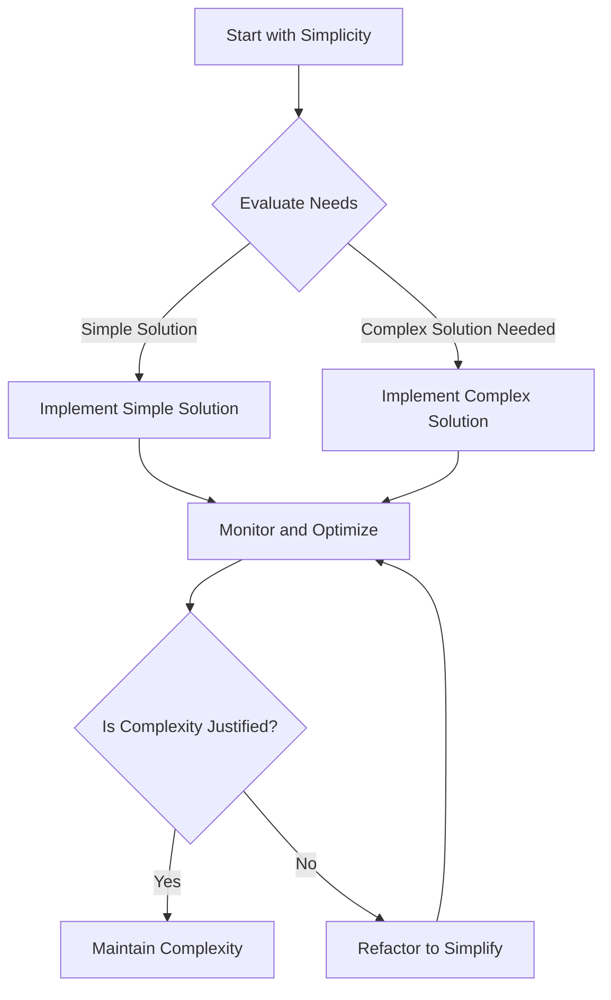

## 19.10 Balancing Simplicity and Complexity

In the realm of software engineering, achieving the right balance between simplicity and complexity is crucial for developing robust, efficient, and maintainable applications. This balance is particularly significant in Lua, a lightweight and flexible programming language often used in game development, embedded systems, and scripting. In this section, we will explore how to navigate the delicate equilibrium between simplicity and complexity in Lua design patterns, providing strategies, examples, and best practices to guide you in your software development journey.

### Design Choices

#### Simplicity First: Avoiding Unnecessary Complexity

Simplicity is the ultimate sophistication. In software design, simplicity translates to code that is easy to read, understand, and maintain. Here are some principles to keep in mind:

- **Minimalism**: Write only the code that is necessary to solve the problem at hand. Avoid adding features or abstractions that are not immediately needed.
- **Clarity**: Ensure that your code is self-explanatory. Use meaningful variable names, clear logic, and comments where necessary to enhance readability.
- **Modularity**: Break down your code into small, manageable modules or functions. This not only simplifies the code but also makes it easier to test and maintain.

**Example: A Simple Lua Function**

```lua
-- Function to calculate the factorial of a number
local function factorial(n)
    if n == 0 then
        return 1
    else
        return n * factorial(n - 1)
    end
end

print(factorial(5))  -- Output: 120
```

In this example, the factorial function is straightforward and easy to understand. It uses recursion to calculate the factorial of a number, demonstrating simplicity in both logic and implementation.

#### When Complexity is Necessary

While simplicity is desirable, there are situations where complexity is unavoidable or even necessary. Understanding when to embrace complexity is key to effective software design.

##### Evaluating Needs: Understanding When Advanced Solutions Are Required

- **Scalability**: As your application grows, simple solutions may no longer suffice. Complex algorithms or data structures might be necessary to handle increased load or data volume.
- **Performance**: In performance-critical applications, such as real-time systems or games, complex optimizations may be required to meet performance goals.
- **Flexibility**: Sometimes, a more complex design is needed to accommodate future changes or extensions without significant refactoring.

**Example: Complex Data Structure**

```lua
-- Implementing a binary search tree in Lua
local Node = {}
Node.__index = Node

function Node:new(value)
    return setmetatable({value = value, left = nil, right = nil}, Node)
end

local BinaryTree = {}
BinaryTree.__index = BinaryTree

function BinaryTree:new()
    return setmetatable({root = nil}, BinaryTree)
end

function BinaryTree:insert(value)
    local node = Node:new(value)
    if not self.root then
        self.root = node
    else
        local current = self.root
        while true do
            if value < current.value then
                if not current.left then
                    current.left = node
                    break
                else
                    current = current.left
                end
            else
                if not current.right then
                    current.right = node
                    break
                else
                    current = current.right
                end
            end
        end
    end
end

-- Usage
local tree = BinaryTree:new()
tree:insert(10)
tree:insert(5)
tree:insert(15)
```

In this example, we implement a binary search tree, a more complex data structure that provides efficient data storage and retrieval. This complexity is justified by the need for performance and scalability.

### Strategies for Balancing Simplicity and Complexity

#### Incremental Development: Building Complexity Gradually

Incremental development involves starting with a simple solution and gradually adding complexity as needed. This approach allows you to maintain simplicity while accommodating new requirements.

- **Start Small**: Begin with a minimal viable product (MVP) that addresses the core functionality.
- **Iterate**: Add features or optimizations incrementally, testing and refining the code at each step.
- **Feedback**: Use feedback from users or stakeholders to guide the development process, ensuring that complexity is added only when necessary.

**Example: Incremental Feature Addition**

```lua
-- Initial simple function to greet a user
local function greet(name)
    return "Hello, " .. name
end

-- Incrementally adding a feature to include time of day
local function greetWithTime(name)
    local hour = os.date("*t").hour
    local greeting = "Hello"
    if hour < 12 then
        greeting = "Good morning"
    elseif hour < 18 then
        greeting = "Good afternoon"
    else
        greeting = "Good evening"
    end
    return greeting .. ", " .. name
end

print(greetWithTime("Alice"))  -- Output varies based on time of day
```

In this example, we start with a simple greeting function and incrementally add complexity by including a time-based greeting.

#### Refactoring: Simplifying Code Over Time

Refactoring is the process of restructuring existing code without changing its external behavior. It helps to simplify complex code, improve readability, and enhance maintainability.

- **Identify Code Smells**: Look for signs of complexity, such as duplicated code, long functions, or deep nesting.
- **Apply Refactoring Techniques**: Use techniques like extracting functions, renaming variables, or simplifying logic to improve the code.
- **Continuous Improvement**: Make refactoring a regular part of the development process to keep the codebase clean and manageable.

**Example: Refactoring a Complex Function**

Before Refactoring:

```lua
-- Complex function with nested logic
local function processOrder(order)
    if order.status == "pending" then
        if order.payment == "completed" then
            order.status = "processed"
            -- Additional processing logic
        else
            order.status = "failed"
            -- Handle payment failure
        end
    else
        -- Handle non-pending orders
    end
end
```

After Refactoring:

```lua
-- Refactored function with simplified logic
local function processPayment(order)
    if order.payment == "completed" then
        order.status = "processed"
        -- Additional processing logic
    else
        order.status = "failed"
        -- Handle payment failure
    end
end

local function processOrder(order)
    if order.status == "pending" then
        processPayment(order)
    else
        -- Handle non-pending orders
    end
end
```

By extracting the payment processing logic into a separate function, we simplify the `processOrder` function, making it easier to read and maintain.

### Use Cases and Examples

#### Scalable Solutions: Planning for Future Growth Without Over-Engineering

Scalability is the ability of a system to handle increased load or demand. Designing for scalability involves anticipating future growth and ensuring that the system can accommodate it without excessive complexity.

- **Design for Change**: Use design patterns that promote flexibility and adaptability, such as the Strategy or Observer patterns.
- **Avoid Over-Engineering**: Focus on current requirements and avoid adding features or complexity that may never be needed.
- **Monitor and Optimize**: Continuously monitor the system's performance and make optimizations as needed to handle growth.

**Example: Using the Strategy Pattern for Scalability**

```lua
-- Strategy pattern for payment processing
local PaymentProcessor = {}
PaymentProcessor.__index = PaymentProcessor

function PaymentProcessor:new(strategy)
    return setmetatable({strategy = strategy}, PaymentProcessor)
end

function PaymentProcessor:process(order)
    self.strategy:process(order)
end

-- Concrete strategy for credit card payment
local CreditCardPayment = {}
CreditCardPayment.__index = CreditCardPayment

function CreditCardPayment:process(order)
    -- Process credit card payment
    print("Processing credit card payment for order " .. order.id)
end

-- Concrete strategy for PayPal payment
local PayPalPayment = {}
PayPalPayment.__index = PayPalPayment

function PayPalPayment:process(order)
    -- Process PayPal payment
    print("Processing PayPal payment for order " .. order.id)
end

-- Usage
local order = {id = 123, amount = 100}
local creditCardProcessor = PaymentProcessor:new(CreditCardPayment)
creditCardProcessor:process(order)

local paypalProcessor = PaymentProcessor:new(PayPalPayment)
paypalProcessor:process(order)
```

In this example, the Strategy pattern is used to handle different payment methods. This design allows for easy addition of new payment strategies in the future, enhancing scalability without over-engineering.

### Visualizing the Balance Between Simplicity and Complexity

To better understand how to balance simplicity and complexity, let's visualize the process using a flowchart.



**Caption**: This flowchart illustrates the decision-making process for balancing simplicity and complexity in software design. Start with simplicity, evaluate needs, implement solutions, and continuously monitor and optimize.

### References and Links

For further reading on balancing simplicity and complexity in software design, consider the following resources:

- [Martin Fowler's Refactoring](https://martinfowler.com/books/refactoring.html)
- [Design Patterns: Elements of Reusable Object-Oriented Software](https://www.amazon.com/Design-Patterns-Elements-Reusable-Object-Oriented/dp/0201633612)
- [The Art of Readable Code](https://www.amazon.com/Art-Readable-Code-Practical-Techniques/dp/0596802293)

### Knowledge Check

To reinforce your understanding of balancing simplicity and complexity, consider the following questions:

- What are the benefits of starting with a simple solution?
- How can you identify when complexity is necessary in a software design?
- What are some common refactoring techniques to simplify complex code?

### Embrace the Journey

Balancing simplicity and complexity is an ongoing journey in software development. Remember, this is just the beginning. As you progress, you'll gain a deeper understanding of when to embrace complexity and when to strive for simplicity. Keep experimenting, stay curious, and enjoy the journey!

## Quiz Time!



### What is the primary benefit of starting with a simple solution in software design?

- [x] It makes the code easier to read and maintain.
- [ ] It allows for the immediate implementation of all features.
- [ ] It ensures the software will never need refactoring.
- [ ] It guarantees the software will be scalable.

> **Explanation:** Starting with a simple solution makes the code easier to read and maintain, which is crucial for long-term software quality.

### When is complexity justified in software design?

- [x] When scalability and performance are critical.
- [ ] When the code needs to be written quickly.
- [ ] When the developer prefers complex solutions.
- [ ] When the software is for a small project.

> **Explanation:** Complexity is justified when scalability and performance are critical, as these factors often require more sophisticated solutions.

### What is incremental development?

- [x] Building complexity gradually by adding features over time.
- [ ] Writing all code at once before testing.
- [ ] Removing features to simplify the code.
- [ ] Starting with a complex solution and simplifying it later.

> **Explanation:** Incremental development involves building complexity gradually by adding features over time, allowing for better management of complexity.

### What is the purpose of refactoring?

- [x] To simplify complex code and improve readability.
- [ ] To add more features to the software.
- [ ] To make the code run faster.
- [ ] To change the external behavior of the software.

> **Explanation:** Refactoring aims to simplify complex code and improve readability without changing the software's external behavior.

### Which design pattern is useful for scalability?

- [x] Strategy Pattern
- [ ] Singleton Pattern
- [ ] Observer Pattern
- [ ] Factory Pattern

> **Explanation:** The Strategy Pattern is useful for scalability as it allows for easy addition of new strategies or behaviors.

### What is a common sign of complexity in code?

- [x] Deep nesting and long functions.
- [ ] Short, concise functions.
- [ ] Well-documented code.
- [ ] Modular design.

> **Explanation:** Deep nesting and long functions are common signs of complexity in code, making it harder to read and maintain.

### How can you avoid over-engineering?

- [x] Focus on current requirements and avoid unnecessary features.
- [ ] Implement all possible features from the start.
- [ ] Use the most complex algorithms available.
- [ ] Ignore user feedback.

> **Explanation:** Avoid over-engineering by focusing on current requirements and avoiding unnecessary features that may never be needed.

### What is the benefit of modularity in code?

- [x] It makes the code easier to test and maintain.
- [ ] It increases the complexity of the code.
- [ ] It makes the code harder to read.
- [ ] It reduces the performance of the software.

> **Explanation:** Modularity makes the code easier to test and maintain by breaking it down into smaller, manageable parts.

### What is the role of feedback in incremental development?

- [x] To guide the development process and ensure necessary complexity.
- [ ] To add complexity to the code.
- [ ] To remove features from the software.
- [ ] To ignore user requirements.

> **Explanation:** Feedback guides the development process and ensures that complexity is added only when necessary.

### True or False: Refactoring should only be done at the end of a project.

- [ ] True
- [x] False

> **Explanation:** Refactoring should be a continuous process throughout the development lifecycle to keep the codebase clean and manageable.


