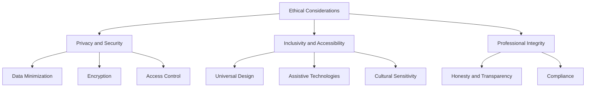

## 19.11 Ethical Considerations in Software Development

In the rapidly evolving field of software development, ethical considerations are paramount. As developers, we wield significant power in shaping the digital landscape, and with that power comes the responsibility to ensure our creations are beneficial, safe, and equitable. This section explores the ethical responsibilities of developers, focusing on key principles such as privacy, security, inclusivity, and professional integrity. We will also discuss real-world use cases and examples to illustrate these concepts.

### Responsibility of Developers

#### Understanding Impact

As developers, we must recognize the profound impact our code can have on individuals and society. Every line of code we write has the potential to influence user behavior, privacy, and security. Therefore, it is crucial to consider the broader implications of our work.

- **Assessing Consequences**: Before implementing a feature, consider its potential effects on users and society. Will it enhance user experience, or could it inadvertently cause harm?
- **Long-term Thinking**: Think beyond immediate goals and consider the long-term impact of your software. How will it evolve, and what future challenges might arise?

### Key Principles

#### Privacy and Security

Protecting user data is a fundamental ethical obligation for developers. In an era where data breaches and privacy violations are common, safeguarding user information is more critical than ever.

- **Data Minimization**: Collect only the data necessary for your application to function. Avoid gathering excessive information that could compromise user privacy.
- **Encryption**: Use encryption to protect sensitive data both in transit and at rest. This ensures that even if data is intercepted, it remains unreadable to unauthorized parties.
- **Access Control**: Implement robust access control mechanisms to ensure that only authorized users can access sensitive information.

#### Inclusivity and Accessibility

Designing software that is inclusive and accessible to all users is not just a legal requirement but an ethical imperative. Consider the diverse needs of your user base and strive to create applications that everyone can use.

- **Universal Design**: Adopt a universal design approach that accommodates users with varying abilities and preferences.
- **Assistive Technologies**: Ensure your software is compatible with assistive technologies, such as screen readers and voice recognition systems.
- **Cultural Sensitivity**: Be mindful of cultural differences and design software that respects and accommodates diverse cultural norms.

### Professional Integrity

#### Honesty and Transparency

Being truthful about the capabilities and limitations of your software is essential for maintaining trust with users and stakeholders.

- **Clear Communication**: Clearly communicate what your software can and cannot do. Avoid making exaggerated claims that could mislead users.
- **Open Source**: Consider open-sourcing your code to promote transparency and allow others to verify its integrity.

#### Compliance

Adhering to laws and regulations is a fundamental aspect of ethical software development. Ensure your software complies with relevant legal standards and industry best practices.

- **Data Protection Laws**: Familiarize yourself with data protection laws, such as the General Data Protection Regulation (GDPR), and ensure your software complies with these regulations.
- **Industry Standards**: Follow industry standards and guidelines to ensure your software meets quality and safety benchmarks.

### Use Cases and Examples

#### Ethical Dilemmas

Navigating ethical dilemmas is an inevitable part of software development. Here are some common scenarios and how to address them:

- **User Tracking**: Balancing the need for user data with privacy concerns can be challenging. Implement opt-in mechanisms and provide clear explanations of how data will be used.
- **Algorithmic Bias**: Algorithms can inadvertently perpetuate bias if not carefully designed. Regularly audit your algorithms for bias and take corrective action as needed.
- **Security vs. Usability**: Enhancing security often comes at the cost of usability. Strive to find a balance that protects user data without compromising user experience.

### Code Examples

Let's explore some Lua code examples that demonstrate ethical considerations in software development.

#### Data Encryption Example

```lua
-- Lua code for encrypting user data using a simple encryption algorithm

local function encrypt(data, key)
    local encrypted = {}
    for i = 1, #data do
        local byte = string.byte(data, i)
        local encryptedByte = bit.bxor(byte, key)
        table.insert(encrypted, string.char(encryptedByte))
    end
    return table.concat(encrypted)
end

local userData = "Sensitive User Data"
local encryptionKey = 42 -- Example key, use a secure key in production

local encryptedData = encrypt(userData, encryptionKey)
print("Encrypted Data: " .. encryptedData)
```

> **Explanation:** This Lua code snippet demonstrates a simple encryption technique using the XOR operation. It highlights the importance of encrypting sensitive user data to protect privacy.

#### Access Control Example

```lua
-- Lua code for implementing basic access control

local users = {
    {username = "admin", role = "admin"},
    {username = "user1", role = "user"},
    {username = "user2", role = "user"}
}

local function hasAccess(username, requiredRole)
    for _, user in ipairs(users) do
        if user.username == username and user.role == requiredRole then
            return true
        end
    end
    return false
end

local currentUser = "user1"
local requiredRole = "admin"

if hasAccess(currentUser, requiredRole) then
    print("Access granted")
else
    print("Access denied")
end
```

> **Explanation:** This Lua code snippet demonstrates a basic access control mechanism, ensuring that only users with the appropriate role can access certain features.

### Visualizing Ethical Considerations

To better understand the ethical considerations in software development, let's visualize the relationship between key principles using a diagram.



> **Description:** This diagram illustrates the key ethical considerations in software development, highlighting the interconnectedness of privacy, security, inclusivity, accessibility, and professional integrity.

### References and Links

- [Mozilla Developer Network (MDN) Web Docs](https://developer.mozilla.org/en-US/)
- [W3Schools](https://www.w3schools.com/)
- [General Data Protection Regulation (GDPR)](https://gdpr-info.eu/)
- [Open Source Initiative](https://opensource.org/)

### Knowledge Check

- **What are the key ethical principles in software development?**
- **How can developers ensure their software is inclusive and accessible?**
- **What are some common ethical dilemmas in software development?**

### Embrace the Journey

Remember, ethical considerations are an ongoing journey. As you continue to develop software, keep these principles in mind and strive to create applications that are not only functional but also ethical. Stay curious, keep learning, and enjoy the journey of ethical software development!

## Quiz Time!



### What is a fundamental ethical obligation for developers regarding user data?

- [x] Protecting user data
- [ ] Collecting as much data as possible
- [ ] Sharing user data with third parties
- [ ] Ignoring data privacy concerns

> **Explanation:** Protecting user data is a fundamental ethical obligation for developers to ensure privacy and security.

### Which principle emphasizes designing software for all users?

- [x] Inclusivity and Accessibility
- [ ] Data Minimization
- [ ] Encryption
- [ ] Compliance

> **Explanation:** Inclusivity and Accessibility emphasize designing software that is usable by all users, regardless of their abilities or preferences.

### What should developers do to maintain professional integrity?

- [x] Be honest and transparent about software capabilities
- [ ] Exaggerate software capabilities
- [ ] Ignore legal regulations
- [ ] Collect excessive user data

> **Explanation:** Developers should be honest and transparent about their software's capabilities to maintain professional integrity.

### What is a common challenge when balancing security and usability?

- [x] Enhancing security often reduces usability
- [ ] Security always improves usability
- [ ] Usability has no impact on security
- [ ] Usability is more important than security

> **Explanation:** Enhancing security often comes at the cost of usability, making it a challenge to balance the two.

### How can developers ensure their software complies with data protection laws?

- [x] Familiarize themselves with relevant laws and regulations
- [ ] Ignore data protection laws
- [ ] Collect as much data as possible
- [ ] Share user data freely

> **Explanation:** Developers must familiarize themselves with relevant laws and regulations to ensure compliance with data protection laws.

### What is the purpose of encryption in software development?

- [x] To protect sensitive data from unauthorized access
- [ ] To make data easily accessible to everyone
- [ ] To increase data collection
- [ ] To ignore data privacy concerns

> **Explanation:** Encryption is used to protect sensitive data from unauthorized access, ensuring privacy and security.

### What is a key aspect of universal design?

- [x] Accommodating users with varying abilities
- [ ] Designing for a specific user group
- [ ] Ignoring accessibility concerns
- [ ] Focusing solely on aesthetics

> **Explanation:** Universal design aims to accommodate users with varying abilities, ensuring inclusivity and accessibility.

### How can developers address algorithmic bias?

- [x] Regularly audit algorithms for bias
- [ ] Ignore bias in algorithms
- [ ] Focus solely on algorithm efficiency
- [ ] Collect more user data

> **Explanation:** Regularly auditing algorithms for bias helps developers identify and address any unintended biases.

### What is a benefit of open-sourcing code?

- [x] Promotes transparency and allows verification
- [ ] Keeps code hidden from users
- [ ] Increases software complexity
- [ ] Reduces software security

> **Explanation:** Open-sourcing code promotes transparency and allows others to verify its integrity, enhancing trust.

### Ethical considerations in software development are an ongoing journey.

- [x] True
- [ ] False

> **Explanation:** Ethical considerations are an ongoing journey, requiring continuous attention and adaptation as technology evolves.


