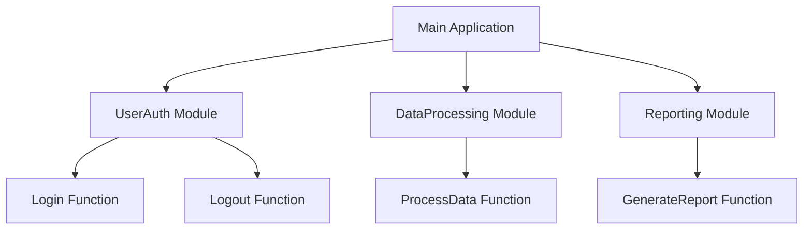

## 19.2 Code Organization and Modularization

In the realm of software development, particularly when working with Lua, effective code organization and modularization are pivotal for creating scalable, maintainable, and efficient applications. This section delves into the best practices for structuring Lua code, focusing on module patterns, encapsulation techniques, and namespace management. By mastering these concepts, developers can enhance the reusability and maintainability of their code, making it easier to manage and update over time.

### Effective Structuring of Code

#### Module Patterns: Organizing Code into Modules

Modules in Lua serve as a fundamental building block for organizing code. They allow developers to encapsulate functionality, promote code reuse, and maintain a clean namespace. Lua's module system is flexible, enabling developers to create both simple and complex modules tailored to their application's needs.

**Creating a Basic Module**

To create a module in Lua, we typically use a table to store functions and variables that belong to the module. Here's a simple example:

```lua
-- math_utils.lua
local MathUtils = {}

function MathUtils.add(a, b)
    return a + b
end

function MathUtils.subtract(a, b)
    return a - b
end

return MathUtils
```

In this example, `MathUtils` is a module that provides basic arithmetic operations. The functions `add` and `subtract` are encapsulated within the module, preventing them from polluting the global namespace.

**Using the Module**

To use the `MathUtils` module in another Lua script, we simply require it:

```lua
-- main.lua
local MathUtils = require("math_utils")

local sum = MathUtils.add(5, 3)
local difference = MathUtils.subtract(10, 4)

print("Sum:", sum) -- Output: Sum: 8
print("Difference:", difference) -- Output: Difference: 6
```

By requiring the module, we gain access to its functions, allowing us to perform operations without directly exposing the implementation details.

#### Techniques for Code Organization

##### Encapsulation: Hiding Implementation Details

Encapsulation is a key principle in software design that involves hiding the internal workings of a module or class, exposing only what is necessary for its use. This approach not only simplifies the interface but also protects the internal state from unintended interference.

**Implementing Encapsulation in Lua**

In Lua, encapsulation can be achieved by defining local variables and functions within a module. These local elements are not accessible from outside the module, ensuring that the internal logic remains hidden.

```lua
-- counter.lua
local Counter = {}
local count = 0 -- Local variable, not accessible outside

function Counter.increment()
    count = count + 1
end

function Counter.getCount()
    return count
end

return Counter
```

In this example, the `count` variable is local to the `Counter` module, meaning it cannot be accessed or modified directly from outside the module. The `increment` and `getCount` functions provide controlled access to the `count` variable.

##### Namespace Management: Avoiding Global Scope Pollution

Managing namespaces effectively is crucial for preventing conflicts and ensuring that code remains modular and maintainable. In Lua, this often involves minimizing the use of global variables and functions.

**Strategies for Namespace Management**

1. **Use Local Variables and Functions**: Define variables and functions as local whenever possible to limit their scope.

2. **Encapsulate in Modules**: Group related functions and variables into modules to keep the global namespace clean.

3. **Avoid Implicit Globals**: Always declare variables with `local` to prevent them from becoming global unintentionally.

```lua
-- Avoiding global variables
local function calculateArea(radius)
    local pi = 3.14159
    return pi * radius * radius
end
```

In this example, both `calculateArea` and `pi` are local, ensuring they do not interfere with other parts of the program.

### Benefits of Code Organization and Modularization

#### Reusability: Sharing Modules Across Projects

One of the primary benefits of modularization is the ability to reuse code across multiple projects. By encapsulating functionality within modules, developers can easily share and integrate these modules into different applications.

**Example: Reusing a Logging Module**

Consider a logging module that can be reused across various projects:

```lua
-- logger.lua
local Logger = {}

function Logger.log(message)
    print("[LOG]: " .. message)
end

return Logger
```

This `Logger` module can be included in any project that requires logging functionality, reducing the need to rewrite code and ensuring consistency across applications.

#### Maintainability: Easier to Manage and Update Code

Modular code is inherently easier to maintain. By isolating functionality within modules, developers can update or refactor specific parts of the codebase without affecting the entire application.

**Example: Updating a Module**

Suppose we need to update the `MathUtils` module to include a new function:

```lua
-- math_utils.lua
local MathUtils = {}

function MathUtils.add(a, b)
    return a + b
end

function MathUtils.subtract(a, b)
    return a - b
end

function MathUtils.multiply(a, b)
    return a * b
end

return MathUtils
```

By adding the `multiply` function, we enhance the module's functionality without impacting existing code that relies on `add` and `subtract`.

### Use Cases and Examples

#### Large-Scale Projects: Managing Complexity Through Organization

In large-scale projects, effective code organization and modularization are essential for managing complexity. By breaking down the application into smaller, manageable modules, developers can focus on individual components without being overwhelmed by the entire codebase.

**Example: Organizing a Web Application**

Consider a web application with multiple features such as user authentication, data processing, and reporting. Each feature can be encapsulated within its own module:

```lua
-- user_auth.lua
local UserAuth = {}

function UserAuth.login(username, password)
    -- Authentication logic
end

function UserAuth.logout()
    -- Logout logic
end

return UserAuth

-- data_processing.lua
local DataProcessing = {}

function DataProcessing.processData(data)
    -- Data processing logic
end

return DataProcessing

-- reporting.lua
local Reporting = {}

function Reporting.generateReport(data)
    -- Report generation logic
end

return Reporting
```

By organizing the application into modules like `UserAuth`, `DataProcessing`, and `Reporting`, we create a clear separation of concerns, making the codebase easier to navigate and maintain.

### Visualizing Code Organization

To better understand how modules interact within an application, let's visualize the structure using a Mermaid.js diagram:



**Diagram Description**: This diagram illustrates the relationship between the main application and its modules. Each module encapsulates specific functionality, promoting a modular and organized code structure.

### Try It Yourself

To solidify your understanding of code organization and modularization in Lua, try the following exercises:

1. **Create a New Module**: Develop a module for handling file operations, including functions for reading and writing files.

2. **Refactor Existing Code**: Take a piece of code you've written previously and refactor it into a module, focusing on encapsulation and namespace management.

3. **Experiment with Module Composition**: Combine multiple modules to create a more complex application, ensuring that each module interacts seamlessly with the others.

### References and Links

- [Lua 5.4 Reference Manual](https://www.lua.org/manual/5.4/)
- [Programming in Lua](https://www.lua.org/pil/contents.html)
- [MDN Web Docs: JavaScript Modules](https://developer.mozilla.org/en-US/docs/Web/JavaScript/Guide/Modules)

### Knowledge Check

To reinforce your learning, consider these questions:

- How does encapsulation improve code maintainability?
- What are the benefits of using modules in Lua?
- How can namespace management prevent conflicts in a large codebase?

### Embrace the Journey

Remember, mastering code organization and modularization is a journey. As you continue to develop your skills, you'll find new ways to structure your code effectively. Keep experimenting, stay curious, and enjoy the process of creating clean, maintainable Lua applications.

## Quiz Time!



### What is the primary purpose of using modules in Lua?

- [x] To encapsulate functionality and promote code reuse
- [ ] To increase the execution speed of Lua scripts
- [ ] To make Lua scripts compatible with other programming languages
- [ ] To reduce the size of Lua scripts

> **Explanation:** Modules in Lua are used to encapsulate functionality, making it reusable across different parts of an application or even across different projects.

### How can encapsulation be achieved in Lua?

- [x] By defining local variables and functions within a module
- [ ] By using global variables for all functions
- [ ] By writing all code in a single file
- [ ] By avoiding the use of functions

> **Explanation:** Encapsulation in Lua is achieved by defining variables and functions as local within a module, preventing external access and modification.

### What is a key benefit of namespace management in Lua?

- [x] It prevents global scope pollution and reduces conflicts
- [ ] It increases the speed of variable access
- [ ] It allows for the use of global variables everywhere
- [ ] It automatically optimizes code for performance

> **Explanation:** Effective namespace management prevents global scope pollution, reducing the risk of conflicts between different parts of the code.

### Which of the following is a technique for avoiding global scope pollution?

- [x] Using local variables and functions
- [ ] Using global variables for all data
- [ ] Writing all code in a single script
- [ ] Avoiding the use of modules

> **Explanation:** Using local variables and functions helps avoid global scope pollution by limiting their accessibility to within the module or function.

### How does modularization benefit large-scale projects?

- [x] It helps manage complexity by breaking down the application into smaller, manageable modules
- [ ] It makes the codebase larger and more complex
- [ ] It reduces the need for documentation
- [ ] It eliminates the need for testing

> **Explanation:** Modularization helps manage complexity in large-scale projects by breaking down the application into smaller, manageable modules, making it easier to maintain and update.

### What is the role of the `require` function in Lua?

- [x] It is used to include and use a module in a Lua script
- [ ] It is used to declare global variables
- [ ] It is used to optimize Lua code
- [ ] It is used to compile Lua scripts

> **Explanation:** The `require` function in Lua is used to include and use a module in a Lua script, allowing access to the module's functions and variables.

### Why is it important to avoid implicit globals in Lua?

- [x] To prevent unintended interference with other parts of the program
- [ ] To increase the execution speed of Lua scripts
- [ ] To make Lua scripts compatible with other programming languages
- [ ] To reduce the size of Lua scripts

> **Explanation:** Avoiding implicit globals prevents unintended interference with other parts of the program, ensuring that variables do not accidentally become global.

### What is a common practice for sharing modules across projects?

- [x] Encapsulating functionality within modules and using them in different projects
- [ ] Copying and pasting code between projects
- [ ] Writing all code in a single script
- [ ] Avoiding the use of functions

> **Explanation:** Encapsulating functionality within modules allows for easy sharing and reuse across different projects, promoting code reuse and consistency.

### How can you update a module without affecting existing code?

- [x] By adding new functions to the module while keeping existing functions unchanged
- [ ] By rewriting the entire module from scratch
- [ ] By removing all existing functions and adding new ones
- [ ] By avoiding the use of modules

> **Explanation:** Adding new functions to a module while keeping existing functions unchanged allows for updates without affecting existing code that relies on the module.

### True or False: Modularization can help reduce the complexity of a codebase.

- [x] True
- [ ] False

> **Explanation:** True. Modularization helps reduce the complexity of a codebase by breaking it down into smaller, manageable modules, making it easier to maintain and update.


