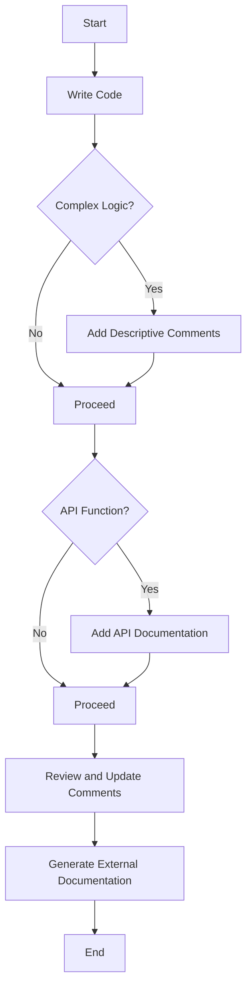

## 19.3 Documentation and Commenting Guidelines

In the world of software development, clear and effective documentation is as crucial as the code itself. For Lua developers, mastering documentation and commenting guidelines is essential to ensure that code is not only functional but also understandable and maintainable. In this section, we will delve into the importance of documentation, best practices for commenting, and provide practical examples to illustrate these concepts.

### Importance of Clear Documentation

Documentation serves as the bridge between developers and users, as well as between team members. It ensures that the purpose, functionality, and usage of code are transparent and accessible. Let's explore the two main types of documentation:

#### Internal Documentation

Internal documentation refers to comments within the code. These comments are vital for:

- **Clarifying Complex Logic**: Explaining intricate algorithms or logic that may not be immediately obvious.
- **Providing Context**: Offering background information on why certain decisions were made.
- **Facilitating Maintenance**: Assisting future developers (or your future self) in understanding and modifying the code.

#### External Documentation

External documentation includes user guides, API references, and other resources that provide a broader understanding of the software. This type of documentation is crucial for:

- **User Guidance**: Helping users understand how to use the software or API effectively.
- **Onboarding New Developers**: Providing a comprehensive overview of the system for new team members.
- **Ensuring Consistency**: Maintaining a consistent understanding of the system across different stakeholders.

### Best Practices for Documentation and Commenting

To create effective documentation and comments, follow these best practices:

#### Descriptive Comments

- **Explain the Why, Not Just the How**: Comments should provide insight into why a particular approach was taken, not just describe what the code does.
- **Keep It Concise**: Avoid overly verbose comments. Aim for clarity and brevity.
- **Update Comments with Code Changes**: Ensure comments are updated whenever the associated code is modified to prevent discrepancies.

#### Consistent Style

- **Adopt a Commenting Style Guide**: Use a consistent style guide for comments to ensure uniformity across the codebase.
- **Use Standardized Tags**: Implement tags like `TODO`, `FIXME`, and `NOTE` to categorize comments and make them easily searchable.
- **Leverage LuaDoc for API Documentation**: Utilize tools like LuaDoc to generate API documentation from comments, ensuring consistency and accessibility.

### Use Cases and Examples

Let's explore some practical use cases and examples to illustrate these guidelines.

#### API Development

When developing APIs, clear documentation is paramount. Consider the following example of a Lua function with comprehensive comments:

```lua
--- Calculates the factorial of a number.
-- This function uses a recursive approach to calculate the factorial.
-- @param n The number for which the factorial is to be calculated.
-- @return The factorial of the number.
-- @usage
-- local result = factorial(5) -- result will be 120
function factorial(n)
    -- Base case: factorial of 0 is 1
    if n == 0 then
        return 1
    end
    -- Recursive case: n * factorial of (n-1)
    return n * factorial(n - 1)
end
```

In this example, the comments provide a clear explanation of the function's purpose, parameters, return value, and usage. This level of detail is crucial for API documentation, as it ensures users understand how to interact with the function.

#### Complex Algorithms

For complex algorithms, comments should elucidate the logic and thought process behind the implementation. Consider the following example of a Lua function implementing the quicksort algorithm:

```lua
--- Sorts an array using the quicksort algorithm.
-- This function sorts the array in-place using the divide-and-conquer approach.
-- @param array The array to be sorted.
-- @param low The starting index of the array segment to be sorted.
-- @param high The ending index of the array segment to be sorted.
local function quicksort(array, low, high)
    -- Helper function to partition the array
    local function partition(arr, low, high)
        local pivot = arr[high] -- Choose the last element as the pivot
        local i = low - 1 -- Index of smaller element
        for j = low, high - 1 do
            -- If current element is smaller than or equal to pivot
            if arr[j] <= pivot then
                i = i + 1
                arr[i], arr[j] = arr[j], arr[i] -- Swap
            end
        end
        arr[i + 1], arr[high] = arr[high], arr[i + 1] -- Swap pivot
        return i + 1
    end

    if low < high then
        -- Partition the array and get the pivot index
        local pi = partition(array, low, high)
        -- Recursively sort elements before and after partition
        quicksort(array, low, pi - 1)
        quicksort(array, pi + 1, high)
    end
end
```

In this example, comments are used to explain the purpose of the function, the parameters, and the logic of the partitioning process. This level of detail is essential for understanding and maintaining complex algorithms.

### Visualizing Documentation Flow

To further enhance understanding, let's visualize the flow of documentation and commenting in a typical software development process using a flowchart.



**Description**: This flowchart illustrates the process of integrating documentation and commenting into the software development lifecycle. It emphasizes the importance of adding descriptive comments for complex logic and generating API documentation for functions.

### Try It Yourself

To reinforce your understanding, try modifying the quicksort example to include additional comments explaining the choice of the pivot element and the swapping mechanism. Experiment with different commenting styles and observe how they affect the readability and maintainability of the code.

### References and Links

For further reading on documentation and commenting best practices, consider exploring the following resources:

- [MDN Web Docs: Writing Documentation](https://developer.mozilla.org/en-US/docs/MDN/Writing_guidelines/Writing_documentation)
- [W3Schools: HTML Comment Tag](https://www.w3schools.com/tags/tag_comment.asp)
- [LuaDoc Documentation](http://keplerproject.github.io/luadoc/)

### Knowledge Check

To test your understanding of documentation and commenting guidelines, consider the following questions:

1. Why is internal documentation important for code maintenance?
2. What are some best practices for writing descriptive comments?
3. How can LuaDoc be used to enhance API documentation?
4. What is the role of external documentation in software development?
5. How can visualizing documentation flow improve the development process?

### Embrace the Journey

Remember, mastering documentation and commenting is an ongoing journey. As you continue to develop your skills, you'll find that clear and effective documentation not only enhances your code but also fosters collaboration and understanding among your peers. Keep experimenting, stay curious, and enjoy the journey!

## Quiz Time!



### Why is internal documentation important?

- [x] It clarifies complex logic and facilitates maintenance.
- [ ] It is only necessary for external users.
- [ ] It is optional and not very useful.
- [ ] It is only for beginner developers.

> **Explanation:** Internal documentation clarifies complex logic and facilitates maintenance, making it essential for all developers.

### What should descriptive comments explain?

- [x] The purpose and reasoning behind code.
- [ ] Only the syntax of the code.
- [ ] The history of the programming language.
- [ ] The hardware requirements.

> **Explanation:** Descriptive comments should explain the purpose and reasoning behind code to provide context and understanding.

### What is a best practice for updating comments?

- [x] Update comments whenever the code changes.
- [ ] Only update comments during major releases.
- [ ] Never update comments once written.
- [ ] Update comments annually.

> **Explanation:** Comments should be updated whenever the code changes to ensure accuracy and relevance.

### How can LuaDoc be used?

- [x] To generate API documentation from comments.
- [ ] To compile Lua code.
- [ ] To debug Lua scripts.
- [ ] To encrypt Lua files.

> **Explanation:** LuaDoc is used to generate API documentation from comments, enhancing consistency and accessibility.

### What is the role of external documentation?

- [x] To provide user guidance and ensure consistency.
- [ ] To replace internal documentation.
- [ ] To serve as a backup for code.
- [ ] To confuse users.

> **Explanation:** External documentation provides user guidance and ensures consistency across different stakeholders.

### What is a standardized tag used in comments?

- [x] TODO
- [ ] HTML
- [ ] CSS
- [ ] JSON

> **Explanation:** TODO is a standardized tag used in comments to categorize and make them easily searchable.

### What is the purpose of visualizing documentation flow?

- [x] To improve understanding of the development process.
- [ ] To create more complex code.
- [ ] To reduce the need for comments.
- [ ] To eliminate external documentation.

> **Explanation:** Visualizing documentation flow improves understanding of the development process and highlights the importance of documentation.

### What should be included in API documentation?

- [x] Function purpose, parameters, and usage.
- [ ] Only the function name.
- [ ] The developer's personal notes.
- [ ] The history of the API.

> **Explanation:** API documentation should include the function purpose, parameters, and usage to ensure clarity and usability.

### How can comments affect code readability?

- [x] They can enhance readability by providing context.
- [ ] They always make code harder to read.
- [ ] They are irrelevant to readability.
- [ ] They only affect readability in large projects.

> **Explanation:** Comments can enhance readability by providing context and explanations, making code easier to understand.

### True or False: Comments should only be added after the code is complete.

- [ ] True
- [x] False

> **Explanation:** Comments should be added throughout the development process to ensure clarity and understanding at every stage.


