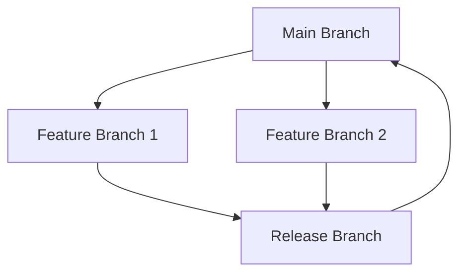
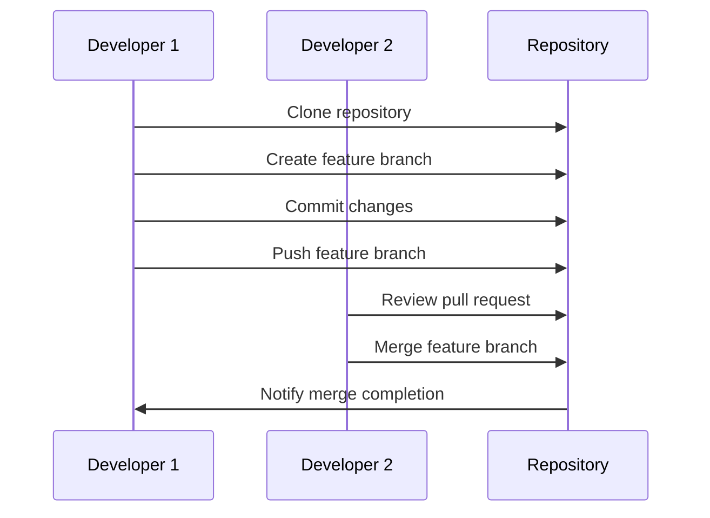

## 19.4 Version Control Strategies

In the realm of software development, effective version control is paramount for managing changes, collaborating with team members, and maintaining the integrity of your codebase. This section delves into version control strategies specifically tailored for Lua development, providing you with the tools and insights necessary to master this crucial aspect of software engineering.

### Managing Changes Effectively

Version control systems (VCS) are indispensable tools for developers, enabling them to track changes, collaborate with others, and maintain a history of their codebase. In this section, we will explore various strategies for managing changes effectively, focusing on branching models, best practices, and collaboration techniques.

#### Branching Models: Strategies for Collaboration

Branching is a fundamental concept in version control, allowing developers to work on different features or fixes simultaneously without interfering with the main codebase. Let's explore some popular branching models:

1. **Git Flow**: A well-defined branching model that uses feature branches, release branches, and hotfix branches. It is ideal for projects with a scheduled release cycle.

2. **GitHub Flow**: A simpler model that uses a single master branch and feature branches. It is suitable for projects with continuous deployment.

3. **Trunk-Based Development**: A model where all developers work on a single branch (trunk) and integrate changes frequently. It promotes rapid integration and is often used in agile environments.

4. **Feature Branching**: Each new feature is developed in its own branch, allowing for isolated development and easier integration.

5. **Release Branching**: Used to prepare a new release, allowing for stabilization and bug fixes before merging back into the main branch.



*Figure 1: Visualizing a typical branching model with feature and release branches.*

### Best Practices

Adhering to best practices in version control ensures that your codebase remains clean, organized, and easy to manage. Here are some key practices to follow:

#### Frequent Commits: Keeping Changes Small and Manageable

- **Commit Often**: Make small, frequent commits to keep changes manageable and reduce the risk of conflicts.
- **Atomic Commits**: Ensure each commit represents a single logical change, making it easier to understand and review.

#### Descriptive Messages: Clear Commit Messages

- **Write Clear Messages**: Use descriptive commit messages to explain the purpose of the change.
- **Follow a Convention**: Adopt a consistent format for commit messages, such as the "Imperative Mood" style.

```plaintext
feat: Add new feature for user authentication
fix: Resolve issue with data serialization
docs: Update README with installation instructions
```

*Example of commit message conventions.*

### Collaboration

Effective collaboration is crucial in team projects, and version control systems provide several features to facilitate this:

#### Code Reviews: Peer Reviewing Before Merging Code

- **Conduct Code Reviews**: Encourage peer reviews to catch errors, improve code quality, and share knowledge.
- **Use Pull Requests**: Implement pull requests to facilitate discussions and reviews before merging code.

#### Conflict Resolution: Handling Overlaps in Code Changes

- **Identify Conflicts Early**: Use tools to detect conflicts during merges and resolve them promptly.
- **Communicate with Team Members**: Collaborate with team members to understand and resolve conflicts effectively.

### Use Cases and Examples

Let's explore some practical use cases and examples of version control strategies in action:

#### Team Projects: Coordinating Efforts Among Developers

In a team project, version control strategies play a crucial role in coordinating efforts among developers. Here's how you can implement these strategies effectively:

1. **Define a Branching Strategy**: Choose a branching model that suits your team's workflow and project requirements.

2. **Establish Guidelines**: Set clear guidelines for commit messages, code reviews, and conflict resolution.

3. **Use Collaboration Tools**: Leverage tools like GitHub, GitLab, or Bitbucket to facilitate collaboration and communication.

4. **Regularly Integrate Changes**: Encourage frequent integration of changes to reduce the risk of conflicts and ensure a stable codebase.

```lua
-- Example Lua code demonstrating a simple feature implementation
-- This code snippet represents a feature branch for user authentication

local User = {}

function User:new(username, password)
    local obj = {username = username, password = password}
    setmetatable(obj, self)
    self.__index = self
    return obj
end

function User:authenticate(inputPassword)
    return self.password == inputPassword
end

-- Test the User authentication feature
local user = User:new("testUser", "securePassword")
print(user:authenticate("securePassword")) -- Output: true
```

*Example of a Lua feature implementation in a feature branch.*

### Try It Yourself

Encourage experimentation by suggesting modifications to the code examples. Try adding new features or refactoring the code to improve its structure.

### Visualizing Version Control Workflows

To better understand version control workflows, let's visualize a typical Git workflow using a sequence diagram:



*Figure 2: Visualizing a typical Git workflow with feature branches and pull requests.*

### References and Links

For further reading on version control strategies and best practices, consider exploring the following resources:

- [Git Documentation](https://git-scm.com/doc)
- [GitHub Guides](https://guides.github.com/)
- [Atlassian Git Tutorials](https://www.atlassian.com/git/tutorials)

### Knowledge Check

To reinforce your understanding of version control strategies, consider the following questions:

- What are the benefits of using a branching model in version control?
- How can frequent commits improve the manageability of your codebase?
- Why are descriptive commit messages important in version control?
- What role do code reviews play in collaborative development?

### Embrace the Journey

Remember, mastering version control is an ongoing journey. As you continue to develop your skills, you'll find new ways to optimize your workflow and collaborate more effectively with your team. Keep experimenting, stay curious, and enjoy the journey!

## Quiz Time!



### What is the primary purpose of using a branching model in version control?

- [x] To allow developers to work on different features simultaneously
- [ ] To increase the size of the repository
- [ ] To make the codebase more complex
- [ ] To reduce the number of commits

> **Explanation:** Branching models allow developers to work on different features or fixes simultaneously without interfering with the main codebase.

### How does frequent committing benefit a project?

- [x] It keeps changes small and manageable
- [ ] It makes the repository larger
- [ ] It complicates the codebase
- [ ] It reduces the number of branches

> **Explanation:** Frequent commits keep changes small and manageable, reducing the risk of conflicts and making it easier to track changes.

### Why are descriptive commit messages important?

- [x] They explain the purpose of the change
- [ ] They increase the size of the commit
- [ ] They make the codebase more complex
- [ ] They reduce the number of branches

> **Explanation:** Descriptive commit messages explain the purpose of the change, making it easier for others to understand and review the code.

### What is the role of code reviews in collaborative development?

- [x] To catch errors and improve code quality
- [ ] To increase the size of the repository
- [ ] To make the codebase more complex
- [ ] To reduce the number of commits

> **Explanation:** Code reviews help catch errors, improve code quality, and facilitate knowledge sharing among team members.

### What is a key benefit of using pull requests?

- [x] They facilitate discussions and reviews before merging code
- [ ] They increase the size of the repository
- [ ] They make the codebase more complex
- [ ] They reduce the number of branches

> **Explanation:** Pull requests facilitate discussions and reviews before merging code, ensuring that changes are thoroughly vetted.

### How can conflicts be identified early in a project?

- [x] By using tools to detect conflicts during merges
- [ ] By increasing the size of the repository
- [ ] By making the codebase more complex
- [ ] By reducing the number of branches

> **Explanation:** Tools can be used to detect conflicts during merges, allowing them to be resolved promptly.

### What is the benefit of using a consistent format for commit messages?

- [x] It makes the messages easier to understand and review
- [ ] It increases the size of the commit
- [ ] It makes the codebase more complex
- [ ] It reduces the number of branches

> **Explanation:** A consistent format for commit messages makes them easier to understand and review, improving communication among team members.

### What is the primary goal of trunk-based development?

- [x] To promote rapid integration and frequent changes
- [ ] To increase the size of the repository
- [ ] To make the codebase more complex
- [ ] To reduce the number of commits

> **Explanation:** Trunk-based development promotes rapid integration and frequent changes, allowing for continuous delivery and deployment.

### How can collaboration tools enhance team projects?

- [x] By facilitating communication and coordination
- [ ] By increasing the size of the repository
- [ ] By making the codebase more complex
- [ ] By reducing the number of branches

> **Explanation:** Collaboration tools facilitate communication and coordination among team members, enhancing the efficiency of team projects.

### True or False: Branching models are only useful for large teams.

- [ ] True
- [x] False

> **Explanation:** Branching models are useful for teams of all sizes, as they help manage changes and facilitate collaboration, regardless of team size.


