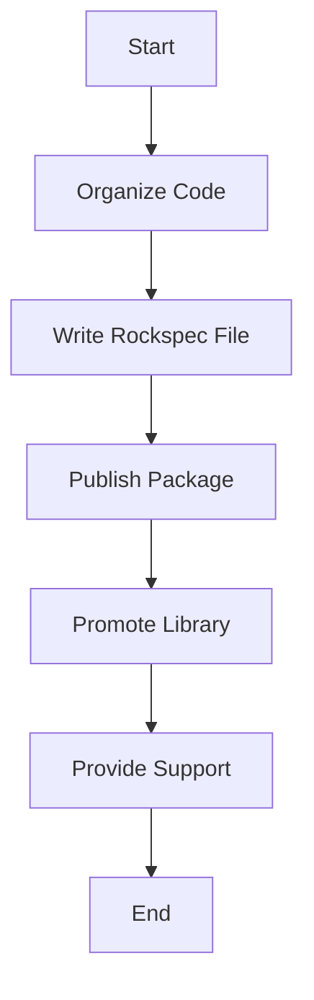

## 19.5 Lua Script Packaging and Distribution

In the world of software development, the ability to package and distribute your code effectively is crucial. This section will guide you through the best practices for packaging and distributing Lua scripts, ensuring that your code is accessible, maintainable, and easy to integrate into other projects. We will explore packaging formats, dependency management, versioning, and provide practical examples to illustrate these concepts.

### Sharing Your Code

Sharing your Lua code with others involves more than just sending files. It requires a structured approach to ensure that your code can be easily installed, updated, and used by others. Let's dive into the key aspects of sharing your Lua code.

#### Packaging Formats

Packaging your Lua scripts involves bundling your code and its dependencies into a format that can be easily distributed and installed. One of the most popular tools for this purpose is **LuaRocks**.

**LuaRocks** is a package manager for Lua modules, similar to npm for JavaScript or pip for Python. It allows you to create, distribute, and install Lua modules in a standardized way.

- **Creating a LuaRock**: To create a LuaRock, you need to write a rockspec file, which is a description of your package. This file includes metadata such as the package name, version, dependencies, and installation instructions.

```lua
-- Example of a rockspec file
package = "my-awesome-library"
version = "1.0-1"
source = {
  url = "https://example.com/my-awesome-library-1.0.tar.gz",
  md5 = "abc123"
}
dependencies = {
  "lua >= 5.1",
  "luasocket"
}
build = {
  type = "builtin",
  modules = {
    ["my_awesome_library"] = "src/my_awesome_library.lua"
  }
}
```

- **Publishing Your Package**: Once your rockspec file is ready, you can publish your package to the LuaRocks repository, making it available for others to install.

- **Installing Packages**: Users can install your package using the `luarocks install` command, which automatically resolves dependencies and installs them.

```bash
luarocks install my-awesome-library
```

#### Best Practices

To ensure that your Lua scripts are easy to use and maintain, follow these best practices when packaging and distributing your code.

##### Dependency Management

Managing dependencies is a critical aspect of software development. When packaging your Lua scripts, specify all required modules and their versions in your rockspec file. This ensures that users have all the necessary components to run your code.

- **Specify Exact Versions**: Whenever possible, specify exact versions of dependencies to avoid compatibility issues.

- **Use Semantic Versioning**: Follow semantic versioning (SemVer) principles to communicate changes in your package. SemVer uses a version number format of `MAJOR.MINOR.PATCH`, where:
  - **MAJOR**: Increases for incompatible API changes.
  - **MINOR**: Increases for backward-compatible functionality.
  - **PATCH**: Increases for backward-compatible bug fixes.

##### Versioning and Releases

Versioning your Lua scripts is essential for managing updates and changes. It allows users to track changes and ensures that they are using the correct version of your code.

- **Tag Releases**: Use version control systems like Git to tag releases. This provides a snapshot of your code at a specific point in time.

- **Changelog**: Maintain a changelog to document changes, improvements, and bug fixes in each release. This helps users understand what has changed and decide whether to upgrade.

- **Backward Compatibility**: Strive to maintain backward compatibility to minimize disruptions for users when upgrading to a new version.

### Use Cases and Examples

To illustrate the concepts discussed, let's explore some practical use cases and examples of Lua script packaging and distribution.

#### Library Distribution

Distributing a Lua library involves making your code accessible to others in a way that is easy to install and use. Here's a step-by-step guide to distributing a Lua library using LuaRocks.

1. **Organize Your Code**: Structure your code in a way that is easy to navigate. Use directories to separate different components of your library.

2. **Write a Rockspec File**: Create a rockspec file that describes your package, including its dependencies and installation instructions.

3. **Publish Your Package**: Use the `luarocks upload` command to publish your package to the LuaRocks repository.

4. **Promote Your Library**: Share your library with the community by writing blog posts, creating documentation, and engaging with users on forums and social media.

5. **Provide Support**: Be responsive to user feedback and provide support for your library. This helps build trust and encourages adoption.

### Try It Yourself

To get hands-on experience with Lua script packaging and distribution, try creating your own Lua library and publishing it using LuaRocks. Experiment with different packaging formats and explore how dependency management and versioning work in practice.

### Visualizing Lua Script Packaging

To better understand the process of Lua script packaging and distribution, let's visualize the workflow using a Mermaid.js flowchart.



**Figure 1**: Visualizing the workflow for packaging and distributing Lua scripts.

### References and Links

For further reading on Lua script packaging and distribution, consider exploring the following resources:

- [LuaRocks Documentation](https://luarocks.org/)
- [Semantic Versioning](https://semver.org/)
- [Git Tagging](https://git-scm.com/book/en/v2/Git-Basics-Tagging)

### Knowledge Check

To reinforce your understanding of Lua script packaging and distribution, consider the following questions and challenges:

- What are the benefits of using LuaRocks for packaging Lua scripts?
- How does semantic versioning help manage updates and changes in your code?
- Try creating a rockspec file for a simple Lua script and publish it using LuaRocks.

### Embrace the Journey

Remember, mastering Lua script packaging and distribution is an ongoing journey. As you gain experience, you'll discover new techniques and best practices that will enhance your skills. Keep experimenting, stay curious, and enjoy the process of sharing your code with the world!

## Quiz Time!



### What is the primary purpose of LuaRocks?

- [x] To manage Lua modules and their dependencies
- [ ] To compile Lua scripts into binaries
- [ ] To provide a graphical interface for Lua development
- [ ] To convert Lua scripts into other programming languages

> **Explanation:** LuaRocks is a package manager for Lua modules, allowing developers to manage dependencies and distribute their code.

### What is a rockspec file used for?

- [x] Describing a Lua package, including its dependencies and installation instructions
- [ ] Compiling Lua scripts into executable files
- [ ] Debugging Lua scripts
- [ ] Encrypting Lua scripts for security

> **Explanation:** A rockspec file contains metadata about a Lua package, such as its name, version, dependencies, and build instructions.

### Which versioning system is recommended for Lua packages?

- [x] Semantic Versioning (SemVer)
- [ ] Calendar Versioning
- [ ] Random Versioning
- [ ] Alphabetic Versioning

> **Explanation:** Semantic Versioning (SemVer) is recommended for Lua packages to communicate changes and maintain compatibility.

### What command is used to install a Lua package using LuaRocks?

- [x] luarocks install <package-name>
- [ ] lua install <package-name>
- [ ] rock install <package-name>
- [ ] lua package <package-name>

> **Explanation:** The `luarocks install <package-name>` command is used to install a Lua package and its dependencies.

### Why is it important to specify exact versions of dependencies?

- [x] To avoid compatibility issues
- [ ] To reduce the size of the package
- [ ] To improve the performance of the package
- [ ] To make the package more secure

> **Explanation:** Specifying exact versions helps avoid compatibility issues by ensuring that the correct versions of dependencies are used.

### What is the benefit of maintaining a changelog for your Lua package?

- [x] It documents changes, improvements, and bug fixes in each release
- [ ] It increases the package's performance
- [ ] It reduces the package's size
- [ ] It encrypts the package for security

> **Explanation:** A changelog helps users understand what has changed in each release and decide whether to upgrade.

### What is the purpose of tagging releases in version control systems?

- [x] To provide a snapshot of your code at a specific point in time
- [ ] To encrypt your code for security
- [ ] To compile your code into binaries
- [ ] To debug your code

> **Explanation:** Tagging releases provides a snapshot of your code, making it easier to manage versions and track changes.

### What is the recommended way to promote your Lua library?

- [x] Writing blog posts and engaging with the community
- [ ] Encrypting the library for security
- [ ] Reducing the library's size
- [ ] Compiling the library into binaries

> **Explanation:** Promoting your library through blog posts and community engagement helps increase its visibility and adoption.

### What is the role of LuaRocks in dependency management?

- [x] It automatically resolves and installs dependencies for Lua packages
- [ ] It compiles Lua scripts into executable files
- [ ] It encrypts Lua scripts for security
- [ ] It provides a graphical interface for Lua development

> **Explanation:** LuaRocks manages dependencies by automatically resolving and installing them for Lua packages.

### True or False: Backward compatibility is not important when releasing new versions of a Lua package.

- [ ] True
- [x] False

> **Explanation:** Backward compatibility is important to minimize disruptions for users when upgrading to a new version.


