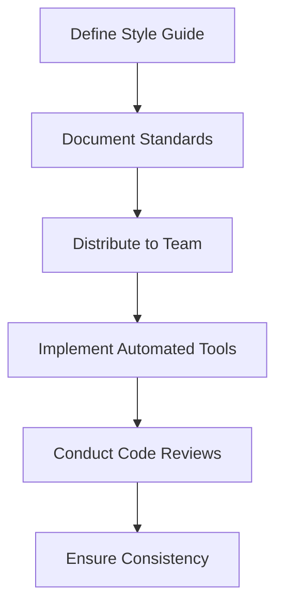

## 19.6 Coding Standards and Style Guides

In the world of software development, coding standards and style guides play a crucial role in ensuring that code is not only functional but also maintainable, readable, and consistent across different projects and teams. This section delves into the importance of coding standards and style guides in Lua development, providing insights into how to create, enforce, and benefit from them.

### Consistency in Code

Consistency is the cornerstone of effective coding practices. It ensures that code is predictable, which makes it easier to read, understand, and maintain. In Lua, as in any programming language, adhering to a consistent style can significantly enhance the quality of the codebase.

#### Defining Standards: Creating a Style Guide

A style guide is a set of conventions and rules that dictate how code should be written and organized. It serves as a reference for developers to ensure uniformity in their coding practices. Here are some key aspects to consider when creating a style guide for Lua:

- **Purpose and Scope**: Define the purpose of the style guide and the scope it covers. This could include naming conventions, code structure, documentation standards, and more.
- **Community Input**: Involve team members in the creation of the style guide to ensure it meets the needs of all stakeholders and gains their buy-in.
- **Documentation**: Clearly document the style guide and make it easily accessible to all team members. Consider using a version control system to manage updates and changes.

### Elements of Style

A well-defined style guide covers various elements of coding style, including indentation, formatting, and naming conventions. Let's explore these elements in detail:

#### Indentation and Formatting: Consistent Code Layout

Indentation and formatting are fundamental to making code readable and understandable. In Lua, it is common to use two spaces for indentation, although some teams may prefer four spaces or tabs. The key is to be consistent throughout the codebase.

```lua
-- Example of consistent indentation in Lua
function greet(name)
  if name then
    print("Hello, " .. name .. "!")
  else
    print("Hello, World!")
  end
end
```

- **Line Length**: Keep lines of code to a reasonable length, typically around 80 characters, to improve readability.
- **Whitespace**: Use whitespace judiciously to separate logical blocks of code and improve clarity.

#### Naming Conventions: Uniform Names for Variables and Functions

Naming conventions are critical for conveying the purpose and usage of variables, functions, and other identifiers. Here are some common practices in Lua:

- **Variables**: Use lowercase letters and underscores to separate words (e.g., `user_name`, `total_count`).
- **Functions**: Use camelCase for function names (e.g., `calculateTotal`, `fetchData`).
- **Constants**: Use uppercase letters with underscores (e.g., `MAX_VALUE`, `DEFAULT_TIMEOUT`).

```lua
-- Example of naming conventions in Lua
local user_name = "Alice"
local MAX_VALUE = 100

function calculateTotal(a, b)
  return a + b
end
```

### Enforcement

Creating a style guide is only the first step. Enforcing it is equally important to ensure that all team members adhere to the established standards.

#### Automated Tools: Using Linters and Formatters

Automated tools can help enforce coding standards by checking code for style violations and formatting issues. Popular tools for Lua include:

- **Luacheck**: A linter for Lua that checks for syntax errors and style issues.
- **LuaFormatter**: A tool that automatically formats Lua code according to specified style rules.

```bash
luacheck my_script.lua

lua-format -i my_script.lua
```

#### Code Reviews: Ensuring Adherence Through Peer Review

Code reviews are an essential part of the development process, providing an opportunity for team members to review each other's code and ensure adherence to the style guide. During code reviews, focus on:

- **Consistency**: Check for consistent application of the style guide across the codebase.
- **Readability**: Ensure that the code is easy to read and understand.
- **Functionality**: Verify that the code meets the functional requirements and is free of errors.

### Use Cases and Examples

Coding standards and style guides are particularly beneficial in team environments, where multiple developers work on the same codebase. They facilitate collaboration by ensuring that everyone follows the same conventions, making it easier to understand and modify each other's code.

#### Team Environments: Facilitating Collaboration

In team environments, coding standards help:

- **Reduce Conflicts**: Minimize merge conflicts by ensuring consistent code formatting.
- **Improve Onboarding**: Make it easier for new team members to understand the codebase and contribute effectively.
- **Enhance Code Quality**: Promote best practices and reduce the likelihood of errors.

### Try It Yourself

To get hands-on experience with coding standards and style guides in Lua, try the following exercises:

1. **Create a Style Guide**: Draft a style guide for a small Lua project, covering indentation, naming conventions, and documentation standards.
2. **Use Luacheck**: Run Luacheck on a Lua script and fix any style violations it reports.
3. **Conduct a Code Review**: Pair up with a colleague and review each other's code, focusing on adherence to the style guide.

### Visualizing Code Consistency

To better understand how coding standards and style guides contribute to code consistency, consider the following flowchart that illustrates the process of creating and enforcing a style guide:



**Figure 1**: The process of creating and enforcing a coding style guide in a development team.

### References and Links

For further reading on coding standards and style guides, consider the following resources:

- [Lua Style Guide](https://www.lua.org/manual/5.3/)
- [Luacheck Documentation](https://github.com/mpeterv/luacheck)
- [LuaFormatter Documentation](https://github.com/Koihik/LuaFormatter)

### Knowledge Check

To reinforce your understanding of coding standards and style guides, consider the following questions:

- What are the benefits of using a style guide in a team environment?
- How can automated tools help enforce coding standards?
- Why is consistency important in coding practices?

### Embrace the Journey

Remember, adopting coding standards and style guides is just the beginning. As you continue to develop your skills, you'll find that these practices not only improve your code but also enhance your ability to collaborate with others. Keep experimenting, stay curious, and enjoy the journey!

## Quiz Time!



### What is the primary purpose of a coding style guide?

- [x] To ensure consistency and readability in code
- [ ] To increase the complexity of code
- [ ] To make code harder to understand
- [ ] To enforce strict programming paradigms

> **Explanation:** A coding style guide ensures consistency and readability, making code easier to understand and maintain.

### Which tool can be used to automatically format Lua code?

- [x] LuaFormatter
- [ ] LuaLint
- [ ] LuaCheck
- [ ] LuaBeautify

> **Explanation:** LuaFormatter is a tool used to automatically format Lua code according to specified style rules.

### What is a common naming convention for constants in Lua?

- [x] Uppercase letters with underscores (e.g., MAX_VALUE)
- [ ] Lowercase letters with underscores (e.g., max_value)
- [ ] CamelCase (e.g., MaxValue)
- [ ] PascalCase (e.g., MaxValue)

> **Explanation:** Constants in Lua are typically named using uppercase letters with underscores.

### How can code reviews help enforce coding standards?

- [x] By allowing team members to review each other's code for adherence to the style guide
- [ ] By automatically fixing style violations
- [ ] By increasing the complexity of code
- [ ] By making code harder to understand

> **Explanation:** Code reviews allow team members to ensure that code adheres to the style guide, promoting consistency and quality.

### What is the recommended line length for Lua code to improve readability?

- [x] Around 80 characters
- [ ] Around 50 characters
- [ ] Around 100 characters
- [ ] Around 120 characters

> **Explanation:** Keeping lines of code to around 80 characters improves readability.

### What is a benefit of using automated tools like Luacheck?

- [x] They help identify syntax errors and style issues
- [ ] They increase the complexity of code
- [ ] They make code harder to understand
- [ ] They enforce strict programming paradigms

> **Explanation:** Automated tools like Luacheck help identify syntax errors and style issues, ensuring adherence to coding standards.

### Why is whitespace important in code formatting?

- [x] It separates logical blocks of code and improves clarity
- [ ] It increases the complexity of code
- [ ] It makes code harder to understand
- [ ] It enforces strict programming paradigms

> **Explanation:** Whitespace is used to separate logical blocks of code, improving clarity and readability.

### What is a common indentation style in Lua?

- [x] Two spaces
- [ ] Four spaces
- [ ] Tabs
- [ ] No indentation

> **Explanation:** Two spaces are commonly used for indentation in Lua, although consistency is more important than the specific style.

### How can a style guide facilitate collaboration in a team environment?

- [x] By ensuring all team members follow the same coding conventions
- [ ] By increasing the complexity of code
- [ ] By making code harder to understand
- [ ] By enforcing strict programming paradigms

> **Explanation:** A style guide ensures that all team members follow the same coding conventions, facilitating collaboration and understanding.

### True or False: A style guide should be static and never updated.

- [ ] True
- [x] False

> **Explanation:** A style guide should be a living document that evolves with the team's needs and industry best practices.


