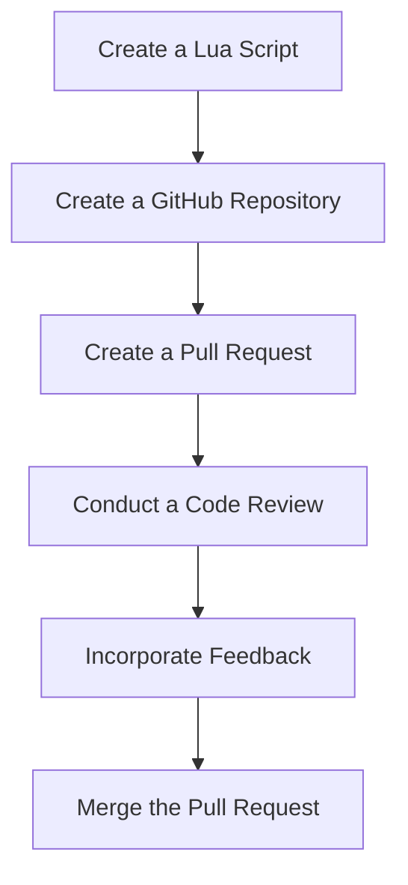

## 19.7 Collaboration and Code Review Practices

In the world of software development, collaboration and code review are crucial practices that ensure the delivery of high-quality, maintainable, and efficient code. For Lua developers, these practices are no different. In this section, we will delve into the importance of collaboration and code review, explore various techniques, and discuss tools and platforms that facilitate these processes. We will also provide examples and use cases to illustrate how these practices can be effectively implemented in Lua development projects.

### Enhancing Code Quality

Enhancing code quality is a primary goal of collaboration and code review. By working together and reviewing each other's code, developers can catch issues early, share knowledge, and improve the overall quality of the codebase.

#### Peer Review Benefits

Peer review is a process where developers review each other's code to identify potential issues, suggest improvements, and ensure adherence to coding standards. Here are some key benefits of peer review:

- **Catching Issues Early**: Peer review helps identify bugs, security vulnerabilities, and performance bottlenecks before the code is merged into the main codebase. This early detection reduces the cost and effort required to fix issues later in the development cycle.
- **Improving Code Quality**: By having multiple eyes on the code, peer review ensures that the code is clean, efficient, and adheres to best practices. It also helps maintain consistency across the codebase.
- **Knowledge Sharing**: Peer review is an excellent opportunity for team members to learn from each other. It fosters a culture of continuous learning and improvement, as developers share their insights and expertise.
- **Encouraging Collaboration**: The peer review process encourages open communication and collaboration among team members. It helps build trust and respect within the team, leading to a more cohesive and productive development environment.

### Code Review Techniques

Effective code review requires a structured approach. Here are some techniques that can enhance the code review process:

#### Positive Feedback Loop

Creating a positive feedback loop is essential for encouraging open communication and collaboration during code reviews. Here are some tips for establishing a positive feedback loop:

- **Provide Constructive Feedback**: Focus on providing constructive feedback that highlights both the strengths and areas for improvement in the code. Avoid negative or harsh criticism, as it can discourage developers and hinder collaboration.
- **Encourage Open Communication**: Foster an environment where developers feel comfortable asking questions, seeking clarification, and discussing different approaches. Encourage open dialogue and active participation from all team members.
- **Recognize Good Work**: Acknowledge and appreciate well-written code and innovative solutions. Recognizing good work boosts morale and motivates developers to continue producing high-quality code.

#### Focused Reviews

Focused reviews involve concentrating on specific aspects of the code during the review process. This approach ensures that reviews are thorough and efficient. Here are some areas to focus on during code reviews:

- **Functionality**: Verify that the code meets the functional requirements and behaves as expected. Test edge cases and ensure that the code handles errors gracefully.
- **Code Style and Consistency**: Ensure that the code adheres to the project's coding standards and style guidelines. Consistent code style improves readability and maintainability.
- **Performance**: Evaluate the code for performance bottlenecks and suggest optimizations where necessary. Consider the impact of the code on memory usage and execution speed.
- **Security**: Identify potential security vulnerabilities and ensure that the code follows security best practices. Pay attention to input validation, data sanitization, and access control.

### Tools and Platforms

Several tools and platforms facilitate collaboration and code review in software development. Here are some popular options for Lua developers:

#### Pull Requests

Pull requests are a common mechanism for managing code changes in version control systems like Git. They provide a structured way to review and discuss code changes before merging them into the main codebase. Here are some benefits of using pull requests:

- **Centralized Discussion**: Pull requests provide a centralized platform for discussing code changes. Developers can leave comments, suggest improvements, and ask questions directly within the pull request.
- **Version Control Integration**: Pull requests are integrated with version control systems, allowing developers to track changes, view diffs, and manage branches efficiently.
- **Approval Workflow**: Pull requests support an approval workflow, where designated reviewers can approve or request changes to the code. This workflow ensures that code changes are thoroughly reviewed before being merged.

#### Review Tools

Several review tools and platforms are available to facilitate code reviews. Here are some popular options:

- **GitHub**: GitHub is a widely used platform for hosting and reviewing code. It provides features like pull requests, code reviews, and issue tracking, making it a popular choice for open-source and private projects.
- **GitLab**: GitLab is another popular platform that offers comprehensive code review features. It provides tools for managing code changes, conducting reviews, and automating workflows.
- **Bitbucket**: Bitbucket is a version control platform that supports Git and Mercurial repositories. It offers features like pull requests, inline comments, and code review tools.

### Use Cases and Examples

Let's explore some use cases and examples of how collaboration and code review practices can be effectively implemented in Lua development projects.

#### Knowledge Sharing

Knowledge sharing is a crucial aspect of collaboration and code review. By sharing knowledge, developers can learn from each other and improve their skills. Here are some ways to facilitate knowledge sharing:

- **Pair Programming**: Pair programming involves two developers working together on the same code. This practice encourages real-time collaboration and knowledge sharing, as developers can discuss ideas, solve problems, and learn from each other.
- **Code Review Sessions**: Conduct regular code review sessions where team members can present their code, discuss challenges, and receive feedback. These sessions provide an opportunity for developers to learn from each other's experiences and gain new insights.
- **Documentation and Commenting**: Encourage developers to write clear and concise documentation and comments in their code. Well-documented code is easier to understand and maintain, facilitating knowledge sharing among team members.

### Try It Yourself

To put these concepts into practice, let's create a simple Lua script and conduct a code review. We'll use GitHub to manage the code changes and facilitate the review process.

1. **Create a Lua Script**: Write a simple Lua script that performs a basic task, such as calculating the factorial of a number.

```lua
-- Function to calculate the factorial of a number
function factorial(n)
    if n == 0 then
        return 1
    else
        return n * factorial(n - 1)
    end
end

-- Test the factorial function
print("Factorial of 5 is: " .. factorial(5))
```

2. **Create a GitHub Repository**: Create a new GitHub repository and add the Lua script to the repository.

3. **Create a Pull Request**: Make a change to the Lua script, such as adding error handling or optimizing the code. Create a pull request to propose the change.

4. **Conduct a Code Review**: Invite team members to review the pull request. Encourage them to provide feedback, suggest improvements, and discuss the code.

5. **Incorporate Feedback**: Based on the feedback received, make the necessary changes to the code. Update the pull request and seek approval from the reviewers.

6. **Merge the Pull Request**: Once the code has been reviewed and approved, merge the pull request into the main codebase.

### Visualizing the Code Review Process

To better understand the code review process, let's visualize it using a flowchart. The flowchart below illustrates the steps involved in conducting a code review using pull requests.



### References and Links

For further reading on collaboration and code review practices, consider exploring the following resources:

- [GitHub Documentation](https://docs.github.com/en)
- [GitLab Documentation](https://docs.gitlab.com/)
- [Bitbucket Documentation](https://support.atlassian.com/bitbucket/docs/)

### Knowledge Check

To reinforce your understanding of collaboration and code review practices, consider the following questions:

- What are the benefits of peer review in software development?
- How can a positive feedback loop enhance the code review process?
- What are some areas to focus on during code reviews?
- How do pull requests facilitate code reviews in version control systems?
- What are some popular platforms for conducting code reviews?

### Embrace the Journey

Remember, collaboration and code review are ongoing processes that require continuous improvement and adaptation. As you implement these practices in your Lua development projects, keep experimenting, stay curious, and enjoy the journey of learning and growth.

## Quiz Time!



### What is one of the primary benefits of peer review in software development?

- [x] Catching issues early
- [ ] Increasing code complexity
- [ ] Reducing collaboration
- [ ] Delaying project timelines

> **Explanation:** Peer review helps identify bugs and issues early in the development process, reducing the cost and effort required to fix them later.

### Which technique encourages open communication during code reviews?

- [x] Positive Feedback Loop
- [ ] Negative Criticism
- [ ] Ignoring Feedback
- [ ] Delayed Responses

> **Explanation:** A positive feedback loop encourages open communication by providing constructive feedback and recognizing good work.

### What is the purpose of focused reviews in code review?

- [x] Addressing specific aspects of the code
- [ ] Reviewing all code at once
- [ ] Ignoring code style
- [ ] Avoiding performance checks

> **Explanation:** Focused reviews concentrate on specific aspects of the code, such as functionality, style, performance, and security.

### Which platform is commonly used for hosting and reviewing code?

- [x] GitHub
- [ ] Microsoft Word
- [ ] Excel
- [ ] PowerPoint

> **Explanation:** GitHub is a widely used platform for hosting and reviewing code, offering features like pull requests and issue tracking.

### What is a benefit of using pull requests in version control systems?

- [x] Centralized Discussion
- [ ] Decentralized Code Management
- [ ] Ignoring Code Changes
- [ ] Avoiding Approvals

> **Explanation:** Pull requests provide a centralized platform for discussing code changes, allowing developers to leave comments and suggest improvements.

### How can knowledge sharing be facilitated during code reviews?

- [x] Pair Programming
- [ ] Working in Isolation
- [ ] Avoiding Documentation
- [ ] Ignoring Feedback

> **Explanation:** Pair programming encourages real-time collaboration and knowledge sharing, allowing developers to learn from each other.

### What is the role of documentation in knowledge sharing?

- [x] Making code easier to understand
- [ ] Increasing code complexity
- [ ] Hiding code functionality
- [ ] Avoiding code reviews

> **Explanation:** Well-documented code is easier to understand and maintain, facilitating knowledge sharing among team members.

### What is a key aspect of creating a positive feedback loop?

- [x] Providing constructive feedback
- [ ] Ignoring code quality
- [ ] Delaying responses
- [ ] Avoiding communication

> **Explanation:** Providing constructive feedback is essential for creating a positive feedback loop, encouraging open communication and collaboration.

### What is the first step in the code review process using pull requests?

- [x] Create a Lua Script
- [ ] Merge the Pull Request
- [ ] Conduct a Code Review
- [ ] Incorporate Feedback

> **Explanation:** The first step is to create a Lua script, which will be the basis for the pull request and subsequent code review.

### True or False: Code reviews are only beneficial for identifying bugs.

- [ ] True
- [x] False

> **Explanation:** Code reviews are beneficial for identifying bugs, improving code quality, sharing knowledge, and encouraging collaboration.


