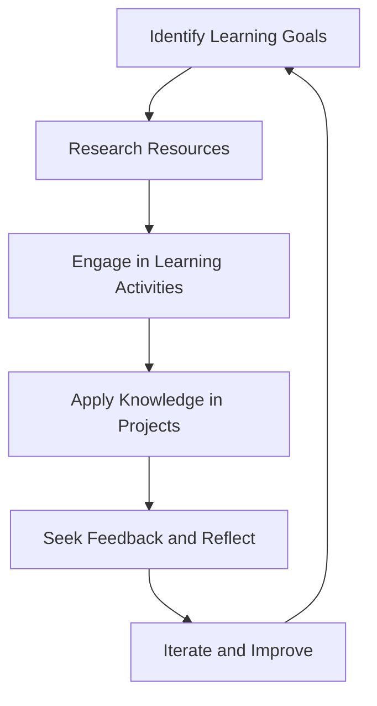

## 19.8 Continuous Learning and Skill Development

In the ever-evolving field of software development, continuous learning and skill development are crucial for staying relevant and effective. As a software engineer or architect working with Lua, mastering design patterns is just the beginning. To truly excel, you must commit to ongoing education and practice. This section will guide you through strategies and resources to enhance your skills in Lua design patterns and beyond.

### Staying Up-to-Date

Staying current with the latest trends, tools, and techniques in Lua and software development is essential. Here are some effective ways to keep your knowledge fresh:

#### Learning Resources

1. **Books**: Books are a timeless resource for in-depth learning. Consider titles like "Programming in Lua" by Roberto Ierusalimschy and "Lua Design Patterns" by Fabio Mascarenhas. These books provide foundational knowledge and advanced insights into Lua programming and design patterns.

2. **Online Courses**: Platforms like Coursera, Udemy, and Pluralsight offer courses on Lua programming and design patterns. These courses often include video lectures, quizzes, and hands-on projects to reinforce learning.

3. **Online Tutorials**: Websites like [Lua Users Wiki](http://lua-users.org/wiki/) and [Lua.org](https://www.lua.org/) offer tutorials and documentation that can help you understand Lua's intricacies and design patterns.

4. **Podcasts and Webinars**: Listening to podcasts and attending webinars can provide insights into industry trends and expert opinions. Look for content that focuses on Lua, software architecture, and design patterns.

5. **Research Papers and Articles**: Reading research papers and articles can expose you to cutting-edge developments and theoretical underpinnings of design patterns in Lua.

### Strategies for Skill Development

Developing your skills requires more than just consuming information. Here are some strategies to actively enhance your abilities:

#### Practice Projects

1. **Applying New Concepts**: Create small projects to apply new design patterns and Lua features. For example, build a simple game or a web application using Lua to practice implementing various patterns.

2. **Code Reviews**: Participate in code reviews, both as a reviewer and a reviewee. This process helps you learn from others' code and receive feedback on your own work.

3. **Open Source Contributions**: Contribute to open source projects written in Lua. This not only improves your coding skills but also exposes you to real-world codebases and collaboration.

4. **Hackathons and Coding Challenges**: Engage in hackathons and online coding challenges to test your skills under pressure and learn new techniques from peers.

#### Community Involvement

1. **User Groups and Forums**: Join Lua user groups and forums such as [Stack Overflow](https://stackoverflow.com/questions/tagged/lua) and [Reddit's Lua Community](https://www.reddit.com/r/lua/). Engaging in discussions can provide new perspectives and solutions to problems.

2. **Meetups and Conferences**: Attend meetups and conferences focused on Lua and software development. Networking with other professionals can lead to collaborations and mentorship opportunities.

3. **Social Media and Blogs**: Follow Lua experts and software architects on social media platforms like Twitter and LinkedIn. Reading their blogs can keep you informed about industry trends and best practices.

### Use Cases and Examples

Understanding the practical applications of continuous learning can motivate you to pursue it actively. Here are some use cases:

#### Career Growth

1. **Advancing Skills for Professional Development**: Continuous learning can lead to career advancement opportunities. By mastering Lua design patterns, you can take on more complex projects, lead teams, and contribute to architectural decisions.

2. **Transitioning to New Roles**: If you're looking to transition into a new role, such as a software architect or a technical lead, continuous learning is essential. It equips you with the knowledge and skills needed to excel in these positions.

3. **Staying Competitive in the Job Market**: The tech industry is highly competitive. By continuously updating your skills, you remain a valuable asset to your current employer and an attractive candidate for future opportunities.

### Code Examples and Exercises

To solidify your understanding of Lua design patterns, let's explore some code examples and exercises:

#### Singleton Pattern in Lua

The Singleton pattern ensures a class has only one instance and provides a global point of access to it. Here's how you can implement it in Lua:

```lua
-- Singleton Pattern Example

local Singleton = {}
Singleton.__index = Singleton

-- Private instance variable
local instance = nil

-- Private constructor
local function new()
    local self = setmetatable({}, Singleton)
    -- Initialize your singleton instance here
    self.value = 0
    return self
end

-- Public method to get the instance
function Singleton:getInstance()
    if not instance then
        instance = new()
    end
    return instance
end

-- Usage
local singleton1 = Singleton:getInstance()
singleton1.value = 42

local singleton2 = Singleton:getInstance()
print(singleton2.value) -- Output: 42
```

**Try It Yourself**: Modify the Singleton pattern to include a method that resets the instance. Experiment with adding additional methods to the Singleton class.

### Visualizing Continuous Learning

To better understand the process of continuous learning and skill development, let's visualize it using a flowchart:



**Description**: This flowchart represents the cyclical nature of continuous learning. It starts with identifying learning goals, researching resources, engaging in learning activities, applying knowledge, seeking feedback, and iterating for improvement.

### References and Links

- [Lua.org](https://www.lua.org/): Official Lua website with documentation and resources.
- [Lua Users Wiki](http://lua-users.org/wiki/): Community-driven resource for Lua programmers.
- [Coursera](https://www.coursera.org/): Online learning platform offering courses on Lua and software development.
- [Udemy](https://www.udemy.com/): Platform with a variety of courses on programming and design patterns.

### Knowledge Check

To reinforce your learning, consider these questions and challenges:

1. What are the benefits of continuous learning in software development?
2. How can you apply the Singleton pattern in a real-world Lua project?
3. Describe a strategy for staying up-to-date with Lua design patterns.
4. What are some effective ways to engage with the Lua community?
5. How can contributing to open source projects enhance your skills?

### Embrace the Journey

Remember, continuous learning is a journey, not a destination. As you progress, you'll encounter new challenges and opportunities for growth. Stay curious, keep experimenting, and enjoy the process of becoming a more skilled and knowledgeable software engineer.

## Quiz Time!



### What is one benefit of continuous learning in software development?

- [x] Staying relevant in a rapidly changing industry
- [ ] Reducing the need for collaboration
- [ ] Avoiding the use of design patterns
- [ ] Limiting exposure to new technologies

> **Explanation:** Continuous learning helps developers stay relevant and adapt to changes in technology and industry trends.

### Which resource is NOT typically used for learning Lua?

- [ ] Books
- [ ] Online Courses
- [ ] Podcasts
- [x] Cooking Shows

> **Explanation:** While books, online courses, and podcasts are common learning resources, cooking shows are not relevant to learning Lua.

### How can practice projects help in skill development?

- [x] By applying new concepts in a practical context
- [ ] By avoiding real-world applications
- [ ] By focusing solely on theory
- [ ] By limiting creativity

> **Explanation:** Practice projects allow developers to apply new concepts in a practical context, reinforcing learning and enhancing skills.

### What is a key advantage of community involvement?

- [x] Gaining new perspectives and solutions
- [ ] Working in isolation
- [ ] Avoiding feedback
- [ ] Limiting collaboration

> **Explanation:** Community involvement provides opportunities to gain new perspectives, solutions, and feedback from peers.

### What is a common use case for continuous learning?

- [x] Advancing skills for career growth
- [ ] Reducing job opportunities
- [ ] Limiting professional development
- [ ] Avoiding new technologies

> **Explanation:** Continuous learning helps individuals advance their skills, leading to career growth and new opportunities.

### What is the primary goal of the Singleton pattern?

- [x] To ensure a class has only one instance
- [ ] To create multiple instances of a class
- [ ] To avoid using classes altogether
- [ ] To limit access to a class

> **Explanation:** The Singleton pattern ensures that a class has only one instance and provides a global point of access to it.

### How can open source contributions benefit developers?

- [x] By exposing them to real-world codebases
- [ ] By limiting collaboration
- [ ] By avoiding feedback
- [ ] By reducing skill development

> **Explanation:** Open source contributions expose developers to real-world codebases and collaboration, enhancing their skills and experience.

### What is a key component of the continuous learning process?

- [x] Seeking feedback and reflecting
- [ ] Avoiding feedback
- [ ] Limiting reflection
- [ ] Working in isolation

> **Explanation:** Seeking feedback and reflecting on one's work are crucial components of the continuous learning process.

### What is the purpose of a flowchart in learning?

- [x] To visualize processes and concepts
- [ ] To limit understanding
- [ ] To avoid visual representation
- [ ] To reduce clarity

> **Explanation:** Flowcharts help visualize processes and concepts, aiding in understanding and clarity.

### Continuous learning is a journey, not a destination.

- [x] True
- [ ] False

> **Explanation:** Continuous learning is an ongoing process that involves adapting to new challenges and opportunities for growth.



By following these strategies and utilizing the resources mentioned, you can continuously improve your skills in Lua design patterns and software development. Embrace the journey of learning, and you'll find yourself becoming a more proficient and adaptable developer.
