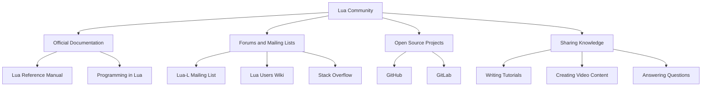

## 19.9 Leveraging the Lua Community and Resources

In the world of software development, community and resources play a pivotal role in shaping the skills and knowledge of developers. Lua, a lightweight and versatile scripting language, boasts a vibrant community and a wealth of resources that can significantly enhance your development journey. In this section, we will explore the benefits of engaging with the Lua community, the resources available to you, and how you can contribute back to this thriving ecosystem.

### Community Benefits

#### Support and Collaboration

Engaging with the Lua community offers numerous benefits, including support and collaboration. Whether you're a beginner or an experienced developer, the community provides a platform to seek help, share ideas, and collaborate on projects. Here are some key aspects of community support:

- **Getting Help and Feedback**: The Lua community is known for its welcoming and supportive nature. When you encounter challenges or need feedback on your code, you can turn to forums, mailing lists, and chat groups for assistance. Experienced developers are often willing to share their insights and help troubleshoot issues.

- **Collaborative Projects**: Collaboration is a cornerstone of the Lua community. By participating in open-source projects or contributing to community-driven initiatives, you can work alongside other developers, learn from their expertise, and collectively create innovative solutions.

- **Networking Opportunities**: Engaging with the community allows you to connect with like-minded individuals, expand your professional network, and discover potential collaborators for future projects.

### Resources

The Lua community offers a wealth of resources that cater to developers of all skill levels. These resources can help you deepen your understanding of Lua, stay updated with the latest developments, and find solutions to coding challenges.

#### Official Documentation

The official Lua documentation is a comprehensive resource that provides detailed information about the language's syntax, features, and libraries. It serves as an essential reference for developers seeking to understand Lua's core concepts and functionalities.

- **Lua Reference Manual**: The reference manual is the authoritative source for Lua's syntax and semantics. It covers everything from basic language constructs to advanced features like metatables and coroutines.

- **Programming in Lua**: This book, written by Lua's chief architect Roberto Ierusalimschy, offers an in-depth exploration of Lua programming. It covers both introductory and advanced topics, making it a valuable resource for developers at any stage of their Lua journey.

#### Forums and Mailing Lists

Forums and mailing lists are excellent platforms for discussing Lua-related topics, sharing knowledge, and seeking advice from the community. Some popular forums and mailing lists include:

- **Lua-L Mailing List**: The Lua-L mailing list is a long-standing platform where developers discuss Lua-related topics, share announcements, and seek advice. It's a great place to engage with the community and stay informed about the latest developments.

- **Lua Users Wiki**: The Lua Users Wiki is a collaborative platform where developers share tutorials, code snippets, and best practices. It's a valuable resource for finding solutions to common problems and learning from the experiences of other developers.

- **Stack Overflow**: While not exclusive to Lua, Stack Overflow is a popular platform where developers can ask questions and receive answers from the community. It's a great place to find solutions to specific coding challenges and learn from the experiences of others.

### Contributing Back

Contributing back to the Lua community is a rewarding way to give back and help others benefit from your knowledge and experience. Here are some ways you can contribute:

#### Open Source Projects

Participating in open-source projects is a great way to contribute to the Lua community. By contributing code, documentation, or bug reports, you can help improve existing projects and create new tools and libraries for the community to use.

- **Finding Projects**: To find open-source projects to contribute to, explore platforms like GitHub and GitLab. Look for projects that align with your interests and skill level, and reach out to the maintainers to express your interest in contributing.

- **Making Contributions**: When contributing to open-source projects, follow the project's contribution guidelines and adhere to best practices for code quality and documentation. Engage with the project's community, seek feedback, and collaborate with other contributors to make meaningful contributions.

#### Sharing Knowledge

Sharing your knowledge and experiences with the Lua community is another valuable way to contribute. By writing tutorials, creating video content, or answering questions on forums, you can help others learn and grow as developers.

- **Writing Tutorials**: Consider writing tutorials that cover specific Lua topics or demonstrate how to solve common problems. Share your tutorials on platforms like Medium, Dev.to, or your personal blog to reach a wider audience.

- **Creating Video Content**: Video content is an engaging way to share knowledge and demonstrate coding techniques. Consider creating video tutorials or live coding sessions to showcase your expertise and help others learn.

- **Answering Questions**: Participate in forums and Q&A platforms like Stack Overflow to answer questions and provide guidance to other developers. Your insights and experiences can help others overcome challenges and improve their skills.

### Use Cases and Examples

The Lua community is rich with use cases and examples that demonstrate the language's versatility and power. By exploring these examples, you can gain inspiration for your projects and find solutions to coding challenges.

#### Problem Solving

The Lua community is a valuable resource for finding solutions to coding challenges. By exploring community-driven projects, code repositories, and tutorials, you can discover innovative solutions and learn new techniques.

- **Exploring Code Repositories**: Platforms like GitHub and GitLab host a wide range of Lua projects and code repositories. By exploring these repositories, you can find examples of how other developers have solved similar problems and gain insights into best practices.

- **Learning from Tutorials**: Community-driven tutorials and guides offer practical examples and step-by-step instructions for solving common problems. By following these tutorials, you can learn new techniques and apply them to your projects.

- **Participating in Hackathons**: Hackathons and coding competitions are great opportunities to challenge yourself, collaborate with others, and find creative solutions to complex problems. Look for Lua-focused hackathons or participate in general coding competitions to test your skills and learn from others.

### Visualizing the Lua Community Ecosystem

To better understand the Lua community ecosystem, let's visualize the various components and interactions within the community using a Mermaid.js diagram.

**Diagram Description**: This diagram illustrates the various components of the Lua community ecosystem, including official documentation, forums and mailing lists, open-source projects, and knowledge-sharing activities. Each component plays a vital role in supporting and enriching the Lua community.

### References and Links

To further explore the Lua community and resources, consider visiting the following links:

- [Lua Official Website](https://www.lua.org/)
- [Lua Reference Manual](https://www.lua.org/manual/)
- [Programming in Lua](https://www.lua.org/pil/)
- [Lua-L Mailing List](https://www.lua.org/lua-l.html)
- [Lua Users Wiki](http://lua-users.org/wiki/)
- [Stack Overflow Lua Questions](https://stackoverflow.com/questions/tagged/lua)
- [GitHub Lua Repositories](https://github.com/topics/lua)
- [GitLab Lua Projects](https://gitlab.com/explore/projects/topics/lua)

### Knowledge Check

To reinforce your understanding of leveraging the Lua community and resources, consider the following questions and challenges:

- **Question**: What are some benefits of engaging with the Lua community?
- **Challenge**: Explore an open-source Lua project on GitHub and contribute a small bug fix or feature enhancement.
- **Question**: How can you share your knowledge with the Lua community?
- **Challenge**: Write a tutorial on a Lua topic you're passionate about and share it on a platform like Medium or Dev.to.

### Embrace the Journey

Remember, engaging with the Lua community and leveraging available resources is just the beginning of your journey as a Lua developer. As you progress, you'll build more complex projects, collaborate with other developers, and contribute to the growth of the community. Keep experimenting, stay curious, and enjoy the journey!

## Quiz Time!



### What is one of the primary benefits of engaging with the Lua community?

- [x] Support and collaboration
- [ ] Access to proprietary software
- [ ] Guaranteed job placement
- [ ] Free hardware

> **Explanation:** Engaging with the Lua community provides support and collaboration opportunities, allowing developers to seek help, share ideas, and work on projects together.

### Which resource is considered the authoritative source for Lua's syntax and semantics?

- [x] Lua Reference Manual
- [ ] Stack Overflow
- [ ] GitHub
- [ ] Lua Users Wiki

> **Explanation:** The Lua Reference Manual is the authoritative source for Lua's syntax and semantics, providing detailed information about the language.

### What is a common platform for discussing Lua-related topics and seeking advice?

- [x] Lua-L Mailing List
- [ ] Facebook
- [ ] Instagram
- [ ] TikTok

> **Explanation:** The Lua-L Mailing List is a long-standing platform where developers discuss Lua-related topics and seek advice from the community.

### How can you contribute to open-source Lua projects?

- [x] By contributing code, documentation, or bug reports
- [ ] By purchasing the project
- [ ] By criticizing the project without offering solutions
- [ ] By ignoring the project's guidelines

> **Explanation:** Contributing code, documentation, or bug reports is a valuable way to contribute to open-source Lua projects and help improve them.

### What is one way to share your knowledge with the Lua community?

- [x] Writing tutorials
- [ ] Keeping your knowledge to yourself
- [ ] Deleting online resources
- [ ] Discouraging others from learning

> **Explanation:** Writing tutorials is a great way to share your knowledge with the Lua community and help others learn and grow as developers.

### Where can you find a wide range of Lua projects and code repositories?

- [x] GitHub
- [ ] Twitter
- [ ] LinkedIn
- [ ] Pinterest

> **Explanation:** GitHub hosts a wide range of Lua projects and code repositories, making it a valuable resource for finding examples and solutions.

### What is a valuable resource for finding solutions to common Lua problems?

- [x] Lua Users Wiki
- [ ] A random blog
- [ ] A closed-source book
- [ ] A private chat group

> **Explanation:** The Lua Users Wiki is a collaborative platform where developers share tutorials, code snippets, and best practices, making it a valuable resource for finding solutions.

### What is one way to engage with the Lua community and expand your professional network?

- [x] Participating in forums and mailing lists
- [ ] Avoiding all online interactions
- [ ] Only communicating with non-developers
- [ ] Ignoring community events

> **Explanation:** Participating in forums and mailing lists allows you to engage with the Lua community, expand your professional network, and discover potential collaborators.

### What is a common platform for asking questions and receiving answers from the Lua community?

- [x] Stack Overflow
- [ ] MySpace
- [ ] Snapchat
- [ ] Vine

> **Explanation:** Stack Overflow is a popular platform where developers can ask questions and receive answers from the community, including Lua-related inquiries.

### True or False: Engaging with the Lua community is only beneficial for beginner developers.

- [ ] True
- [x] False

> **Explanation:** Engaging with the Lua community is beneficial for developers of all skill levels, providing support, collaboration, and learning opportunities for beginners and experienced developers alike.


