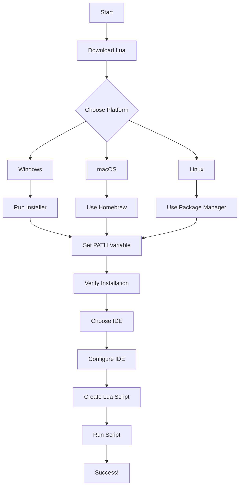

## 2.1 Installing Lua and Setting Up the Development Environment

Welcome to the first step in your journey to mastering Lua design patterns! Before diving into the intricacies of Lua programming, it's essential to have a well-configured development environment. This section will guide you through downloading and installing Lua, setting up your environment on various platforms, and choosing the right tools to enhance your coding experience.

### Downloading Lua

Lua is a lightweight, high-level programming language designed for embedded use in applications. To start using Lua, you need to download the Lua interpreter. Here’s how you can do it:

1. **Visit the Official Lua Website**: Navigate to [Lua's official website](https://www.lua.org/download.html) to find the latest stable release of Lua.

2. **Choose the Appropriate Version**: Lua is available in source code form. You can download the source code and compile it yourself, or you can download precompiled binaries for your operating system.

3. **Download the Source Code**: If you prefer to compile Lua from source, download the source code tarball. This approach gives you more control over the installation process and allows you to customize Lua for your specific needs.

4. **Precompiled Binaries**: For a quicker setup, download precompiled binaries. These are available for Windows, macOS, and Linux, and they simplify the installation process.

### Installation on Different Platforms

Lua can be installed on various operating systems, each with its own set of instructions. Let's explore how to set up Lua on Windows, macOS, and Linux.

#### Installing Lua on Windows

1. **Download the Lua for Windows Installer**: Visit the [Lua for Windows project page](https://github.com/rjpcomputing/luaforwindows) and download the installer. This package includes Lua binaries, libraries, and a selection of useful tools.

2. **Run the Installer**: Execute the downloaded installer and follow the on-screen instructions. The installer will guide you through the installation process, allowing you to choose the installation directory and components.

3. **Set Up Environment Variables**: After installation, you need to add Lua to your system's PATH variable. This allows you to run Lua from any command prompt window.

   - Open the Start menu and search for "Environment Variables."
   - Click on "Edit the system environment variables."
   - In the System Properties window, click on "Environment Variables."
   - Under "System variables," find the "Path" variable and click "Edit."
   - Click "New" and add the path to the Lua executable (e.g., `C:\Program Files (x86)\Lua\5.1`).

4. **Verify the Installation**: Open a command prompt and type `lua -v`. If Lua is installed correctly, you should see the version number displayed.

#### Installing Lua on macOS

1. **Using Homebrew**: Homebrew is a popular package manager for macOS that simplifies the installation of software.

   - Open Terminal and install Homebrew if you haven't already: 
     ```bash
     /bin/bash -c "$(curl -fsSL https://raw.githubusercontent.com/Homebrew/install/HEAD/install.sh)"
     ```

   - Install Lua using Homebrew:
     ```bash
     brew install lua
     ```

2. **Verify the Installation**: After installation, verify that Lua is installed by typing `lua -v` in Terminal. You should see the Lua version number.

3. **Alternative Method - Manual Installation**: If you prefer not to use Homebrew, you can download the Lua source code and compile it manually.

   - Download the source code from [Lua's official website](https://www.lua.org/download.html).
   - Extract the tarball and navigate to the extracted directory in Terminal.
   - Compile and install Lua:
     ```bash
     make macosx
     sudo make install
     ```

#### Installing Lua on Linux

1. **Using Package Managers**: Most Linux distributions include Lua in their package repositories. You can install Lua using your distribution's package manager.

   - **Debian/Ubuntu**:
     ```bash
     sudo apt update
     sudo apt install lua5.3
     ```

   - **Fedora**:
     ```bash
     sudo dnf install lua
     ```

   - **Arch Linux**:
     ```bash
     sudo pacman -S lua
     ```

2. **Manual Installation**: For more control, you can compile Lua from source.

   - Download the Lua source code from [Lua's official website](https://www.lua.org/download.html).
   - Extract the tarball and navigate to the extracted directory.
   - Compile and install Lua:
     ```bash
     make linux
     sudo make install
     ```

3. **Verify the Installation**: Open a terminal and type `lua -v` to confirm that Lua is installed.

### Integrated Development Environments (IDEs)

Choosing the right Integrated Development Environment (IDE) or text editor can significantly enhance your Lua programming experience. Here are some popular options:

1. **ZeroBrane Studio**: A lightweight IDE specifically designed for Lua development. It offers debugging, code completion, and syntax highlighting.

2. **Visual Studio Code**: A versatile code editor with Lua support through extensions. It provides features like IntelliSense, debugging, and Git integration.

3. **Sublime Text**: A powerful text editor with Lua plugins available for syntax highlighting and code snippets.

4. **Atom**: A hackable text editor with Lua packages for enhanced functionality.

5. **Eclipse with Koneki**: Eclipse IDE with the Koneki Lua Development Tools plugin offers a comprehensive Lua development environment.

### Configuring the Environment

Once Lua is installed, it's crucial to configure your development environment to ensure a smooth coding experience.

#### Setting Up PATH Variables

Setting up PATH variables allows you to run Lua from any command line interface without specifying the full path to the Lua executable.

- **Windows**: As described earlier, add the Lua installation directory to the PATH environment variable.

- **macOS/Linux**: The installation process typically adds Lua to the PATH. You can verify this by typing `echo $PATH` in Terminal and checking for the Lua directory.

#### Testing the Installation

To ensure everything is set up correctly, create a simple Lua script and run it.

1. **Create a Lua Script**: Open your preferred text editor and create a file named `hello.lua` with the following content:

   ```lua
   -- hello.lua
   print("Hello, Lua!")
   ```

2. **Run the Script**: Open a terminal or command prompt, navigate to the directory containing `hello.lua`, and execute:

   ```bash
   lua hello.lua
   ```

   You should see the output `Hello, Lua!`, confirming that Lua is installed and working correctly.

### Try It Yourself

Now that you have Lua installed, try modifying the `hello.lua` script to explore Lua's capabilities. For example, add variables, loops, or functions to see how Lua handles them. Experimentation is a great way to learn!

### Visualizing the Setup Process

Below is a flowchart that visualizes the steps involved in setting up Lua on your system:



### References and Links

- [Lua Official Website](https://www.lua.org/)
- [Lua for Windows](https://github.com/rjpcomputing/luaforwindows)
- [Homebrew](https://brew.sh/)
- [Visual Studio Code](https://code.visualstudio.com/)
- [ZeroBrane Studio](https://studio.zerobrane.com/)

### Knowledge Check

- What are the steps to install Lua on Windows?
- How do you verify that Lua is installed correctly?
- What are some popular IDEs for Lua development?

### Embrace the Journey

Remember, setting up your development environment is just the beginning. As you progress, you'll explore more complex Lua features and design patterns. Keep experimenting, stay curious, and enjoy the journey!

## Quiz Time!



### What is the first step in installing Lua?

- [x] Visit the official Lua website
- [ ] Download an IDE
- [ ] Set up PATH variables
- [ ] Write a Lua script

> **Explanation:** The first step is to visit the official Lua website to download the interpreter.

### Which package manager is recommended for installing Lua on macOS?

- [x] Homebrew
- [ ] APT
- [ ] DNF
- [ ] Pacman

> **Explanation:** Homebrew is a popular package manager for macOS that simplifies software installation.

### How can you verify that Lua is installed correctly on your system?

- [x] By typing `lua -v` in the command line
- [ ] By checking the PATH variable
- [ ] By running a Lua script
- [ ] By opening an IDE

> **Explanation:** Typing `lua -v` in the command line will display the installed Lua version, confirming the installation.

### What is the purpose of setting up PATH variables?

- [x] To run Lua from any command line interface
- [ ] To install Lua
- [ ] To download Lua
- [ ] To compile Lua

> **Explanation:** Setting up PATH variables allows you to run Lua from any command line interface without specifying the full path.

### Which IDE is specifically designed for Lua development?

- [x] ZeroBrane Studio
- [ ] Visual Studio Code
- [ ] Atom
- [ ] Eclipse

> **Explanation:** ZeroBrane Studio is a lightweight IDE specifically designed for Lua development.

### What command is used to install Lua on Ubuntu?

- [x] `sudo apt install lua5.3`
- [ ] `brew install lua`
- [ ] `sudo dnf install lua`
- [ ] `sudo pacman -S lua`

> **Explanation:** The command `sudo apt install lua5.3` is used to install Lua on Ubuntu.

### What should you do after installing Lua on Windows?

- [x] Set up the PATH variable
- [ ] Download the source code
- [ ] Compile Lua
- [ ] Use Homebrew

> **Explanation:** After installing Lua on Windows, you need to set up the PATH variable to run Lua from any command prompt.

### Which text editor can be enhanced with Lua plugins?

- [x] Sublime Text
- [ ] ZeroBrane Studio
- [ ] Visual Studio Code
- [ ] Eclipse

> **Explanation:** Sublime Text is a powerful text editor with Lua plugins available for syntax highlighting and code snippets.

### What is the output of the following Lua script?
```lua
print("Hello, Lua!")
```

- [x] Hello, Lua!
- [ ] Hello, World!
- [ ] Lua!
- [ ] Hello!

> **Explanation:** The script prints "Hello, Lua!" to the console.

### True or False: You can compile Lua from source on macOS.

- [x] True
- [ ] False

> **Explanation:** You can compile Lua from source on macOS for more control over the installation process.


