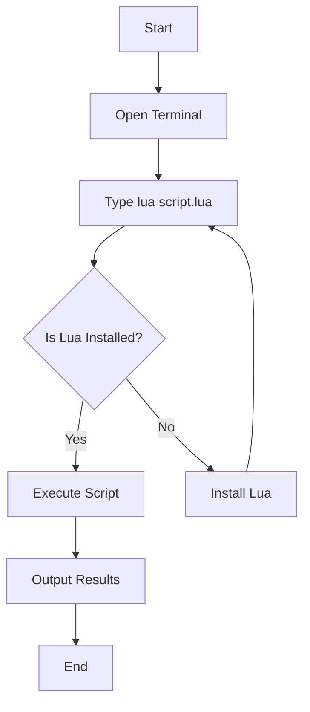

## 2.2 Running and Debugging Lua Scripts

Running and debugging Lua scripts efficiently is a crucial skill for any developer working with this versatile language. In this section, we will explore various methods to execute Lua scripts, including command-line execution, using shebang lines for Unix-like systems, and leveraging the interactive mode. Additionally, we will delve into debugging techniques to help you identify and resolve issues in your Lua code.

### Command-Line Execution

Running Lua scripts from the command line is a straightforward process that allows you to execute your code directly from the terminal or command prompt. This method is particularly useful for automation, scripting, and testing purposes.

#### Running Lua Scripts

To run a Lua script from the command line, you need to have Lua installed on your system. Once installed, you can execute a Lua script using the following command:

```bash
lua script.lua
```

Here, `script.lua` is the name of your Lua script file. Ensure that the Lua interpreter is in your system's PATH to execute the command successfully.

#### Shebang Lines for Scripts

On Unix-like systems, you can make Lua scripts executable by adding a shebang line at the top of your script. This line specifies the interpreter that should be used to run the script. Here's how you can do it:

```lua
#!/usr/bin/env lua
-- Your Lua code goes here
print("Hello, Lua!")
```

After adding the shebang line, you need to change the file's permissions to make it executable:

```bash
chmod +x script.lua
```

Now, you can run the script directly from the terminal:

```bash
./script.lua
```

#### Interactive Mode

Lua provides an interactive mode, also known as the Read-Eval-Print Loop (REPL), which allows you to execute Lua commands and see the results immediately. This mode is excellent for testing small code snippets and experimenting with Lua features.

To start the Lua REPL, simply type `lua` in your terminal:

```bash
lua
```

You will see a prompt where you can enter Lua commands:

```lua
> print("Hello, Lua!")
Hello, Lua!
```

To exit the REPL, press `Ctrl + D` or type `os.exit()`.

### Debugging Techniques

Debugging is an essential part of the development process, helping you identify and fix errors in your code. Lua offers several tools and techniques for debugging.

#### Print Debugging

One of the simplest debugging techniques is to use `print` statements to output variable values and program flow information. This method is quick and effective for small scripts.

```lua
local function add(a, b)
    print("Adding:", a, b) -- Debugging output
    return a + b
end

print(add(5, 3))
```

#### Using the `debug` Library

Lua includes a `debug` library that provides more advanced debugging capabilities. This library allows you to inspect variables, stack traces, and more.

Here's an example of using the `debug` library to print a stack trace:

```lua
local function faultyFunction()
    error("An error occurred!")
end

local function wrapperFunction()
    faultyFunction()
end

local status, err = pcall(wrapperFunction)
if not status then
    print("Error:", err)
    print("Stack trace:")
    debug.traceback()
end
```

#### Integrated Development Environments (IDEs)

Several IDEs support Lua development and offer built-in debugging tools. Some popular options include:

- **ZeroBrane Studio**: A lightweight Lua IDE with debugging support.
- **Visual Studio Code**: With the Lua extension, it provides syntax highlighting and debugging capabilities.
- **Eclipse with Koneki**: Offers Lua development tools and debugging features.

These IDEs allow you to set breakpoints, step through code, and inspect variables, making debugging more efficient.

### Visualizing Lua Execution

To better understand how Lua scripts are executed, let's visualize the process using a flowchart. This diagram illustrates the typical flow of running a Lua script from the command line:



This flowchart shows the steps involved in executing a Lua script, from opening the terminal to outputting the results.

### Try It Yourself

Experiment with the following code snippet by modifying the values and observing the output:

```lua
local function multiply(a, b)
    print("Multiplying:", a, b)
    return a * b
end

print(multiply(4, 7))
```

Try changing the numbers and adding more `print` statements to see how the program flow changes.

### Knowledge Check

Before we conclude, let's reinforce what we've learned with a few questions:

- How do you make a Lua script executable on Unix-like systems?
- What is the purpose of the Lua REPL?
- Name one IDE that supports Lua debugging.

### Embrace the Journey

Remember, mastering running and debugging Lua scripts is just the beginning. As you progress, you'll gain more confidence in writing and troubleshooting Lua code. Keep experimenting, stay curious, and enjoy the journey!

## Quiz Time!



### How do you execute a Lua script from the command line?

- [x] lua script.lua
- [ ] run script.lua
- [ ] execute script.lua
- [ ] start script.lua

> **Explanation:** The correct command to execute a Lua script from the command line is `lua script.lua`.

### What is the purpose of a shebang line in a Lua script?

- [x] To specify the interpreter for executing the script
- [ ] To comment the script
- [ ] To define variables
- [ ] To import libraries

> **Explanation:** A shebang line specifies the interpreter that should be used to execute the script.

### Which command is used to make a Lua script executable on Unix-like systems?

- [x] chmod +x script.lua
- [ ] execute script.lua
- [ ] run script.lua
- [ ] start script.lua

> **Explanation:** The `chmod +x script.lua` command is used to change the file's permissions to make it executable.

### How do you start the Lua REPL?

- [x] Type lua in the terminal
- [ ] Type run in the terminal
- [ ] Type start in the terminal
- [ ] Type execute in the terminal

> **Explanation:** Typing `lua` in the terminal starts the Lua REPL.

### What is a simple debugging technique in Lua?

- [x] Using print statements
- [ ] Using shebang lines
- [ ] Using chmod command
- [ ] Using execute command

> **Explanation:** Using `print` statements is a simple and effective debugging technique in Lua.

### Which library provides advanced debugging capabilities in Lua?

- [x] debug
- [ ] io
- [ ] os
- [ ] math

> **Explanation:** The `debug` library provides advanced debugging capabilities in Lua.

### Name an IDE that supports Lua development and debugging.

- [x] ZeroBrane Studio
- [ ] Notepad
- [ ] MS Paint
- [ ] Excel

> **Explanation:** ZeroBrane Studio is a lightweight Lua IDE with debugging support.

### What does the Lua REPL stand for?

- [x] Read-Eval-Print Loop
- [ ] Run-Execute-Print Loop
- [ ] Read-Execute-Print Loop
- [ ] Run-Eval-Print Loop

> **Explanation:** REPL stands for Read-Eval-Print Loop, which allows for interactive execution of Lua commands.

### How can you exit the Lua REPL?

- [x] Press Ctrl + D or type os.exit()
- [ ] Press Ctrl + C or type exit()
- [ ] Press Ctrl + Z or type quit()
- [ ] Press Ctrl + X or type stop()

> **Explanation:** You can exit the Lua REPL by pressing `Ctrl + D` or typing `os.exit()`.

### True or False: The `debug` library is used for file I/O operations.

- [ ] True
- [x] False

> **Explanation:** False. The `debug` library is used for debugging, not for file I/O operations.




