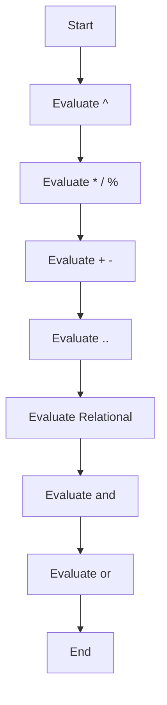

## 2.3 Basic Syntax and Language Constructs

Welcome to the world of Lua programming! In this section, we will explore the foundational elements of Lua's syntax and language constructs. Whether you're an experienced developer or new to Lua, understanding these basics is crucial for mastering the language and applying design patterns effectively.

### Hello World Program

Let's start with the classic "Hello World" program, a rite of passage for every programmer. This simple script will introduce you to Lua's syntax and how to execute a Lua script.

```lua
-- This is a single-line comment in Lua
print("Hello, World!")
```

**Explanation:**

- **Comments**: The `--` denotes a single-line comment. Comments are ignored by the Lua interpreter and are used to annotate code.
- **`print` Function**: The `print` function outputs text to the console. Here, it displays "Hello, World!".

#### Try It Yourself

Modify the script to print your name instead of "Hello, World!". This will help you get comfortable with editing and running Lua scripts.

### Syntax Overview

Lua's syntax is designed to be simple and easy to read. Let's break down some key language constructs:

#### Statements and Blocks

Lua scripts are composed of statements, which are executed sequentially. A block is a group of statements enclosed by `do` and `end`.

```lua
do
    local x = 10
    print(x)
end
```

**Explanation:**

- **Local Variables**: The `local` keyword declares a variable with local scope, meaning it's accessible only within the block.
- **Blocks**: The `do ... end` construct defines a block of code.

#### Comments

Comments are essential for documenting code. Lua supports single-line and multi-line comments.

```lua
-- This is a single-line comment

--[[
This is a
multi-line comment
]]
```

**Explanation:**

- **Single-Line Comments**: Start with `--`.
- **Multi-Line Comments**: Enclosed within `--[[` and `]]`.

### Operators and Expressions

Operators are symbols that perform operations on variables and values. Lua supports various operators, including arithmetic, relational, logical, and more.

#### Arithmetic Operators

Arithmetic operators perform mathematical operations.

| Operator | Description       | Example    |
|----------|-------------------|------------|
| `+`      | Addition          | `a + b`    |
| `-`      | Subtraction       | `a - b`    |
| `*`      | Multiplication    | `a * b`    |
| `/`      | Division          | `a / b`    |
| `%`      | Modulus           | `a % b`    |
| `^`      | Exponentiation    | `a ^ b`    |

```lua
local a = 10
local b = 5
print(a + b)  -- Output: 15
print(a - b)  -- Output: 5
print(a * b)  -- Output: 50
print(a / b)  -- Output: 2
print(a % b)  -- Output: 0
print(a ^ b)  -- Output: 100000
```

#### Relational Operators

Relational operators compare two values and return a boolean result.

| Operator | Description       | Example    |
|----------|-------------------|------------|
| `==`     | Equal to          | `a == b`   |
| `~=`     | Not equal to      | `a ~= b`   |
| `<`      | Less than         | `a < b`    |
| `>`      | Greater than      | `a > b`    |
| `<=`     | Less than or equal| `a <= b`   |
| `>=`     | Greater than or equal | `a >= b` |

```lua
local a = 10
local b = 5
print(a == b)  -- Output: false
print(a ~= b)  -- Output: true
print(a < b)   -- Output: false
print(a > b)   -- Output: true
print(a <= b)  -- Output: false
print(a >= b)  -- Output: true
```

#### Logical Operators

Logical operators are used to combine boolean expressions.

| Operator | Description | Example       |
|----------|-------------|---------------|
| `and`    | Logical AND | `a and b`     |
| `or`     | Logical OR  | `a or b`      |
| `not`    | Logical NOT | `not a`       |

```lua
local a = true
local b = false
print(a and b)  -- Output: false
print(a or b)   -- Output: true
print(not a)    -- Output: false
```

### Precedence and Associativity

Understanding operator precedence and associativity is crucial for evaluating expressions correctly. Precedence determines the order in which operators are evaluated, while associativity determines the order of evaluation for operators with the same precedence.

#### Operator Precedence

Operators with higher precedence are evaluated first. Here's a table of Lua's operator precedence from highest to lowest:

1. `^` (Exponentiation)
2. `not` (Logical NOT)
3. `*`, `/`, `%` (Multiplication, Division, Modulus)
4. `+`, `-` (Addition, Subtraction)
5. `..` (Concatenation)
6. `<`, `>`, `<=`, `>=`, `~=`, `==` (Relational)
7. `and` (Logical AND)
8. `or` (Logical OR)

#### Associativity

Associativity determines the direction of evaluation for operators with the same precedence:

- **Left-Associative**: Evaluated from left to right (e.g., `+`, `-`, `*`, `/`).
- **Right-Associative**: Evaluated from right to left (e.g., `^`, `..`).

```lua
local result = 2 + 3 * 4 ^ 2
print(result)  -- Output: 50
```

**Explanation:**

- **Exponentiation**: `4 ^ 2` is evaluated first, resulting in `16`.
- **Multiplication**: `3 * 16` is evaluated next, resulting in `48`.
- **Addition**: `2 + 48` is evaluated last, resulting in `50`.

### Visualizing Operator Precedence and Associativity

To better understand how Lua evaluates expressions, let's visualize the process using a flowchart.



**Caption**: This flowchart illustrates the order of operator precedence in Lua, guiding the evaluation of complex expressions.

### Knowledge Check

Let's pause for a moment to reflect on what we've learned. Consider the following questions:

- What is the output of the following Lua script?

```lua
local x = 5
local y = 10
local z = x * y + 2 ^ 3
print(z)
```

- How would you modify the script to change the order of operations?

### Embrace the Journey

Remember, mastering Lua's syntax and language constructs is just the beginning. As you progress, you'll build more complex and interactive applications. Keep experimenting, stay curious, and enjoy the journey!

### References and Links

For further reading on Lua's syntax and operators, consider exploring the following resources:

- [Lua 5.4 Reference Manual](https://www.lua.org/manual/5.4/)
- [Programming in Lua](https://www.lua.org/pil/)

## Quiz Time!



### What is the output of the following Lua script?
```lua
local a = 3
local b = 4
local c = a + b * 2
print(c)
```

- [ ] 10
- [x] 11
- [ ] 14
- [ ] 8

> **Explanation:** The multiplication `b * 2` is evaluated first, resulting in `8`, then added to `a`, resulting in `11`.

### Which operator has the highest precedence in Lua?

- [ ] `+`
- [ ] `*`
- [x] `^`
- [ ] `and`

> **Explanation:** The exponentiation operator `^` has the highest precedence in Lua.

### What is the purpose of the `local` keyword in Lua?

- [x] To declare a variable with local scope
- [ ] To declare a global variable
- [ ] To declare a constant
- [ ] To declare a function

> **Explanation:** The `local` keyword is used to declare a variable with local scope, meaning it's accessible only within the block.

### Which of the following is a logical operator in Lua?

- [ ] `+`
- [ ] `*`
- [x] `and`
- [ ] `==`

> **Explanation:** `and` is a logical operator used to combine boolean expressions.

### How do you denote a single-line comment in Lua?

- [x] `--`
- [ ] `//`
- [ ] `#`
- [ ] `/*`

> **Explanation:** Single-line comments in Lua are denoted by `--`.

### What is the result of the expression `5 + 3 * 2` in Lua?

- [ ] 16
- [x] 11
- [ ] 13
- [ ] 10

> **Explanation:** The multiplication `3 * 2` is evaluated first, resulting in `6`, then added to `5`, resulting in `11`.

### Which of the following is a relational operator in Lua?

- [ ] `+`
- [ ] `or`
- [x] `<=`
- [ ] `not`

> **Explanation:** `<=` is a relational operator used to compare two values.

### What does the `print` function do in Lua?

- [x] Outputs text to the console
- [ ] Reads input from the user
- [ ] Declares a variable
- [ ] Defines a function

> **Explanation:** The `print` function outputs text to the console.

### Which of the following is a multi-line comment in Lua?

- [ ] `--`
- [ ] `//`
- [ ] `#`
- [x] `--[[ ]]`

> **Explanation:** Multi-line comments in Lua are enclosed within `--[[` and `]]`.

### True or False: The `or` operator has higher precedence than the `and` operator in Lua.

- [ ] True
- [x] False

> **Explanation:** The `and` operator has higher precedence than the `or` operator in Lua.



By understanding these basic syntax and language constructs, you're well on your way to mastering Lua and applying design patterns effectively. Keep practicing and exploring the possibilities Lua offers!
