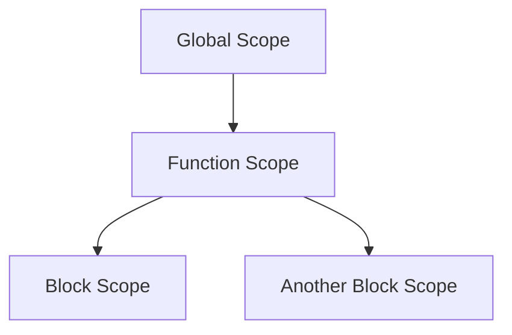

## 2.4 Variables, Types, and Scope

In the world of programming, understanding variables, data types, and scope is crucial for writing efficient and bug-free code. In Lua, these concepts are straightforward yet powerful, offering flexibility and control to developers. Let's delve into these foundational elements of Lua programming.

### Variable Declaration: Local vs. Global Variables

In Lua, variables are containers for storing data values. They can be declared as either local or global, each serving different purposes and scopes.

#### Local Variables

Local variables are declared using the `local` keyword and are confined to the block in which they are defined. This means they are only accessible within the scope of that block, which could be a function, a loop, or any other block of code.

```lua
function exampleFunction()
    local x = 10  -- local variable
    print(x)      -- Output: 10
end

exampleFunction()
print(x)          -- Error: x is not defined
```

In the above example, `x` is a local variable and is only accessible within `exampleFunction`. Attempting to access `x` outside this function results in an error.

#### Global Variables

Global variables, on the other hand, are accessible from anywhere in the program. They are declared without the `local` keyword.

```lua
y = 20  -- global variable

function anotherFunction()
    print(y)  -- Output: 20
end

anotherFunction()
print(y)      -- Output: 20
```

Here, `y` is a global variable and can be accessed both inside and outside `anotherFunction`.

#### Best Practices

- **Use local variables** whenever possible to avoid unintended side effects and to improve performance.
- **Limit the use of global variables** to only those that need to be accessed across multiple functions or modules.

### Data Types

Lua is a dynamically typed language, meaning that variables do not have fixed types. Instead, the type is determined at runtime. Lua supports several basic data types:

#### Nil

The `nil` type represents the absence of a value. It is the default value of uninitialized variables.

```lua
local a
print(a)  -- Output: nil
```

#### Boolean

The `boolean` type has two values: `true` and `false`.

```lua
local isLuaFun = true
print(isLuaFun)  -- Output: true
```

#### Number

Lua uses double-precision floating-point numbers to represent numeric values. This allows for both integer and floating-point arithmetic.

```lua
local num = 42
local pi = 3.14159
print(num, pi)  -- Output: 42  3.14159
```

#### String

Strings in Lua are immutable sequences of characters. They can be enclosed in single or double quotes.

```lua
local greeting = "Hello, Lua!"
print(greeting)  -- Output: Hello, Lua!
```

#### Function

Functions are first-class values in Lua, meaning they can be stored in variables, passed as arguments, and returned from other functions.

```lua
local function sayHello()
    print("Hello!")
end

sayHello()  -- Output: Hello!
```

#### Userdata

Userdata is a type that allows arbitrary C data to be stored in Lua variables. It is used to represent complex data structures from C libraries.

#### Thread

The `thread` type represents independent threads of execution and is used in conjunction with Lua's coroutine library.

#### Table

Tables are the only data structure in Lua and can be used to represent arrays, dictionaries, and more complex data structures.

```lua
local person = {
    name = "Alice",
    age = 30
}

print(person.name)  -- Output: Alice
```

### Type Conversion

Lua provides both implicit and explicit type conversion methods.

#### Implicit Conversion

Lua performs implicit conversion in certain operations, such as concatenating numbers with strings.

```lua
local num = 10
local str = "The number is: " .. num
print(str)  -- Output: The number is: 10
```

#### Explicit Conversion

For explicit conversion, Lua provides functions such as `tonumber` and `tostring`.

```lua
local numStr = "123"
local num = tonumber(numStr)
print(num)  -- Output: 123

local num = 456
local str = tostring(num)
print(str)  -- Output: "456"
```

### Scope Rules

Scope determines the visibility and lifetime of variables. In Lua, scope is defined by blocks, which are sections of code enclosed by `do...end`, functions, loops, or control structures.

#### Block Scope

Variables declared with `local` are confined to the block in which they are declared.

```lua
do
    local x = 5
    print(x)  -- Output: 5
end

print(x)  -- Error: x is not defined
```

#### Function Scope

Functions create their own scope, and variables declared within a function are not accessible outside of it.

```lua
function myFunction()
    local y = 10
    print(y)  -- Output: 10
end

myFunction()
print(y)  -- Error: y is not defined
```

#### Global Scope

Variables declared without `local` are global and accessible from any part of the program.

```lua
z = 15

function showZ()
    print(z)  -- Output: 15
end

showZ()
print(z)  -- Output: 15
```

### Visualizing Scope in Lua

To better understand how scope works in Lua, let's visualize it using a scope chain diagram.



**Caption:** This diagram illustrates how different scopes are nested within each other in Lua. The global scope encompasses function scopes, which in turn can contain block scopes.

### Try It Yourself

Experiment with the following code to see how variable scope affects accessibility:

```lua
local function outerFunction()
    local outerVar = "I'm outside!"
    
    local function innerFunction()
        local innerVar = "I'm inside!"
        print(outerVar)  -- Accessible
        print(innerVar)  -- Accessible
    end
    
    innerFunction()
    print(innerVar)  -- Error: innerVar is not defined
end

outerFunction()
```

**Suggested Modifications:**

- Try declaring `innerVar` as a global variable and observe the changes.
- Move the declaration of `outerVar` outside `outerFunction` and see how it affects the output.

### Knowledge Check

- What is the difference between local and global variables in Lua?
- How does Lua handle type conversion?
- What are the basic data types supported by Lua?
- How does scope affect variable visibility in Lua?

### Summary

Understanding variables, types, and scope in Lua is essential for writing effective and efficient code. By mastering these concepts, you can control the accessibility and lifetime of your variables, choose the appropriate data types, and perform type conversions as needed. Remember, this is just the beginning. As you progress, you'll build more complex and interactive Lua applications. Keep experimenting, stay curious, and enjoy the journey!

## Quiz Time!



### What keyword is used to declare a local variable in Lua?

- [x] local
- [ ] var
- [ ] let
- [ ] global

> **Explanation:** The `local` keyword is used to declare a local variable in Lua, limiting its scope to the block in which it is defined.

### Which of the following is not a basic data type in Lua?

- [ ] nil
- [ ] boolean
- [ ] integer
- [x] array

> **Explanation:** Lua does not have a separate `array` type. Arrays are implemented using tables.

### How can you explicitly convert a string to a number in Lua?

- [x] tonumber
- [ ] tostring
- [ ] toint
- [ ] convert

> **Explanation:** The `tonumber` function is used to explicitly convert a string to a number in Lua.

### What will be the output of the following code snippet?
```lua
local x = 5
do
    local x = 10
    print(x)
end
print(x)
```

- [ ] 10 10
- [x] 10 5
- [ ] 5 10
- [ ] 5 5

> **Explanation:** The inner block has its own local `x`, which is printed as 10. The outer `x` remains 5.

### Which function can be used to convert a number to a string in Lua?

- [x] tostring
- [ ] tonumber
- [ ] tostr
- [ ] convert

> **Explanation:** The `tostring` function is used to convert a number to a string in Lua.

### What is the default value of an uninitialized variable in Lua?

- [x] nil
- [ ] 0
- [ ] false
- [ ] undefined

> **Explanation:** In Lua, the default value of an uninitialized variable is `nil`.

### Which of the following statements about global variables in Lua is true?

- [x] They are accessible from any part of the program.
- [ ] They are only accessible within the function they are declared.
- [ ] They are automatically garbage collected.
- [ ] They are declared using the `global` keyword.

> **Explanation:** Global variables in Lua are accessible from any part of the program.

### What will be the output of the following code snippet?
```lua
function test()
    local a = 10
    b = 20
end
test()
print(a, b)
```

- [ ] 10 20
- [ ] 10 nil
- [ ] nil 20
- [x] nil nil

> **Explanation:** `a` is local to the function and `b` is global, but `a` is not accessible outside the function, and `b` is not printed.

### Which of the following is a valid way to declare a global variable in Lua?

- [x] x = 10
- [ ] local x = 10
- [ ] global x = 10
- [ ] var x = 10

> **Explanation:** In Lua, a global variable is declared without the `local` keyword.

### True or False: In Lua, functions can be stored in variables and passed as arguments.

- [x] True
- [ ] False

> **Explanation:** Lua treats functions as first-class values, allowing them to be stored in variables and passed as arguments.




