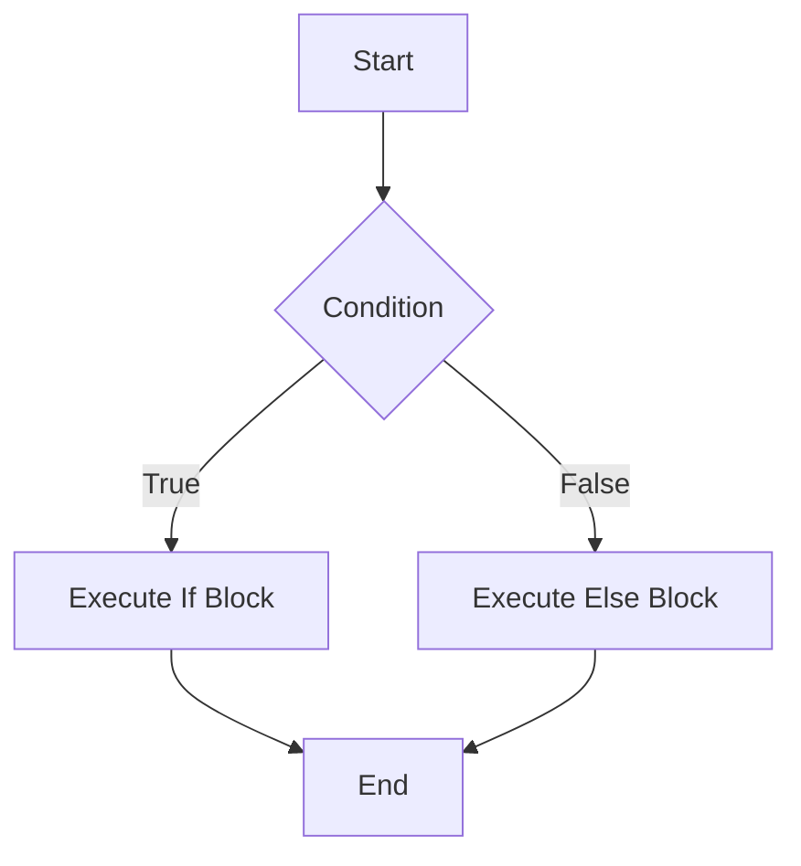
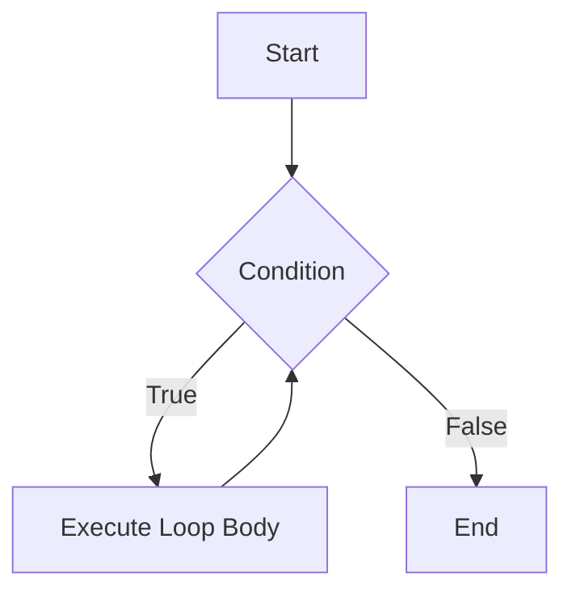

## 2.5 Control Structures: Conditionals and Loops

In this section, we delve into the fundamental control structures in Lua: conditionals and loops. These constructs are the backbone of decision-making and repetitive tasks in programming, allowing you to control the flow of your Lua scripts efficiently. By mastering these concepts, you will be able to write more dynamic and responsive code.

### Conditional Statements

Conditional statements in Lua are used to execute different blocks of code based on certain conditions. The primary conditional constructs in Lua are `if`, `elseif`, and `else`.

#### The `if` Statement

The `if` statement is the simplest form of conditional execution. It evaluates a condition and executes a block of code if the condition is true.

```lua
local age = 18

if age >= 18 then
    print("You are eligible to vote.")
end
```

In this example, the message "You are eligible to vote." is printed only if the `age` variable is 18 or older.

#### The `elseif` Statement

The `elseif` statement allows you to check multiple conditions. It is used after an `if` statement and before an `else` statement.

```lua
local score = 85

if score >= 90 then
    print("Grade: A")
elseif score >= 80 then
    print("Grade: B")
elseif score >= 70 then
    print("Grade: C")
else
    print("Grade: F")
end
```

Here, the script checks the `score` variable against multiple conditions and prints the corresponding grade.

#### The `else` Statement

The `else` statement is used to execute a block of code if none of the preceding conditions are true.

```lua
local temperature = 15

if temperature > 30 then
    print("It's a hot day.")
elseif temperature > 20 then
    print("It's a warm day.")
else
    print("It's a cold day.")
end
```

In this example, if the temperature is not greater than 30 or 20, the script defaults to printing "It's a cold day."

### Loops

Loops are used to execute a block of code repeatedly. Lua provides several types of loops: `while`, `repeat...until`, and `for`.

#### The `while` Loop

The `while` loop continues to execute a block of code as long as a specified condition is true.

```lua
local count = 1

while count <= 5 do
    print("Count: " .. count)
    count = count + 1
end
```

This loop prints the numbers 1 through 5. The loop condition is checked before each iteration.

#### The `repeat...until` Loop

The `repeat...until` loop is similar to the `while` loop, but it checks the condition after executing the loop body. This means the loop body is always executed at least once.

```lua
local count = 1

repeat
    print("Count: " .. count)
    count = count + 1
until count > 5
```

This loop also prints the numbers 1 through 5, but the condition is checked after each iteration.

#### The `for` Loop

The `for` loop is used for iterating over a range of numbers. It is concise and easy to use for counting loops.

```lua
for i = 1, 5 do
    print("Iteration: " .. i)
end
```

This loop prints the numbers 1 through 5. The loop variable `i` is automatically incremented after each iteration.

### Breaking Loops

Lua provides the `break` statement to exit a loop prematurely. This is useful when you want to stop the loop based on a condition that is checked within the loop body.

```lua
for i = 1, 10 do
    if i == 6 then
        break
    end
    print("Number: " .. i)
end
```

In this example, the loop stops when `i` equals 6, so only the numbers 1 through 5 are printed.

### Practical Examples

Let's explore some practical examples that demonstrate common patterns using control structures.

#### Example 1: Finding the Maximum Value

```lua
local numbers = {3, 5, 7, 2, 8, 1}
local max = numbers[1]

for i = 2, #numbers do
    if numbers[i] > max then
        max = numbers[i]
    end
end

print("Maximum value: " .. max)
```

This script finds the maximum value in a list of numbers using a `for` loop and an `if` statement.

#### Example 2: Calculating Factorials

```lua
local function factorial(n)
    local result = 1
    for i = 2, n do
        result = result * i
    end
    return result
end

print("Factorial of 5: " .. factorial(5))
```

This function calculates the factorial of a number using a `for` loop.

### Visualizing Control Structures

To better understand the flow of control structures, let's visualize them using Mermaid.js diagrams.

#### If-Else Flowchart



This flowchart illustrates the decision-making process of an `if-else` statement.

#### While Loop Flowchart



This flowchart represents the execution flow of a `while` loop.

### Try It Yourself

Experiment with the code examples provided by modifying the conditions and loop ranges. For instance, try changing the range in the `for` loop or the condition in the `while` loop to see how the output changes.

### Knowledge Check

- What is the difference between `if` and `elseif`?
- How does a `repeat...until` loop differ from a `while` loop?
- When would you use a `break` statement in a loop?

### Embrace the Journey

Remember, mastering control structures is a crucial step in becoming proficient in Lua programming. As you continue to explore and experiment, you'll gain a deeper understanding of how to control the flow of your scripts effectively. Keep practicing, stay curious, and enjoy the journey!

## Quiz Time!



### What is the primary purpose of conditional statements in Lua?

- [x] To execute different blocks of code based on certain conditions.
- [ ] To repeat a block of code multiple times.
- [ ] To define functions.
- [ ] To declare variables.

> **Explanation:** Conditional statements are used to execute different blocks of code based on certain conditions.

### Which Lua statement is used to check multiple conditions?

- [ ] if
- [x] elseif
- [ ] else
- [ ] for

> **Explanation:** The `elseif` statement is used to check multiple conditions in Lua.

### How does a `repeat...until` loop differ from a `while` loop?

- [x] It checks the condition after executing the loop body.
- [ ] It checks the condition before executing the loop body.
- [ ] It does not require a condition.
- [ ] It is used for iterating over a range of numbers.

> **Explanation:** A `repeat...until` loop checks the condition after executing the loop body, ensuring the loop body is executed at least once.

### What does the `break` statement do in a loop?

- [x] It exits the loop prematurely.
- [ ] It continues the loop to the next iteration.
- [ ] It restarts the loop from the beginning.
- [ ] It skips the current iteration.

> **Explanation:** The `break` statement exits the loop prematurely based on a condition checked within the loop body.

### Which loop is best suited for iterating over a range of numbers?

- [ ] while
- [ ] repeat...until
- [x] for
- [ ] if

> **Explanation:** The `for` loop is best suited for iterating over a range of numbers due to its concise syntax.

### What is the output of the following code snippet?
```lua
local count = 1
repeat
    print("Count: " .. count)
    count = count + 1
until count > 3
```

- [x] Count: 1, Count: 2, Count: 3
- [ ] Count: 1, Count: 2
- [ ] Count: 1, Count: 2, Count: 3, Count: 4
- [ ] Count: 1

> **Explanation:** The `repeat...until` loop executes the loop body until the condition `count > 3` is true, printing "Count: 1", "Count: 2", and "Count: 3".

### What is the purpose of the `else` statement in Lua?

- [x] To execute a block of code if none of the preceding conditions are true.
- [ ] To check multiple conditions.
- [ ] To repeat a block of code.
- [ ] To define a function.

> **Explanation:** The `else` statement executes a block of code if none of the preceding conditions are true.

### How can you exit a loop when a specific condition is met?

- [x] Use the `break` statement.
- [ ] Use the `continue` statement.
- [ ] Use the `return` statement.
- [ ] Use the `exit` statement.

> **Explanation:** You can exit a loop when a specific condition is met by using the `break` statement.

### What is the output of the following code snippet?
```lua
for i = 1, 3 do
    print("Iteration: " .. i)
end
```

- [x] Iteration: 1, Iteration: 2, Iteration: 3
- [ ] Iteration: 1, Iteration: 2
- [ ] Iteration: 1, Iteration: 2, Iteration: 3, Iteration: 4
- [ ] Iteration: 1

> **Explanation:** The `for` loop iterates over the range 1 to 3, printing "Iteration: 1", "Iteration: 2", and "Iteration: 3".

### True or False: A `while` loop always executes its body at least once.

- [ ] True
- [x] False

> **Explanation:** A `while` loop checks the condition before executing its body, so it may not execute at all if the condition is false initially.




