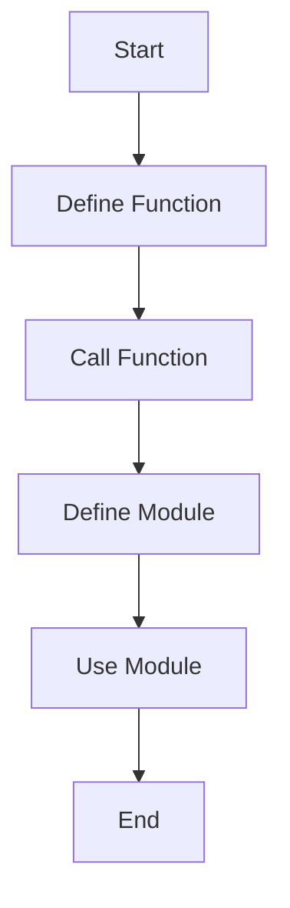

## 2.6 Functions and Modules

In Lua, functions and modules are fundamental constructs that enable developers to write modular, reusable, and organized code. Understanding these concepts is crucial for mastering Lua and applying design patterns effectively. In this section, we will delve into defining functions, handling parameters and return values, working with variadic functions, creating and using modules, and managing namespaces to avoid name clashes.

### Defining Functions

Functions in Lua are first-class citizens, meaning they can be stored in variables, passed as arguments, and returned from other functions. This flexibility allows for powerful programming paradigms such as functional programming and higher-order functions.

#### Syntax for Declaring Functions

To define a function in Lua, use the `function` keyword followed by the function name and a pair of parentheses. The function body is enclosed within `end`.

```lua
-- Define a simple function
function greet(name)
    print("Hello, " .. name .. "!")
end

-- Call the function
greet("Alice")
```

In this example, we define a function `greet` that takes one parameter, `name`, and prints a greeting message. The function is then called with the argument `"Alice"`.

### Parameters and Return Values

Functions in Lua can accept parameters and return values, allowing for flexible data manipulation and processing.

#### Passing Arguments

When calling a function, you can pass arguments that correspond to the parameters defined in the function signature.

```lua
-- Function with two parameters
function add(a, b)
    return a + b
end

-- Call the function with arguments
local sum = add(5, 3)
print("Sum:", sum)  -- Output: Sum: 8
```

In the `add` function, two parameters `a` and `b` are defined, and the function returns their sum.

#### Returning Results

Lua functions can return multiple values, which is a powerful feature for returning complex data structures or multiple results from a single function call.

```lua
-- Function returning multiple values
function divide(dividend, divisor)
    local quotient = dividend // divisor
    local remainder = dividend % divisor
    return quotient, remainder
end

-- Capture multiple return values
local q, r = divide(10, 3)
print("Quotient:", q, "Remainder:", r)  -- Output: Quotient: 3 Remainder: 1
```

Here, the `divide` function returns both the quotient and remainder of a division operation.

### Variable Number of Arguments

Lua supports variadic functions, which can accept a variable number of arguments using the `...` syntax. This is useful for functions that need to handle an arbitrary number of inputs.

```lua
-- Variadic function example
function concatenate(...)
    local args = {...}
    return table.concat(args, " ")
end

-- Call the variadic function
local result = concatenate("Lua", "is", "fun!")
print(result)  -- Output: Lua is fun!
```

In this example, the `concatenate` function uses `...` to accept any number of arguments, which are then concatenated into a single string.

### Modules

Modules in Lua are used to organize code into reusable components. A module is essentially a table that contains functions, variables, and other data.

#### Creating and Using Modules

To create a module, define a table and populate it with functions and data. Use the `require` function to load the module in other scripts.

```lua
-- mymodule.lua
local M = {}

function M.sayHello()
    print("Hello from the module!")
end

return M
```

```lua
-- main.lua
local mymodule = require("mymodule")
mymodule.sayHello()  -- Output: Hello from the module!
```

In this example, `mymodule.lua` defines a module with a single function `sayHello`. The module is then required and used in `main.lua`.

### Namespaces

Namespaces help avoid name clashes by encapsulating functions and variables within a table. This is particularly useful in larger projects with multiple modules.

#### Avoiding Name Clashes Using Table-Based Modules

By using tables as namespaces, you can prevent conflicts between functions or variables with the same name.

```lua
-- Define a namespace
local MathUtils = {}

function MathUtils.add(a, b)
    return a + b
end

function MathUtils.subtract(a, b)
    return a - b
end

-- Use the namespace
print(MathUtils.add(10, 5))       -- Output: 15
print(MathUtils.subtract(10, 5))  -- Output: 5
```

In this example, `MathUtils` is a table that serves as a namespace for the `add` and `subtract` functions.

### Visualizing Function Calls and Module Usage

To better understand how functions and modules interact in Lua, let's visualize the process using a flowchart.



This flowchart illustrates the typical process of defining a function, calling it, defining a module, and using the module in a Lua program.

### Try It Yourself

Experiment with the code examples provided in this section. Try modifying the functions to accept different parameters or return different values. Create your own modules and explore how namespaces can help organize your code.

### Knowledge Check

- What is the syntax for defining a function in Lua?
- How can you return multiple values from a Lua function?
- What is the purpose of the `...` syntax in Lua functions?
- How do you create and use a module in Lua?
- Why are namespaces important in Lua programming?

### Summary

In this section, we explored the fundamentals of functions and modules in Lua. We learned how to define functions, handle parameters and return values, work with variadic functions, create and use modules, and manage namespaces to avoid name clashes. These concepts are essential for writing organized, reusable, and efficient Lua code.

Remember, this is just the beginning. As you progress, you'll build more complex and interactive Lua applications. Keep experimenting, stay curious, and enjoy the journey!

## Quiz Time!



### What is the syntax for defining a function in Lua?

- [x] `function functionName(parameters) end`
- [ ] `def functionName(parameters):`
- [ ] `functionName(parameters) { }`
- [ ] `fn functionName(parameters)`

> **Explanation:** In Lua, functions are defined using the `function` keyword followed by the function name and parameters, ending with `end`.

### How can you return multiple values from a Lua function?

- [x] By separating values with commas in the return statement
- [ ] By using an array
- [ ] By using a dictionary
- [ ] By using a tuple

> **Explanation:** Lua allows returning multiple values by separating them with commas in the return statement.

### What is the purpose of the `...` syntax in Lua functions?

- [x] To accept a variable number of arguments
- [ ] To define a function
- [ ] To return multiple values
- [ ] To create a module

> **Explanation:** The `...` syntax in Lua functions is used to accept a variable number of arguments, making the function variadic.

### How do you create a module in Lua?

- [x] By defining a table and returning it
- [ ] By using the `module` keyword
- [ ] By using the `class` keyword
- [ ] By using the `package` keyword

> **Explanation:** In Lua, a module is created by defining a table and returning it, allowing the module to be required in other scripts.

### Why are namespaces important in Lua programming?

- [x] To avoid name clashes and organize code
- [ ] To increase execution speed
- [ ] To reduce memory usage
- [ ] To enable parallel processing

> **Explanation:** Namespaces help avoid name clashes and organize code, especially in larger projects with multiple modules.

### What is a key feature of Lua functions?

- [x] They are first-class citizens
- [ ] They must return a value
- [ ] They cannot be nested
- [ ] They are statically typed

> **Explanation:** Lua functions are first-class citizens, meaning they can be stored in variables, passed as arguments, and returned from other functions.

### How can you load a module in Lua?

- [x] Using the `require` function
- [ ] Using the `import` statement
- [ ] Using the `include` statement
- [ ] Using the `load` function

> **Explanation:** In Lua, the `require` function is used to load modules.

### What is the role of tables in Lua modules?

- [x] They serve as containers for functions and data
- [ ] They define the module's scope
- [ ] They increase performance
- [ ] They manage memory allocation

> **Explanation:** Tables in Lua modules serve as containers for functions and data, organizing them into reusable components.

### Can Lua functions return no values?

- [x] True
- [ ] False

> **Explanation:** Lua functions can return no values, a single value, or multiple values, depending on the function's design.

### What is a common use case for variadic functions in Lua?

- [x] Concatenating strings
- [ ] Sorting arrays
- [ ] Managing memory
- [ ] Handling errors

> **Explanation:** Variadic functions are often used for operations like concatenating strings, where the number of inputs can vary.




