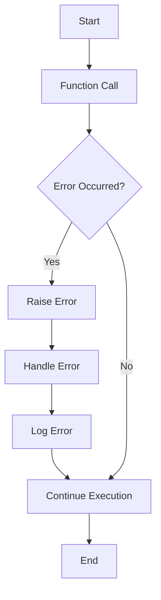

## 2.7 Error Handling and Debugging Basics

Error handling and debugging are crucial aspects of software development, ensuring that applications run smoothly and efficiently. In this section, we will delve into the fundamentals of error handling and debugging in Lua, providing you with the tools and techniques needed to write robust and error-resistant code.

### Error Functions in Lua

Lua provides several built-in functions for error handling, including `error()`, `assert()`, and `pcall()`. These functions allow developers to manage errors effectively and ensure that their programs can handle unexpected situations gracefully.

#### Using `error()`

The `error()` function in Lua is used to raise an error. When called, it terminates the program and displays an error message. This function is useful for signaling that something has gone wrong in your code.

```lua
function divide(a, b)
    if b == 0 then
        error("Division by zero is not allowed")
    end
    return a / b
end

-- Example usage
local result = divide(10, 0)  -- This will raise an error
```

In this example, the `divide()` function checks if the divisor `b` is zero. If it is, the function raises an error using `error()`, preventing division by zero.

#### Using `assert()`

The `assert()` function is a convenient way to check conditions and raise errors if those conditions are not met. It takes a condition and an optional error message as arguments. If the condition evaluates to `false`, `assert()` raises an error with the provided message.

```lua
function openFile(filename)
    local file = assert(io.open(filename, "r"), "Failed to open file")
    return file
end

-- Example usage
local file = openFile("nonexistent.txt")  -- This will raise an error
```

Here, `assert()` checks if the file can be opened. If not, it raises an error with the message "Failed to open file".

#### Using `pcall()`

The `pcall()` function, short for "protected call", is used to execute a function in protected mode. This means that any errors that occur during the execution of the function are caught, and the program does not terminate. Instead, `pcall()` returns a status code indicating success or failure.

```lua
function riskyFunction()
    error("An error occurred")
end

local status, err = pcall(riskyFunction)

if not status then
    print("Error caught: " .. err)
end
```

In this example, `pcall()` is used to call `riskyFunction()`. If an error occurs, `pcall()` returns `false`, and the error message is stored in `err`.

### Exception Handling: Simulating Try-Catch-Finally

Lua does not have built-in exception handling like some other programming languages, but you can simulate try-catch-finally behavior using `pcall()` and `xpcall()`.

#### Simulating Try-Catch

To simulate a try-catch block, you can use `pcall()` to wrap the code that might throw an error and handle the error in the subsequent code.

```lua
function tryCatchDemo()
    local function riskyOperation()
        error("Something went wrong")
    end

    local status, err = pcall(riskyOperation)

    if not status then
        print("Caught an error: " .. err)
    end
end

tryCatchDemo()
```

In this example, `riskyOperation()` is called within `pcall()`, and any errors are caught and printed.

#### Simulating Try-Catch-Finally

To simulate a try-catch-finally block, you can use `xpcall()`, which allows you to specify an error handler function.

```lua
function tryCatchFinallyDemo()
    local function riskyOperation()
        error("An error occurred")
    end

    local function errorHandler(err)
        print("Caught an error: " .. err)
    end

    local function finallyBlock()
        print("Executing finally block")
    end

    xpcall(riskyOperation, errorHandler)
    finallyBlock()
end

tryCatchFinallyDemo()
```

Here, `xpcall()` is used to call `riskyOperation()`, and `errorHandler()` is specified to handle any errors. The `finallyBlock()` function is executed after the try-catch simulation, mimicking the behavior of a finally block.

### Debug Library: Introduction to Lua's Built-in Debugging Facilities

Lua provides a built-in debug library that offers various functions to inspect and manipulate the execution of Lua programs. This library is particularly useful for debugging and understanding the behavior of your code.

#### Key Functions in the Debug Library

- **`debug.traceback()`**: Generates a stack traceback, which is helpful for understanding the call sequence that led to an error.
- **`debug.getinfo()`**: Retrieves information about a function or a function call, such as its name, source, and line number.
- **`debug.sethook()`**: Sets a hook function that is called at specific events during the execution of a Lua program, such as function calls or line executions.

#### Using `debug.traceback()`

The `debug.traceback()` function is useful for generating a stack trace when an error occurs, helping you identify the sequence of function calls that led to the error.

```lua
function faultyFunction()
    error("An unexpected error")
end

function wrapperFunction()
    local status, err = pcall(faultyFunction)
    if not status then
        print("Error: " .. err)
        print(debug.traceback())
    end
end

wrapperFunction()
```

In this example, `debug.traceback()` is used to print the stack trace when an error occurs in `faultyFunction()`.

#### Using `debug.getinfo()`

The `debug.getinfo()` function provides detailed information about a function or a function call, which can be useful for debugging.

```lua
function sampleFunction()
    print("Hello, World!")
end

local info = debug.getinfo(sampleFunction)
print("Function name: " .. (info.name or "unknown"))
print("Defined in: " .. info.short_src)
print("Line number: " .. info.linedefined)
```

This code retrieves and prints information about `sampleFunction()` using `debug.getinfo()`.

### Best Practices for Error Handling and Debugging

Writing robust code with proper error handling is essential for developing reliable applications. Here are some best practices to consider:

1. **Validate Inputs**: Always validate inputs to functions to prevent unexpected errors.
2. **Use Assertions**: Use `assert()` to enforce preconditions and invariants in your code.
3. **Handle Errors Gracefully**: Use `pcall()` and `xpcall()` to handle errors without crashing your program.
4. **Log Errors**: Implement logging to record errors and their context for later analysis.
5. **Use Debugging Tools**: Leverage Lua's debug library to inspect and understand your code's behavior.
6. **Write Test Cases**: Develop test cases to catch errors early in the development process.

### Visualizing Error Handling Flow

To better understand the flow of error handling in Lua, let's visualize the process using a flowchart.



**Figure 1**: This flowchart illustrates the process of error handling in Lua, from detecting an error to handling and logging it.

### Try It Yourself

Experiment with the code examples provided in this section. Try modifying the error messages, adding new conditions, or using different functions from the debug library. This hands-on approach will help reinforce your understanding of error handling and debugging in Lua.

### Knowledge Check

Before moving on, let's review some key concepts:

- What are the primary functions used for error handling in Lua?
- How can you simulate try-catch-finally behavior in Lua?
- What is the purpose of the debug library in Lua?

### Embrace the Journey

Remember, mastering error handling and debugging is a continuous journey. As you gain experience, you'll develop a deeper understanding of how to write robust and error-resistant code. Keep experimenting, stay curious, and enjoy the process of learning and improving your Lua programming skills.

## Quiz Time!



### What function is used to raise an error in Lua?

- [x] error()
- [ ] assert()
- [ ] pcall()
- [ ] xpcall()

> **Explanation:** The `error()` function is used to raise an error in Lua, terminating the program and displaying an error message.

### Which function allows you to execute code in protected mode?

- [ ] error()
- [ ] assert()
- [x] pcall()
- [ ] debug.traceback()

> **Explanation:** The `pcall()` function is used to execute code in protected mode, catching any errors that occur during execution.

### How can you simulate try-catch behavior in Lua?

- [x] Using pcall()
- [ ] Using assert()
- [ ] Using error()
- [ ] Using debug.getinfo()

> **Explanation:** You can simulate try-catch behavior in Lua using `pcall()` to wrap the code that might throw an error and handle the error in subsequent code.

### What is the purpose of the debug library in Lua?

- [ ] To raise errors
- [ ] To execute code in protected mode
- [x] To inspect and manipulate the execution of Lua programs
- [ ] To enforce preconditions

> **Explanation:** The debug library in Lua provides functions to inspect and manipulate the execution of Lua programs, aiding in debugging and understanding code behavior.

### Which function generates a stack traceback in Lua?

- [ ] pcall()
- [ ] assert()
- [x] debug.traceback()
- [ ] error()

> **Explanation:** The `debug.traceback()` function generates a stack traceback, helping to identify the sequence of function calls that led to an error.

### What is a best practice for handling errors in Lua?

- [x] Validate inputs
- [ ] Ignore errors
- [ ] Use global variables
- [ ] Avoid assertions

> **Explanation:** Validating inputs is a best practice for handling errors in Lua, preventing unexpected errors by ensuring that inputs meet expected conditions.

### How can you enforce preconditions in your Lua code?

- [ ] Using pcall()
- [x] Using assert()
- [ ] Using error()
- [ ] Using debug.traceback()

> **Explanation:** You can enforce preconditions in your Lua code using `assert()`, which raises an error if a condition is not met.

### What does the `xpcall()` function allow you to specify?

- [ ] A condition to check
- [x] An error handler function
- [ ] A stack traceback
- [ ] A function to execute in protected mode

> **Explanation:** The `xpcall()` function allows you to specify an error handler function, which is called if an error occurs during the execution of the protected function.

### What should you do to catch errors early in the development process?

- [ ] Ignore errors
- [ ] Use global variables
- [x] Write test cases
- [ ] Avoid assertions

> **Explanation:** Writing test cases is a best practice to catch errors early in the development process, ensuring that code behaves as expected.

### True or False: Lua has built-in exception handling like try-catch-finally.

- [ ] True
- [x] False

> **Explanation:** False. Lua does not have built-in exception handling like try-catch-finally, but you can simulate this behavior using `pcall()` and `xpcall()`.


