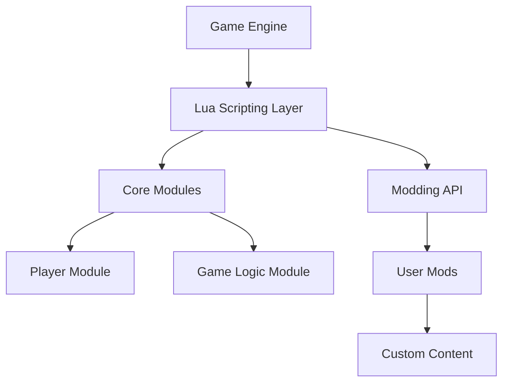

## 20.1 Large-Scale Game Development with Lua

Lua has become a cornerstone in the world of game development, particularly for large-scale projects. Its lightweight nature, ease of integration, and flexibility make it an ideal choice for scripting in complex game environments. In this section, we will delve into the real-world applications of Lua in game development, explore key strategies for success, and address the challenges developers face when using Lua in large-scale projects.

### Real-World Applications

#### Notable Games

Lua's influence in the gaming industry is profound, with numerous high-profile titles leveraging its capabilities. One of the most notable examples is **World of Warcraft**, a massively multiplayer online role-playing game (MMORPG) that uses Lua extensively for its user interface and modding community. Other games like **Angry Birds**, **Civilization V**, and **Roblox** also utilize Lua, showcasing its versatility across different genres and platforms.

### Key Strategies

#### Modularity

One of the primary strategies for successful large-scale game development with Lua is modularity. By separating game logic into distinct scripts, developers can manage complexity more effectively and facilitate collaboration among team members. Modularity also allows for easier maintenance and updates, as changes can be made to individual modules without affecting the entire codebase.

**Example: Modular Game Architecture**

```lua
-- Player module
local Player = {}
Player.__index = Player

function Player:new(name, health)
    local instance = setmetatable({}, Player)
    instance.name = name
    instance.health = health
    return instance
end

function Player:takeDamage(amount)
    self.health = self.health - amount
    if self.health <= 0 then
        print(self.name .. " has been defeated!")
    end
end

return Player

-- Game module
local Player = require("Player")

local game = {}
game.players = {}

function game:addPlayer(name, health)
    local player = Player:new(name, health)
    table.insert(self.players, player)
end

function game:start()
    for _, player in ipairs(self.players) do
        print(player.name .. " is ready with " .. player.health .. " health.")
    end
end

return game
```

In this example, the `Player` module is separate from the `Game` module, allowing for independent development and testing.

#### Community Engagement

Supporting modding and user-generated content is another key strategy. By providing tools and documentation for modders, developers can foster a vibrant community that extends the life of the game and enhances its appeal. Lua's simplicity makes it accessible to a wide range of users, encouraging creativity and innovation.

**Example: Modding API**

```lua
-- Modding API
local ModAPI = {}

function ModAPI:registerMod(name, initFunction)
    print("Registering mod: " .. name)
    initFunction()
end

return ModAPI

-- Example Mod
local ModAPI = require("ModAPI")

ModAPI:registerMod("Example Mod", function()
    print("Example Mod initialized!")
end)
```

This simple API allows users to register and initialize mods, promoting community engagement and content creation.

### Challenges and Solutions

#### Performance Tuning

Performance is a critical concern in large-scale game development. Lua's interpreted nature can lead to performance bottlenecks if not managed properly. Developers must optimize scripts for efficiency, using techniques such as caching, lazy loading, and minimizing global variable usage.

**Example: Performance Optimization**

```lua
-- Caching example
local cache = {}

function expensiveFunction(param)
    if cache[param] then
        return cache[param]
    end

    -- Simulate an expensive operation
    local result = param * 2
    cache[param] = result
    return result
end

print(expensiveFunction(10)) -- Cached result
```

By caching results, we reduce the need for repeated expensive computations, improving performance.

#### Tooling

Developing robust tools for editing and debugging Lua scripts is essential for large-scale projects. Integrated development environments (IDEs) with Lua support, custom editors, and debuggers can significantly enhance productivity and reduce errors.

**Example: Custom Debugger**

```lua
-- Simple Debugger
local Debugger = {}

function Debugger:log(message)
    print("[DEBUG] " .. message)
end

function Debugger:watch(variable, name)
    print("[WATCH] " .. name .. ": " .. tostring(variable))
end

return Debugger

-- Usage
local Debugger = require("Debugger")

local health = 100
Debugger:watch(health, "Player Health")
```

This simple debugger logs messages and watches variables, aiding in the development process.

### Visualizing Game Architecture

To better understand the architecture of a large-scale game using Lua, let's visualize a typical game structure with a focus on modularity and community engagement.



**Diagram Description:** This diagram illustrates the relationship between the game engine, Lua scripting layer, core modules, and user mods. The Lua scripting layer acts as a bridge between the game engine and both core modules and user-generated content, emphasizing modularity and community engagement.

### Knowledge Check

To reinforce your understanding of large-scale game development with Lua, consider the following questions:

1. What are the benefits of modularity in game development?
2. How does Lua facilitate community engagement in games?
3. What are some common performance optimization techniques in Lua?
4. Why is tooling important for large-scale Lua projects?

### Embrace the Journey

Remember, mastering large-scale game development with Lua is a journey. As you progress, you'll encounter new challenges and opportunities to innovate. Keep experimenting, stay curious, and enjoy the process of creating immersive gaming experiences.

### References and Links

- [Lua Official Website](https://www.lua.org/)
- [World of Warcraft Lua API](https://wowpedia.fandom.com/wiki/World_of_Warcraft_API)
- [Lua Performance Tips](https://www.lua.org/gems/sample.pdf)

## Quiz Time!



### What is one of the primary strategies for successful large-scale game development with Lua?

- [x] Modularity
- [ ] Monolithic architecture
- [ ] Hardcoding game logic
- [ ] Ignoring community feedback

> **Explanation:** Modularity allows developers to manage complexity by separating game logic into distinct scripts, facilitating collaboration and maintenance.

### How does Lua facilitate community engagement in games?

- [x] By providing tools and documentation for modders
- [ ] By restricting user-generated content
- [ ] By making the codebase inaccessible
- [ ] By limiting customization options

> **Explanation:** Lua's simplicity and accessibility encourage creativity and innovation, allowing users to create mods and extend the game's life.

### What is a common performance optimization technique in Lua?

- [x] Caching
- [ ] Increasing global variable usage
- [ ] Disabling lazy loading
- [ ] Ignoring performance bottlenecks

> **Explanation:** Caching results reduces the need for repeated expensive computations, improving performance.

### Why is tooling important for large-scale Lua projects?

- [x] It enhances productivity and reduces errors
- [ ] It complicates the development process
- [ ] It limits debugging capabilities
- [ ] It discourages collaboration

> **Explanation:** Robust tools for editing and debugging Lua scripts are essential for enhancing productivity and reducing errors in large-scale projects.

### Which game is known for using Lua extensively?

- [x] World of Warcraft
- [ ] Minecraft
- [ ] Fortnite
- [ ] Call of Duty

> **Explanation:** World of Warcraft uses Lua extensively for its user interface and modding community.

### What is the role of the Lua scripting layer in game architecture?

- [x] Acts as a bridge between the game engine and both core modules and user-generated content
- [ ] Replaces the game engine
- [ ] Eliminates the need for core modules
- [ ] Restricts user-generated content

> **Explanation:** The Lua scripting layer facilitates interaction between the game engine, core modules, and user-generated content, emphasizing modularity and community engagement.

### What is a benefit of supporting modding in games?

- [x] Extends the life of the game
- [ ] Limits user creativity
- [ ] Reduces game complexity
- [ ] Discourages community involvement

> **Explanation:** Supporting modding and user-generated content fosters a vibrant community, extending the game's life and enhancing its appeal.

### What is a challenge developers face when using Lua in large-scale projects?

- [x] Performance tuning
- [ ] Lack of community support
- [ ] Inflexibility of the language
- [ ] Difficulty in integrating with other technologies

> **Explanation:** Lua's interpreted nature can lead to performance bottlenecks, requiring developers to optimize scripts for efficiency.

### What is an example of a tool that can aid in Lua development?

- [x] Custom debugger
- [ ] Obfuscator
- [ ] Code minifier
- [ ] Code obfuscator

> **Explanation:** A custom debugger can log messages and watch variables, aiding in the development process.

### True or False: Lua is only suitable for small-scale game development.

- [ ] True
- [x] False

> **Explanation:** Lua is suitable for both small-scale and large-scale game development, as evidenced by its use in games like World of Warcraft.


