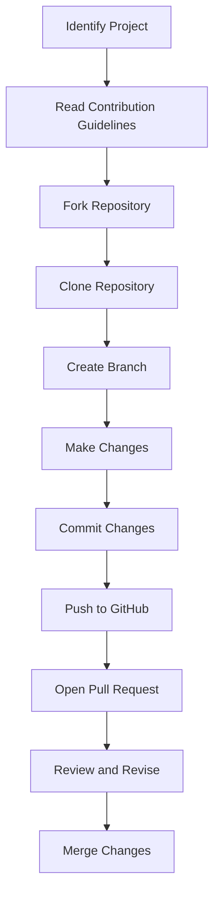

## 20.10 Open Source Projects and Contributions

Open source projects offer a unique opportunity for developers to collaborate, learn, and contribute to the broader software community. In this section, we will explore how you can participate in the Lua ecosystem, find projects to contribute to, understand the contribution process, and reap the benefits of being an active member of the open source community.

### Participating in the Lua Ecosystem

#### Finding Projects

The first step in contributing to open source is identifying projects that align with your interests and expertise. Here are some strategies to help you find the right projects:

- **Explore GitHub and GitLab**: These platforms host numerous Lua projects. Use search filters to find repositories tagged with "Lua" or related keywords.
- **Join Lua Forums and Communities**: Engage with the Lua community through forums, mailing lists, and social media groups. These platforms often share opportunities for contribution.
- **Follow Lua Conferences and Meetups**: Events like LuaConf and Lua workshops are great places to learn about ongoing projects and meet project maintainers.
- **Check Lua Libraries and Frameworks**: Libraries such as LÖVE (a framework for 2D games) and OpenResty (a web platform) are popular in the Lua community and often welcome contributions.

#### Contribution Process

Once you've identified a project, the next step is to understand the contribution process. Here's a general guide to help you get started:

- **Read the Contribution Guidelines**: Most projects have a `CONTRIBUTING.md` file that outlines how to contribute. This document is crucial for understanding the project's workflow, coding standards, and communication channels.
- **Fork and Clone the Repository**: Create a personal copy of the repository to work on. This allows you to experiment and make changes without affecting the original project.
- **Identify Issues or Features**: Look for open issues labeled "good first issue" or "help wanted." These are typically beginner-friendly and a great starting point.
- **Collaborate with Maintainers**: Engage with the project maintainers by commenting on issues or joining project discussions. This helps ensure your contributions align with the project's goals.
- **Submit Pull Requests**: Once you've made your changes, submit a pull request for review. Be prepared to receive feedback and make revisions.

#### Benefits

Contributing to open source projects offers numerous benefits, both professionally and personally:

- **Skill Development**: Working on real-world projects enhances your coding skills, exposes you to new technologies, and provides practical experience in software development.
- **Community Building**: Open source contributions allow you to network with other developers, share knowledge, and build a reputation in the community.
- **Portfolio Enhancement**: Contributions to well-known projects can significantly enhance your professional portfolio, showcasing your skills to potential employers.

### Use Cases and Examples

#### Library Development

Creating and maintaining libraries is a common form of contribution in the Lua ecosystem. Libraries extend the functionality of Lua and provide tools for other developers to use. Here are some examples:

- **LuaSocket**: A library that provides network support for the Lua language. Contributing to such libraries involves understanding network protocols and Lua's C API.
- **Penlight**: A comprehensive set of pure Lua libraries for functional programming, data structures, and more. Contributions can range from bug fixes to adding new modules.

#### Documentation

Documentation is a critical aspect of any open source project. Improving guides, tutorials, and API references can significantly enhance a project's usability and accessibility:

- **LuaRocks Documentation**: LuaRocks is a package manager for Lua modules. Contributing to its documentation involves writing clear, concise guides for installing and using Lua modules.
- **LÖVE Wiki**: The LÖVE framework has a community-maintained wiki that serves as a comprehensive resource for game developers. Contributions can include writing tutorials, updating outdated information, and adding examples.

### Code Examples

Let's explore a simple example of contributing to an open source Lua project. We'll create a basic Lua module and submit it to a hypothetical project.

```lua
-- mymodule.lua
-- A simple Lua module for string manipulation

local mymodule = {}

-- Function to reverse a string
function mymodule.reverse(str)
    return str:reverse()
end

-- Function to convert a string to uppercase
function mymodule.to_upper(str)
    return str:upper()
end

return mymodule
```

In this example, we've created a module with two functions: `reverse` and `to_upper`. To contribute this module to an open source project, follow these steps:

1. **Fork the Repository**: Create a fork of the project repository on GitHub.
2. **Clone the Fork**: Clone your fork to your local machine using `git clone`.
3. **Create a Branch**: Create a new branch for your changes using `git checkout -b mymodule-feature`.
4. **Add Your Module**: Add `mymodule.lua` to the project and commit your changes.
5. **Push to GitHub**: Push your branch to your GitHub fork using `git push origin mymodule-feature`.
6. **Open a Pull Request**: Navigate to the original repository and open a pull request from your branch.

### Visualizing the Contribution Process

To better understand the contribution process, let's visualize it using a flowchart:



This flowchart outlines the typical steps involved in contributing to an open source project, from identifying a project to merging your changes.

### Try It Yourself

To gain hands-on experience, try modifying the `mymodule.lua` code example:

- **Add a New Function**: Implement a function that counts the number of vowels in a string.
- **Improve Error Handling**: Add error handling to ensure the input is a valid string.
- **Optimize Performance**: Research and implement performance optimizations for the existing functions.

### References and Links

For further reading and resources, consider exploring the following:

- [GitHub's Guide to Open Source](https://opensource.guide/)
- [LuaRocks Documentation](https://luarocks.org/)
- [LÖVE Framework](https://love2d.org/)
- [OpenResty Documentation](https://openresty.org/)

### Knowledge Check

To reinforce your understanding, consider the following questions:

- What are the benefits of contributing to open source projects?
- How can you find Lua projects to contribute to?
- What is the typical process for submitting a pull request?

### Embrace the Journey

Remember, contributing to open source is a journey of continuous learning and growth. As you engage with the Lua community, you'll not only enhance your skills but also contribute to the collective knowledge and advancement of the software industry. Keep experimenting, stay curious, and enjoy the journey!

## Quiz Time!



### What is the first step in contributing to an open source project?

- [x] Identifying a project to contribute to
- [ ] Writing code immediately
- [ ] Submitting a pull request
- [ ] Forking the repository

> **Explanation:** The first step is to identify a project that aligns with your interests and expertise.

### Which platform is commonly used to host open source Lua projects?

- [x] GitHub
- [ ] Bitbucket
- [ ] SourceForge
- [ ] CodePen

> **Explanation:** GitHub is a popular platform for hosting open source projects, including those written in Lua.

### What is the purpose of a `CONTRIBUTING.md` file?

- [x] To outline how to contribute to a project
- [ ] To list all contributors
- [ ] To provide a project roadmap
- [ ] To document code style guidelines

> **Explanation:** The `CONTRIBUTING.md` file provides guidelines on how to contribute to the project.

### What is a common label for beginner-friendly issues?

- [x] "good first issue"
- [ ] "urgent"
- [ ] "critical"
- [ ] "enhancement"

> **Explanation:** "good first issue" is a label often used to indicate issues suitable for beginners.

### What is a benefit of contributing to open source projects?

- [x] Skill development
- [ ] Guaranteed employment
- [ ] Immediate financial gain
- [ ] Ownership of the project

> **Explanation:** Contributing to open source projects helps in skill development through practical experience.

### What should you do after forking a repository?

- [x] Clone the repository to your local machine
- [ ] Submit a pull request
- [ ] Delete the original repository
- [ ] Merge changes immediately

> **Explanation:** After forking, you should clone the repository to your local machine to start making changes.

### What is a common use case for contributing to documentation?

- [x] Improving guides and tutorials
- [ ] Writing new code features
- [ ] Designing user interfaces
- [ ] Testing software

> **Explanation:** Contributing to documentation often involves improving guides, tutorials, and API references.

### What is the final step in the contribution process?

- [x] Merging changes into the main repository
- [ ] Deleting your fork
- [ ] Creating a new branch
- [ ] Writing a new `README.md`

> **Explanation:** The final step is merging your changes into the main repository after review and approval.

### What is a common tool for managing Lua modules?

- [x] LuaRocks
- [ ] npm
- [ ] Maven
- [ ] Gradle

> **Explanation:** LuaRocks is a package manager for Lua modules.

### True or False: Contributing to open source projects can enhance your professional portfolio.

- [x] True
- [ ] False

> **Explanation:** True, contributions to well-known projects can significantly enhance your professional portfolio.


