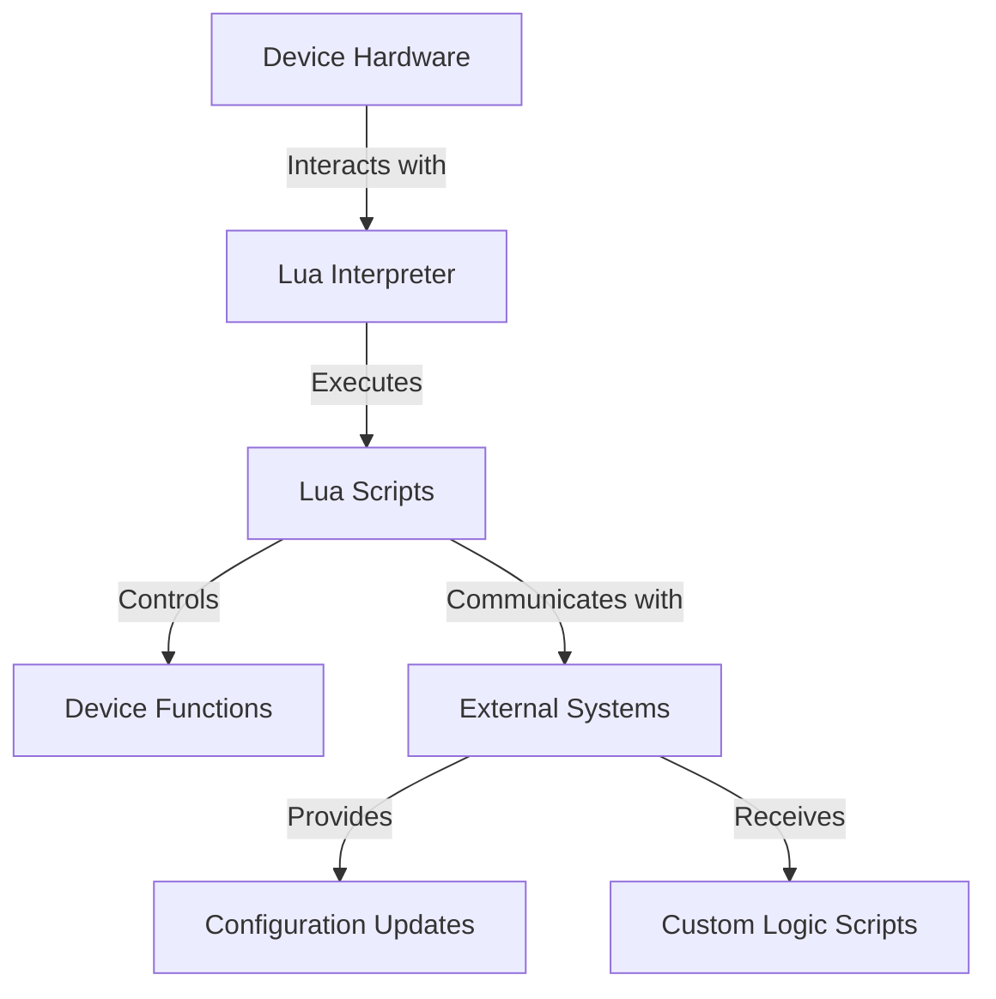

## 20.2 Scripting in Embedded Systems

Embedded systems are ubiquitous in modern technology, powering everything from consumer electronics to industrial machines. As these systems become more complex, the need for flexible and efficient programming solutions grows. Lua, a lightweight scripting language, has emerged as a powerful tool for embedded systems, offering flexibility, simplicity, and ease of integration. In this section, we will explore the role of Lua in embedded systems, its advantages, and practical use cases.

### Implementing Lua on Devices

Lua's lightweight nature makes it an ideal choice for embedded systems, where resources are often limited. Its small footprint and efficient execution allow it to run on devices with constrained memory and processing power. Let's delve into some common applications of Lua in embedded systems.

#### Applications

1. **Routers and Network Devices**: Lua is used in routers and network devices to manage configurations, automate tasks, and implement custom network protocols. Its ability to handle complex logic with minimal overhead makes it a preferred choice for network administrators.

2. **Consumer Electronics**: From smart TVs to gaming consoles, Lua is employed to script user interfaces, manage device settings, and enable interactive features. Its ease of use allows developers to quickly prototype and deploy new functionalities.

3. **Industrial Automation**: In industrial settings, Lua scripts control machinery, monitor sensors, and manage data flows. Its flexibility allows for rapid adaptation to changing requirements and integration with other systems.

### Advantages of Lua in Embedded Systems

Lua offers several advantages that make it a compelling choice for embedded systems:

#### Flexibility

- **Dynamic Updates**: Lua scripts can be updated without altering the underlying firmware, allowing for quick changes and improvements. This flexibility is crucial in environments where downtime must be minimized.

- **Customizability**: Users can write custom scripts to tailor device behavior to specific needs, enhancing the device's functionality without requiring extensive programming knowledge.

#### Simplicity

- **Ease of Scripting**: Lua's simple syntax and powerful features make it accessible to both novice and experienced developers. This simplicity reduces the learning curve and accelerates development.

- **Rapid Prototyping**: Developers can quickly prototype and test new features, reducing time-to-market and enabling iterative improvements.

### Use Cases and Examples

To illustrate the practical applications of Lua in embedded systems, let's explore some real-world use cases.

#### Configuration Management

Managing configurations in embedded systems can be challenging, especially when dealing with a large number of devices. Lua simplifies this process by allowing for dynamic configuration updates and automation.

**Example**: Consider a network of IoT devices that require periodic configuration updates. With Lua, administrators can write scripts to automatically fetch and apply new configurations from a central server, reducing manual intervention and ensuring consistency across devices.

```lua
-- Lua script for automatic configuration update
local http = require("socket.http")
local config_url = "http://config-server/device-config"

function update_config()
    local response, status = http.request(config_url)
    if status == 200 then
        local config = loadstring(response)
        config() -- Apply the new configuration
        print("Configuration updated successfully.")
    else
        print("Failed to fetch configuration. Status:", status)
    end
end

-- Schedule the update to run every hour
local timer = require("timer")
timer.schedule(update_config, 3600)
```

#### Custom Logic

Lua's scripting capabilities allow users to implement custom logic tailored to specific requirements. This is particularly useful in scenarios where devices need to perform unique tasks or interact with other systems.

**Example**: A smart home system that uses Lua scripts to automate lighting based on occupancy and time of day. Users can customize the logic to suit their preferences, enhancing the system's adaptability.

```lua
-- Lua script for smart lighting control
local occupancy_sensor = require("occupancy_sensor")
local light_controller = require("light_controller")

function control_lights()
    local is_occupied = occupancy_sensor.is_occupied()
    local hour = os.date("*t").hour

    if is_occupied and (hour >= 18 or hour < 6) then
        light_controller.turn_on()
        print("Lights turned on.")
    else
        light_controller.turn_off()
        print("Lights turned off.")
    end
end

-- Monitor occupancy and control lights accordingly
local timer = require("timer")
timer.schedule(control_lights, 300) -- Check every 5 minutes
```

### Visualizing Lua's Role in Embedded Systems

To better understand how Lua integrates with embedded systems, let's visualize its interaction with device components and external systems.



**Diagram Description**: This flowchart illustrates how Lua scripts interact with device hardware and external systems. The Lua interpreter executes scripts that control device functions and communicate with external systems for configuration updates and custom logic.

### Try It Yourself

Experiment with the provided code examples by modifying the configuration URL or changing the logic for smart lighting control. Try adding new features or integrating additional sensors to enhance functionality.

### References and Links

- [Lua Official Documentation](https://www.lua.org/manual/5.4/)
- [MDN Web Docs on Scripting Languages](https://developer.mozilla.org/en-US/docs/Web/JavaScript/Guide)
- [W3Schools Lua Tutorial](https://www.w3schools.com/lua/)

### Knowledge Check

- What are the advantages of using Lua in embedded systems?
- How does Lua enhance flexibility in device management?
- Describe a use case where Lua scripting can simplify configuration management.

### Embrace the Journey

Remember, this is just the beginning. As you explore Lua's potential in embedded systems, you'll discover new ways to enhance device functionality and streamline operations. Keep experimenting, stay curious, and enjoy the journey!

### Quiz Time!



### What is a key advantage of using Lua in embedded systems?

- [x] Flexibility in updating behavior without firmware changes
- [ ] High memory consumption
- [ ] Complex syntax
- [ ] Limited scripting capabilities

> **Explanation:** Lua allows for dynamic updates and customizability, making it flexible for embedded systems.

### Which application is NOT typically associated with Lua in embedded systems?

- [ ] Routers
- [ ] Consumer electronics
- [x] Desktop gaming
- [ ] Industrial automation

> **Explanation:** Lua is commonly used in embedded systems like routers and consumer electronics, not typically in desktop gaming.

### How does Lua simplify scripting for complex tasks?

- [x] By providing a simple syntax and powerful features
- [ ] By requiring extensive programming knowledge
- [ ] By increasing the learning curve
- [ ] By limiting functionality

> **Explanation:** Lua's simple syntax and powerful features make it accessible and effective for scripting complex tasks.

### What is a common use case for Lua in embedded systems?

- [x] Configuration management
- [ ] Desktop application development
- [ ] Video editing
- [ ] Graphic design

> **Explanation:** Lua is often used for configuration management in embedded systems due to its flexibility and simplicity.

### What is the role of the Lua interpreter in embedded systems?

- [x] Executes Lua scripts
- [ ] Compiles device firmware
- [ ] Manages hardware resources
- [ ] Designs user interfaces

> **Explanation:** The Lua interpreter executes scripts that control device functions and interact with external systems.

### How can Lua scripts be updated in embedded systems?

- [x] Without altering the underlying firmware
- [ ] By rewriting the entire firmware
- [ ] By replacing the hardware
- [ ] By using a different programming language

> **Explanation:** Lua scripts can be updated dynamically without changing the firmware, providing flexibility.

### What is a benefit of using Lua for custom logic in devices?

- [x] Allows users to tailor device behavior to specific needs
- [ ] Requires extensive hardware changes
- [ ] Limits device functionality
- [ ] Complicates user interaction

> **Explanation:** Lua enables users to implement custom logic, enhancing device functionality without extensive changes.

### What is a typical application of Lua in consumer electronics?

- [x] Scripting user interfaces
- [ ] Designing circuit boards
- [ ] Manufacturing components
- [ ] Testing hardware

> **Explanation:** Lua is used to script user interfaces and manage settings in consumer electronics.

### How does Lua contribute to rapid prototyping?

- [x] By allowing quick prototyping and testing of new features
- [ ] By increasing development time
- [ ] By complicating the testing process
- [ ] By limiting feature implementation

> **Explanation:** Lua's simplicity and flexibility enable rapid prototyping and testing, reducing time-to-market.

### True or False: Lua is suitable for devices with constrained memory and processing power.

- [x] True
- [ ] False

> **Explanation:** Lua's lightweight nature makes it ideal for devices with limited resources.


