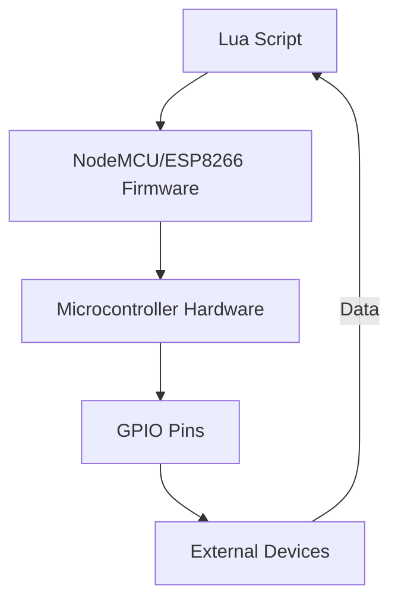

## 20.3 Lua in Microcontroller Programming

Microcontrollers have become the backbone of modern electronics, powering everything from household appliances to industrial machines. As the Internet of Things (IoT) continues to expand, the need for efficient, flexible, and rapid development tools has never been greater. Lua, a lightweight scripting language, has emerged as a powerful tool for microcontroller programming, offering a unique blend of simplicity, efficiency, and versatility.

### Bringing Scripting to Microcontrollers

Lua's integration into microcontroller platforms like NodeMCU and ESP8266 has opened new avenues for developers. These platforms leverage Lua's lightweight nature, making it an ideal choice for resource-constrained environments. Let's explore how Lua is transforming microcontroller programming.

#### Platforms: NodeMCU and ESP8266 with Lua Firmware

NodeMCU and ESP8266 are popular microcontroller platforms that have embraced Lua for scripting. These platforms provide a robust environment for developing IoT applications, thanks to their built-in Wi-Fi capabilities and extensive community support.

- **NodeMCU**: An open-source firmware and development kit that helps you prototype your IoT product within a few Lua script lines. It is based on the ESP8266 Wi-Fi module and uses the Lua scripting language.
  
- **ESP8266**: A low-cost Wi-Fi microchip with full TCP/IP stack and microcontroller capability. It can be programmed using Lua, thanks to the NodeMCU firmware, which simplifies the development process.

#### Benefits of Using Lua in Microcontroller Programming

Lua offers several advantages when it comes to microcontroller programming:

- **Rapid Development**: Lua's simple syntax and dynamic nature allow for quick prototyping and deployment. Developers can write and test code on the fly, significantly reducing development time.

- **Community Support**: The Lua community is vibrant and active, providing a wealth of shared resources, libraries, and tools. This support network is invaluable for troubleshooting and enhancing your projects.

- **Flexibility**: Lua's ability to integrate with C/C++ code allows developers to optimize performance-critical sections of their applications while maintaining the ease of scripting for the rest.

- **Portability**: Lua's lightweight nature makes it highly portable, allowing it to run on a wide range of hardware platforms with minimal modifications.

#### Challenges: Managing Resource Constraints

Despite its benefits, using Lua in microcontroller programming comes with its own set of challenges:

- **Limited Memory and CPU**: Microcontrollers often have limited resources, which can constrain the complexity of Lua scripts. Developers must be mindful of memory usage and optimize their code to fit within these constraints.

- **Performance**: While Lua is efficient, it may not match the performance of compiled languages like C/C++. Developers need to balance the ease of scripting with the need for speed, often by offloading performance-critical tasks to C/C++.

- **Debugging**: Debugging Lua scripts on microcontrollers can be challenging due to limited debugging tools and the absence of a full-fledged development environment.

#### Use Cases and Examples: Building IoT Devices

Lua's integration with microcontrollers has made it a popular choice for IoT applications. Here are some common use cases and examples:

- **Connected Sensors**: Lua can be used to program sensors that collect data and transmit it over Wi-Fi. For example, a temperature sensor can be programmed to send readings to a cloud server at regular intervals.

- **Actuators**: Lua scripts can control actuators like motors and LEDs, enabling automation tasks. For instance, a Lua script could be used to open a valve when a certain condition is met.

- **Home Automation**: Lua is ideal for building home automation systems, where devices need to communicate and coordinate with each other. A Lua-based system can control lighting, heating, and security systems from a central hub.

- **Data Logging**: Microcontrollers running Lua can log data from various sensors and store it locally or send it to a remote server for analysis.

### Code Examples

Let's dive into some practical examples to illustrate how Lua can be used in microcontroller programming.

#### Example 1: Blinking an LED

One of the simplest projects you can start with is blinking an LED. This example demonstrates how to use Lua to control an LED connected to a NodeMCU board.

```lua
-- Define the pin where the LED is connected
local ledPin = 1

-- Set the pin mode to output
gpio.mode(ledPin, gpio.OUTPUT)

-- Function to toggle the LED state
local function toggleLED()
    local state = gpio.read(ledPin)
    if state == gpio.HIGH then
        gpio.write(ledPin, gpio.LOW)
    else
        gpio.write(ledPin, gpio.HIGH)
    end
end

-- Set a timer to toggle the LED every second
tmr.alarm(0, 1000, tmr.ALARM_AUTO, toggleLED)
```

**Explanation**: This script sets up a GPIO pin as an output and toggles its state every second using a timer. The `gpio` and `tmr` modules are part of the NodeMCU firmware, providing easy access to hardware features.

#### Example 2: Reading a Temperature Sensor

In this example, we'll read data from a DHT11 temperature and humidity sensor and print the values to the console.

```lua
-- Load the DHT module
local dht = require("dht")

-- Define the pin where the sensor is connected
local sensorPin = 2

-- Function to read and print sensor data
local function readSensor()
    local status, temp, humi, temp_dec, humi_dec = dht.read(sensorPin)
    if status == dht.OK then
        print("Temperature: "..temp.."."..temp_dec.." C")
        print("Humidity: "..humi.."."..humi_dec.."%")
    elseif status == dht.ERROR_CHECKSUM then
        print("DHT Checksum error.")
    elseif status == dht.ERROR_TIMEOUT then
        print("DHT Timeout error.")
    end
end

-- Set a timer to read the sensor every 2 seconds
tmr.alarm(1, 2000, tmr.ALARM_AUTO, readSensor)
```

**Explanation**: This script uses the `dht` module to read temperature and humidity data from a DHT11 sensor. The data is printed to the console every 2 seconds.

### Visualizing Lua's Role in Microcontroller Programming

To better understand how Lua fits into the microcontroller ecosystem, let's visualize the interaction between Lua scripts, the microcontroller hardware, and external devices.



**Diagram Description**: This flowchart illustrates the flow of data and control in a Lua-based microcontroller application. The Lua script interacts with the NodeMCU/ESP8266 firmware, which in turn controls the microcontroller hardware. The hardware interfaces with external devices through GPIO pins, enabling data exchange and control.

### Try It Yourself

Experimentation is key to mastering Lua in microcontroller programming. Here are some suggestions to modify the examples above:

- **LED Blinking**: Change the blinking interval or add more LEDs to create different patterns.
- **Temperature Sensor**: Modify the script to send data to a cloud server or display it on an LCD screen.

### References and Links

For further reading and resources, consider the following links:

- [NodeMCU Documentation](https://nodemcu.readthedocs.io/)
- [ESP8266 Community Forum](https://www.esp8266.com/)
- [Lua Programming Guide](https://www.lua.org/manual/5.1/)

### Knowledge Check

To reinforce your understanding, consider the following questions:

1. What are the main benefits of using Lua for microcontroller programming?
2. How does Lua's lightweight nature make it suitable for microcontrollers?
3. What are some common challenges when using Lua on microcontrollers?
4. How can Lua scripts be optimized for performance on resource-constrained devices?
5. What are some practical use cases for Lua in IoT applications?

### Embrace the Journey

Remember, this is just the beginning. As you progress, you'll discover more complex and powerful applications of Lua in microcontroller programming. Keep experimenting, stay curious, and enjoy the journey!

## Quiz Time!



### What is a primary benefit of using Lua in microcontroller programming?

- [x] Rapid development and prototyping
- [ ] High computational power
- [ ] Large memory capacity
- [ ] Extensive built-in libraries

> **Explanation:** Lua's simplicity and dynamic nature allow for quick prototyping and deployment, making it ideal for rapid development.

### Which platforms are commonly associated with Lua in microcontroller programming?

- [x] NodeMCU
- [x] ESP8266
- [ ] Arduino
- [ ] Raspberry Pi

> **Explanation:** NodeMCU and ESP8266 are popular platforms that use Lua for scripting, while Arduino and Raspberry Pi typically use other languages.

### What is a common challenge when using Lua on microcontrollers?

- [x] Managing limited memory and CPU resources
- [ ] Lack of community support
- [ ] Difficulty in writing code
- [ ] Incompatibility with hardware

> **Explanation:** Microcontrollers often have limited resources, which can constrain the complexity of Lua scripts.

### How can Lua scripts be optimized for performance on microcontrollers?

- [x] Offloading performance-critical tasks to C/C++
- [ ] Increasing the microcontroller's memory
- [ ] Using more complex algorithms
- [ ] Avoiding the use of timers

> **Explanation:** Developers can optimize performance by offloading critical tasks to C/C++ while maintaining the ease of scripting for other parts.

### What is a practical use case for Lua in IoT applications?

- [x] Building connected sensors and actuators
- [ ] Developing desktop applications
- [ ] Creating complex video games
- [ ] Designing large-scale databases

> **Explanation:** Lua is ideal for IoT applications, such as building connected sensors and actuators, due to its lightweight nature.

### Which module is used in the example to read data from a DHT11 sensor?

- [x] dht
- [ ] gpio
- [ ] tmr
- [ ] wifi

> **Explanation:** The `dht` module is used to read temperature and humidity data from a DHT11 sensor.

### What is the role of the `tmr` module in the LED blinking example?

- [x] To set a timer for toggling the LED state
- [ ] To read sensor data
- [ ] To connect to Wi-Fi
- [ ] To control GPIO pins

> **Explanation:** The `tmr` module is used to set a timer that toggles the LED state every second.

### How does Lua's community support benefit microcontroller programming?

- [x] Provides shared resources and libraries
- [ ] Offers high computational power
- [ ] Increases memory capacity
- [ ] Ensures compatibility with all hardware

> **Explanation:** The Lua community provides a wealth of shared resources, libraries, and tools, which are invaluable for development.

### What is a key feature of the NodeMCU platform?

- [x] Built-in Wi-Fi capabilities
- [ ] High processing power
- [ ] Large storage capacity
- [ ] Extensive built-in libraries

> **Explanation:** NodeMCU is known for its built-in Wi-Fi capabilities, making it ideal for IoT applications.

### True or False: Lua is not suitable for microcontroller programming due to its complexity.

- [ ] True
- [x] False

> **Explanation:** Lua is suitable for microcontroller programming because of its simplicity and lightweight nature, making it ideal for resource-constrained environments.


