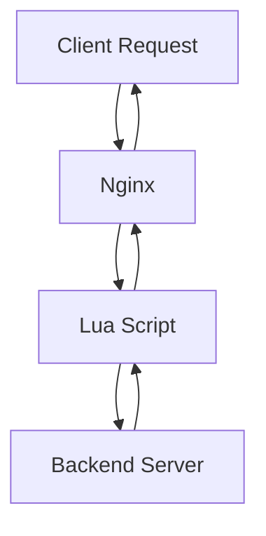

## 20.4 Developing High-Performance Web Services with OpenResty

In the ever-evolving landscape of web development, the demand for high-performance, scalable web services is paramount. OpenResty, a powerful web platform based on Nginx and Lua, offers a robust solution for developers aiming to build efficient web applications. This section delves into the intricacies of developing web services with OpenResty, exploring its features, use cases, and practical examples.

### Introduction to OpenResty

OpenResty is a full-fledged web application server that integrates the Nginx HTTP server with Lua scripting capabilities. It is designed to handle high concurrency, making it an ideal choice for building web services that require speed and scalability.

#### Key Features of OpenResty

- **Asynchronous I/O**: OpenResty leverages Nginx's event-driven architecture to handle a large number of simultaneous connections efficiently.
- **Lua Scripting**: The integration of Lua allows for dynamic request handling and customization, enabling developers to write high-performance web applications.
- **Extensibility**: OpenResty supports a wide range of third-party Nginx modules, enhancing its functionality and flexibility.

### Leveraging Nginx and Lua for Scalable Services

The combination of Nginx and Lua in OpenResty provides a powerful platform for developing scalable web services. Nginx's non-blocking architecture, coupled with Lua's lightweight scripting capabilities, allows developers to create efficient applications that can handle thousands of concurrent requests.

#### Asynchronous I/O in OpenResty

Asynchronous I/O is a core feature of OpenResty, enabling it to manage multiple connections without blocking. This is achieved through Nginx's event-driven model, which uses a small number of threads to handle a large number of connections.

```lua
-- Example of asynchronous HTTP request handling in OpenResty
local http = require "resty.http"
local httpc = http.new()

local res, err = httpc:request_uri("http://example.com", {
    method = "GET",
    headers = {
        ["User-Agent"] = "OpenResty Lua"
    }
})

if not res then
    ngx.say("failed to request: ", err)
    return
end

ngx.status = res.status
ngx.say(res.body)
```

In this example, we use the `resty.http` module to perform an asynchronous HTTP request. The non-blocking nature of this operation allows OpenResty to handle other requests concurrently.

### Scripting Capabilities for Dynamic Request Handling

Lua scripting in OpenResty provides the flexibility to customize request handling dynamically. This capability is particularly useful for implementing business logic, authentication, and data processing directly within the web server.

#### Dynamic Routing with Lua

```lua
-- Example of dynamic routing in OpenResty
local uri = ngx.var.uri

if uri == "/api/v1/resource" then
    ngx.say("Handling API v1 resource")
elseif uri == "/api/v2/resource" then
    ngx.say("Handling API v2 resource")
else
    ngx.status = ngx.HTTP_NOT_FOUND
    ngx.say("Resource not found")
end
```

This code snippet demonstrates how Lua can be used to implement dynamic routing based on the request URI. By inspecting `ngx.var.uri`, we can route requests to different handlers.

### Use Cases and Examples

OpenResty is well-suited for a variety of use cases, including content delivery networks (CDNs) and API services. Let's explore these scenarios in detail.

#### Content Delivery Networks (CDNs)

CDNs require efficient content distribution to deliver static and dynamic content quickly to users worldwide. OpenResty's ability to handle high concurrency and cache content makes it an excellent choice for building CDNs.

```lua
-- Example of caching content in OpenResty
local res = ngx.location.capture("/backend")

if res.status == ngx.HTTP_OK then
    ngx.header.content_type = res.header["Content-Type"]
    ngx.say(res.body)
    ngx.shared.cache:set(ngx.var.uri, res.body, 60) -- Cache for 60 seconds
else
    ngx.status = res.status
    ngx.say("Error fetching content")
end
```

In this example, we use `ngx.location.capture` to fetch content from a backend server and cache it using `ngx.shared.cache`. This approach reduces load on the backend and improves response times.

#### API Services

OpenResty's scripting capabilities make it ideal for developing robust and efficient APIs. By leveraging Lua, developers can implement complex logic and data processing directly within the web server.

```lua
-- Example of an API endpoint in OpenResty
local cjson = require "cjson"

ngx.req.read_body()
local data = ngx.req.get_body_data()

if not data then
    ngx.status = ngx.HTTP_BAD_REQUEST
    ngx.say("No data provided")
    return
end

local json_data = cjson.decode(data)
ngx.say("Received data: ", cjson.encode(json_data))
```

This code snippet illustrates how to handle JSON data in an API endpoint. We use the `cjson` module to decode and encode JSON, allowing for seamless data exchange.

### Visualizing OpenResty's Architecture

To better understand how OpenResty operates, let's visualize its architecture using a Mermaid.js diagram.



**Diagram Description**: This diagram illustrates the flow of a client request through OpenResty. The request is first handled by Nginx, which then invokes a Lua script for processing. The Lua script may interact with a backend server to fetch or update data before returning the response to the client.

### Try It Yourself

To gain hands-on experience with OpenResty, try modifying the code examples provided. Experiment with different request handling logic, caching strategies, and API endpoints. This will help you understand the flexibility and power of OpenResty in developing web services.

### Knowledge Check

- Explain how OpenResty's asynchronous I/O model benefits web service performance.
- Describe how Lua scripting enhances the flexibility of request handling in OpenResty.
- Provide an example of a use case where OpenResty would be an ideal choice.

### References and Further Reading

- [OpenResty Official Documentation](https://openresty.org/en/docs.html)
- [Nginx HTTP Server](https://nginx.org/en/docs/)
- [Lua Programming Language](https://www.lua.org/manual/5.1/)

### Embrace the Journey

Developing web services with OpenResty is a rewarding experience that combines the power of Nginx and Lua. As you continue to explore and experiment, you'll discover new ways to optimize and scale your applications. Remember, this is just the beginning. Keep experimenting, stay curious, and enjoy the journey!

## Quiz Time!



### What is a key feature of OpenResty that enables it to handle high concurrency?

- [x] Asynchronous I/O
- [ ] Synchronous I/O
- [ ] Blocking Threads
- [ ] Single-threaded Execution

> **Explanation:** OpenResty leverages Nginx's event-driven architecture to handle multiple connections asynchronously, allowing it to manage high concurrency efficiently.

### How does Lua scripting enhance OpenResty's request handling capabilities?

- [x] By allowing dynamic request handling
- [ ] By providing a static configuration
- [ ] By limiting customization
- [ ] By reducing performance

> **Explanation:** Lua scripting enables developers to implement dynamic request handling and customize the behavior of the web server, enhancing flexibility and functionality.

### Which module is used in OpenResty for making asynchronous HTTP requests?

- [x] resty.http
- [ ] ngx.http
- [ ] lua.http
- [ ] async.http

> **Explanation:** The `resty.http` module is used in OpenResty to perform asynchronous HTTP requests, leveraging Lua's scripting capabilities.

### What is a common use case for OpenResty?

- [x] Content Delivery Networks (CDNs)
- [ ] Desktop Applications
- [ ] Mobile Apps
- [ ] Embedded Systems

> **Explanation:** OpenResty's ability to handle high concurrency and cache content makes it an excellent choice for building CDNs, which require efficient content distribution.

### In the provided API example, which module is used for JSON handling?

- [x] cjson
- [ ] json
- [ ] lua.json
- [ ] resty.json

> **Explanation:** The `cjson` module is used in OpenResty for encoding and decoding JSON data, facilitating seamless data exchange in API services.

### What is the primary advantage of using OpenResty for API services?

- [x] Robust and efficient API development
- [ ] Limited scripting capabilities
- [ ] High memory usage
- [ ] Complex configuration

> **Explanation:** OpenResty's Lua scripting capabilities allow for robust and efficient API development, enabling complex logic and data processing directly within the web server.

### How can OpenResty improve response times in a CDN?

- [x] By caching content
- [ ] By increasing server load
- [ ] By reducing concurrency
- [ ] By limiting connections

> **Explanation:** OpenResty can cache content using `ngx.shared.cache`, reducing load on the backend and improving response times for CDN services.

### What does the `ngx.var.uri` variable represent in OpenResty?

- [x] The request URI
- [ ] The server IP address
- [ ] The client IP address
- [ ] The request method

> **Explanation:** The `ngx.var.uri` variable in OpenResty represents the request URI, allowing developers to implement dynamic routing based on the requested path.

### True or False: OpenResty can only be used for web services.

- [ ] True
- [x] False

> **Explanation:** While OpenResty is primarily used for web services, its flexibility and scripting capabilities allow it to be used in various other applications, such as reverse proxies and load balancers.

### Which of the following is NOT a feature of OpenResty?

- [ ] Asynchronous I/O
- [ ] Lua Scripting
- [ ] Extensibility
- [x] Single-threaded Execution

> **Explanation:** OpenResty is not limited to single-threaded execution; it uses Nginx's event-driven architecture to handle multiple connections concurrently.


