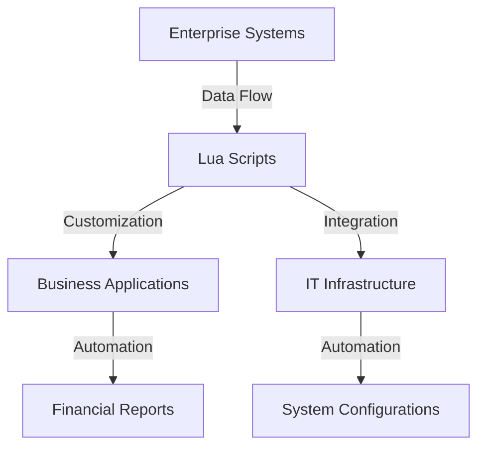

## 20.5 Automation and Scripting in Enterprise Environments

In the fast-paced world of enterprise environments, automation and scripting play a crucial role in streamlining business processes, reducing manual effort, and enhancing productivity. Lua, with its lightweight footprint and flexibility, emerges as a powerful tool for developing automation scripts that can be tailored to specific business needs. In this section, we will explore how Lua can be leveraged to automate and script various enterprise tasks, focusing on customization, integration, and practical use cases.

### Streamlining Business Processes

#### Customization: Tailoring Software to Specific Workflows

One of the key advantages of using Lua in enterprise environments is its ability to customize software to fit specific workflows. Lua's simplicity and extensibility make it an ideal choice for embedding into larger systems, allowing developers to create scripts that can adapt to the unique requirements of different business processes.

- **Explain the Need for Customization**: In enterprise settings, off-the-shelf software solutions often fall short of meeting all the specific needs of a business. Customization allows organizations to modify and extend software functionalities to align with their unique workflows and processes.

- **Demonstrate Lua's Flexibility**: Lua's dynamic nature and ease of integration with other languages and systems make it a versatile tool for customization. By embedding Lua scripts into existing applications, developers can introduce new features, automate repetitive tasks, and enhance overall system capabilities.

- **Provide Examples of Customization**: Consider a scenario where a company needs to generate customized reports from a database. Lua scripts can be used to query the database, process the data, and format the reports according to the company's specific requirements.

```lua
-- Example: Custom Report Generation Script
local db = require("database_module") -- Hypothetical database module
local report = {}

-- Function to fetch data from the database
function fetchData(query)
    local data = db.execute(query)
    return data
end

-- Function to format data into a report
function formatReport(data)
    for _, record in ipairs(data) do
        table.insert(report, string.format("ID: %s, Name: %s, Sales: %d", record.id, record.name, record.sales))
    end
end

-- Main script execution
local query = "SELECT id, name, sales FROM sales_data WHERE date = '2024-11-17'"
local data = fetchData(query)
formatReport(data)

-- Output the report
for _, line in ipairs(report) do
    print(line)
end
```

#### Implementation: Integrating with Systems

Integration is a critical aspect of automation in enterprise environments. Lua's ability to interface with various systems and technologies makes it an excellent choice for building scripts that connect disparate enterprise tools.

- **Explain the Importance of Integration**: Enterprises often rely on a multitude of software systems and tools to manage their operations. Effective integration ensures seamless data flow and communication between these systems, reducing the risk of errors and improving efficiency.

- **Demonstrate Lua's Integration Capabilities**: Lua can be integrated with other programming languages, databases, and network protocols, enabling it to act as a glue language that binds different components together. This capability is particularly useful in scenarios where enterprises need to automate workflows that span multiple systems.

- **Provide Examples of Integration**: Consider a situation where an enterprise needs to automate the deployment of software updates across a network of servers. Lua scripts can be used to interface with server management tools, execute deployment commands, and monitor the status of each update.

```lua
-- Example: Software Deployment Script
local servers = {"server1.example.com", "server2.example.com", "server3.example.com"}
local deployment_tool = require("deployment_module") -- Hypothetical deployment module

-- Function to deploy updates to a server
function deployUpdate(server)
    local success, err = deployment_tool.deploy(server, "update_package")
    if success then
        print("Deployment successful on " .. server)
    else
        print("Deployment failed on " .. server .. ": " .. err)
    end
end

-- Main script execution
for _, server in ipairs(servers) do
    deployUpdate(server)
end
```

### Use Cases and Examples

#### Financial Applications: Automating Reports and Data Analysis

Financial applications are ripe for automation, as they often involve repetitive tasks such as data entry, report generation, and data analysis. Lua can be used to automate these processes, freeing up valuable time for financial analysts to focus on more strategic activities.

- **Explain the Role of Automation in Financial Applications**: Automation can significantly reduce the time and effort required to perform routine financial tasks, such as generating monthly reports or analyzing transaction data. By automating these processes, organizations can improve accuracy and efficiency.

- **Demonstrate Lua's Application in Financial Automation**: Lua scripts can be used to automate the extraction, transformation, and loading (ETL) of financial data, as well as the generation of reports and dashboards. This can be particularly useful for organizations that need to process large volumes of data on a regular basis.

- **Provide Examples of Financial Automation**: Consider a scenario where a financial institution needs to generate daily transaction reports. Lua scripts can be used to query the transaction database, aggregate the data, and generate reports in various formats.

```lua
-- Example: Daily Transaction Report Script
local db = require("database_module") -- Hypothetical database module
local report = {}

-- Function to fetch transaction data
function fetchTransactions(date)
    local query = string.format("SELECT account_id, amount, type FROM transactions WHERE date = '%s'", date)
    local data = db.execute(query)
    return data
end

-- Function to generate report
function generateReport(transactions)
    local total_deposits = 0
    local total_withdrawals = 0

    for _, transaction in ipairs(transactions) do
        if transaction.type == "deposit" then
            total_deposits = total_deposits + transaction.amount
        elseif transaction.type == "withdrawal" then
            total_withdrawals = total_withdrawals + transaction.amount
        end
    end

    table.insert(report, string.format("Total Deposits: %d", total_deposits))
    table.insert(report, string.format("Total Withdrawals: %d", total_withdrawals))
end

-- Main script execution
local date = "2024-11-17"
local transactions = fetchTransactions(date)
generateReport(transactions)

-- Output the report
for _, line in ipairs(report) do
    print(line)
end
```

#### IT Operations: Deploying Updates and Configurations

In IT operations, automation is essential for managing the deployment of updates and configurations across a large number of systems. Lua can be used to script these processes, ensuring consistency and reducing the risk of human error.

- **Explain the Importance of Automation in IT Operations**: Automation helps IT teams manage complex environments more efficiently by reducing the manual effort required to deploy updates, configure systems, and monitor performance. This leads to faster response times and improved system reliability.

- **Demonstrate Lua's Role in IT Automation**: Lua scripts can be used to automate tasks such as software deployment, configuration management, and system monitoring. By scripting these processes, IT teams can ensure that updates and configurations are applied consistently across all systems.

- **Provide Examples of IT Automation**: Consider a scenario where an IT team needs to deploy a security patch to all servers in a data center. Lua scripts can be used to automate the deployment process, verify the success of each update, and generate reports on the status of each server.

```lua
-- Example: Security Patch Deployment Script
local servers = {"server1.example.com", "server2.example.com", "server3.example.com"}
local patch_tool = require("patch_module") -- Hypothetical patch module

-- Function to deploy patch to a server
function deployPatch(server)
    local success, err = patch_tool.apply(server, "security_patch")
    if success then
        print("Patch applied successfully on " .. server)
    else
        print("Patch application failed on " .. server .. ": " .. err)
    end
end

-- Main script execution
for _, server in ipairs(servers) do
    deployPatch(server)
end
```

### Try It Yourself

To deepen your understanding of Lua's capabilities in automation and scripting, try modifying the code examples provided in this section. Experiment with different scenarios, such as:

- Customizing the report generation script to include additional data fields or different formatting options.
- Integrating the deployment script with a different server management tool or protocol.
- Automating a different financial or IT process using Lua scripts.

### Visualizing Lua's Role in Enterprise Automation

To better understand how Lua fits into the broader landscape of enterprise automation, consider the following diagram, which illustrates the integration of Lua scripts with various enterprise systems.



**Diagram Description**: This diagram illustrates how Lua scripts act as a bridge between enterprise systems and business applications, enabling customization and integration. Lua scripts automate the generation of financial reports and the deployment of system configurations, streamlining business processes.

### Knowledge Check

- What are the benefits of using Lua for automation and scripting in enterprise environments?
- How can Lua be integrated with other systems and technologies?
- What are some common use cases for Lua in financial applications and IT operations?

### Summary

In this section, we've explored how Lua can be used to automate and script various tasks in enterprise environments. By leveraging Lua's flexibility and integration capabilities, organizations can streamline business processes, improve efficiency, and reduce the risk of errors. Whether it's customizing software to fit specific workflows, integrating with different systems, or automating financial and IT operations, Lua offers a powerful solution for enterprise automation.

### Embrace the Journey

Remember, this is just the beginning. As you continue to explore Lua's capabilities, you'll discover new ways to automate and streamline processes in your organization. Keep experimenting, stay curious, and enjoy the journey!

## Quiz Time!



### What is one of the key advantages of using Lua in enterprise environments?

- [x] Customization of software to fit specific workflows
- [ ] High computational power
- [ ] Built-in support for all enterprise systems
- [ ] Automatic error handling

> **Explanation:** Lua's simplicity and extensibility make it ideal for customizing software to align with unique business workflows.

### How does Lua facilitate integration with other systems?

- [x] By acting as a glue language that binds different components together
- [ ] By replacing existing systems
- [ ] By being the only language used in the enterprise
- [ ] By providing built-in enterprise tools

> **Explanation:** Lua can interface with various programming languages, databases, and network protocols, making it a versatile tool for integration.

### What is a common use case for Lua in financial applications?

- [x] Automating report generation and data analysis
- [ ] Developing new financial software from scratch
- [ ] Replacing existing financial systems
- [ ] Manual data entry

> **Explanation:** Lua can automate the extraction, transformation, and loading of financial data, as well as the generation of reports and dashboards.

### In IT operations, what is a key benefit of using Lua for automation?

- [x] Ensuring consistency and reducing the risk of human error
- [ ] Increasing the number of manual tasks
- [ ] Replacing IT staff
- [ ] Eliminating the need for updates

> **Explanation:** Lua scripts can automate tasks such as software deployment and configuration management, ensuring consistency and reducing errors.

### What is the role of Lua scripts in the provided diagram?

- [x] Acting as a bridge between enterprise systems and business applications
- [ ] Replacing enterprise systems
- [ ] Eliminating the need for business applications
- [ ] Acting as standalone applications

> **Explanation:** Lua scripts integrate with enterprise systems to enable customization and automation of business processes.

### How can Lua be used in the deployment of software updates?

- [x] By scripting the deployment process and verifying the success of each update
- [ ] By manually applying updates
- [ ] By eliminating the need for updates
- [ ] By replacing the software

> **Explanation:** Lua scripts can automate the deployment of updates, ensuring consistency and reducing the risk of errors.

### What is a benefit of automating financial tasks with Lua?

- [x] Improving accuracy and efficiency
- [ ] Increasing manual effort
- [ ] Reducing the need for data analysis
- [ ] Eliminating financial reports

> **Explanation:** Automation reduces the time and effort required for routine tasks, improving accuracy and efficiency.

### How can Lua scripts be customized for specific business needs?

- [x] By embedding them into existing applications and modifying functionalities
- [ ] By using them as standalone applications
- [ ] By replacing existing business processes
- [ ] By eliminating the need for customization

> **Explanation:** Lua's dynamic nature allows developers to embed scripts into applications and customize functionalities to meet specific needs.

### What is a key consideration when integrating Lua with other systems?

- [x] Ensuring seamless data flow and communication
- [ ] Replacing all existing systems
- [ ] Eliminating the need for integration
- [ ] Using Lua as the only programming language

> **Explanation:** Effective integration ensures seamless data flow and communication between systems, reducing errors and improving efficiency.

### True or False: Lua can only be used for scripting in financial applications.

- [ ] True
- [x] False

> **Explanation:** Lua is versatile and can be used for scripting and automation in various domains, including IT operations and other enterprise environments.


