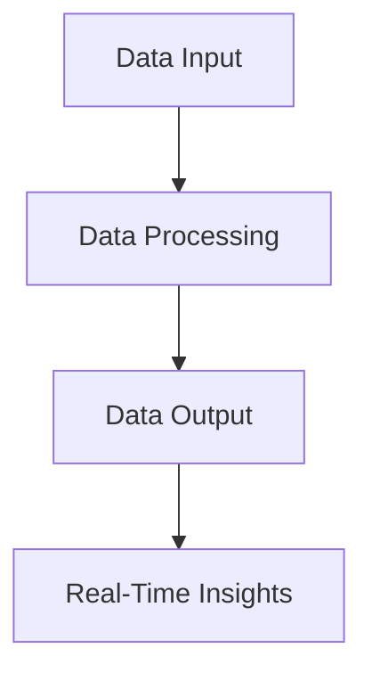

## 20.6 Real-Time Data Processing Applications

In the rapidly evolving landscape of technology, real-time data processing has become a cornerstone for applications that require immediate insights and actions. Whether it's monitoring systems, analytics, or alerts, the ability to handle live data streams efficiently is crucial. In this section, we will delve into the world of real-time data processing using Lua, a lightweight yet powerful scripting language. We will explore implementation strategies, use cases, and practical examples to equip you with the knowledge to build robust real-time applications.

### Handling Live Data Streams

Real-time data processing involves the continuous input, processing, and output of data. This is essential for applications that need to react to data as it arrives, such as stock market analysis, network monitoring, and more. Let's explore some key applications and strategies for handling live data streams.

#### Applications

1. **Monitoring Systems**: Real-time monitoring systems are used to track the performance and health of IT infrastructure, applications, and networks. They provide immediate alerts when anomalies or issues are detected, allowing for quick resolution.

2. **Analytics**: Real-time analytics involves processing data as it is generated to provide immediate insights. This is crucial for businesses that need to make data-driven decisions quickly.

3. **Alerts**: Real-time alert systems notify users of critical events as they happen. This is vital in scenarios such as security breaches, system failures, or any situation where immediate action is required.

### Implementation Strategies

Implementing real-time data processing applications requires careful consideration of concurrency, data flow, and system architecture. Let's explore some strategies to achieve efficient real-time processing in Lua.

#### Concurrency with Coroutines

Lua's coroutines provide a powerful mechanism for handling concurrency in real-time applications. Coroutines allow you to perform non-blocking operations, enabling your application to handle multiple tasks simultaneously without being hindered by blocking calls.

**Example: Using Coroutines for Non-Blocking Processing**

```lua
-- Define a coroutine for processing data
function processData(dataStream)
    for data in dataStream do
        -- Simulate data processing
        print("Processing data: " .. data)
        coroutine.yield()  -- Yield control to allow other tasks to run
    end
end

-- Create a data stream
local dataStream = coroutine.wrap(function()
    for i = 1, 10 do
        coroutine.yield(i)
    end
end)

-- Run the coroutine
local processor = coroutine.create(processData)
while coroutine.status(processor) ~= "dead" do
    coroutine.resume(processor, dataStream)
end
```

In this example, we use a coroutine to process data from a stream. The `coroutine.yield()` function allows the coroutine to pause and resume, enabling other tasks to run concurrently.

#### Building Efficient Data Pipelines

Data pipelines are essential for structuring the flow of data from input to output. In real-time applications, efficient data pipelines ensure that data is processed quickly and accurately.

**Example: Building a Simple Data Pipeline**

```lua
-- Define a data pipeline
function dataPipeline(input, process, output)
    for data in input do
        local processedData = process(data)
        output(processedData)
    end
end

-- Define input, process, and output functions
local function input()
    return coroutine.wrap(function()
        for i = 1, 5 do
            coroutine.yield("Data " .. i)
        end
    end)
end

local function process(data)
    return data .. " processed"
end

local function output(data)
    print("Output: " .. data)
end

-- Run the data pipeline
dataPipeline(input(), process, output)
```

In this example, we define a simple data pipeline with input, process, and output stages. The pipeline processes data in real-time, demonstrating how data flows through each stage.

### Use Cases and Examples

Real-time data processing is applicable in various domains. Let's explore some use cases and examples to illustrate how Lua can be used to build real-time applications.

#### Stock Market Analysis

In the financial sector, real-time stock market analysis is crucial for making informed investment decisions. Processing financial data in real-time allows traders to react to market changes instantly.

**Example: Real-Time Stock Market Analysis**

```lua
-- Simulate a stock market data stream
local stockDataStream = coroutine.wrap(function()
    local stocks = {"AAPL", "GOOGL", "MSFT"}
    for _, stock in ipairs(stocks) do
        for i = 1, 3 do
            coroutine.yield(stock .. " price: " .. math.random(100, 500))
        end
    end
end)

-- Process stock data
function analyzeStockData(dataStream)
    for data in dataStream do
        print("Analyzing: " .. data)
        coroutine.yield()
    end
end

-- Run the stock market analysis
local analyzer = coroutine.create(analyzeStockData)
while coroutine.status(analyzer) ~= "dead" do
    coroutine.resume(analyzer, stockDataStream)
end
```

In this example, we simulate a stock market data stream and use a coroutine to analyze the data in real-time. This approach allows for immediate analysis and decision-making based on live data.

#### Network Monitoring

Network monitoring involves tracking the performance and health of network infrastructure. Real-time network monitoring can detect anomalies and performance issues as they occur, enabling quick response and resolution.

**Example: Real-Time Network Monitoring**

```lua
-- Simulate a network data stream
local networkDataStream = coroutine.wrap(function()
    local events = {"Packet Loss", "High Latency", "Connection Timeout"}
    for _, event in ipairs(events) do
        for i = 1, 3 do
            coroutine.yield(event .. " detected at " .. os.date("%X"))
        end
    end
end)

-- Monitor network events
function monitorNetwork(dataStream)
    for event in dataStream do
        print("Network Alert: " .. event)
        coroutine.yield()
    end
end

-- Run the network monitoring
local monitor = coroutine.create(monitorNetwork)
while coroutine.status(monitor) ~= "dead" do
    coroutine.resume(monitor, networkDataStream)
end
```

In this example, we simulate a network data stream and use a coroutine to monitor network events in real-time. This approach allows for immediate alerts and actions based on live network data.

### Visualizing Real-Time Data Processing

To better understand the flow of real-time data processing, let's visualize the process using a Mermaid.js diagram.



**Diagram Description**: This diagram illustrates the flow of real-time data processing, where data is input, processed, and output to provide real-time insights.

### Try It Yourself

Experiment with the code examples provided in this section. Try modifying the data streams, processing logic, or output functions to see how they affect the real-time processing. This hands-on approach will deepen your understanding of real-time data processing in Lua.

### References and Links

- [Lua Coroutines](https://www.lua.org/manual/5.4/manual.html#2.6) - Official Lua documentation on coroutines.
- [Real-Time Data Processing](https://en.wikipedia.org/wiki/Real-time_computing) - Wikipedia article on real-time computing.
- [Stock Market Analysis](https://www.investopedia.com/terms/s/stock-analysis.asp) - Investopedia article on stock analysis.

### Knowledge Check

- What are the key components of a real-time data processing application?
- How do coroutines facilitate non-blocking operations in Lua?
- Describe a use case where real-time data processing is essential.

### Embrace the Journey

Remember, mastering real-time data processing is a journey. As you progress, you'll build more complex and efficient applications. Keep experimenting, stay curious, and enjoy the journey!

## Quiz Time!



### What is a key benefit of using coroutines in real-time data processing?

- [x] Non-blocking operations
- [ ] Increased memory usage
- [ ] Slower execution
- [ ] Reduced code readability

> **Explanation:** Coroutines allow for non-blocking operations, enabling concurrent task execution without blocking the main thread.

### Which of the following is NOT an application of real-time data processing?

- [ ] Monitoring systems
- [ ] Analytics
- [ ] Alerts
- [x] Batch processing

> **Explanation:** Batch processing is not real-time; it involves processing data in large batches at scheduled intervals.

### In the stock market analysis example, what does the coroutine yield?

- [x] Stock price data
- [ ] Network events
- [ ] User input
- [ ] System logs

> **Explanation:** The coroutine yields stock price data for real-time analysis.

### What is the purpose of a data pipeline in real-time processing?

- [x] Structuring data flow from input to output
- [ ] Increasing data redundancy
- [ ] Reducing data accuracy
- [ ] Delaying data processing

> **Explanation:** A data pipeline structures the flow of data from input to output, ensuring efficient processing.

### How does real-time network monitoring benefit IT infrastructure?

- [x] Detects anomalies and performance issues
- [ ] Increases network latency
- [ ] Reduces network bandwidth
- [ ] Delays issue resolution

> **Explanation:** Real-time network monitoring detects anomalies and performance issues, allowing for quick resolution.

### What is the role of `coroutine.yield()` in a Lua coroutine?

- [x] Pauses the coroutine and allows other tasks to run
- [ ] Terminates the coroutine
- [ ] Increases coroutine priority
- [ ] Reduces coroutine memory usage

> **Explanation:** `coroutine.yield()` pauses the coroutine, allowing other tasks to run concurrently.

### Which Lua feature is essential for building real-time data pipelines?

- [x] Coroutines
- [ ] Tables
- [ ] Metatables
- [ ] Strings

> **Explanation:** Coroutines are essential for building real-time data pipelines due to their non-blocking nature.

### What is a common use case for real-time data processing?

- [x] Stock market analysis
- [ ] Historical data archiving
- [ ] Offline data processing
- [ ] Scheduled reporting

> **Explanation:** Real-time data processing is commonly used in stock market analysis for immediate decision-making.

### Which diagramming tool is used to visualize real-time data processing in this guide?

- [x] Mermaid.js
- [ ] UML
- [ ] Visio
- [ ] Lucidchart

> **Explanation:** Mermaid.js is used to create diagrams in this guide, compatible with Hugo rendering.

### True or False: Real-time data processing is only applicable to financial applications.

- [ ] True
- [x] False

> **Explanation:** Real-time data processing is applicable to various domains, including monitoring systems, analytics, and alerts.




